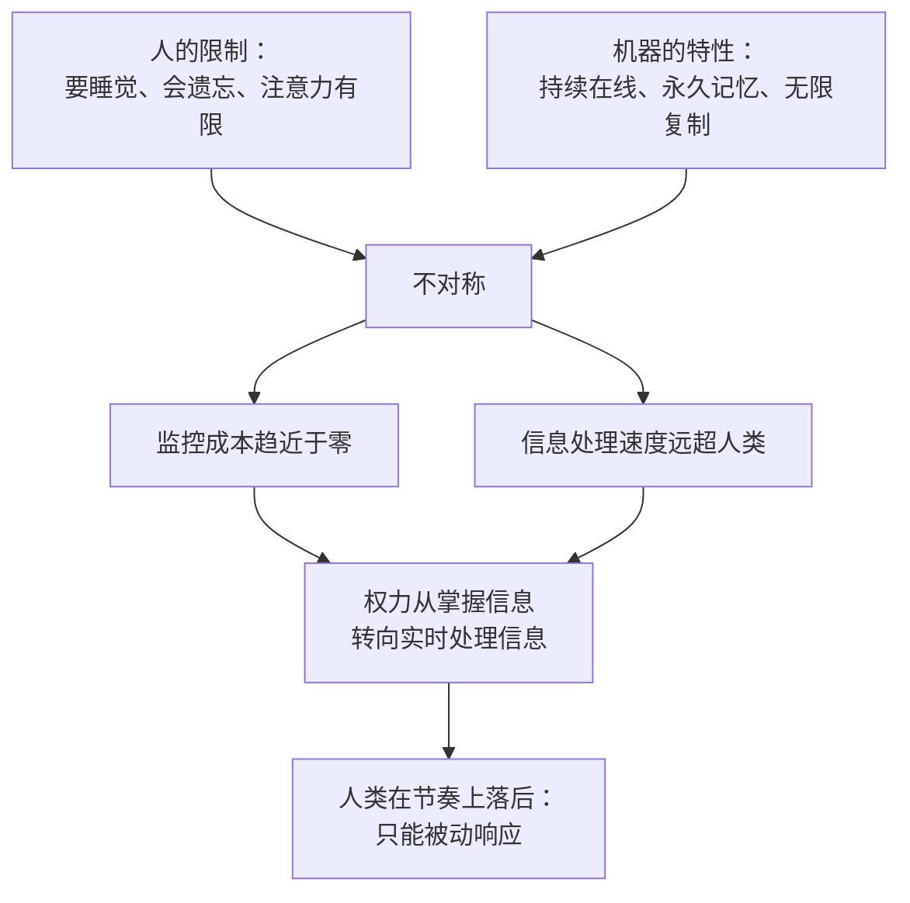

# 08｜永不停歇：为什么“不睡觉”的算法改变了权力结构

> 当网络永远在线、永不遗忘时，权力会发生什么变化？

---

## 一、先说结论

计算机不疲倦、不遗忘、可以无限复制，这让持续监控第一次变得廉价。权力的关键从“谁掌握信息”转向“谁能实时处理信息”，而人类第一次在这种比较里全面落后。

赫拉利的判断是：真正的变化不是机器更聪明，而是机器不需要休息。

## 二、我们先理解一个问题

先想一个问题：历史上的皇帝能不能做到全天候监控？

他可以派人盯梢，可以设立密探，可以要求地方官定期汇报。但所有执行者都是人——人要睡觉、要吃饭、会心软、会受贿、会记错。所以古代监控的成本极高，覆盖率极低。

现在换一个场景：一个平台的系统在凌晨三点判断你该看到什么内容，早上七点决定给你推哪家餐厅，下午两点给你的贷款申请打分。它不需要休息，也不需要加班费。

同样一件事，成本结构变了。问题是：当监控成本降到接近于零，权力会流向哪里？

## 三、作者到底提出了什么观点？

赫拉利把这一章命名为“永不停歇”，他关注的正是这个不对称。

他指出，人类的信息网络有一个生物学上的上限：参与者要睡觉、注意力有限、记忆会衰退。而计算机没有这些限制。它可以全天候在线，可以同时服务几百万人，可以永久保存每一条记录，也可以瞬间复制自己。

这带来三个后果。

第一，监控变得廉价。过去需要成千上万人才能完成的事情，现在靠自动化就能覆盖。

第二，权力从“掌握信息”转向“处理信息”。在信息稀缺的时代，谁拥有档案谁就拥有权力；在信息过剩的时代，谁能实时把信息变成决定，谁就拥有权力。

第三，人类失去了谈判的节奏。人可以等，机器不必等；机器可以无限耐心地等你上钩，而你的注意力只能用一次。

## 四、把这个观点翻译成人话

可以把“记忆”和“注意力”看成两种资源。

人类靠遗忘活着。忘记仇怨，社会才能和解；忘记细节，大脑才能腾出空间处理新的事。遗忘不是缺陷，是保护机制。

而系统靠不遗忘获利。它记住你每一次点击、每一次犹豫、每一次深夜的搜索，然后在下一次恰到好处地使用这些记忆。

于是出现一个奇怪的局面：需要遗忘的一方，正在和一个永不遗忘的系统打交道。

## 五、为什么会这样？

把这种不对称拆开，可以看到权力转移的路径。

第一步，人的限制是硬约束，无法通过努力解决。

第二步，机器的特性是结构性的优势，而且成本还在持续下降。

第三步，两者叠加，产生不对称。

第四步，监控变得廉价。

第五步，处理速度决定了决策速度。

第六步，权力转移到能实时处理信息的一方。

第七步，人类从“参与者”变成“响应者”——这是赫拉利最担心的一步。

## 六、举一个现实生活中的例子

看一个很普通的夜晚。

你打算十一点睡。躺下之后刷了几分钟手机，推荐流不断给你新的内容。等你抬头时已经一点半。第二天你状态很差，晚上又想早点睡，然后又刷到一点半。

这个循环里，没有人在逼你。算法只是持续在线，并且非常了解什么样的内容能让你停不下来。而你的自控力是一种会疲劳的资源——它会随着时间下降，而算法不会。

这就是“永不停歇”在日常生活中的样子：它不需要战胜你，只需要等你疲劳。

## 七、回到书中重新理解

赫拉利在这一章里对比了历史上的监控与今天的监控。

他提到，过去的独裁者要建立全面的监控体系，必须依赖大量人力，而人力本身就是不可靠的——他们会被收买、会偷懒、会有自己的判断。所以历史上的极权总是“想要全知，却做不到全知”。

而自动化监控解决了这个问题：它不知疲倦，也不产生自己的判断。

他还强调了数字记忆的特殊性：人类社会的很多机制其实是建立在遗忘之上的——刑满释放、债务重组、社会和解。而一个永不遗忘的系统，会让“过去”永远压在“现在”身上。

赫拉利由此提出他的核心担忧：网络永远在线，意味着人类第一次面对一个不需要休息的对手。

## 八、这个观点背后还有什么？

第一，它有一个隐含前提：权力依赖于信息处理能力，而处理能力受生物学限制。这条前提把技术问题变成了权力问题。

第二，它指出了遗忘的制度价值。一个社会的宽容程度，往往和它允许遗忘的程度相关。数字记忆把这个平衡打破了。

第三，它和下一篇的关系很直接：如果系统永不休息，它犯错的方式也会不同——错误会被持续、规模化地复制，而不是偶尔发生。

第四，它也解释了为什么“断网”“下线”变成了一种奢侈品。当网络永不休息，退出本身就成了一种需要资源才能获得的权利。

## 九、这个观点有问题吗？

有几个地方需要质疑。

第一，“永不停歇”并不完全是新事物。十九世纪的工厂也是全天候运转的，电网、电报、早期的电话交换系统同样不休息。批评者认为，赫拉利把一种技术特性浪漫化成了历史断裂。

第二，他可能把分析重心放错了。真正稀缺的也许不是算力，而是人的注意力——如果是这样，那么问题的关键就不是“机器不睡觉”，而是“注意力被谁定价”。

第三，他把“永不遗忘”主要当作威胁，但数字记忆也有明显的公共价值：追责、取证、历史记录、防止篡改。一个会遗忘的社会，同样会遗忘罪行。

第四，他倾向于把人与机器的差别说成本质差别，但现实中更常见的是人机协同：人做判断，机器做筛选。这种混合模式的权力后果，比“机器接管”更复杂。

## 十、今天再看这个观点

以下是基于赫拉利思想的现代延伸，不是作者原话。

今天的客服、内容审核、风控系统都在 7×24 运转。这带来的不只是效率，还有劳动条件的变化：当系统可以随时工作，围绕它工作的人也被期待随时在线。

而在个人层面，“永不停歇”最直观的表现是：你很难真正下线。退出需要成本，而留下是默认选项。

## 十一、这一篇真正应该记住什么？

1. 真正的变化不是机器更聪明，而是机器不需要休息。
2. 权力从“掌握信息”转向“实时处理信息”，人类在这种比较里结构性落后。
3. 人类的遗忘是一种保护机制，而系统靠不遗忘获利——这是一个新的不对称。
4. 当网络永不休息，退出本身变成一种需要资源才能获得的权利。

## 十二、留一个问题

如果系统永不遗忘，而人必须遗忘才能继续生活，那么该由谁来决定，什么应该被记住、什么应该被放下？
