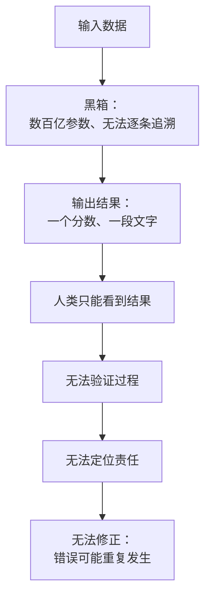

# 09｜可能出错：AI 的错误和人的错误有什么根本不同

> AI 会犯错吗？它的错误为什么更难被发现、更难被追责？

---

## 一、先说结论

AI 的错误不是“算错了”，而是黑箱式的：它能给出结果，却给不出可检验的理由。幻觉、偏见与不可解释性叠加在一起，让传统的问责机制第一次失效。

赫拉利这一章的名字是“可能出错”。他要说的不是“机器不如人可靠”，而是：当错误无法被解释，我们就无法修正它。

## 二、我们先理解一个问题

先做一个对比。

一个医生误诊了，你可以问他：你是怎么判断的？他会告诉你他看了哪些指标、排除了哪些可能、在哪一步判断错了。即使他错了，这个错误也是可追溯的，可以变成经验教训。

现在换成一个模型误判了你的贷款申请。你问：为什么拒绝我？答案是：模型给出的分数是 612，低于阈值。

你继续问：612 是怎么来的？答案是：由几百个特征计算得出。你问：哪个特征最关键？通常没有人能给你一个可信的回答。

问题就在这里：一个无法解释的错误，还算不算“错误”？它能不能被修正？

## 三、作者到底提出了什么观点？

赫拉利的判断是：AI 的错误与人类的错误在结构上不同。

第一，人类犯错通常伴随着一个可追溯的推理过程。我们可以问“你为什么这么想”，答案可能有漏洞，但它是可检验的。

第二，AI 的错误常常没有这个过程。模型给出的是输出，不是推理。它不是“想错了”，而是“生成了一个看起来合理的答案”。

第三，也是最麻烦的一点：这类系统的目标往往不是“说真话”，而是“生成看起来对的输出”。赫拉利特别指出，幻觉不是故障，而是机制的副产品。

第四，错误会被规模化。一个人的错误影响一个病人；一个模型的错误可能在一天内影响几百万次决策，而且每次看起来都不一样。

## 四、把这个观点翻译成人话

可以把信任理解成“理由的交换”。

我相信你的判断，是因为我能理解你的理由；如果我理解不了你的理由，我只能选择信或者不信——这不是信任，这是押注。

人类社会的问责机制，全部建立在“能问出理由”这个前提上：法庭要听陈述，医院要写病历，公司要留审批记录。当系统的理由无法被提取，这些机制就失去了着力点。

## 五、为什么会这样？

把“无法问责”的链条拆开，会看到它卡在哪一环。

第一步，输入进入模型。

第二步，模型内部的计算无法被逐条追溯。这不是有人故意保密，而是结构上就无法给出人类可读的推理。

第三步，输出只有结果，没有理由。

第四步，人类只能根据结果判断。

第五步，因为无法验证过程，我们无法知道它在什么条件下会出错。

第六步，因为无法定位责任，追责变成了追不到人的事。

第七步，错误无法被修正，只会在下一次以另一种形式出现。

## 六、举一个现实生活中的例子

2023 年，美国有一位律师在处理一起案件时，用 AI 帮助起草法律文书。文书里引用了六个判例，每个都有案件名称、法院、年份，看起来非常规范。

问题是：这六个判例都不存在。它们是 AI 编出来的。

法官发现后，对律师及其律所进行了处罚。这件事之所以值得记住，不是因为律师偷懒，而是因为它暴露了一个新问题：AI 的错误不是“明显错”，而是“看起来对”。它编出的判例格式完美、风格专业，连执业多年的律师都没有怀疑。

更麻烦的是后续：如果这种错误出现在一份没有被仔细核查的文件里，它会进入司法记录，成为“先例”，然后被别的文书引用。错误就这样被复制、固化，就像上一篇讲的那样。

## 七、回到书中重新理解

赫拉利把这一章命名为“可能出错：谬误百出的网络”，他要论证的是：网络出错是常态，不是例外。

他区分了两类错误。一类是随机误差，可以通过重复测量平均掉；另一类是系统性错误，会随着规模扩大而放大。AI 的问题主要属于第二类。

他还指出一个关键区别：人犯错时会犹豫，机器不会。一个人如果对某件事没有把握，语气会变弱、会加限定词；而模型可以用完全相同的自信语气输出正确和错误的内容。这种“自信的错误”比“迟疑的错误”危险得多。

赫拉利由此提出他的核心担忧：当错误既无法解释、又无法追责时，自我修正机制就失去了对象——你没法修正一个不承认自己有理由的东西。

## 八、这个观点背后还有什么？

第一，它有一个隐含前提：信任建立在可验证性之上。当我们无法验证，就只能依赖“表现”——而表现是可以被伪造的。

第二，它揭示了问责机制的结构依赖。第三篇讲的文件系统之所以能追责，是因为文件可以被审查；而模型没有“文件”，只有权重。

第三，它和第六篇形成尖锐的对照：自我修正机制要求“承认错误的可能性”，而黑箱系统连“哪里错了”都无法定位。

第四，它把风险从“机器出错”转向了“人类过度信任”。真正的危险往往不是错误本身，而是错误被当成权威。

## 九、这个观点有问题吗？

有几个地方值得质疑。

第一，一些研究者认为“黑箱”问题被夸大了。可解释性研究已有实质进展：特征归因、注意力可视化、影响函数等方法可以在一定程度上说明模型的判断依据。

第二，人也会犯错，而且常常更糟。人类专家的误判率并不低，偏见也更隐蔽。把“不可解释”当作 AI 独有的问题，可能并不公平。

第三，赫拉利的论述偏概念化，缺少对具体技术机制的讨论。这会让读者以为 AI 的错误完全随机，而实际上很多错误有清晰的模式，可以被测试发现。

第四，有批评者指出，他把因果链讲反了：问题通常不是“AI 会犯错”，而是“人给了 AI 不该给的权限”。同一个模型，用在写营销文案和用在量刑上，风险完全不同——这取决于制度，而不取决于模型。

## 十、今天再看这个观点

以下是基于赫拉利思想的现代延伸，不是作者原话。

在医疗、金融、司法这些领域，AI 辅助决策正在普及。随之而来的是一类新问题：当医生的判断和模型不一致时，谁说了算？如果模型建议的方案被采纳而结果不好，责任算谁的？

这些问题目前都没有稳定答案。但可以确定的是：只要“解释”这一环是空的，问责就只能停留在形式层面。

## 十一、这一篇真正应该记住什么？

1. AI 的错误不是算错，而是生成看起来合理却无法解释的输出；幻觉是机制的副产品，不是故障。
2. 人类社会的问责机制建立在“能问出理由”之上，黑箱让这个前提失效。
3. “自信的错误”比“迟疑的错误”危险得多：模型用同样的语气输出正确和错误的内容。
4. 真正的风险往往不是机器出错，而是人类把无法解释的输出当成权威。

## 十二、留一个问题

如果一个错误无法被解释，我们还能说它是“错误”吗——还是只能说它“结果不好”？
