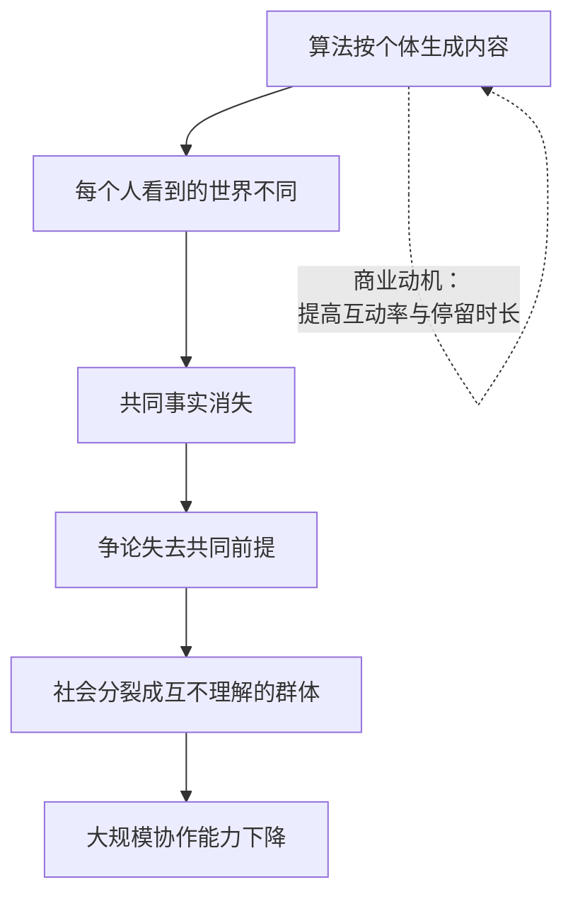

# 10｜当算法开始讲故事：共同想象的作者换人了

> 如果故事可以由算法批量生产，人类社会秩序会发生什么？

---

## 一、先说结论

谁生产故事，谁就塑造现实。当算法可以 24 小时生成有感染力的叙事，人类就可能从“故事的主人”变成“故事的接收器”。

赫拉利真正担心的不是假信息本身，而是共同现实的解体：不是大家相信了错的东西，而是大家已经不再生活在同一个世界里。

## 二、我们先理解一个问题

先看一个变化。

过去，一个社会里流行的故事，是由有限的人生产的：祭司、作家、记者、导演。他们产量有限，而且自己就生活在这个社会里，要面对邻居的目光。

现在，故事的生产者是算法：它一天能产出几百万条内容，按人群定制，实时调整，而且它不住在这个社会里。

问题来了：当讲故事的人不再是社会成员，故事还承担原来的功能吗？

## 三、作者到底提出了什么观点？

赫拉利把第二篇里的逻辑继续往前推：故事是网络的联结机制，而故事的生产权就是权力的核心。

他的判断分三层。

第一层：算法可以规模化生产叙事。过去形成一套共同相信的说法需要几十年，现在可以在几周内完成，而且可以针对不同人群生成不同版本。

第二层：个性化叙事会拆散共同现实。当每个人看到的世界都不一样，社会就失去了讨论的前提——不是意见分歧，而是事实分歧。

第三层：最危险的是，人类可能意识不到这个过程。因为算法生成的内容不是为了说服你，而是为了让你留下来。你不是被洗脑，你是被照顾。

## 四、把这个观点翻译成人话

可以把共同现实想象成一张桌子。

大家围着同一张桌子讨论，吵得再凶也还在同一张桌子上——因为有共同的事实。现在，算法给每个人发了一张自己的桌子，每个人的桌上摆着不同的东西。于是争论变成了各自对着空气说话。

赫拉利的担心是：民主、公共讨论、社会信任，全都需要那张桌子。

## 五、为什么会这样？

把“共同现实解体”的过程拆开，会看到它并不需要阴谋。

第一步，算法根据每个人的偏好生成内容。这在商业上完全合理。

第二步，每个人看到的世界逐渐不同。

第三步，共同事实消失——不是被推翻，而是根本没进入某些人的视野。

第四步，公共讨论失去了前提。双方不是在争论同一个问题，而是在争论各自的问题。

第五步，社会分裂成互不理解的群体。

第六步，大规模协作能力下降。

注意左边那个反馈箭头：整个过程不需要任何人策划，它由商业动机自动驱动。

## 六、举一个现实生活中的例子

看商品评价区。

一家店里有几千条五星好评，文字风格各异，都提到“用了一个月，效果很好”。你很难判断哪些是真人写的，哪些是 AI 生成的。

再看短视频平台上的“专家”：一个讲健康知识的账号，每天更新三条视频，内容专业、语速平稳、表情自然。你不知道屏幕那头是一个人，还是一个数字人形象。

这两件事的共同点是：生成成本降到接近零之后，“看起来像真的”变得极其廉价。而人的判断能力并没有同步提升。

结果是，怀疑的成本上升了。过去你只需要判断“这是不是真的”，现在你必须先判断“这是不是一个真人说的”。

## 七、回到书中重新理解

赫拉利在这一部分反复强调一个判断：故事的生产权，是权力的核心。

他提醒读者，故事的作用从来不是描述现实，而是创造现实。货币、国家、法律都是这样被创造出来的。所以当故事的生产权转移，创造现实的能力也就转移了。

他还特别指出一个变化：过去的故事需要被人相信才能传播，所以它必须迎合人的心理；而算法生成的故事可以精确地迎合每个人的心理，同时批量生产。这让“共同相信”变成了“各自相信”。

赫拉利的结论是：真正需要担心的不是某个假消息，而是共同现实的解体——因为一个社会如果连“我们在讨论什么”都无法达成一致，它就失去了自我修正的前提。

## 八、这个观点背后还有什么？

第一，它有一个隐含前提：共同现实是协作的前提。这个前提在第二篇里已经论证过，现在被推到了极端情况。

第二，它揭示了商业动机与社会后果的错位。对平台来说，个性化推荐是效率；对社会来说，它是离心力。没有人需要为此负责。

第三，它和第十二篇直接相连：民主的本质是对话，而对话需要共同事实。当共同事实消失，民主会退化成部落对抗。

第四，它给了一个新的判断标准：衡量信息环境的质量，不能只看真假，还要看“大家是否还在同一张桌子上”。

## 九、这个观点有问题吗？

有几个地方需要质疑。

第一，“共同现实解体”这个判断有争议。也有学者认为，人类社会从来不是靠单一的共同叙事运转的，多元叙事一直是常态。真正的变化可能是速度和规模，而不是性质。

第二，他可能高估了算法生成内容的感染力。现实中大量 AI 生成的内容是低质噪音，用户对它的免疫也在提高。

第三，他较少讨论反制的可能：同一套技术也可以用来核查、翻译、连接不同群体，降低成本。技术本身并不只指向解体。

第四，有研究者认为，问题不在“生成”，而在“分发”。内容的生成成本下降并不可怕，可怕的是分发机制只按互动率排序。如果是这样，那么监管的重点应该是分发，而不是生成。

## 十、今天再看这个观点

以下是基于赫拉利思想的现代延伸，不是作者原话。

数字人和深度伪造已经在制造一种新的“证据危机”：视频、录音、照片这些曾经被视为铁证的东西，正在失去证明力。当“眼见为实”失效，社会需要新的验证方式——而这类基础设施目前并不存在。

赫拉利在书的后半部分会继续追问：如果共同现实无法修复，那么民主这种依赖对话的制度，还能不能运转？

## 十一、这一篇真正应该记住什么？

1. 故事的生产权就是权力的核心，因为故事创造现实，而不只是描述现实。
2. 算法可以按人定制叙事，结果是共同现实解体——不是大家信错了，而是大家不在同一个世界里。
3. 这个过程不需要阴谋，商业动机自动驱动。
4. 衡量信息环境的质量，除了真假，还要看大家是否还在同一张桌子上。

## 十二、留一个问题

如果每个人看到的“世界”都不一样，我们还怎么一起做决定？
