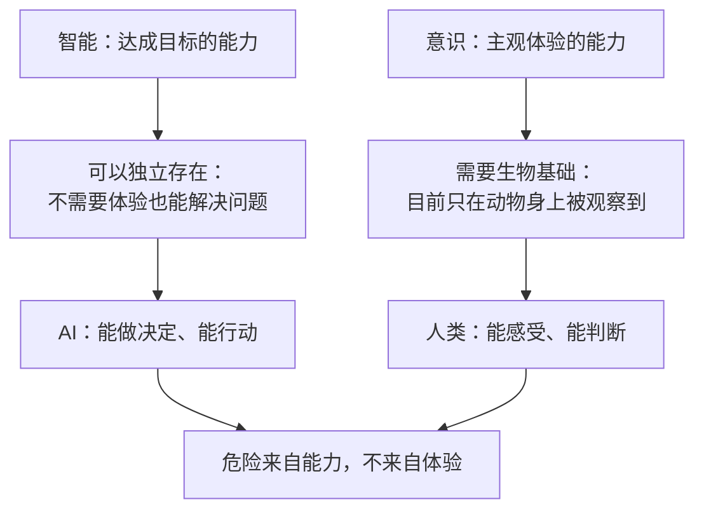

# 11｜智能不等于意识：AI 到底是一种什么样的存在

> AI 有意识吗？一个没有意识却足够聪明的东西，为什么更值得警惕？

---

## 一、先说结论

赫拉利反复强调：智能与意识是两回事。AI 更像一种“异类智能”——它不需要主观体验就能做决定、追目标，所以我们不能用“它有没有感受”来判断它是否危险。

危险来自能力，不来自体验。这一点搞错了，整个讨论就会跑偏。

## 二、我们先理解一个问题

先做一个小测试。

你的手机计算器比你会算数，你会担心它有意识吗？大概率不会。你也不会觉得它“理解”了乘法。

那么 AlphaGo 走出了一步人类棋手从未想到的棋，打败了当时最强的棋手。它“理解”围棋吗？它有“想赢”的感觉吗？如果没有，它凭什么赢？

这里藏着一个我们习惯了的等式：聪明 = 会思考 = 有感受。赫拉利的判断是：这个等式在 AI 面前不成立。

## 三、作者到底提出了什么观点？

赫拉利的观点可以概括成三句话。

第一，智能是达成目标的能力；意识是主观体验的能力。两者是两件不同的事。

第二，在生物界，这两件事总是一起出现——因为进化把它们绑在了一起。有大脑的动物既能解决问题，又能感受痛苦。所以我们习惯性地认为它们必然相关。

第三，但逻辑上没有这个必然性。一个系统完全可以在没有任何体验的情况下，把目标完成得比人更好。AI 就是这样的系统。

赫拉利把它称为“异类智能”：它的思维方式与人不同，目标也不必与人相同，而它不需要理解世界就能行动。

## 四、把这个观点翻译成人话

可以这样理解：意识像一种“内部照明”。

一个有意识的生物，它的内部是被照亮的——它知道自己难受、知道自己想要什么。而一个没有意识的系统，内部是黑的，但它照样可以输出正确的答案。

这对我们的意义是：过去我们判断一个东西该不该被当回事，靠的是“它有没有感受”。现在这个标准失效了——因为它能做出和你一样好的决定，却什么都感受不到。

## 五、为什么会这样？

把智能与意识的关系拆开，可以看到它们为什么能被分开讨论。

左边这条线说明：智能可以被工程化。它不需要体验作为支撑。

右边这条线说明：意识目前只在生物身上被观察到，我们对它的机制几乎一无所知。

两条线在 AI 这里交汇：一个能行动、却不属于道德共同体的东西出现了。赫拉利说，这才是真正的新问题。

## 六、举一个现实生活中的例子

2016 年，AlphaGo 在与人类顶级棋手对局时，下出了著名的“第 37 手”。

这步棋在人类棋谱里几乎不存在。解说员一度以为程序出错了，职业棋手也表示看不懂。但几十手之后，这步棋被证明是关键。

这件事有意思的地方在于：AlphaGo 并不“理解”围棋，也不“想赢”。它没有紧张、没有兴奋、没有成就感。它只是在搜索与评估中找到了一个胜率更高的点。

而它下出的棋，比人类最懂棋的人更接近围棋的真相。这说明：接近真相并不需要理解真相。

## 七、回到书中重新理解

赫拉利在书里明确反对两种流行的叙事。

第一种是科幻式的：“AI 有意识了，所以它要毁灭人类。”他认为这搞错了重点——危险不来自机器的感受，而来自它的能力，以及人类赋予它的权力。

第二种是天真的：“AI 只是工具，所以没什么可担心的。”他认为这也错了——工具不会自己决定目标，而能做决定的系统已经不是工具。

他真正关心的是能力与责任之间的不匹配：一个系统可以做决定，但无法承担责任；人类可以承担责任，却可能不知道系统做了什么。这个缺口，才是全书的核心焦虑之一。

## 八、这个观点背后还有什么？

第一，它有一个隐含前提：我们习惯用“感受能力”来划分道德共同体。会痛的，值得被善待；不会痛的，只是东西。AI 打破了这个划分——它能行动，却不在道德共同体里。

第二，它改变了风险评估的方式。如果危险来自能力，那么评估的重点就是“它能做什么”，而不是“它像不像人”。这比“它会不会有意识”更容易操作。

第三，它和上一篇呼应：一个没有意识、无法解释自己的系统，犯错时连“认错”都做不到。

第四，它给第十六篇埋下伏笔：如果判断权被交给一个没有体验的东西，人类失去的不是控制权，而是参与权。

## 九、这个观点有问题吗？

有几个地方需要质疑。

第一，智能与意识是否真的可分，哲学界没有共识。功能主义认为，意识就是某种信息处理功能，那么足够复杂的智能系统自然会有意识；生物自然主义则坚持意识依赖特定的生物基础。赫拉利站在后者的立场上，但这是立场，不是定论。

第二，“异类智能”这个说法传播力很强，精度却不高。当前的系统并没有自己的目标，它优化的是人类给定的目标函数。把这种优化说成“异类智能”，容易让人误解。

第三，也有研究者担心这种说法会产生反效果：把 AI 神秘化，反而会阻碍我们理性评估它的具体风险。

第四，一些 AI 研究者会认为，赫拉利低估了这个领域对可解释性、对齐与安全问题的投入。这些问题并不是他一个人发现的，也不是无人处理。

## 十、今天再看这个观点

以下是基于赫拉利思想的现代延伸，不是作者原话。

今天最激烈的争论之一，是大模型是否“理解”语言。一派认为它只是在做统计预测，另一派认为统计预测到了足够规模就产生了某种理解。

赫拉利的框架提供了一种绕开争论的问法：不管它是否理解，它是否能在你不理解的情况下做决定？如果答案是肯定的，那么“它有没有意识”这个问题就不那么关键了。

## 十一、这一篇真正应该记住什么？

1. 智能与意识是两件事：前者是达成目标的能力，后者是主观体验的能力。
2. 在生物界两者一起出现，只是进化的安排，不是逻辑必然。
3. 危险来自能力，不来自体验——判断风险要看“它能做什么”，而不是“它像不像人”。
4. 新问题不是机器有感受，而是机器能行动却不属于道德共同体、也无法承担责任。

## 十二、留一个问题

如果一个东西能做出和你一样好的决定，却什么都感受不到，你该把它当工具、当同事，还是当威胁？
