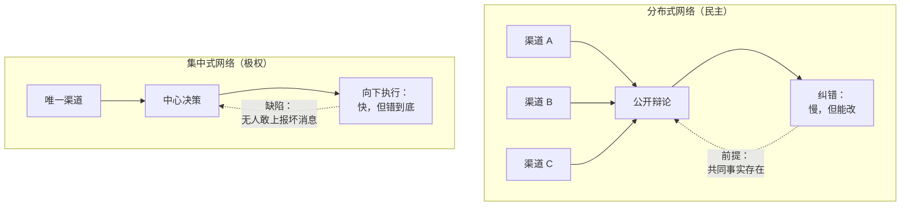

# 12｜民主制度：我们还能对话吗

> 民主的本质为什么是“对话”，而 AI 为什么正在破坏这场对话？

---

## 一、先说结论

民主是一套分布式信息网络，靠持续的对话与纠错运转。当信息环境被算法和假信息污染，对话所依赖的共同事实消失，民主就会退化成彼此喊话的部落。

赫拉利的问题很直接：如果民主的基础是对话，而我们正在失去对话的能力，那么民主还剩下什么？

## 二、我们先理解一个问题

先想一个看似技术性的问题：民主到底靠什么运转？

答案通常会说：选举、法律、分权。这些都没错，但它们都建立在同一个前提上——人们能够就同一件事进行讨论，并且承认对方说的可能是对的。

现在假设这个前提消失了：双方引用完全不同的事实，都认为对方被洗脑了，讨论变成互相指责。

在这种情况下，投票还在，制度还在，但民主还剩下多少实质？

## 三、作者到底提出了什么观点？

赫拉利把民主和极权当作两种信息网络结构来对比。

民主是一种分布式网络：信息沿着许多条独立的渠道流动，任何单一机构都无法垄断真相。它的运转方式是持续的对话与辩论，靠竞争性的纠错来改进判断。

极权是一种集中式网络：信息向一个中心汇聚，再由中心向下发布。它的优势是快速、统一、执行力强。

赫拉利指出，民主的优势从来不是“更聪明”，而是“更能改错”。它的代价也很明显：慢、吵、效率低、经常做出平庸的决定。而它最脆弱的地方在于——它依赖一个健康的信息环境。

所以当对话所依赖的共同事实被侵蚀，民主不是变得更激烈，而是变得更空洞。

## 四、把这个观点翻译成人话

可以把民主理解成“众筹判断”。

一个人的判断会有偏见、会有盲区，但很多人的判断经过公开辩论之后，错误可以被平均掉一部分。这套机制能工作，前提是大家在看同一份材料。

如果每个人手里的材料都不一样，那么“众筹”就变成了各说各话：不是在讨论问题，而是在展示立场。

## 五、为什么会这样？

把两种网络的结构画出来，差别一目了然。

左边这条链的优势在最后一步：它能改错。代价是中间过程很吵，而且经常显得无能。

右边这条链的优势在速度：没有争论，直接执行。代价是它没有回头路——因为纠错渠道被自己关掉了。

赫拉利真正担心的是：分布式网络的优势，取决于它的输入质量。如果输入被污染，分布式网络不会变聪明，只会变得更分裂。

## 六、举一个现实生活中的例子

看一个家庭群或者同学群。

最初大家讨论的是同一件事：某个新闻、某个政策、某个亲戚的决定。后来慢慢变了：有人转发的文章，另一些人根本看不到；双方各自引用“事实”，都觉得对方被带偏了。

再过一段时间，群里的讨论就停止了。不是达成了一致，而是大家发现没法讨论了——每次开口都是同样的争吵，于是干脆不说了。

这个过程的可怕之处在于：它不需要任何人做错事。平台推荐、内容生产、群体选择，各自按自己的逻辑运行，结果就是共同讨论空间的消失。

## 七、回到书中重新理解

赫拉利在这一章里，把民主和极权放进同一个分析框架：它们都是信息网络，区别在于信息如何流动、权力如何分布。

他强调一个容易被忽略的事实：对话是一种历史罕见的安排。在人类历史的大部分时间里，社会并不是靠对话运转的，而是靠命令、传统和暴力。民主能存在，靠的是一整套配套条件：独立的媒体、可信任的司法、教育、公共空间。

他也指出，民主的自我修正机制需要时间来运作：选举要几年，司法要程序，调查要周期。而信息环境的变化速度远快于此。

赫拉利的结论不是“民主必胜”，而是：民主是一种需要持续维护的脆弱安排，而它的维护成本正在上升。

## 八、这个观点背后还有什么？

第一，它有一个隐含前提：共同事实是公共讨论的基础设施。这个基础设施过去由媒体、学校、公共机构共同维护，现在它们的能力都在下降。

第二，它揭示了民主的成本结构。民主的慢和吵，是它可纠错的代价。当人们只看到代价、看不到收益时，就会倾向于追求“效率”——这是集中式网络的诱惑。

第三，它和上一篇直接相连：共同现实一旦解体，对话就失去了前提。

第四，它把问题从“谁对谁错”转向了“我们还能不能一起讨论”。这是一个更基础的问题。

## 九、这个观点有问题吗？

有几个地方需要质疑。

第一，把民主定义为“信息网络”是一种简化。民主还涉及权力分配、代表制、法治、公民社会等维度，这些不能都还原成信息流动。

第二，一些政治学者认为，民主的危机主要来自经济不平等与制度失灵，而不是信息环境。如果民众的不满有真实的物质基础，那么把问题归因于假信息，可能是在回避更根本的矛盾。

第三，他的“对话”模型偏向理想化的审议民主，与现实中政党动员、利益集团博弈的运作方式差距很大。

第四，他较少讨论民主国家内部的信息垄断：平台权力、媒体集团、游说产业，同样在扭曲信息流动，而且它们并不来自外部。

## 十、今天再看这个观点

以下是基于赫拉利思想的现代延伸，不是作者原话。

在选举周期里，AI 生成的内容已经开始批量出现：仿冒候选人声音的自动电话、以假乱真的图像、按人群定制的说服话术。这些内容的特点不是让人相信某个谎言，而是让人不再相信任何东西。

治理上的回应还很不成熟。标记 AI 生成内容、平台自查、事实核查，都面临同一个难题：验证的速度永远追不上生成的速度。

## 十一、这一篇真正应该记住什么？

1. 民主是一种分布式信息网络，优势不在聪明，而在能纠错；代价是慢和吵。
2. 民主依赖共同事实这个基础设施，而它正在被侵蚀。
3. 对话在人类历史上是罕见的安排，需要一整套配套条件才能维持。
4. 当共同事实消失，民主不会变得更激烈，只会变得更空洞。

## 十二、留一个问题

如果民主的前提是“大家还在同一张桌子上”，那么当桌子被搬走之后，我们该重建桌子，还是换一种决策方式？
