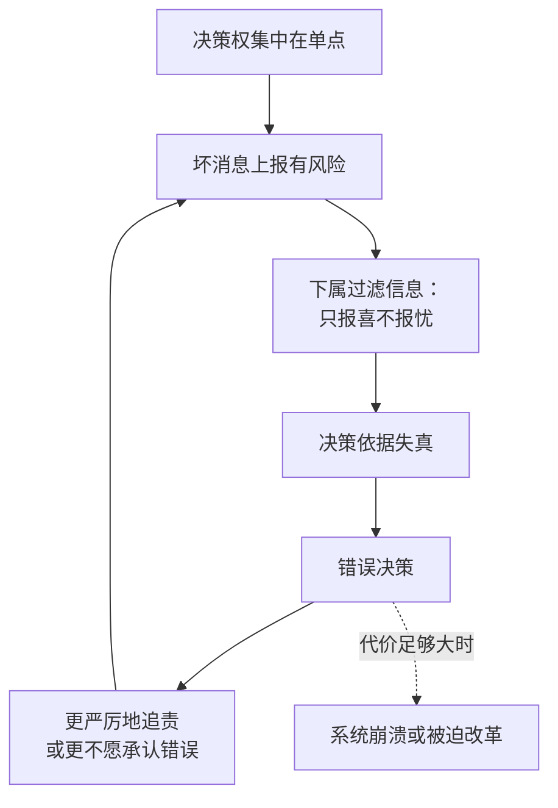

# 13｜“英明领袖”的神话：为什么集中决策总是灾难收场

> 为什么“把决定权交给最英明的人”这种想法总会失败？

---

## 一、先说结论

信息天然是分散的，任何单点都不可能掌握全部。把决策权集中到一个人（或一个算法）手里，等于关掉整个网络的纠错能力——历史上的大灾难几乎都遵循这一剧本。

赫拉利反复强调：问题不在于领袖聪不聪明，而在于结构。再聪明的人，也只能看到别人愿意让他看到的东西。

## 二、我们先理解一个问题

先看一个悖论。

几乎所有的灾难性决策，事后看都愚蠢得不可思议：明显的情报被忽略、明显的风险被低估、明显的反对意见被压制。但做出这些决策的人，往往并不愚蠢——他们中有不少是精明的政治动物，甚至是出色的战略家。

那么问题出在哪里？为什么聪明人在关键位置上会做出愚蠢的决定？

## 三、作者到底提出了什么观点？

赫拉利的答案是：问题出在信息结构上。

集中式网络有一个致命缺陷：坏消息很难上传。因为上报坏消息的人要承担后果——他可能被斥责为悲观、不忠，甚至被当作问题本身。于是每个人都学会了只报好消息。

而决策者恰恰需要坏消息：他要判断风险、要调整方向。当输入被系统性过滤之后，他的决策依据就失真了。

赫拉利还讨论了一个更深的问题：绝对正确的幻想。当一个领袖或一个机构被赋予“不会错”的属性时，纠错就失去了合法性——因为质疑权威本身变成了错误。他在书里提到，这类主张在历史上反复出现，而它们的结果几乎都一样。

## 四、把这个观点翻译成人话

可以把决策者想象成坐在一间屋子里的人。

他只能看到从门缝里递进来的纸条。如果递纸条的人都学会了挑好的写，那么他看到的就永远是一个正在变好的世界。他基于这些纸条做出的决定，再英明也救不了他。

关键点在于：这个过滤机制不是某个人设计的，而是所有人自我保护的结果。它不需要阴谋，只需要人性。

## 五、为什么会这样？

把集中决策的失败拆开，会看到一条自我强化的循环。

第一步，决策权集中。这在短期内效率很高，也很清晰。

第二步，上报坏消息开始有风险——不是有人下令封口，而是每个人都能算清成本。

第三步，信息被过滤。

第四步，决策者看到的现实与真实情况脱节。

第五步，做出错误决策。

第六步，为了维护权威，错误更难被承认，于是过滤更严重。

第七步，循环持续，直到代价无法掩盖。

## 六、举一个现实生活中的例子

看一个项目组的崩盘过程。

项目上线前三个月，负责测试的同事发现核心功能的性能不达标。他在周会上提了一句，项目经理说“先按计划推进，性能后面再优化”。

一个月后，性能问题更严重了。这位同事又提了一次，这次他加了一句“可能有点风险，但也许能扛住”。他学会了一件事：说问题要带缓冲。

再过一个月，客户开始投诉。所有人突然开始找原因，而原因早在三个月前就被说过了。

复盘会上，项目经理说：“为什么没人早点告诉我？”——这句话很真实，也很讽刺：他其实被告诉过两次，只是系统不奖励说真话的人。

## 七、回到书中重新理解

赫拉利在这一章里，用历史上的极权政权作为案例。

他的论证重点不是“这些人有多坏”，而是结构：斯大林和希特勒都不是不聪明的人，他们对权力的运作非常敏感。但正因为他们建立了集中式的信息网络，他们最终只能听到自己愿意听的东西。战争中的误判、资源的错配、对敌方能力的低估，很多都源于此。

他也讨论了“绝对正确”在制度上的表现形式：当某个职位被赋予不可错的属性，任何纠错尝试都会先被当成不忠来处理。

赫拉利由此得出一个反直觉的判断：集中决策的诱惑恰恰来自它的高效。它可以快速行动、清晰表态、明确责任——这些都是民主做不到的。但它的高效是短期的，它的代价是系统性的。

## 八、这个观点背后还有什么？

第一，它有一个隐含前提：知识是分散的。这个论证在经济学里由哈耶克提出过——没有哪个中央计划者能掌握分散在千万人手里的信息。赫拉利把这个逻辑从经济扩展到了政治。

第二，它解释了为什么“找对人”不能解决问题。只要结构不变，再英明的人也会被同一套过滤器包围。

第三，它和第六篇呼应：纠错机制的本质是“让坏消息可以安全地传播”。这是所有制度设计里最难、也最关键的一件事。

第四，它给下一篇留下入口：如果 AI 可以让集中式网络既掌握全部信息、又不需要依赖会过滤信息的下属，那么集中决策的老毛病会被治好吗？还是会变成另一种东西？

## 九、这个观点有问题吗？

有几个地方需要质疑。

第一，“集中决策必然失败”这个判断过强。历史上也有集中决策成功的例子：战时动员、大型基础设施、危机应对。集中决策在目标明确、反馈迅速的场景里，效率优势是真实的。

第二，他主要使用极端案例（纳粹德国、苏联），缺少对“有限集中”的讨论。现实中大量组织是混合结构：战略集中、执行分散。

第三，哈耶克的论证是关于经济计算的，把它直接扩展到政治领域，论证力度会减弱——政治决策的目标往往不像市场价格那样清晰可测。

第四，也有学者认为，真正的问题不是“集中还是分散”，而是“有没有纠错渠道”。一个分散但没有纠错机制的网络，同样会长期犯错。

## 十、今天再看这个观点

以下是基于赫拉利思想的现代延伸，不是作者原话。

在企业里，这套机制被称作“CEO 回声室”：高管团队逐渐只剩下一种声音，董事会的信息来源被管理层垄断，直到危机爆发。近年不少公司的突然崩塌，都能看到这条链条。

一个值得注意的新变化是：一些公司开始用数据看板替代层层汇报，试图绕过“人过滤信息”的问题。但如果指标本身是被挑选出来的，过滤只是换了一个位置。

## 十一、这一篇真正应该记住什么？

1. 集中决策的失败不是道德问题，而是信息结构问题：坏消息无法安全上传。
2. 信息过滤不需要阴谋，只需要每个人都做出自我保护的选择。
3. “绝对正确”的属性一旦被赋予某个位置，纠错就失去了合法性。
4. 集中决策的诱惑来自它的高效，但它的高效是短期的，代价是系统性的。

## 十二、留一个问题

如果 AI 能让决策者绕过“会过滤信息的下属”，集中决策的老毛病会被治好，还是会变成一种更彻底的东西？
