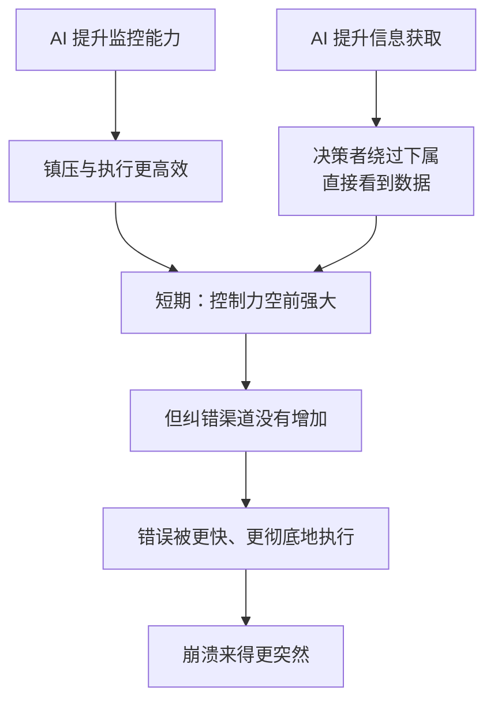

# 14｜极权主义：所有力量归于算法？

> AI 会让极权制度变得不可战胜吗？

---

## 一、先说结论

AI 确实给了极权前所未有的监控与决策能力，但集中式网络天生缺乏纠错：没人敢指出错误，系统就会越走越偏。极权在 AI 时代既更强大，也更脆弱。

赫拉利的两面判断同样重要：不要因为它脆弱就以为它必然失败——他在书里明确提醒，不要假设幻觉网络注定崩溃。

## 二、我们先理解一个问题

先看一个历史困境。

历史上的独裁者都想要全知：知道谁在抱怨、谁在串联、谁在囤粮。但他们做不到，因为执行监控的是人——人会偷懒、会被收买、会有自己的判断。所以他们只能在“有限监控”和“极高成本”之间取舍。

现在假设监控可以自动化：不需要密探，不需要告密者，系统自动记录、自动分析、自动预警。

问题来了：如果监控的瓶颈被技术解决了，极权是不是就天下无敌了？

## 三、作者到底提出了什么观点？

赫拉利的回答是：一半是，一半不是。

是的那一半：AI 确实解决了极权的两个老问题。第一是监控成本，自动化让全面监控第一次变得可行。第二是信息过滤，决策者可以直接读取原始数据，不必依赖会美化汇报的下属。

不是的那一半：纠错问题无解。集中式网络最根本的弱点是，它无法承认自己错了。而 AI 恰恰会放大执行力度——如果方向错了，AI 会让错误执行得更快、更彻底、更不可挽回。

赫拉利还提出一个更微妙的可能：当决策越来越多地交给算法，统治者本人也可能被架空。他名义上拥有一切权力，实际上只是在确认算法给出的选项。

## 四、把这个观点翻译成人话

可以把极权想象成一辆车。

它的特点是方向盘只有一个，油门很猛，而且没有刹车——因为刹车（纠错）需要有人敢说“我们走错了”，而这套系统不奖励这种人。

AI 做的事情，是给这辆车换一个更强的引擎。它确实跑得更快了，但刹车依然没有。而且速度越快，撞上的时候越惨。

## 五、为什么会这样？

把“更强也更脆弱”这个双重判断拆开，可以看到它来自两条不同的机制。

上半部分是“更强”的来源：监控和执行都被技术加持，控制力达到历史高点。

下半部分是“更脆弱”的来源：控制力提升不等于纠错能力提升。一个系统越是能压制反对意见，它就越听不到自己正在走错路。

两条机制叠加的结果是：极权在和平时期看起来更稳固，在危机时刻崩得更快。

## 六、举一个现实生活中的例子

看外卖骑手和仓储工人身上的“算法管理”。

系统给每个人派单、计算路线、设定时限，超时就扣分、影响收入。它不需要主管盯着，也不需要谁发脾气——它只是持续地、精确地执行规则。

这套系统效率极高。但它有一个特点：申诉渠道非常有限。骑手遇到商家出餐慢、电梯坏了、天气恶劣，系统并不会“理解”，它只记录超时。

在微观尺度上，这就是“所有力量归于算法”的样子：规则清晰、执行严格、纠错困难。工人不是被某个人压迫，而是被一套没人能修改的规则压迫。

## 七、回到书中重新理解

赫拉利在这一章里，把极权当作一种信息网络来解剖，而不是当作一种道德败坏。

他的分析框架是：极权的优势在于统一行动与快速执行，弱点在于缺乏自我修正机制。这两点都不是靠“更坏的坏人”造成的，而是结构决定的。

他还讨论了 AI 带来的新变量：当算法参与到决策中，极权可能演变成一种更陌生的形态——不是某个人在统治，而是某个模型在筛选、排序、建议，而所有人都不知道它的标准是什么。

赫拉利最后提醒读者：不要因为“幻觉网络终将失败”而安心。他在书里明确写道，纳粹和斯大林体制曾经是历史上最强的网络之一，它们差一点就赢了。如果我们要阻止这类网络的胜利，必须自己去做那些困难的工作。

## 八、这个观点背后还有什么？

第一，它有一个隐含前提：权力需要信息，而信息需要渠道。控制渠道的能力越强，纠错的可能性就越低——这是同一个硬币的两面。

第二，它揭示了集中式网络的规模悖论：网络越大，需要处理的信息越多，单点决策的失真越严重。

第三，它和上一篇呼应：坏消息上传的困难是集中式网络的原罪，AI 解决的是“技术上的上传”，不是“制度上的上传”。

第四，它给了一个重要的方法论提醒：判断一个制度是否健康，不要看它多强大，要看它能不能承认错误。

## 九、这个观点有问题吗？

有几个地方需要质疑。

第一，他对极权的分析偏结构主义，可能低估了镇压之外的因素：合法性叙事、经济绩效、民族主义动员，这些同样能维持一个体制的稳定。

第二，把问题限定在“极权 vs 民主”可能已经过时。民主国家同样在大规模使用算法治理：福利发放、警务预测、边境筛查。算法权力的集中并不专属于某一种制度。

第三，关于“AI 强化极权”这个判断本身有争议。也有研究者认为，AI 同样会削弱极权——信息更难被完全封锁，跨境流动更难阻断。

第四，最需要警惕的是心理层面：如果“极权更脆弱”被当作安慰，人们就可能低估它的持久性。赫拉利本人对此是清醒的，但读者容易只记住前半句。

## 十、今天再看这个观点

以下是基于赫拉利思想的现代延伸，不是作者原话。

算法管理正在从工厂和平台扩散到更多行业：排班、考核、信贷、保险定价。它们的共同特征是：规则由系统执行，而系统不解释自己。

这带来一个治理上的新课题：如何在算法管理的场景里保留有效的申诉渠道。如果申诉只是让人再点一次“确认”，那它就不是纠错，而是仪式。

## 十一、这一篇真正应该记住什么？

1. AI 解决了极权的两个老问题（监控成本、信息过滤），但解决不了第三个：纠错。
2. 控制力提升不等于纠错能力提升，速度越快，撞上时越惨。
3. 算法统治可能连统治者本人都架空：名义上拥有一切权力，实际上只是在确认选项。
4. 不要因为“幻觉网络终将失败”而安心——历史上最强的网络之一，差一点就赢了。

## 十二、留一个问题

如果一个系统连“我们可能错了”都不允许被说出口，那么它变强的时候，究竟是在变强，还是在积累一次更大的崩塌？
