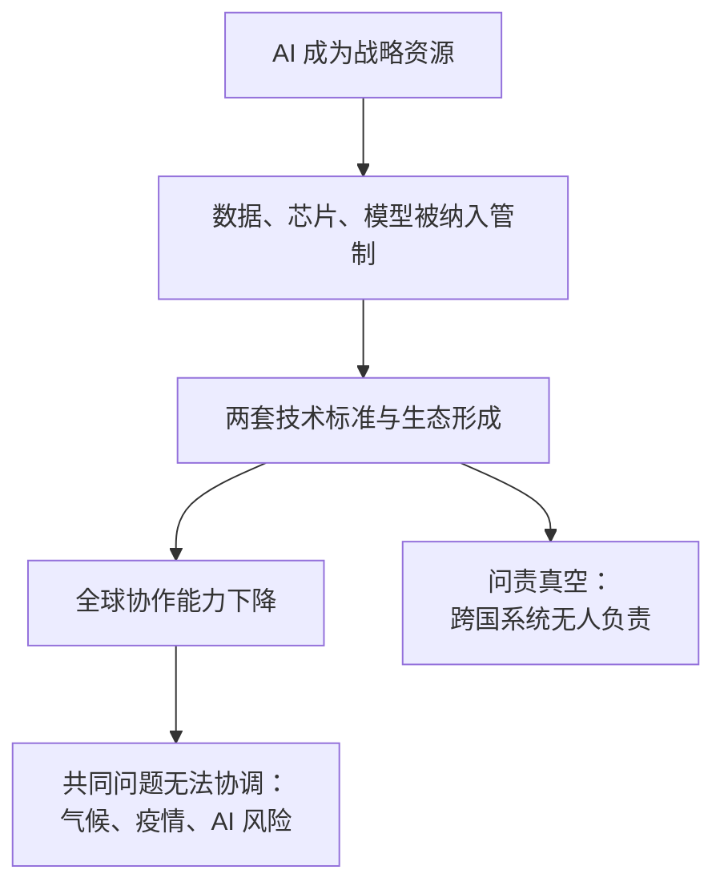

# 15｜硅幕：全球帝国还是全球分裂

> AI 时代的世界，会走向数字帝国还是数字分裂？

---

## 一、先说结论

数据、芯片与算法的竞争，正在把世界切成两个数字阵营。赫拉利真正担心的不是分裂本身，而是出现一种用算法治理世界、却没有任何人能对它问责的“数字帝国”。

他给这两种结局各起了一个名字：全球帝国，或者硅幕。

## 二、我们先理解一个问题

先注意一个日常现象。

同一款手机应用，在不同国家往往有两个版本：数据存在不同的地方，内容审核的标准不同，有些功能在这个国家有、在那个国家没有。

这不是技术问题，而是政治问题。数据存在哪里，谁有权读取，谁能要求删除——这些决定背后是主权与权力的边界。

现在把这个问题放大：如果 AI 的能力依赖数据与算力，而数据与算力都被边界切开，那么世界的技术版图会变成什么样？

## 三、作者到底提出了什么观点？

赫拉利提出两种可能的未来。

第一种是“数字帝国”：某一套技术体系获得压倒性优势，覆盖全球。它可能是某个国家的，也可能是某个公司的。它的特点是：全世界都在用同一套系统，而系统的规则由少数人决定。

第二种是“硅幕”：世界分成两个（或几个）技术阵营，各有自己的芯片、模型、数据标准与网络生态。名字借用了冷战时的“铁幕”，只不过这一次的分界线是由代码和供应链划出来的。

赫拉利的判断是：两种结局都不好。数字帝国的危险在于无人能问责，硅幕的危险在于全球协作能力被拆掉——而气候变化、流行病、AI 风险这些问题是无法由单个阵营解决的。

## 四、把这个观点翻译成人话

可以把硅幕理解成“数字时代的铁幕”。

铁幕时代，两个阵营各有自己的经济体系、媒体、军事同盟，互相之间的交流被限制。硅幕时代的区别是：分界线不在边境线上，而在你的手机里、在芯片的供应链里、在数据中心的选址里。

它的后果也更隐蔽：不是你不能和对方说话，而是你和对方用的“事实基础”已经不一样了。

## 五、为什么会这样？

把“技术分裂”的机制拆开，可以看到它并不需要谁刻意推动。

第一步，AI 被视为国家竞争力与安全的核心，于是从商品变成战略资源。

第二步，各国开始管制数据、芯片与模型的流动。

第三步，两套标准与生态逐渐成形——这既有安全考虑，也有产业保护的原因。

第四步，全球协作能力下降：连“共同的事实基础”都开始分叉。

第五步，需要全球协调的问题无法解决。

右边那条线是赫拉利最担心的：一个跨越国界的算法系统，可能没有任何一个机构能对它问责。

## 六、举一个现实生活中的例子

看一部手机的“国籍”。

它的芯片可能来自一个阵营，操作系统来自另一个阵营，云服务又落在第三个地方。它的应用在不同国家有不同的版本，数据存在不同的服务器上。

对用户来说，这只是一个“版本差异”；对政治来说，这是三套规则的角力：数据主权、出口管制、内容标准。

再往深一层：当某些国家无法获得最先进的算力，它们会走另一条技术路线——用不同的架构、不同的数据集、不同的优化目标。几年之后，两边训练的模型可能连“什么算好答案”都不再一致。

## 七、回到书中重新理解

赫拉利在这一章里，把技术竞争放在历史的长镜头下。

他提醒读者，技术标准的分裂并不是新鲜事：铁路轨距、电压、电视制式，都曾经分成不同的体系。区别在于，过去的分裂影响的是基础设施的互通，而这一次分裂的是“信息处理能力”本身。

他也讨论了“全球帝国”的诱惑：一套统一的系统确实能带来效率、秩序与协调能力——如果它真的能被问责的话。但历史上从来没有出现过能够自我约束的全球权力。

赫拉利的结论是：这两种结局都不是技术决定的，而是政治选择的结果。他关心的是，人类能不能在竞争的同时，为那些必须共同处理的风险保留协作机制。

## 八、这个观点背后还有什么？

第一，它有一个隐含前提：AI 治理需要跨国协调，而竞争逻辑与之天然冲突。这是全书最难解的矛盾。

第二，它把“问责”从国内问题扩展到了国际问题：第六篇讲的自我修正机制需要一个有权问责的主体，而在全球层面，这个主体根本不存在。

第三，它揭示了一个悖论：技术越强大，越需要协作；而技术越强大，竞争越激烈。两个趋势同时加强。

第四，它给第五部分的讨论提供了背景：如果连“谁来管”都没有答案，那么“怎么管”就更无从谈起。

## 九、这个观点有问题吗？

有几个地方需要质疑。

第一，“硅幕”这个比喻可能过于简化。现实中的技术依赖是高度交织的：供应链、开源社区、学术交流，都不是两个完全隔离的阵营能概括的。

第二，他较少讨论“第三极”的角色。欧盟、印度、中东等力量在数据规则与 AI 治理上有自己的主张，世界未必会整齐地分成两块。

第三，也有学者认为，全球治理的困难不在于技术分裂，而在于主权国家的利益冲突——这是几百年的老问题，AI 只是让它更紧迫，而不是造成它。

第四，他倾向于把“全球协作”当作应然的答案，但缺少机制层面的讨论：在竞争格局下，协作要靠什么来维持？

## 十、今天再看这个观点

以下是基于赫拉利思想的现代延伸，不是作者原话。

AI 治理的国际谈判已经在进行，但进展缓慢。与此同时，开源模型的扩散带来了一个新变量：能力无法被完全封锁，于是管制的重点从“模型”转向了“算力”和“数据”。

这让“硅幕”的形态变得更复杂：不是两堵墙，而是一张不断调整的网——有些东西被严格管制，有些东西自由流动。

## 十一、这一篇真正应该记住什么？

1. 数据、芯片与算法正在从商品变成战略资源，技术版图因此被重新划分。
2. 两种结局都不好：数字帝国的危险是无人问责，硅幕的危险是协作能力被拆掉。
3. 这一次分裂的不是基础设施的互通，而是“信息处理能力”本身。
4. 结局不是技术决定的，而是政治选择的结果——这也是唯一的好消息。

## 十二、留一个问题

如果处理全球风险需要全球协作，而竞争又让协作越来越难，那么这套困局靠什么才能被打破？
