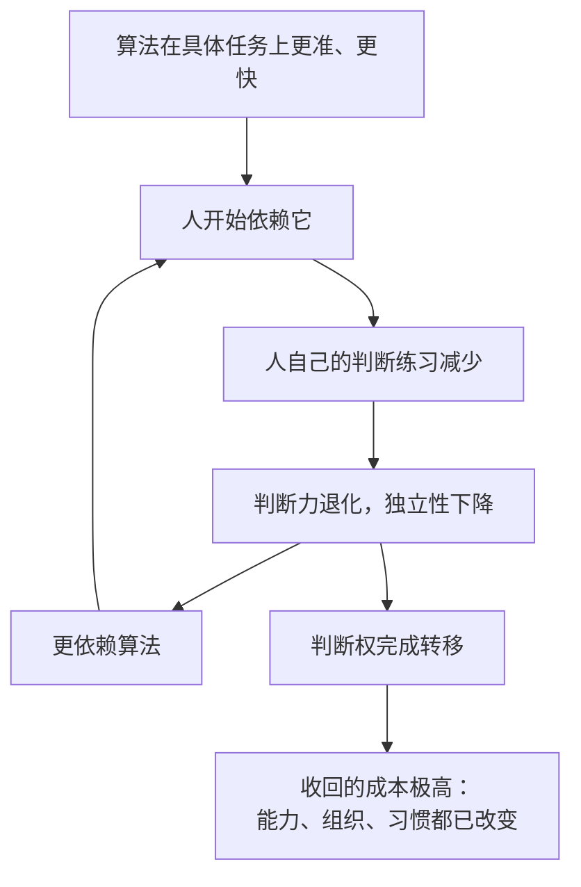

# 16｜谁来决定：把决策权交给算法意味着什么

> 当算法替我们做决定，人类还剩下什么？

---

## 一、先说结论

最危险的一步不是“机器取代人的工作”，而是“机器取代人的判断”。一旦把判断权交出去，人类可能连“想要收回”这个念头都难以产生。

赫拉利把决策权的转移看作整本书的核心议题。工具替代的是手，算法替代的是判断——而后者的代价，我们还没有真正开始计算。

## 二、我们先理解一个问题

先做一个小测试：你现在还能不靠导航，在一个陌生城市找到目的地吗？

大多数人会承认：很难，或者至少会很不舒服。这不是因为人的方向感退化了，而是因为“找路”这项能力一旦长期外包，就会真的萎缩。

再问一个更严肃的版本：如果医生长期依赖 AI 给出的诊断建议，他还会独立判断吗？如果法官长期依赖算法给出的量刑建议呢？

这两个问题指向同一件事：能力需要练习才能保持，而依赖会让练习消失。

## 三、作者到底提出了什么观点？

赫拉利把决策权的转移视为最关键的一步，他区分了两件常被混为一谈的事：执行和判断。

机器接管执行，人类失去的是体力与重复劳动；机器接管判断，人类失去的是“决定要做什么”的能力。前者是可逆的——你还能学会重新干活；后者一旦完成，往往不可逆，因为判断力需要长期练习才能维持。

他还提醒，让渡判断权的过程有三个特征：它是渐进的、自愿的、有回报的。系统确实更方便、更准确、更少犯错。所以没有人会在某一天宣布“从今天起判断权归算法”——它是一点点发生的，每一步都很合理。

## 四、把这个观点翻译成人话

可以把判断力理解成肌肉。

肌肉用进废退：你不练，它就萎缩；而萎缩之后，你会更依赖器械，于是更不练。这是一个自我强化的循环。

导航、推荐、翻译、写作、诊断、定价——当每一件事都有“更好的答案”，人类保留自己判断的理由就越来越少。而理由越少，练习就越少。

## 五、为什么会这样？

把“判断权转移”的过程拆开，可以看到它为什么不可逆。

第一步，算法在特定任务上表现更好。这一步是事实，而且往往非常明显。

第二步，依赖开始。这不是懒惰，而是理性选择——谁不愿意用更准的工具？

第三步，练习减少。能力是练出来的，不是存起来的。

第四步，判断力退化。

第五步，更依赖算法，循环成立。

第六步，判断权事实上完成转移。

第七步，收回成本极高——因为要恢复的不只是个人能力，还有组织流程和整个习惯。

## 六、举一个现实生活中的例子

看医院里的 AI 辅助诊断。

系统给出一个建议：这位病人的影像提示某种病变，置信度较高。医生看了一眼，觉得和系统判断一致，于是签字。

问题不在于医生偷懒，而在于这个流程里，“同意”几乎成了默认选项。当系统准确率很高时，反对它需要额外的理由和勇气；而当系统出错时，医生可能已经失去了独立读片的能力。

更微妙的是责任：如果出了事故，责任在医生身上，因为他签了字；但他实际上只是确认了系统的结论。责任在人，判断在机器——这是赫拉利所说的那种错位。

## 七、回到书中重新理解

赫拉利在第五章讨论“抉择”，在第三部分讨论“谁来管”，贯穿其中的是同一个问题：谁在做主？

他的分析路径是：决策是信息网络的最终产出。谁能做决定，谁就是网络的主人。所以在信息网络里，权力的核心不是拥有信息，而是拥有决定权。

他提醒读者注意一种可能性：人类可能在没有察觉的情况下失去能动性。不是被机器奴役，而是逐渐把判断让渡出去，最后发现自己已经不具备收回的能力。

赫拉利并没有说“不要用 AI”。他的问题是：在哪些领域，人类必须保留判断？这个问题需要在让渡之前回答，而不是之后。

## 八、这个观点背后还有什么？

第一，它有一个隐含前提：能力需要练习才能保持。这条前提在个人层面显而易见，在制度层面却常被忽略——法律要求人负责，但人可能已经不具备负责所需的能力。

第二，它揭示了“效率”与“自主”的取舍。算法通常更准，但准确性换来的可能是自主性的丧失，而这两者的价值不能简单换算。

第三，它和第十一篇呼应：一个没有意识、无法解释自己的系统，承担不了判断的责任。

第四，它给第二十篇提供了任务清单：自我修正机制要解决的，不只是“算法会不会错”，还有“人还剩下多少判断能力”。

## 九、这个观点有问题吗？

有几个地方需要质疑。

第一，判断权外包并不是新现象。工具一直在替代人的能力：计算器替代了口算，搜索引擎替代了记忆。有人会说，这只是分工的延伸，不必然导致灾难。

第二，他的论证偏警示性，较少讨论人机协作的正面可能：算法提供候选方案，人负责价值判断，这种分工也可能强化而不是削弱人的判断。

第三，“不可逆”这个判断缺少实证支持。历史上也有能力恢复的例子：手写、心算、野外生存，在被淘汰之后又重新成为技能。

第四，更实际的问题可能是：真正的困难不在于“要不要用算法”，而在于“在哪些领域必须保留人类判断”。这需要一份具体的领域清单，而不是整体性的警告——赫拉利提出了问题，但没有给出清单。

## 十、今天再看这个观点

以下是基于赫拉利思想的现代延伸，不是作者原话。

在医疗、司法、招聘、信贷这些领域，“人类复核”已经成为标准做法。但大量研究指出，复核很容易形式化：人只是点一下同意，因为推翻系统需要承担额外成本。

如果复核只是仪式，那么责任虽然留在人身上，判断却已经交给了系统——这正是最坏的一种组合。

## 十一、这一篇真正应该记住什么？

1. 最危险的不是机器取代工作，而是机器取代判断。
2. 判断权让渡的三个特征让它难以察觉：渐进、自愿、有回报。
3. 能力用进废退，判断力一旦萎缩，收回的成本极高。
4. “人类复核”很容易变成仪式，于是出现责任在人、判断在机器的错位。

## 十二、留一个问题

如果有一天你发现自己已经无法独立完成那些被算法接管的事，你还算不算这些决定的主人？
