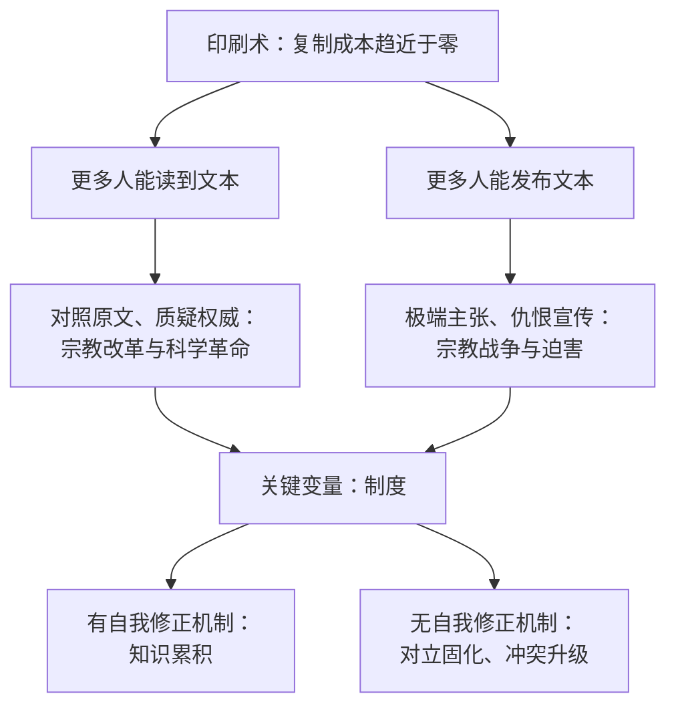

# 17｜印刷术的双面性：同一次信息革命，为什么既带来科学也带来宗教战争

> 为什么同一种技术进步，既能解放人，也能放大疯狂？

---

## 一、先说结论

信息革命本身不决定结果。印刷术既催生了科学革命与宗教改革，也把仇恨与战争宣传送到每个村庄。决定方向的是制度：有没有自我修正机制，比有没有新技术更重要。

这是全书最容易被忽略、也最有现实意义的一章。因为它回答的正是我们今天要面对的问题：这一次会不会不一样？

## 二、我们先理解一个问题

先看一个反差。

十五世纪中叶，古腾堡把活字印刷带进欧洲。接下来两百年里，欧洲发生了三件大事：宗教改革、科学革命、宗教战争。

前两件通常被写成进步的故事：思想解放、知识普及。第三件则是欧洲近代最惨烈的杀戮之一，一些地区的人口在几十年里大幅减少。

同一个技术，同一次革命，为什么既带来了解放，也带来了屠杀？

## 三、作者到底提出了什么观点？

赫拉利的判断是：技术不决定结果，但它改变了可能性空间。

印刷术做的事情很简单：把复制文本的成本降到了极低。这个变化本身是中性的，它同时打开了两个方向。

一个方向是扩散知识：更多人可以读到书，可以自己对照原文，可以质疑权威的解释。科学革命与宗教改革都受益于此。

另一个方向是扩散极端主张：小册子、传单、煽动性的宣传可以以前所未有的速度和规模传播。宗教仇恨、末日预言、对异端的指控，同样被印刷机放大。

赫拉利明确反对“技术进步必然带来进步”的叙事。他认为，决定方向的是制度——尤其是自我修正机制的强弱。

## 四、把这个观点翻译成人话

可以把技术理解成一个放大器。

放大器不决定你说什么，它只决定有多少人听见。你可以用它喊救命，也可以用它喊仇恨。技术本身不会替你选择，但它会让你的选择后果更大。

所以，问“这项技术好不好”是没有意义的问题。真正该问的是：我们有没有配套的制度，让它的放大作用朝一个可纠错的方向走？

## 五、为什么会这样？

把印刷术的两条分支画出来，会看得更清楚。

上半部分是同一台机器带来的两种可能，它们甚至常常同时发生。

下半部分说明：技术只提供了可能性，制度决定了哪种可能性被实现、被放大。

赫拉利的观点是，印刷术真正催生的不只是新知识，还有一套新的纠错制度：公开实验、期刊、同行评议、可重复的验证。这套制度才是科学革命的引擎，而不是印刷机本身。

## 六、举一个现实生活中的例子

看手机摄像头。

它让警察暴力、战争罪行、事故现场被记录下来，成为无法否认的证据。近年很多公共事件的推动力，正来自一段随手拍的视频。

同一个摄像头，也让偷拍、敲诈、隐私侵犯变得极其廉价。同一种能力，两个方向。

关键变量同样不在摄像头，而在制度：有没有法律约束拍摄与传播，有没有平台责任，有没有对受害者的救济渠道。技术提供了能力，社会决定它的用途。

## 七、回到书中重新理解

赫拉利在书里多次回到这段历史。

他讲到，宗教改革之所以能迅速扩散，靠的正是印刷机：大量廉价小册子把争论从神学院带到了街头。这场争论最终演变成持续数十年的宗教战争。

他同时也指出，印刷术是科学的加速器。但科学之所以能累积，是因为它发明了制度：公开实验、同行评议、可重复验证。也就是说，科学不是“印刷机的产物”，而是“印刷机加上一套纠错制度的产物”。

赫拉利由此得到一个推论：技术在历史上从来不决定结局，它只是把选择摆到人面前。这个推论，正是他讨论 AI 时的基本立场。

## 八、这个观点背后还有什么？

第一，它有一个隐含前提：技术的后果取决于配套制度，而不是技术本身的性质。这个立场与“技术中性论”相近，但赫拉利更强调“制度是变量”。

第二，它解释了为什么同样的技术在不同社会会产生完全不同的结果。这也提醒我们：讨论 AI 的风险，不能只讨论模型能力，还要讨论它被放进什么制度里。

第三，它和第六篇呼应：自我修正机制是唯一能把技术潜力导向真相的东西。

第四，它反驳了一种常见的安慰：既然印刷术最终带来了科学，那么 AI 最终也会带来好处。这个推论在赫拉利看来是站不住脚的——因为印刷术之后，也有一段非常黑暗的时期。

## 九、这个观点有问题吗？

有几个地方需要质疑。

第一，“技术中性”的立场本身有争议。有研究者认为技术有内在倾向：印刷术天然有利于分散权威，因为复制让中心难以垄断文本；那么 AI 是否也有内在倾向？赫拉利没有展开这一点。

第二，他可能低估了印刷术发挥作用的社会条件：识字率、城市化、商业出版、纸张价格。没有这些条件，印刷机不会带来任何革命。

第三，关于宗教战争与印刷术的因果关系，历史学界有不同看法。王朝政治、财政危机、气候与农业减产都是重要因素。把战争主要归因于信息革命，是一种偏信息主义的解释。

第四，也有人批评说，“制度决定论”只是把技术决定论换成了另一种单一解释：如果一切都由制度决定，那么技术的变化又有什么意义？

## 十、今天再看这个观点

以下是基于赫拉利思想的现代延伸，不是作者原话。

社交媒体的历史几乎是印刷术故事的翻版：它既让被压制的声音得以传播，也让谣言、仇恨与操纵以前所未有的速度扩散。最初人们以为它天然是民主的工具，后来发现它同样可以是分裂的工具。

赫拉利在书中的立场是：不要指望技术自动站在好的一边，也不要把技术当成替罪羊。真正的问题是——我们能不能在窗口关闭之前，把制度补齐。

## 十一、这一篇真正应该记住什么？

1. 信息革命不决定结果，它只改变可能性空间。
2. 印刷术同时催生了科学革命与宗教战争，两个方向由制度决定。
3. 科学的关键不是印刷机，而是印刷机加上一套纠错制度：公开、可重复、可质疑。
4. “技术最终会带来好处”是一个历史依据不足的安慰。

## 十二、留一个问题

如果连印刷术这样“明显进步”的技术都带来过几十年的屠杀，那么我们凭什么相信，这一次会不一样？
