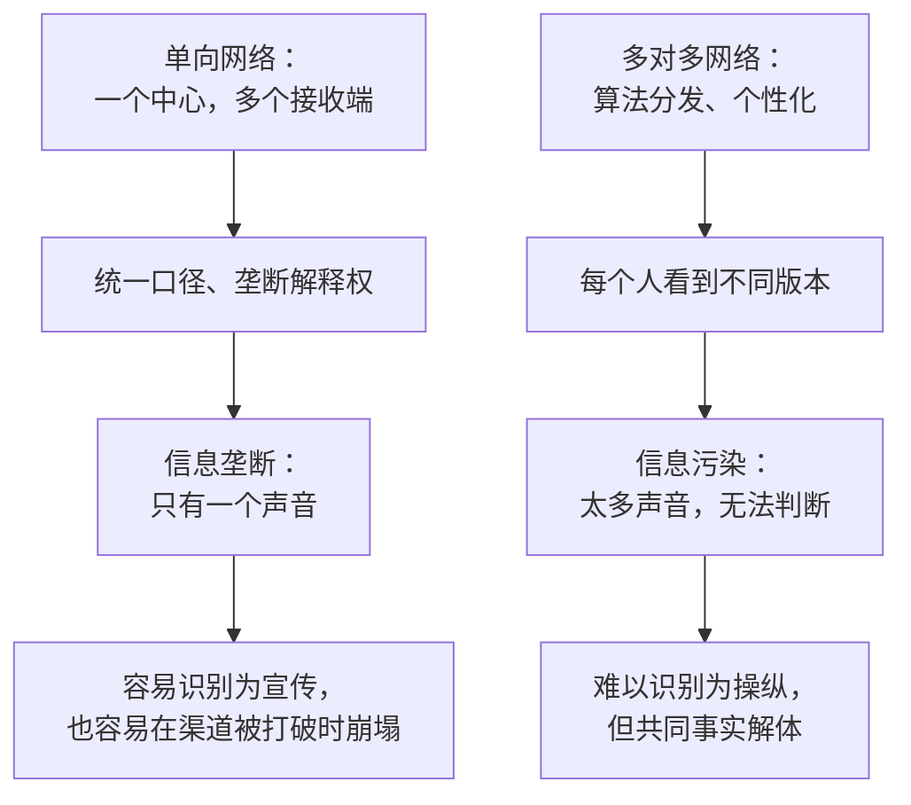

# 18｜宣传机器：20 世纪的极权如何操控信息网络

> 20 世纪的极权政权如何用广播和报纸统治？它和今天的算法有什么不同？

---

## 一、先说结论

广播与报纸是“一对多”的单向网络，极权靠它统一口径、垄断解释权。今天的算法网络是“多对多”的：中央控制更难，但操纵更隐蔽、更个性化。

赫拉利的分析给出一个反直觉的结论：信息垄断和信息污染是两种不同的危险，而它们需要不同的应对方式。

## 二、我们先理解一个问题

先做一个对比。

二十世纪三十年代，一个普通家庭晚上能听到的声音是有限的：电台里的新闻、报纸上的社论。所有人听到的是同一套说法。

今天，同一个家庭里，父亲刷到的内容、母亲刷到的内容、孩子刷到的内容，几乎没有重叠。没有人规定他们该看什么，每个人都在“自己选择”。

哪一种更难抵抗？看似是前者，因为那是强制；但如果仔细想，后者的操纵可能更难识别——因为它看起来像是你自己的选择。

## 三、作者到底提出了什么观点？

赫拉利在这一章里，把二十世纪的极权当作一种信息网络的运作方式来解剖。

单向网络的特点是：一个中心，多个接收端，没有回传渠道。广播尤其典型——你可以听，但不能回话。这种结构让“统一口径”第一次变得可行：同一个版本的现实，可以同时送进几百万个家庭。

赫拉利指出，极权需要的是单一真相版本。它必须回答所有问题，而且答案不能有分歧。广播与报纸正好适合这种需求。

但他的重点在对比：今天的算法网络是“多对多”的。信息的流动不再是单向广播，而是无数个节点之间互相转发、互相强化。这种结构让中央控制变得困难，但带来了新的问题：不是只有一个声音，而是有太多声音，以至于无法判断。

## 四、把这个观点翻译成人话

可以把单向网络想象成一个大喇叭。

大喇叭的特点是：所有人听到同一个声音，而且没人能回话。它的操纵方式是粗暴的，但也是可见的——你至少知道“这是宣传”。

算法网络则像无数个私人电台。每个人听到的内容都不一样，而且每个人都以为那是自己挑的。操纵不再需要统一口径，它只需要在你情绪最容易被调动的时候，把最合适的内容推给你。

一个在明处，一个在暗处。

## 五、为什么会这样？

把两种网络的失效模式放在一起比较，差别就清楚了。

上半部分说明：垄断式的控制是可见的，因此也是可反抗的。只要渠道被打开，统一口径就会失效。

下半部分说明：污染式的操纵是隐形的。它不要求你相信某个版本，它只要求你不再相信任何版本——因为当所有说法都差不多时，人就会退回立场和情绪。

赫拉利的判断是：从垄断到污染，控制没有消失，只是换了形态。

## 六、举一个现实生活中的例子

看家里的老人。

如果一位老人每天只看一个电视频道，那么他对世界的理解就会由这个频道的编辑标准决定：什么算重要新闻，谁值得同情，什么问题是禁忌。他不觉得自己被影响，因为他只是在“看新闻”。

这其实是一个微缩版的单向网络：信息来源单一，缺少对照，久而久之形成稳定的世界观。

对比之下，年轻人的信息环境是碎片的：几十个来源，算法按兴趣分发，看起来自由，但可能更极端、更难核实。两种环境各有各的盲区：一个是被单一来源塑造，一个是被碎片来源淹没。

## 七、回到书中重新理解

赫拉利在这一章里，把纳粹德国与苏联的宣传机器作为案例。

他的分析要点是结构而非道德：这些政权之所以能高效动员，是因为它们掌握了当时最先进的传播技术，并且把渠道收归一处。统一口径带来的效果是惊人的——一个社会可以在几年内改变对现实的整体描述。

同时他也指出这种结构的脆弱：一旦渠道被打破（战争失败、外部广播渗透、技术扩散），垄断式叙事就会迅速瓦解，因为它没有备用版本。

然后他把镜头转向今天：算法分发让“渠道”这个概念本身消失了。信息不再沿着固定管道流动，而是按每个人的反应实时调整。这意味着，过去那种“打破垄断就能获得自由”的思路，可能不再有效。

## 八、这个观点背后还有什么？

第一，它有一个隐含前提：控制信息的方式随技术变化，而技术的变化会改变控制的形态，而不是消灭控制。

第二，它区分了两种失效模式：垄断（只有一个声音）与污染（太多声音）。前者摧毁多样性，后者摧毁判断力。

第三，它和上一篇呼应：印刷术时代的分裂、广播时代的垄断、算法时代的污染，是同一问题的三种形态。

第四，它给第十二篇的讨论提供了历史纵深：民主需要的不是“更多信息”，而是可判断的信息环境。

## 九、这个观点有问题吗？

有几个地方需要质疑。

第一，他对宣传效果的分析可能过于侧重技术条件，而低估了社会条件：经济危机、战败创伤、阶层撕裂，这些才是宣传能够生效的土壤。

第二，“单向 vs 多对多”的二分过于整齐。现实中两者是混合的：今天的算法平台也在做集中式编辑与流量倾斜，而当年的极权也在利用人际传播。

第三，传播学里有一个长期争论：宣传的效果是否被高估？早期研究认为媒体能直接塑造态度，后来的研究更强调“有限效果”——受众会根据自己的既有立场筛选信息。赫拉利的叙述更接近前者。

第四，他较少讨论公共广播等非商业化模式的经验：在一些国家，公共媒体在维持共同事实方面确实起过作用。这类制度经验对今天的问题可能比警告更有用。

## 十、今天再看这个观点

以下是基于赫拉利思想的现代延伸，不是作者原话。

如果宣传曾经需要统一口径，那么今天的“个性化宣传”已经不需要了：同一套叙事可以针对不同人群调整版本，各自都觉得自己听到的是真话。

这让传统的应对手段（辟谣、事实核查、媒体素养教育）都面临同一个困境：它们依赖共同的判断标准，而污染恰恰破坏了这个标准。

## 十一、这一篇真正应该记住什么？

1. 单向网络让统一口径第一次变得可行，垄断式控制因此成为可能。
2. 算法网络是“多对多”的：控制更难，但操纵更隐蔽、更个性化。
3. 信息垄断与信息污染是两种不同的危险：前者摧毁多样性，后者摧毁判断力。
4. “打破垄断就能获得自由”的旧思路，在污染式操纵面前可能失效。

## 十二、留一个问题

如果操纵不再需要统一口径，而只需要在每个人耳边说不同的话，那么“自由选择”还剩下多少意义？
