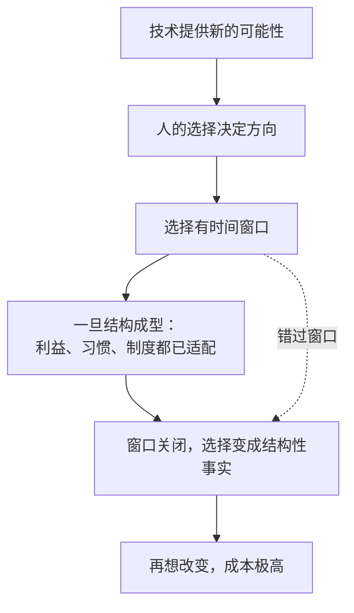

# 19｜人类还有选择吗

> 在技术与历史的“必然性”面前，人的选择还有多大空间？

---

## 一、先说结论

赫拉利拒绝技术决定论：历史不是被技术推着走的，而是被无数选择累积出来的。但选择的窗口很窄，而且必须在灾难发生之前使用。

他还提醒一句更不客气的话：不作为也是一种选择，而且是最常见的一种。

## 二、我们先理解一个问题

先问一个问题：如果 AI 的发展是必然的，那我们还讨论什么？

很多关于 AI 的讨论都带着一种宿命感：技术会怎么发展、社会会怎么变化、人类会面临什么——好像这些都是剧本，我们只是在等待剧情展开。

但如果真是这样，那么道德、制度、选择就都没有意义了。反过来，如果选择有意义，那么它究竟能改变什么？它又能在什么时候起作用？

## 三、作者到底提出了什么观点？

赫拉利站在选择这一边。

他从《人类简史》时期就有一个一贯立场：历史没有必然的方向。帝国的兴衰、宗教的胜败、制度的更替，事后看像是必然，当时看全是偶然与选择的结果。

在《智人之上》里，他把这个立场用在了 AI 上：技术提供了新的可能性，但走向哪一个可能性，取决于人怎么选。他反对两种宿命论——一种是“AI 必然带来灾难”，另一种是“技术总会解决问题”。

但他同时也强调：选择的窗口不会一直开着。一旦某个结构成型（比如判断权被普遍外包、某套标准被固化），再想回头，代价会高得多。

## 四、把这个观点翻译成人话

可以把历史理解成一条有很多岔路的路，而不是一条铺好的轨道。

我们站在岔路口上，可以往左也可以往右。但岔路口不是永久的：走出一段之后，路面会收窄，回头的成本会上升，最后就变成了一条单行道。

赫拉利的提醒正是这个意思：现在能选，不等于以后也能选。

## 五、为什么会这样？

把“选择的窗口”拆开，可以看到它为什么会关闭。

第一步，技术打开新的可能。

第二步，人的选择决定走哪一条。

第三步，选择有时间限制。这是关键的一步——它把“自由”变成了“紧迫”。

第四步，一旦选定的方向被利益、习惯和制度固化，它就不再是选择，而是现实。

第五步，窗口关闭。

第六步，改变的成本从“决策成本”变成“重建成本”。

## 六、举一个现实生活中的例子

看核武器。

1945 年之后，人类进入了一个随时可能自我毁灭的时代。按技术决定论，全面核战争似乎是迟早的事。

但接下来发生的事情是：各国建立了军控条约、建立了热线、形成了威慑与核查机制，并在几次危机中刻意后退。结果是，八十年来核武器没有再被用于战争。

这个结果不是技术决定的，是选择的结果——一连串具体、枯燥、经常被嘲笑的外交安排。

它也不能证明人类总能选对。它只说明一件事：在最坏的可能性面前，选择仍然是有作用的。

## 七、回到书中重新理解

赫拉利在全书结尾处明确表达了这一立场：他不是在预言，而是在警示。

他的论证结构是：前面的十一章说明了信息网络如何运作、为什么会出错、为什么容易失去纠错能力；而结语要说的是——这些机制不是命运，它们是可以被人改变的，只要人愿意。

他也承认，人类在历史上经常在事后才明白自己错过了什么。所以他的呼吁不是“请保持乐观”，而是“请现在就去做那些枯燥的工作”。

## 八、这个观点背后还有什么？

第一，它有一个隐含前提：人的能动性是真实的，而不是幻觉。如果连“选择”都是被决定的，那么整本书的批判就没有落脚点。

第二，它把希望与责任绑在一起。承认“我们还有选择”，等于承认“选错了要怪我们”。

第三，它和第十六篇呼应：判断权的转移之所以危险，正是因为它是选择的结果，而选择一旦完成就很难回头。

第四，它给最后一篇留了任务：如果还有选择，那么应该选什么？

## 九、这个观点有问题吗？

有几个地方需要质疑。

第一，“选择有效”的论证偏软。核武器没有毁灭世界，可能说明选择有用，也可能只是运气好——几次危机中，误判与偶然都差点导致灾难。

第二，他给出的行动建议比较笼统。“建设有强自我修正机制的机构”这句话方向明确，但缺少具体路径：先做什么、谁来做、成本由谁承担。

第三，有批评者认为，他的分析框架本身带有决定论色彩：他强调网络结构、技术趋势、系统性力量，最后又说“我们还有选择”，两者之间存在张力。这个批评不无道理。

第四，他可能低估了集体行动的困难。即使所有人都知道该做什么，搭便车、短期利益、责任分散也会让行动难以发生——这不是认知问题，而是组织问题。

## 十、今天再看这个观点

以下是基于赫拉利思想的现代延伸，不是作者原话。

在 AI 治理领域，“窗口期”是一个被反复提及的概念：监管一旦落后于能力扩散，再想追上就要付出更高成本。这与赫拉利的判断是同一件事，只是尺度更具体。

但也要注意一个反例：历史上很多治理确实是“事后补票”完成的——先出事，再立法。所以真正的问题也许不是“能不能在窗口期行动”，而是“我们愿意付出多少代价来提前行动”。

## 十一、这一篇真正应该记住什么？

1. 历史不是被技术决定的，而是被选择累积出来的——这是他整本书的立场基础。
2. 选择有时间窗口，一旦结构成型，选择就变成了事实。
3. 不作为也是一种选择，而且是最常见的一种。
4. “我们还有选择”这句话的另一面是：选错了，责任在我们。

## 十二、留一个问题

如果选择的窗口正在关闭，你怎么判断现在该做什么，而不是等到更有把握的时候再做？
