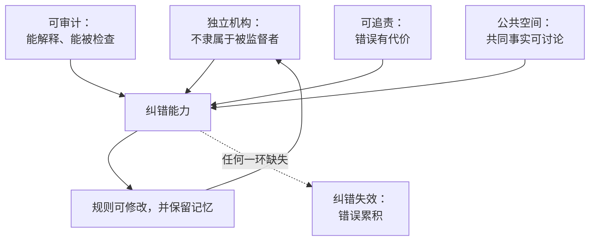

# 20｜我们需要什么样的自我修正机制

> 面对 AI，什么样的制度设计能让我们保住纠错能力？

---

## 一、先说结论

答案不是“更强的控制”，而是更强的自我修正：独立机构、可审计的算法、跨国协调，以及一个不被单一叙事吞掉的公共空间。控制只能维持秩序，修正才能保住真相。

赫拉利自己也说，这本书最核心的建议其实很朴素：去干那些枯燥的活，建设有强自我修正机制的机构。

## 二、我们先理解一个问题

先看一个常见的思路。

面对 AI 带来的风险，最直觉的反应是加强控制：审查内容、限制模型、集中监管权、要求平台听话。这些措施看起来最直接，也最容易见效。

但问题是：控制需要一个控制者。如果控制者本身出错，谁来纠正他？如果控制权被滥用，谁来约束？

换句话说，如果解药是“更集中的权力”，那么我们就回到了前几篇反复讨论的那个陷阱里。

## 三、作者到底提出了什么观点？

赫拉利给出的方向不是控制，而是修正。他提出的要素大致有四个。

第一，独立的监督机构。监督者不能隶属于被监督者——这是所有纠错机制的前提。

第二，可问责的算法。系统要能被审查、能解释、能被追责。第九篇讲的“黑箱”，在这里变成了制度设计问题。

第三，跨国协调。AI 的风险不认国界，但监管只认国界。第十五篇的“硅幕”，在这里变成了必须解决的障碍。

第四，保护公共空间。共同事实是对话的前提，而它需要被主动维护，不能指望它自然存在。

赫拉利还特别强调一点：这些机制不会一劳永逸。它们需要持续维护，而且很容易被侵蚀——历史上每一次建立起来的纠错机制，后来都被削弱过。

## 四、把这个观点翻译成人话

可以把自我修正机制理解成刹车系统。

刹车不会让你跑得更快，它甚至会让你的车更重、更贵。但没有刹车的车，只能在空旷的路上开——而我们的路从来不空旷。

更关键的是：刹车必须由车上的人控制，而不是由发动机厂商控制。这就是“独立性”的含义。

## 五、为什么会这样？

把这套机制拆开，可以看到四个部件为什么缺一不可。

第一，独立机构提供发现错误的可能。

第二，可审计提供定位错误的可能。

第三，可追责提供改正错误的动力。

第四，公共空间提供讨论错误的场所。

四者齐备，纠错才成立。缺任何一环，循环都会断掉：没有独立机构就发现不了，不能审计就定位不了，没有代价就不想改，没有公共空间就无法形成压力。

## 六、举一个现实生活中的例子

看食品安全的抽检制度。

它的结构很简单：由独立于企业的机构定期抽检；抽检结果公开；发现问题就下架、召回、处罚；处罚结果再公开，形成压力。

这套制度的巧妙之处在于：它不指望企业自觉，也不指望消费者自己辨别。它把“发现错误”变成了一项常规工作，由专门机构持续执行。

结果是，食品出问题的频率被压到了一个可接受的水平——不是因为它消灭了问题，而是因为它让问题能持续被发现。

这套思路正是赫拉利想搬到 AI 治理上的模式：不追求一次性的完美方案，而是建立持续发现问题的能力。

## 七、回到书中重新理解

赫拉利在结语里，把建议收敛到这一点上。

他承认这个答案听起来很无聊：没有宏大的技术方案，也没有激动人心的宣言，只有机构建设、流程设计、责任划分。他还自嘲说，这些工作既不浪漫，也不容易获得掌声。

但他强调，这是唯一被历史验证过的方法。科学之所以能持续逼近真相，不是因为科学家更聪明，而是因为他们建立了制度；民主之所以能纠错，不是因为选民更明智，而是因为有选举、司法、媒体这些机制。

他也提出一个警告：不要指望“更聪明的算法”来解决算法的问题。如果我们把纠错也交给算法，那么我们就彻底放弃了自我修正的能力。

## 八、这个观点背后还有什么？

第一，它有一个隐含前提：纠错是制度问题，不是技术问题。技术可以提高纠错的速度，但不能替代纠错的结构。

第二，它和第六篇形成完整的闭环：前面讲清了自我修正机制为什么重要，这里讲清了它由什么组成。

第三，它和第十篇形成呼应：制度需要被故事支撑。要让人们愿意为纠错付出代价，就需要一套能让人相信“纠错值得”的叙事——这一点赫拉利提到得不多，但它很关键。

第四，它把责任放回到了具体的人身上：机制不是自然生成的，它需要有人去建、去守、去维护。

## 九、这个观点有问题吗？

有几个地方需要质疑。

第一，建议过于笼统。独立机构、跨国协调、公共空间，这些方向都对，但缺少具体路径与优先级：先做什么？在哪些领域先做？成本由谁承担？

第二，“独立机构”在现实中很难真正独立。监管机构被产业俘获、被政治周期左右、被预算限制，都是常态。赫拉利把它当作一个可实现的方案，可能低估了难度。

第三，跨国协调在当前的地缘环境下几乎不可能。第十五篇刚讲过硅幕的形成，这里又要求全球协作，两者之间存在明显的张力，他并没有给出解决办法。

第四，有研究者认为，他误判了问题的性质：AI 治理的真正困难不是“缺少机构”，而是“速度差”——技术迭代以月计，立法以年计。在这个前提下，即使机构建好了，也可能永远慢一步。

## 十、今天再看这个观点

以下是基于赫拉利思想的现代延伸，不是作者原话。

算法审计、AI 法案、事故报告制度，已经在一些地区进入实践。它们的共同思路正是赫拉利所说的“持续发现问题的能力”：不追求一次性审批，而是要求持续披露、持续评估。

目前的经验显示，最难的部分不是制定标准，而是让人愿意披露坏消息——这又回到了第十三篇的那条循环：只要上报坏消息有风险，任何机制都会被绕过。

## 十一、这一篇真正应该记住什么？

1. 面对 AI，解药不是更强的控制，而是更强的自我修正。
2. 自我修正需要四个部件：独立机构、可审计、可追责、可讨论的公共空间，缺一不可。
3. 纠错是制度问题，不是技术问题；不要指望用算法解决算法的问题。
4. 这套机制不会一劳永逸，它需要被持续维护，而且很容易被侵蚀。

## 十二、留一个问题

如果纠错机制必须由人来建设和维护，那么在一个大家都觉得“来不及了”的时代，谁愿意去做那些枯燥的工作？
