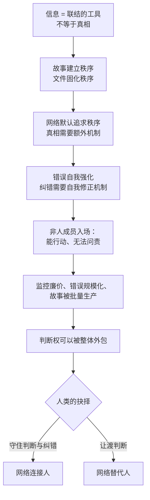

# 21｜结语：在智人之上，人类要回答的问题

> 这本书最终想让我们警惕什么，又希望我们守住什么？

---

## 一、先说结论

赫拉利的核心警告不是“AI 会毁灭人类”，而是“人类可能已经把判断权交了出去，却还以为自己仍然在做主”。信息网络既可以连接人，也可以替代人；守住前者，是这一代人无法回避的任务。

所以这本书真正的问题不是“机器会变成什么”，而是“我们还想做什么样的人”。

## 二、我们先理解一个问题

回到全书开篇的那个悖论。

我们把自己叫做智人——智慧的人。我们登上了月球，分裂了原子，读写了基因。但与此同时，我们正在破坏自己赖以生存的生态，正在失去彼此对话的能力，正在把越来越重要的判断交给我们并不理解的系统。

一个如此聪明的物种，为什么会做这么多自我毁灭的事？

赫拉利的回答贯穿了整本书：问题不在人性，而在信息。给好人坏信息，他们就会做出坏决定。

## 三、作者到底提出了什么观点？

把这二十篇的论证串起来，赫拉利的观点可以压缩成一条链。

信息的第一功能是联结，不是反映真相；所以网络天然倾向于用故事建立秩序，而真相需要额外的机制才能存活。故事需要文件来固化，文件会让人变成条目；错误会自我强化，而纠错需要专门的制度。这些制度在历史上一直稀缺，而它们刚刚被证明是可以建立的——科学、法治、民主都是例子。

现在，网络里出现了新成员：不需要意识就能行动的非人系统。它们让监控变廉价，让错误规模化，让故事可以被批量生产，也让判断权第一次可以被整体外包。

于是问题变成了：人类能不能在判断权被交出去之前，把自我修正机制建起来？

## 四、把这个观点翻译成人话

可以把整本书压缩成一句话：

信息网络既可以连接人，也可以替代人。

连接人，意味着网络帮你更好地和其他人一起判断；替代人，意味着网络替你判断，而你逐渐不再需要具备判断能力。

这两条路都不是技术决定的。它取决于我们是否还愿意去做那些枯燥的工作：建立机构、维护流程、追问理由、承认错误。

## 五、为什么会这样？

把全书的因果链画成一张图，会看得更清楚。

这张图的重点在最后一步：前面所有的环节都是结构性的力量，而最后一步是选择。

## 六、举一个现实生活中的例子

做一个小清单。

今天你一天里，有多少决定是系统给的？看什么内容、走哪条路、买哪个商品、听什么音乐、这笔钱能不能借、这条信息是真是假。每一项都有“更好的答案”，每一项你都用得很顺手。

再问一句：这些决定里，有多少你还有能力自己完成？

这个清单不需要答案，它本身就是答案。赫拉利的整本书，问的就是这个问题。

## 七、回到书中重新理解

赫拉利在结语里明确了两件事。

第一，这本书不是预言。他反复强调，他不是在说“AI 一定会怎样”，而是在说“如果我们不做什么，可能会怎样”。

第二，他给出的答案很朴素：建设有强自我修正机制的机构。他承认这听起来既不激动人心，也不够彻底，但这是历史上唯一被验证过的方法。

他还提醒读者一件事：信息网络的历史告诉我们，最危险的不是技术的强大，而是人类的自我确信——当一个人、一个机构、一个时代认为自己已经绝对正确时，灾难往往就开始了。

## 八、这个观点背后还有什么？

第一，它有一个隐含前提：人类的价值不在于效率，而在于判断与责任。如果效率是唯一标准，那么把判断交给机器几乎是必然的；只有承认判断本身有价值，才有理由保留它。

第二，它把“智能不等于意识”（第十一篇）与“判断权”（第十六篇）和“自我修正机制”（第二十篇）串成了一条完整的线：能行动的不一定有意识，没意识的不承担责任，而承担责任需要判断——所以判断权不能整体让渡。

第三，它给读者留下了一个不太舒服的结论：这件事没有旁观者。每个人都在用自己的选择，投票决定网络是连接人还是替代人。

## 九、这个观点有问题吗？

有几个地方需要质疑。

第一，整本书偏警示、少方案。赫拉利自己也承认这一点，但批评者认为，反复强调风险而缺少可执行路径，容易让读者陷入无力感。

第二，历史类比有其局限。印刷术、广播与 AI 之间的相似性很醒目，但 AI 的独特之处（自我生成、可扩展、不可解释）可能让类比失效。用历史的镜子照未来，能照到方向，照不到细节。

第三，一些研究者认为他低估了技术解决问题的潜力：同样的工具也可以用于核查、翻译、教育、医疗，而这些正面用途在他的叙述里占比很小。

第四，也有读者提出一种反批评：把问题归结为“信息”与“机制”，可能遮蔽了更传统的解释——权力、利益、分配。如果社会分裂的根源是利益，那么改善信息环境并不能解决根本问题。

## 十、今天再看这个观点

以下是基于赫拉利思想的现代延伸，不是作者原话。

这本书出版之后，AI 能力又向前走了几步：模型更强、智能体更普及、生成内容更难辨别。赫拉利的警告因此显得更紧迫，但他给出的答案没有变——因为那个答案本来就不是技术性的。

对普通读者来说，这本书最实际的用处也许不是预测未来，而是提供一套提问方式：这件事的信息是怎么流动的？谁在生产故事？错误能不能被发现？判断权在谁手里？

## 十一、这一篇真正应该记住什么？

1. 赫拉利的核心警告不是机器毁灭人类，而是人类把判断权交了出去却毫无察觉。
2. 问题不在人性，而在信息：给好人坏信息，他们就会做出坏决定。
3. 唯一被历史验证过的解药是自我修正机制——它枯燥、昂贵、需要维护。
4. 网络既可以连接人，也可以替代人；这个选择没有旁观者。

## 十二、留一个问题

如果判断权已经悄悄交了出去，我们怎么知道自己是什么时候交出它的？

## 系列收束

从第一篇到这一篇，我们走的是一条从概念到抉择的路线。

起点是一个反直觉的判断：信息的第一功能是联结，而不是求真。接着我们看到，联结靠故事，故事靠文件，文件会咬人；错误会自我强化，真相要让位于秩序，而自我修正机制是唯一能让人从错误里活下来的东西。

然后非人的成员入场了。它们不睡觉、会出错、能讲故事、不需要意识就能行动。它们让监控变廉价，让判断权第一次可以被整体外包。

最后我们回到一个古老的问题：人到底想要什么？

赫拉利的答案并不新奇，甚至有点朴素：他想要的是一个还能承认自己错了的世界。这个愿望听起来很低，但它需要的东西极高——独立的机构、可质疑的权威、愿意付代价的公民，以及一种不被单一叙事吞掉的公共生活。

这本书的书名是《智人之上》。它指的不只是 AI 位于人类之上，也指向一个更古老的问题：在智人之上，还有没有一种更明智的活法？

这个问题没有答案，但提问的方式已经变了。读完之后，你至少可以带着一个新的习惯去看新闻、看平台、看自己手机上的推荐：**这些信息在联结谁？它想让谁闭嘴？它有没有可能错了？**
