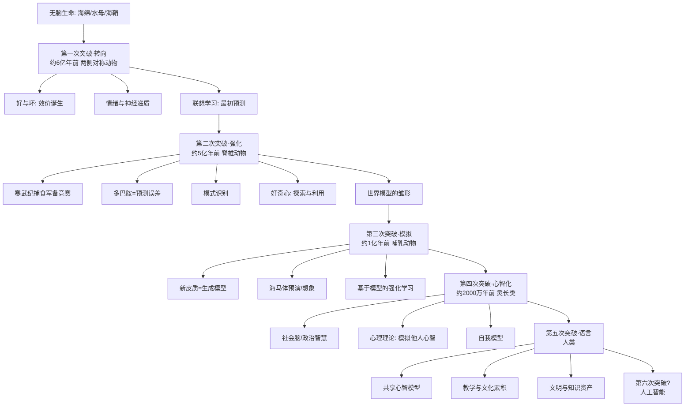

# 《智能简史》深度解读系列

> 原著：Max Bennett《A Brief History of Intelligence: Evolution, AI, and the Five Breakthroughs That Made Our Brains》
> 中译：麦克斯·班尼特《智能简史：进化、AI与人脑的突破》，林桥津 译，中译出版社

---

## 系列简介

本书要回答的不是"人脑由哪些零件组成"，而是一个更根本的问题：**智能是怎么一步步长出来的？**

作者把十亿年的神经进化史压缩成五次突破——**转向、强化、模拟、心智化、语言**。每一次突破都解决了前一代大脑解决不了的问题，也都给"智能"增加了一种新的"模型"。更关键的是，他把这五次突破与今天的 AI 一一对照：AI 已经能"转向"、能"强化学习"，甚至在模仿"模拟"，但在"心智化"和真正的语言上仍然缺席。

所以这既是一部脑的进化史，也是一张 AI 的路线图。本系列不按章节复述，而是围绕"每次突破解决了什么问题、怎么解决、今天对应 AI 的哪一块"重新组织成 28 篇。

---

## 全书核心问题

> **智能不是某一种能力，而是五次进化突破层层叠加的产物。理解这五次突破，就能理解人脑为什么强大、今天的 AI 到底缺了什么。**

---

## 全书知识地图



---

## 全系列目录

### 第一部分｜总纲：重新理解"智能"

### 01｜智能究竟是什么？为什么“聪明”不是一件单一的事

核心问题：智能到底是什么？它是天赋、算力，还是一整套能力的叠加？

核心观点：智能不是一个开关，而是五次突破层层叠加的结果。每次突破都是在旧大脑上加装一种新的"模型"：转向加装"好坏的模型"，强化加装"行动的模型"，模拟加装"世界的模型"，心智化加装"他人心智的模型"，语言让这些模型可以在大脑之间复制。

理解难度：★★☆☆☆

关键词：五次突破、智能的层次、模型

---

### 02｜大脑诞生之前，世界是什么样子？

核心问题：在"大脑"出现之前，生命靠什么活着？

核心观点：最早的生命不需要大脑。海绵、水母、海鞘要么随波逐流，要么只有反射。大脑不是生命的必需品，而是"移动"和"选择"的副产品。海鞘幼虫有一个简单大脑用于寻找落脚点，一旦定居就把大脑消化掉——因为不再需要做决定了。

理解难度：★☆☆☆☆

关键词：海绵、水母、海鞘、神经元起源、埃迪卡拉纪

---

### 第二部分｜第一次突破·转向（约6亿年前）

### 03｜第一批有大脑的动物，为什么必须先学会“转向”？

核心问题：为什么大脑的第一个功能是"转向"？

核心观点：约6亿年前，两侧对称动物出现。它带来的不是思考，而是"方向"：身体有了前后左右，于是能朝某个方向移动。大脑的第一份工作就是一个转向控制器：根据感官输入决定靠近还是远离。智能的起点不是聪明，而是"会拐弯"。

理解难度：★★☆☆☆

关键词：两侧对称、转向、感觉—运动回路

---

### 04｜大脑给世界贴上的第一个标签：“好”与“坏”

核心问题：大脑如何从一团模糊信号里做出第一个决定？

核心观点：第一次突破的核心产物是"效价"——把外界刺激分为好的和坏的、该靠近的和该回避的。这是智能史上第一次出现"意义"。在此之前世界只是一堆物理刺激；在此之后世界有了"对我有利/不利"。

理解难度：★☆☆☆☆

关键词：效价、趋近—回避、好与坏

---

### 05｜情绪从哪里来？——喜怒哀乐的原始版本

核心问题：情绪是文明的装饰，还是古老的计算机制？

核心观点：多巴胺、血清素、肾上腺素这些"情绪分子"在第一次突破时就已出现，比大脑本身还古老。情绪不是人类的奢侈品，而是最古老的决策系统：用身体状态快速告诉动物"现在该做什么"。

理解难度：★★☆☆☆

关键词：多巴胺、血清素、情绪起源、内稳态

---

### 06｜学习的曙光：动物如何第一次把“两件事”联系起来？

核心问题：动物第一次学会"预测"是什么时候？

核心观点：第一次突破还带来了联想学习：把两个原本无关的事件连起来。这是预测能力的雏形，也是后来所有学习的地基。但它还很笨——只能学会直接接触到的关联，还不会为长远目标做规划。

理解难度：★★★☆☆

关键词：联想学习、经典条件反射、预测

---

### 第三部分｜第二次突破·强化（约5亿年前）

### 07｜寒武纪大爆发：一场把“捕食”变成常态的军备竞赛

核心问题：为什么生命在5亿年前突然"卷"了起来？

核心观点：寒武纪大爆发是第二次突破的舞台。捕食者出现了，猎物必须跑、躲、防。这场军备竞赛让大脑不得不升级：光会转向不够了，还要会学习、会记仇、会分辨。第二次突破——强化学习——正是在这种压力下诞生。

理解难度：★★☆☆☆

关键词：寒武纪、捕食者—猎物、军备竞赛、脊椎动物

---

### 08｜多巴胺不是“快乐分子”，而是大脑的“预测误差”老师

核心问题：我们到底是怎么通过"试错"学会一件事的？

核心观点：第二次突破的核心是时序差分学习。多巴胺并不等于快乐，它更像一个"老师"：结果比预期好，多巴胺上升，告诉你"记住刚才的动作"；结果比预期差，多巴胺下降，告诉你"别再这么做"。这就是无模型强化学习。

理解难度：★★★★☆

关键词：多巴胺、奖励预测误差、时序差分学习、强化学习

---

### 09｜面对混乱的世界，大脑如何识别“模式”？

核心问题：世界这么复杂，大脑凭什么能"看懂"它？

核心观点：强化学习要工作，前提是大脑能把无穷的感官输入压缩成少数有意义的"状态"。这就是模式识别问题。大脑必须一边压缩信息，一边保留对生存重要的区别。今天的神经网络面对的是同一个问题。

理解难度：★★★☆☆

关键词：模式识别、状态表征、泛化、维度灾难

---

### 10｜为什么生命会“好奇”？——探索与利用的永恒两难

核心问题：既然已经找到能活命的方法，为什么动物还要冒险探索？

核心观点：只利用已知，会被环境变化淘汰；只探索，会浪费能量甚至送命。第二次突破给了动物一套"好奇心"机制：新奇本身就是奖励。这让动物愿意在安全范围内尝试新事物，为后来的模拟能力积累素材。

理解难度：★★★☆☆

关键词：好奇心、探索—利用、内在动机

---

### 11｜第二个突破的极限：鱼脑里已经出现“世界模型”了吗？

核心问题：无模型强化学习到底卡在哪里？

核心观点：经过第二次突破，鱼已经能学习、能预测、能好奇，但它只能在"做过"的事情上变聪明。要面对从未遇到的情况，它需要一个内部的"世界模型"。鱼只拥有这个模型的雏形，真正的世界模型要等到哺乳动物。

理解难度：★★★☆☆

关键词：世界模型、无模型学习、试错成本

---

### 第四部分｜第三次突破·模拟（约1亿年前）

### 12｜恐龙统治下的“黑暗时代”，哺乳动物在偷偷做什么？

核心问题：为什么"想象"这种能力诞生在弱小的哺乳动物身上？

核心观点：哺乳动物的祖先在恐龙时代只能夜间活动、以昆虫为食。黑暗中看不清、跑不快，唯一的活路是"提前判断危险"。这段黑暗时代逼出了第三次突破：一个能生成内部画面的新结构——新皮质。模拟能力是弱者逼出来的。

理解难度：★★☆☆☆

关键词：夜间瓶颈、黑暗时代、哺乳动物、新皮质起源

---

### 13｜新皮质是一台“想象机器”吗？——生成模型猜想

核心问题：大脑里那块皱巴巴的新皮质，到底在算什么？

核心观点：新皮质可以理解为一台生成模型：它不断根据过去经验"猜测"世界的结构，再用感官输入修正猜测。它不是被动接收信息，而是主动预测。感知因此更像"受控的幻觉"。这一思想直接启发了今天的预测编码与生成式 AI。

理解难度：★★★★☆

关键词：新皮质、生成模型、预测编码、自上而下

---

### 14｜在脑子里先跑一遍：模拟如何让学习变得廉价

核心问题：为什么"想象"能让学习成本大幅下降？

核心观点：真实世界的试错要付出生命代价。模拟让动物能在脑内跑一遍未来。海马体的"位置细胞"与睡眠中的"重放"说明老鼠真的会在大脑里预演路线。想象＝低成本的试错。

理解难度：★★★☆☆

关键词：海马体、位置细胞、心理时间旅行、重放

---

### 15｜“三思而后行”为什么是一种进化超能力？

核心问题：基于模型的强化学习和靠试错的学习，差别在哪里？

核心观点：第三次突破把"无模型强化学习"升级为"基于模型的强化学习"：动物不再只靠过去经验，而是用世界模型评估还没发生的选项。这让规划、延迟满足、目标导向行为成为可能。"三思而后行"不是道德修养，而是一种算得更省的计算策略。

理解难度：★★★☆☆

关键词：基于模型的强化学习、规划、延迟满足

---

### 16｜为什么机器人会下棋，却不会洗碗？——模拟的边界

核心问题：机器能赢国际象棋冠军，为什么摆不好洗碗机里的餐具？

核心观点：下棋的世界规则封闭、状态可枚举；洗碗面对的是开放、混乱、充满例外的物理世界。哺乳动物的世界模型善于在混乱中泛化，而 AI 的"模型"往往只覆盖训练过的窄领域。这正是第三次突破尚未被 AI 真正攻克的证据。

理解难度：★★★☆☆

关键词：泛化、开放世界、具身智能、洗碗难题

---

### 第五部分｜第四次突破·心智化（约2000万年前）

### 17｜灵长类为什么进化出了“政治家的大脑”？

核心问题：为什么灵长类的大脑比同等体型的动物大得多？

核心观点：灵长类生活在复杂的社会群体里。食物、盟友、地位、背叛——真正难的从来不是自然环境，而是同类。社会脑假说：是社会压力，而不是觅食压力，逼出了更大的大脑。

理解难度：★★★☆☆

关键词：社会脑假说、政治智慧、群体规模

---

### 18｜心智化：如何在自己的脑子里，模拟“别人在想什么”？

核心问题：什么是"心理理论"？它为什么如此困难？

核心观点：心智化＝用你的世界模型去模拟另一个人的世界模型。你不仅知道"草丛里有狮子"，还能推断"他知道草丛里有狮子，但他不知道我知道"。这是模型的模型。自我意识很可能也是这套机制的副产品：当大脑把模拟能力对准自己，就出现了"我"。

理解难度：★★★★☆

关键词：心理理论、心智化、递归模拟、自我模型

---

### 19｜预测物理容易，预测人心太难——“猴锤”与自动驾驶的启示

核心问题：为什么预测"东西"容易，预测"人"很难？

核心观点：物理世界有稳定规律，人心却取决于对方掌握的信息、意图和情绪。自动驾驶真正难的不是识别红绿灯，而是判断那个行人到底会不会突然横穿。预测智能体，比预测物体难一个量级。

理解难度：★★★★☆

关键词：智能体预测、因果推理、博弈、自动驾驶

---

### 20｜为什么老鼠不能去杂货店买东西？——自我模型与复杂社会

核心问题：老鼠会走迷宫，为什么不能完成"买东西"这种任务？

核心观点：买东西需要一连串心智化操作：知道店主知道商品的价格、知道付钱会让他满意、知道自己将来会需要某样东西。这要求一个稳定的"自我模型"和对他人心智的持续建模。老鼠能建模空间，却不能建模心灵。

理解难度：★★★☆☆

关键词：自我模型、社会协作、延迟需求、货比三家

---

### 第六部分｜第五次突破·语言（人类）

### 21｜人类到底特殊在哪里？——寻找“独特性”的三条线索

核心问题：在智能的进化史上，人类究竟特殊在哪里？

核心观点：我们并非赢在感官、力量或记忆。候选答案有三：语言、模仿、教学。单看每一项，黑猩猩都有一点；人类真正的独特之处，是这几样能力叠加成了一套"把知识传下去"的机制。独特性不在某个零件，而在组合。

理解难度：★★★☆☆

关键词：人类独特性、模仿、教学、文化累积

---

### 22｜语言是一种新器官，还是一套“学习程序”？

核心问题：人脑里有没有一块专门管语言的"区域"？

核心观点：人类没有一块独有的"语言脑区"，有的是别的动物没有的学习程序——一套让儿童自动学会语言的行为模板。这解释了为什么学语言越早越容易、越晚越难。语言更像被"安装"进通用大脑的软件。

理解难度：★★★★☆

关键词：语言脑、关键期、学习程序、布罗卡区

---

### 23｜“完美风暴”：语言、模仿与教学如何叠加出文明？

核心问题：为什么只有人类能把知识一代代累积起来？

核心观点：语言让一个人脑中的模型可以被"复制"进另一个大脑。单个人活70年，但知识可以活几千年。模仿与教学则让技能也能传递。三者撞在一起，形成了"文化棘轮"：每一代站在上一代的肩上，文明于是加速。别的物种也有文化，但没有这套棘轮，所以会丢失。

理解难度：★★★☆☆

关键词：共享心智、文化棘轮、累积文化、集体智能

---

### 24｜语言的真正力量：把一个人的想象变成全人类的资产

核心问题：语言最大的作用，是交流信息，还是别的什么？

核心观点：语言最强的地方不是"说事"，而是共享想象——把只存在于一个人脑中的模拟，转换成别人脑中可运行的模拟。金钱、公司、国家、法律这些"共同想象"之所以能成立，正是因为语言能让无数人运行同一个模型。

理解难度：★★★★☆

关键词：共享想象、制度、共同信念、大规模协作

---

### 第七部分｜延伸与批判

### 25｜五次突破有什么共同规律？——智能是“层层叠加的模型”

核心问题：把五次突破串起来，有没有一条统一的主线？

核心观点：每一次突破都是"加到模型上的新一层"：好坏模型→行动模型→世界模型→他人心智模型→可共享模型。后一层建立在前一层之上，无法跳级。这解释了为什么进化花了十亿年，也说明"直接造通用智能"可能比想象中更难。

理解难度：★★★★☆

关键词：叠加式智能、进化阶梯、不可跳级

---

### 26｜AI 走到哪一步了？——用五次突破给今天的 AI 打分

核心问题：今天的 AI 已经完成了五次突破中的哪几次？

核心观点：AI 已很好地完成第1次、第2次，并部分触及第3次。但第4次和第5次仍然薄弱。用这张"突破清单"给 AI 打分，比争论"它是不是智能"更有意义。

理解难度：★★★★☆

关键词：AI 对照、能力清单、强化学习、世界模型

---

### 27｜ChatGPT 与“心灵之窗”：它为什么仍然读不懂你？

核心问题：能说会道的 LLM，为什么还是"不懂"你？

核心观点：语言本是心灵的窗口——理解一句话，前提是理解说这句话的心智。LLM 学到的是语言的表层规律，而非语言背后那个"会想象、有意图、能共情"的系统。这是第五次突破最难被复制的部分。

理解难度：★★★★☆

关键词：大语言模型、符号接地、心灵之窗、涌现

---

### 28｜第六次突破：AI 会重演进化，还是另走一条路？

核心问题：如果智能的下一步由人类而不是进化来设计，会怎样？

核心观点：前五次突破都是"生物在生存压力下被迫升级"，慢、残忍、但扎实。AI 的进化不受生物约束，可能更快，也可能因为跳过某些台阶而脆弱。在决定"要造什么样的智能"之前，先想清楚"我们要它成为什么"。

理解难度：★★★☆☆

关键词：第六次突破、AI 未来、目标选择、超级智能

---

## 推荐阅读顺序

严格按上表 **01 → 28** 阅读。设计逻辑：

```text
01-02  总纲与背景：先建立"智能是叠加模型"的总框架
03-06  第一次突破：好坏的模型（最基础）
07-11  第二次突破：行动的模型（依赖效价与联想）
12-16  第三次突破：世界的模型（依赖行动模型）
17-20  第四次突破：他人心智的模型（依赖世界模型）
21-24  第五次突破：可共享的模型（依赖心智模型）
25-28  收束、对照 AI 与批判（依赖全部前文）
```

如果时间有限，最小必读路径是：**01 → 04 → 08 → 13 → 18 → 23 → 26**，七篇即可把握全书骨架。
