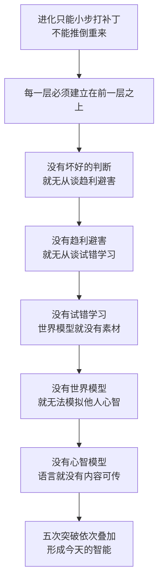

# 01｜智能究竟是什么？为什么“聪明”不是一件单一的事

> 智能到底是什么？它是天赋、算力，还是一整套能力的叠加？

---

## 一、先说结论

班尼特给出的答案是：**智能不是一个开关，也不是一个分数，而是五次进化突破层层叠加的结果。**

大约六亿年前，动物第一次学会"转向"；五亿年前，第一次学会"试错"；一亿年前，第一次学会"想象"；两千万年前，第一次学会"揣摩别人在想什么"；几十万年前，人类第一次学会"把想法讲给同类听"。

每一次突破，都是在旧大脑上加装一台新的"模拟器"：好坏的模型、行动的模型、世界的模型、他人心智的模型、可共享的模型。

所以当我们问"AI 到底有没有智能""某个生物算不算聪明"时，这个问题本身就问错了。真正该问的是：**它已经装到了第几层？**

---

## 二、我们先理解一个问题

先看一个看上去很荒谬的事实。

一台计算机能够在国际象棋上击败人类世界冠军，能在围棋这种"变化比宇宙原子还多"的游戏里碾压顶尖棋手，能写出像模像样的文章，能通过司法考试。可是，它至今没法可靠地做好一件事——**把洗碗机里的餐具摆好**。

它不知道那个盘子该斜着放，不知道锅盖会挡住喷水臂，不知道玻璃杯不能压在碗下面。你让它摆，它可能把杯子叠成一摞，然后"自信"地关上机门。

再看另一个事实。

人类的大脑只有大约 1.4 公斤，功耗约 20 瓦，比一只灯泡还省电。可它能做一件今天任何超级计算机都做不到的事：看着一个陌生人的表情，在两秒钟内判断出"他嘴上说没事，其实心里很不高兴"。

为什么会出现这种反差？

为什么"下棋"这种人类觉得难的事，机器反而先会了？而"摆碗""看脸色"这种三岁小孩都会的事，机器反而学不会？

要回答这个问题，我们必须先问一个更基础的问题：

> **"智能"到底是什么？它是一件东西，还是很多件东西？**

---

## 三、作者到底提出了什么观点？

班尼特是 AI 创业者，不是学院派神经科学家。他写这本书，本来是为了回答一个非常实际的问题：**人类的智能到底是怎么被"造"出来的？如果我们搞清楚了它的来路，是不是就能造出真正的 AI？**

他的答案，是把十亿年的进化史压缩成**五次突破**。

| 突破 | 名称 | 大约时间 | 第一批主角 | 它给了大脑什么 |
|---|---|---|---|---|
| 第一次 | 转向（Steering） | 约 6 亿年前 | 两侧对称动物 | 好坏模型：靠近还是远离 |
| 第二次 | 强化（Reinforcing） | 约 5 亿年前 | 脊椎动物（鱼） | 行动模型：做了会怎样 |
| 第三次 | 模拟（Simulating） | 约 1 亿年前 | 哺乳动物 | 世界模型：在脑中预演 |
| 第四次 | 心智化（Mentalizing） | 约 2000 万年前 | 灵长类 | 心智模型：别人在想什么 |
| 第五次 | 语言（Speaking） | 人类 | 智人 | 共享模型：把想法复制给别人 |

请注意几个关键点。

**第一，这五次不是并列的，而是叠加的。** 每一次都建立在前一次之上，不能跳级。没有"好坏"就无从谈"行动"，没有"世界模型"就无从谈"模拟别人"，没有"心智模型"，语言也只是一堆声音。

**第二，每一次突破，本质都是大脑获得了一种新的"模型"能力。** 这是全书最核心的线索。班尼特认为，**智能的本质，就是在脑子里建立模型，并用这个模型来预测和行动。**

**第三，这五次突破，恰好可以拿来给今天的 AI 打分。** 这正是这本书最抓人的地方：它不是单纯讲进化史，而是拿进化史当尺子，去量 AI 走到哪一步了。

---

## 四、把这个观点翻译成人话

我们换个方式理解这五次突破。

想象你要造一个"会自己活的机器人"，但你只能从最笨的版本开始，一步一步升级，而且每一代都必须能靠这一代的本事活下去。

**第一代：会动的机器人。**
它只有一个本事：判断眼前的东西是"好的"还是"坏的"，然后靠近或躲开。它不会学习，也不会计划。看到亮的地方就往那走，看到黑影就缩回去。这就是第一次突破。听起来很傻，但这是从"不动的生命"到"主动选择"的巨大一步。

**第二代：会试错的机器人。**
它多了一个本事：做对了给块糖，做错了挨一下，它开始记住"上次那样做，结果不错"。慢慢地，它学会了一连串动作。这就是第二次突破。它已经能在环境里"摸索"出一条活路，但它必须真的做过，才能学会。

**第三代：会想象的机器人。**
它多了一个本事：在真正行动之前，先在"脑子里"演一遍。走这条路会不会撞墙？伸手会不会被夹？它开始能够"不付出代价地试错"。这就是第三次突破。这是质变——它终于能处理"没做过的事"。

**第四代：会读心的机器人。**
它多了一个本事：不仅模拟世界，还能模拟"另一个人脑子里的世界"。它知道"主人以为冰箱里有牛奶，但其实昨天已经喝完了"。这就是第四次突破。从此，它可以合作、欺骗、结盟、谈判。

**第五代：会说话的机器人。**
它多了一个本事：把自己脑子里的模型，用声音"复制"到别人的脑子里。一个人花一辈子摸索的经验，几句话就能传给下一代。这就是第五次突破。从此，知识不再随个体死亡而消失。

用一句话概括这五次升级：

> **从"判断好坏"，到"学会行动"，到"想象未来"，到"看懂人心"，到"共享心智"。**

每加一层，这个系统的能力就不是"多一点"，而是打开了一整个新的世界。

---

## 五、为什么会这样？

关键问题是：**为什么智能必须一层一层长，而不能一步到位？**

答案藏在进化的机制里。

进化没有设计师，没有蓝图，它只能做一件事：**在现有的东西上打补丁。** 它不能推倒重来，只能小修小补。所以每一次重大能力的出现，都必须建立在已经存在的大脑结构之上。

这就导致了一个结果：**能力是路径依赖的。**

我们拿"想象"来验证这条链。

一个人能"想象明天面试失败的样子"，前提是他得先知道"失败是坏的"（第一次突破）、得先经历过"做错事会难受"（第二次突破）。如果一只动物连"好坏"都不分，它根本不会去想象什么未来——未来对它没有任何意义。

同样，人能"揣摩同事是不是在针对我"，前提是他自己脑中有一个"世界模型"（第三次突破），能把它套用到另一个人身上。没有世界模型，就没有"别人的世界"可模拟。

所以，智能不是"五项能力的集合"，而是**一座必须一层一层往上盖的楼**。你不能先造第五层再回来打地基。

**这也是这本书最锋利的一个推论：如果智能真的是层层叠加的，那么"直接造出通用智能"可能比很多人想的更难——因为你可能根本跳不过某一层。**

---

## 六、举一个现实生活中的例子

我们用"公司里的一个人"来理解"智能是分层的"。

假设有一个员工，叫小李。他的能力可以拆成几层：

- **第一层：判断好坏。** 他能分辨"这件事对项目有利"还是"有害"。这是最基础的。
- **第二层：学会行动。** 他做过一次汇报被表扬，下一次就会照做。这是经验学习。
- **第三层：预演结果。** 他能在开会前，在脑子里过一遍"如果我说这句话，老板会怎么反应"。这是模拟。
- **第四层：理解他人。** 他能想到"老板今天心情不好，不是因为我的方案，而是因为他刚被上级批评"。这是心智化。
- **第五层：把心智传出去。** 他能把这套经验写成文档，让新人照着学。这是语言和传承。

现在你注意：**这五层是可以"缺"的，而且缺哪一层，人就会表现出很不一样的样子。**

一个"第一、二层强，第三、四层弱"的人，可能是那种执行力很强、但总在人际关系上翻车的人：活干得漂亮，却猜不透同事和领导的心思。

一个"第三、四层强，第五层弱"的人，可能是团队里最会看眼色、最懂人情的人，但他说不清自己是怎么做到的，也没法把本事教给别人。他一个人很厉害，但带不出团队。

再看 AI。

今天的 AI 在前两层上早就是超人了：它能判断一张图里有没有肿瘤（好坏判断），能在围棋里通过自我对弈把水平磨到人类看不懂（试错学习）。在第三层上，它也开始有了苗头：大模型能"续写"一个故事的多种结局，某种意义上是"在脑内模拟"。

但它第四、第五层非常薄。它能说出一句"我理解你的感受"，却不真的拥有一个"你的心智模型"。它能写出一份完美的说明书，却不真的理解说明书里那些动作在物理世界里意味着什么。

**智能的差距，往往不是差在一个整体上，而是差在某一层没有被点亮。**

---

## 七、回到书中重新理解

现在我们再回头看班尼特的问题，就顺了。

他作为一个 AI 创业者，最关心的其实不是"生命史"，而是"**为什么 AI 是现在这个样子**"。他之所以要从六亿年前的海绵、水母讲起，是因为他想证明一件事：

> **今天 AI 的强项和短板，其实早在这条进化路径里被决定了。**

AI 之所以先学会了"下棋"和"识图"，是因为这两种能力对应的是第一、二次突破——它们可以被大量的数据、明确的奖励和反复的试错训练出来。而"摆碗""读心""带团队"之所以难，是因为它们要求第三、四、五次突破——理解混乱的物理世界、理解别人的心智、把理解传出去。

这也解释了那个反直觉的现象：**为什么机器能赢棋却摆不好碗。**

在我们从小接受的观念里，"下棋"是聪明的象征，"摆碗"是本能。但从进化史的角度看，顺序是反过来的：**摆碗要用到的能力，在进化史上比下棋晚出现得多，也高级得多。** 下棋只需要"行动模型"，摆碗却需要"世界模型"。

班尼特想说：**我们高估了计算，低估了理解。**

---

## 八、这个观点背后还有什么？

这里有四个作者没有完全展开、但很关键的隐含前提。

**第一，作者把"智能"定义成了"建模与预测能力"。** 这不是唯一可能的定义。有人把智能等同于"解决问题的能力"，有人等同于"适应环境的能力"，有人等同于"通用性"。班尼特选择了"在脑中建立世界模型、并据此预测"作为主线。这个选择很聪明，因为它能同时解释生物和 AI；但它也意味着，这本书从一开始就排除了其他几种理解智能的方式。

**第二，"突破"这个词自带方向感。** 说某件事是"突破"，暗示着它是一次跃迁、一个进步。但进化本身没有方向，也无所谓进退。班尼特用"突破"讲故事，是文学上的选择，不是科学上的必然。这一点读的时候要留意。

**第三，"五次突破"是一次事后归纳。** 进化史上并没有一块牌子写着"现在进入第三次突破"。这五条线，是作者站在今天回望，从十亿年的混沌里画出来的。它清晰、好记，但清晰本身可能就是代价——真实的进化远比五个台阶更零碎、更混乱。

**第四，它其实在回应一个古老的哲学问题：心与物。** 当班尼特说智能是"层层叠加的模型"时，他实际上把"心智"也当成了一种建模能力。这背后的立场是倾向唯物主义的：心，就是大脑这台建模机器的工作方式。这个立场很强，但不是没有对手。

---

## 九、这个观点有问题吗？

有，而且值得认真对待。这里要特别提醒：**这是一个非常有解释力的框架，而不是学界公认的定论。**

**第一，把进化写成"五次突破"，可能是一种"后见之明的叙事"。** 我们站在终点回看，很容易把历史整理成一条清晰的上升线。但真实的进化充满了大量的死路、重复和偶然。比如"眼睛"在进化史上独立演化了几十次，并不存在"某一次突破"。"转向前进"和"试错学习"之间，也未必真有那么干净的分界。这种"讲故事"的写法读起来痛快，但可能把连续的渐变，剪成了断裂的台阶。

**第二，"跳级"未必不可能。** 班尼特暗示智能必须层层叠加，所以无法绕过某一层。但 AI 的发展恰恰在挑战这个想法：大语言模型并不是先学会"转向"、再学会"强化"、再学会"模拟"的，它是在海量文本上"一次性"训练出来的。它没有走过生物那条路，却表现出了不少类似"世界模型"的能力。这说明：**生物的路径，可能只是智能的一种实现方式，而不是智能的唯一道路。** 用进化史来约束 AI 的可能性，本身就是一个需要论证的假设。

**第三，"模块叠加"可能低估了大脑的整体性。** 现代认知科学里，有一派强调大脑是高度整体、分布式工作的，很难把它干净地切成"五层模块"。而且，这五层之间的关系也未必是严格依赖：有研究发现，某些动物似乎具备"心理理论"的雏形，却没有发达的语言能力；反过来，也有失语症患者保留着完好的心智能力。这说明各层之间可能是部分解耦的，而不是像盖楼那样严丝合缝。

**第四，还有一个"目的论"的陷阱。** 书里很容易读出一句话的潜台词："进化是为了让我们变得更聪明。" 但进化从不"为了"什么。它是盲目的，只是活下来的那些恰好长了这样的大脑。把整个过程叙述成一条通往"人类智能"的必经之路，是一种幸存者偏差——我们只看到成功活到今天的这一支，看不到那些同样努力、却灭绝的无数分支。

**所以更准确的说法是**：班尼特提供了一个极好的"认知地图"，它清晰、好用、能解释很多现象；但它是一张为了理解而画的地图，不等于地形本身。

---

## 十、今天再看这个观点

以下部分是基于班尼特思想的现代延伸，不是他在书里的原话。

我们今天争论"离 AGI 还有多远"，其实常常在争论一个被这份框架点破的问题：**智能能不能跳级？**

一种观点认为，只要把规模继续做大、数据继续喂多，第四、第五次突破会像前三次一样，自然地从模型里"涌现"出来。这是"规模派"的赌注。

另一种观点认为，不会。因为心智化和语言可能不是"更多算力"能自动带来的，它们对应的是完全不同的架构——就像你怎么给一辆马车加马力，也变不出一架飞机。这是"架构派"的赌注。

班尼特的框架，相当于给这场争论提供了一个共同的语言：先别吵"是不是智能"，先看看**它已经完成了哪几次突破，卡在哪一层**。

这也给了一个很实用的判断方法。下次你听到某个 AI 产品有"重大突破"，可以问三个问题：

1. 它是真的用上了**世界模型**，还是只是记住了很多数据？
2. 它有没有对**他人心智**的建模，还是只是在模仿人类说话的方式？
3. 它的知识能不能**稳定地、忠实地**传递给下一个模型，还是每次都要从头训练？

第三点尤其扎心。班尼特在书里提到一个关键区别：ChatGPT 这类模型是"一次性学完就冻结"的，它不能像人一样每天学一点、积累一辈子。**人类智能最大的优势之一，是"持续学习 + 代际传承"；而这恰恰是当前 AI 最不像人的地方。**

---

## 十一、这一篇真正应该记住什么？

1. **智能不是单一能力，而是五次突破的叠加。** 转向、强化、模拟、心智化、语言，一层盖一层，不能跳级。

2. **每次突破都是给大脑加装一种新"模型"。** 好坏模型、行动模型、世界模型、心智模型、可共享模型——智能的本质是建模与预测。

3. **机器能赢棋却摆不好碗，是因为顺序反了。** 摆碗要用到"世界模型"，它在进化史上比下棋需要的"行动模型"出现得晚得多、也高级得多。

4. **这套框架最适合用来给 AI 打分。** 与其争论"它是不是智能"，不如问"它完成到第几次突破了"。

5. **它是一个好用的地图，不是唯一的地形。** 五次突破是作者的事后归纳，清晰是优点，也可能隐藏了真实世界的混乱与偶然。

---

## 十二、留一个问题

> 如果智能真的必须一层一层长出来，
> 那么今天的大模型，究竟是"还没点亮第四层"，
> 还是它走的根本是另一条路——一条不需要第五次突破，也能假装会读心的路？

---

**下一篇**：我们已经知道智能是"层层叠加"的，但第一层究竟长什么样？在这次突破发生之前，生命连"大脑"这个东西都没有。

下一篇我们就回到六亿年前，看看大脑出现之前的世界——**为什么最早的生命根本不需要脑子？**

---

*本系列基于 Max Bennett《A Brief History of Intelligence》整理，文中"班尼特认为/书中认为"均指作者观点；带"延伸"字样的段落为基于其思想的现代推演，不代表原作者。*
