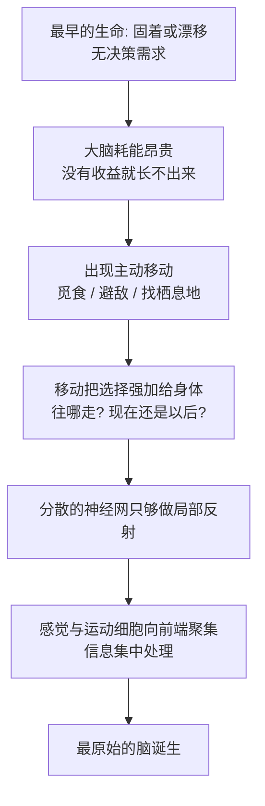

# 02｜大脑诞生之前，世界是什么样子？

> 在"大脑"出现之前，生命靠什么活着？

---

## 一、先说结论

**约六亿年前，地球上已经热闹了三十多亿年，却没有一个神经元。**

在那漫长的岁月里，生命不必思考，也不必选择：海绵固着在海底过滤海水，水母和栉水母只有一张弥散的神经网，埃迪卡拉纪（约 6.35 亿到 5.41 亿年前）的生物大多缓慢、柔软、随波逐流。

班尼特认为，大脑不是生命的必需品，而是"**移动 + 选择**"的副产品。当生命开始主动移动、必须在"往左还是往右""现在还是以后"之间做选择时，一个能快速汇总信息、集中下决定的中央处理器才变得划算。所以真正的问题不是"生命为什么长出了大脑"，而是"**什么样的生活方式，才值得养一个大脑**"。

---

## 二、我们先理解一个问题

先看一个反直觉的事实：**大脑是身体里最贵的东西之一。**

人脑只占体重的 2% 左右，却消耗掉静息状态下约 20% 的能量和氧气。对一只动物来说，长一个大脑、养一个大脑，意味着要吃更多、暴露更久、更容易被吃掉。既然如此——

为什么生命要造它？

如果大脑只是个"奢侈品"，那它应该在进化中被淘汰。可事实恰恰相反：拥有大脑的动物不但没被淘汰，反而占据了今天地球的绝大多数生态位。

更奇怪的是，在拥有大脑之前，生命已经活了三十多亿年，而且活得很好。细菌铺满海洋，蓝细菌改变了整个大气；海绵、水母、海葵这些"没有真正大脑"的生物，今天依然大量存在，既没有灭绝，也没有落后。

所以问题变成了：

> **既然没有大脑也能活几十亿年，那到底是什么，逼着某些生命非长出一个大脑不可？**

---

## 三、作者到底提出了什么观点？

班尼特的回答特别朴素：**大脑是被"移动"和"选择"逼出来的。**

他把大脑出现之前的生命，大致分成几档。

| 生物 | 神经系统状态 | 生活方式 | 需要做决定吗 |
|---|---|---|---|
| 细菌、单细胞 | 完全没有 | 随环境漂移、趋利避害 | 不需要"中央决策" |
| 海绵 | 无神经元、无神经网 | 固着滤食，水自己流过来 | 基本不需要 |
| 水母、栉水母 | 有弥散的神经网，无集中大脑 | 随水漂动，捕捉碰到的东西 | 只需简单反射 |
| 埃迪卡拉纪生物 | 多数无中枢神经系统 | 缓慢、固定或极慢移动 | 几乎不做选择 |
| 两侧对称动物（下一章主角） | 出现前端神经节、神经索 | 主动朝某个方向移动、觅食、避敌 | **必须不停做选择** |

他的核心判断有两句：

**第一，大脑不是"生命的标配"，而是"某种生活方式的选择"。** 一个固着不动、靠水流送饭的生物，长一个大脑毫无用处——因为没有什么需要它决定的事。

**第二，从"没有决策"到"必须决策"，中间跨过的那一步，是"主动移动"。** 一旦你开始主动移动，世界立刻变得复杂：左边有食物，右边有危险；前面可能有捕食者，后面可能是自己的窝。**移动把"选择"这件事强加给了身体。**

而一个身体只要需要不停做选择，它就有强烈的理由把散落各处的感觉细胞和反应细胞，聚拢到一起，让它们互相说话。散落的神经网只能做局部反射；集中的神经节，才能做"综合判断"。

这就是大脑的起点。

---

## 四、把这个观点翻译成人话

我们用一个特别日常的东西来理解：**自动门。**

自动门有"神经"吗？某种意义上它也有：红外传感器、控制器、电机。但它做得极其简单——**检测到人靠近，就开门**。这就是一个反射，一个不需要大脑的反射。

现在想象另一台机器：一台扫地机器人。早期的廉价扫地机器人，走路方式是"撞到墙就随机换个方向"。它也需要传感器和电机，但它几乎不需要"思考"——因为它不需要真正做出好决定，撞了再拐就是了。

而一台今天的高端扫地机器人，要建地图、要判断哪里脏、要规划一条不重复的路线、要记得哪块地毯容易卡住。这时候，它需要的就不再是"反射"，而是**一个能汇总信息、做判断、下决定的东西**。

把这三样东西排起来看：

- 自动门 = 海绵式的生命，只有"刺激—反应"，没有决策；
- 随机撞墙的机器人 = 水母式的生命，会动，但基本靠碰运气；
- 会建地图的机器人 = 有了大脑的生命，必须不断做"该往哪走"的决定。

班尼特想说的是：**大脑的价值，正好等于"需要做的决定"的价值。** 没有决定要做，就不需要大脑；决定越难，大脑就越值得投资。

---

## 五、为什么会这样？

把这条逻辑链条完整走一遍：

**前提**：大脑极其耗能，只有在"能带来生存收益"时才划算。

**原因**：固着的、被动的生活方式几乎没有需要权衡的事，投资的回报接近于零。

**过程**：当某些生命开始主动移动、觅食和避敌，"选择"就出现了；选择要求快速整合多个感官信号、比较利弊、输出方向。

**结果**：把分散的神经细胞向身体前端聚集、让它们互相连接，成为一种巨大的生存优势——这，就是最原始的"脑"。

注意最后一步的语气：**不是"生命想要一个大脑"，而是"这种活法养得起、也养不活那种不长的活法"。** 进化不给奖励，只做淘汰。

---

## 六、举一个现实生活中的例子

我们用"**公司里的自动化**"来体会"不是所有系统都需要大脑"。

一家小餐馆，只需要一个**感应灯**：有人进厕所，灯就亮。这是纯反射，花钱少、够用，不需要任何"判断系统"。

一家连锁便利店，用**电子价签**：总部改价，全国同步。这也几乎不需要"决策"，只需要执行。

可当这家便利店要决定"**哪些货该多进、哪些该下架、哪个店该延长营业时间**"时，纯反射就不够了。它需要一个真正在汇总信息、做权衡的系统——区域经理、数据看板、补货算法。

这时候你会发现：**公司不是有了大脑才变大，而是变大了才不得不长出大脑。** 一个只有三个人的小摊，靠老板的经验反射就够了；一个上万人的组织，如果没有"中央决策"的结构，立刻瘫痪。

这和班尼特讲的生命史是同一个道理：**决策的需求，先于决策的能力。** 先有必须做的选择，然后才有为选择而生的器官。

---

## 七、回到书中重新理解

现在再看那个被无数科普文章讲过的经典案例：**海鞘。**

海鞘（sea squirt，学名属于尾索动物）幼年时长得像一只小蝌蚪，会游泳。它有眼睛一样的感光结构、有尾巴、有一个极其简单的"脑"——大约只有几百个神经元。这个脑几乎只干一件事：**帮它找到一个合适的、可以定居的附着点**。

一旦它找到那块岩石、把自己固定下来，它就再也不需要游泳、不需要导航、不需要做任何"往哪走"的决定了。于是，它把自己不再需要的尾巴、脊索，连同那套负责导航的神经系统，逐步吸收、降解掉。成年海鞘变成一只固定不动、只管过滤海水的"口袋"。

班尼特用这个例子，是为了说明一个非常锋利的观点：

> **大脑是为"做决定"服务的。当决定消失了，大脑本身也会被回收。**

海鞘不是"变笨了"，而是"用不上了"。它把一件昂贵却没有回报的设备拆掉，换成了纯粹的过滤器。这在进化账本上是极其理性的。

这里要提醒一句：**大众版本里常说的"海鞘定居后吃掉自己的大脑"，是戏剧化的简化。** 它并不是把整个神经系统彻底销毁，而是吸收掉大部分用于幼虫游泳和导航的神经结构；成体仍然保留着一套简单、弥散的神经网来协调滤食。**方向是对的，细节被讲狠了。** 这一点我们在第九节还会专门谈。

---

## 八、这个观点背后还有什么？

**第一，它把"智能"重新定义成了"决策的产物"，而不是"生命的属性"。** 在班尼特的框架里，智能不是所有生命的默认配置，而是特定生存方式逼出来的一种投资。这个前提很关键——它意味着，如果一种生命不需要做选择，它就永远不会变聪明，哪怕活上一亿年。

**第二，"用进废退"在神经系统上格外明显。** 海鞘不是孤例。很多寄生虫在进入宿主身体后，会大幅简化自己的神经系统；洞穴鱼类长期生活在黑暗中，眼睛和视觉相关脑区会退化。**神经系统是身体里最"按需付费"的部分之一。**

**第三，神经元本身可能比大脑更古老，而且可能来路复杂。** 分子生物学发现，海绵虽然没有神经元，却拥有大量"造神经元"相关的基因（比如许多突触蛋白的基因）。2021 年发表在《科学》上的一项海绵单细胞图谱研究显示，海绵的某些细胞会用类似突触前、突触后的分子机制互相交流。这说明：**"神经系统的零件"在"神经系统的器官"出现之前很久，就已经在细胞里备好了。**

**第四，消化、免疫、神经三套系统可能同源。** 上面那项研究还发现，海绵里这些"类神经细胞"兼有免疫监测的功能。也就是说，最早用来"感知外界、做出反应"的那套分子工具，未必是专为"思考"发明的，可能只是从"消化"和"防御"里借用过来的。

**这四点合起来，指向一句话：大脑不是凭空诞生的奇迹，而是把已有的零件，按"决策需求"重新组装的结果。**

---

## 九、这个观点有问题吗？

有，而且不少。

**第一，"神经元只起源了一次还是多次"，学界至今没有共识。** 传统观点认为神经系统只起源一次，海绵等无神经动物是"丢失了"或"还没长出来"。但随着栉水母（comb jelly）基因组被测序，出现了一个尖锐的可能性：栉水母在动物演化树上可能分叉得很早，如果真是这样，那么要么神经系统独立演化了两次，要么最早的多细胞祖先本来就有神经网、而后被海绵和扁盘动物丢掉了。这两种情形对"大脑如何起源"意味着完全不同的故事。班尼特为了叙述流畅，采用了较传统的单线叙事，**而科学争议其实悬而未决**。

**第二，"什么才算一个脑"本身就是个定义问题。** 水母的弥散神经网没有中枢，但它能整合信息、能学习（有研究显示刺胞动物能做习惯化、敏感化，甚至某种联想学习）。如果按"能否整合信息做决策"来定义，水母其实有"脑"；如果按"有没有中央神经节"来定义，它就没有。**班尼特把"集中化"当作大脑的标志，这是一个有用但并非唯一的选择。**

**第三，海鞘的故事被讲得太干净了。** 真实情况是分阶段、分结构地退化，而且不同种类的海鞘差异很大。把它讲成"定居就吃掉大脑"固然好记，却也悄悄植入了一个不太准确的心智图像：好像大脑是一个可以整块吞下的东西。**实际上神经系统的退化是渐进的、局部保留的。**

**第四，"移动是大脑的前提"可能是一个偏强的因果。** 有些固着生物（比如某些珊瑚、海葵）拥有相对复杂的神经网；而一些会移动的生物神经系统却极其简单。移动和大脑之间更像"强相关"，而不是"充分必要"。**把话说成"不移动就不需要大脑"，忽略了固着生物也需要协调捕食、防御和繁殖的事实。**

所以更准确的说法是：**班尼特提供了一条非常有解释力的主线——决策需求驱动大脑——但它是一条被整理过的、为了讲故事而变清晰的主线。**

---

## 十、今天再看这个观点

以下是基于班尼特思想的现代延伸，不是他在书里的原话。

这个观点对今天最有用的地方，是它给了我们一把判断"要不要上 AI"的尺子：**不要问"这个系统能不能自动化"，而要问"这个系统需不需要在不确定中做选择"。**

- 一个只会"到点开灯、到点关灯"的系统，是自动门式的，不需要智能，上大模型是浪费；
- 一个需要"看见人、判断他是想进来还是路过、再决定要不要开门"的系统，才开始需要"大脑"；
- 一个需要"在库存、成本、天气、客流之间反复权衡"的系统，才真正值得一个中央决策系统。

同样的逻辑也适用于组织和个人：

**不是所有岗位都需要"动脑"，只有那些每天都要在信息不全时做取舍的岗位才需要。** 反过来，如果你做的事情本质上只是重复的反射，那它被自动化替代只是时间问题——因为它本来就不需要大脑，而你却用了一个昂贵的大脑去做。

海鞘的启示还有更扎心的一面：**当一个人长期待在一个不需要做任何真实选择的环境里，他的"神经节"是会退化的。** 不是生理意义上真的消失，而是能力意义上被闲置、萎缩。

---

## 十一、这一篇真正应该记住什么？

1. **大脑不是生命的必需品，而是"移动 + 选择"的副产品。** 没有需要做的决定，就没有养一个大脑的理由。

2. **在拥有大脑之前，生命已经成功存活了三十多亿年。** 海绵无神经、水母只有神经网、埃迪卡拉纪生物缓慢而简单，它们不是"失败品"。

3. **海鞘是全书最锋利的隐喻：定居之后，它把用于导航的神经系统回收了。** 不是因为笨，而是因为不再需要做决定。

4. **神经系统的"零件"比"器官"更古老。** 海绵没有神经元，却已经带着大量造神经元的基因——大脑更像组装，而非凭空发明。

5. **"神经元起源几次""什么算脑"仍是悬而未决的科学问题。** 本章主线清晰好用，但不等于学界共识。

---

## 十二、留一个问题

> 如果大脑是为了"做决定"而生的，
> 那么一个每天替你做完所有决定的系统——算法推荐、智能助理、自动化流程——
> 究竟是在解放你的大脑，还是在慢慢地，让你变成一只定居后不再需要导航的海鞘？

---

**下一篇**：既然大脑是为"做决定"而生的，那么它做的第一个、也是最重要的决定是什么？答案可能会让你意外——**不是思考，而是拐弯。**

约六亿年前，第一批两侧对称的动物出现了。它们带来的不是聪明，而是"方向"。下一篇我们来看，为什么智能的起点，是学会"转向"。

---

*本系列基于 Max Bennett《A Brief History of Intelligence》整理，文中"班尼特认为/书中认为"均指作者观点；带"延伸"字样的段落为基于其思想的现代推演，不代表原作者。*
