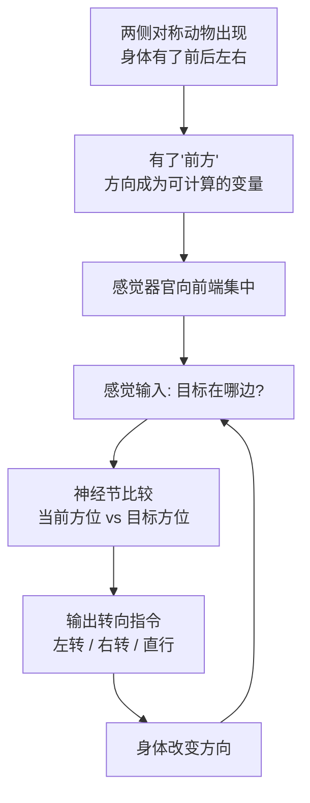

# 03｜第一批有大脑的动物，为什么必须先学会“转向”？

> 为什么大脑的第一个功能是"转向"？

---

## 一、先说结论

**大脑的第一份工作，不是思考，而是当一名"转向控制器"。**

约六亿年前，地球上出现了"两侧对称动物"（bilaterian）。它带来的最大变化不是更复杂，而是**方向**：身体第一次有了前后、左右、背腹，于是它可以真正"朝某个方向走"。有了方向，就必须做选择；要快速做选择，就需要一个能汇总感官、指挥身体的中心。

班尼特认为，神经系统向前端聚集、形成最早的"脑"，最初解决的正是这个问题：**根据水里的气味、光线、震动，决定该靠近还是远离，然后控制身体拐向哪边。** 智能的起点不是聪明，而是"会拐弯"。

---

## 二、我们先理解一个问题

先做个思想实验。

假设你面前有两团东西，都是活的，都在动。

第一团是一只**水母**。它像一个碗，没有前后、没有左右，只有上下和一圈边缘。它能收缩、能漂、能对触碰做出反应。但它不会"追杀"什么东西，因为它没有一个明确的"前方"。海水往哪推，它就往哪去。

第二团是一条**两厘米长的蠕虫**。它有头有尾，头在前，尾在后，身体左右对称。它能朝一个方向稳定地爬，能中途改变方向，能在闻到食物时把头转过去。

现在问：**如果要给其中一团装一个"大脑"，装在哪一团上更有意义？**

答案显然是第二团。原因说出来简单得近乎废话：**只有第二团才有"方向"这回事。**

而"方向"一旦存在，"选择"就出现了：往左还是往右？前进还是后退？靠近还是逃走？在这些选择出现的地方，一个"中央决策器官"才有用武之地。

于是真正的问题来了：

> **为什么"有方向"这件事，会逼出"有大脑"这件事？**

---

## 三、作者到底提出了什么观点？

班尼特的回答可以拆成三句话。

**第一，两侧对称是智能史上的一次基础性巨变。** 在它之前，动物大多是径向对称的，比如水母、海葵——身体围绕一个轴心分布，没有"头"和"尾"。在它之后，动物有了一个明确的**前端**，感觉器官和"处理信息"的细胞自然就往前端搬家。**头，就是这么来的。**

**第二，大脑的第一份功能是"转向"（steering）。** 他把第一次突破命名为"转向"，不是比喻，而是字面意思：最早的脑，本质上是一个**闭环控制系统**——感官输入当前方位，脑比较"目标方位"和"当前方位"，输出一个转向指令，身体拐一下，然后感官再输入、再修正。

**第三，这个转向不是开环的，而是闭环反馈的。** 也就是说，它不是"转一次就完事"，而是**一边走一边看、一边看一边修**。这和今天的自动驾驶方向盘、无人机姿态控制，是同一个数学结构。

用一张表对比会很清楚：

| | 径向对称（水母式） | 两侧对称（蠕虫式） |
|---|---|---|
| 身体轴向 | 上下 + 一圈 | 前后、左右、背腹 |
| 有没有"前方" | 没有 | 有 |
| 典型行为 | 随波逐流、碰到才反应 | 朝某个方向主动移动 |
| 感觉器官分布 | 分散在边缘 | 集中到前端 |
| 有没有中枢 | 弥散神经网 | 前端神经节 + 神经索 |
| 大脑的角色 | 无 | 转向控制器 |

班尼特的核心洞见在于：**智能的第一步，不是"变得更会想"，而是"变得更会走"。**

---

## 四、把这个观点翻译成人话

我们用一个所有人都熟悉的东西：**开车。**

新手学车时最怕什么？不是踩油门，而是**"方向"**。你要一边看前方、一边看后视镜，一边判断"我现在偏左了还是偏右了"，然后轻轻修一下方向盘。修多了，车画龙；修少了，车压线。

这个动作的结构是：

**看当前方向 → 和我想去的方向比较 → 打一点方向盘 → 再看 → 再修。**

这就是闭环转向，也是第一代大脑干的事。

现在把这个动作抽象一下，你会看到它其实包含三个最基本的能力：

1. **感知**：我现在在哪、朝哪；
2. **比较**：这和我想要的差多少；
3. **行动**：往哪边修、修多少。

班尼特想说的就是：**大脑一开始不需要会"理解世界"，它只需要会完成上面这三件事。** 感知、比较、行动——这是个极简的回路，但它是后来一切复杂智能的地基。

换个更生活的比喻：

- 你走在路上，闻到左边飘来烧烤味，你自然会偏一下头、往左挪两步。这就是"趋近"。
- 你闻到右边有股焦糊味、还看见有烟，你会本能地往左绕。这就是"回避"。

**这就是那台最早的"转向控制器"每天在做的全部工作：闻一闻，比一比，拐一下。**

---

## 五、为什么会这样？

把因果链完整铺开：

**前提**：两侧对称给了身体一个稳定的"前方"，让"方向"成为有意义的变量。

**原因**：有方向，就有"朝向目标"和"偏离目标"的区别；有区别，就需要一个系统来计算差多少。

**过程**：感觉细胞集中到前端，采集"前方"信息；运动细胞被统一的信号驱动；两者之间的中间神经元，负责把"差距"翻译成"转向指令"，并不断根据新信息修正。

**结果**：一个闭环的"感知—比较—行动"回路形成，成为所有后续大脑的公共底座。

注意箭头最后回到 D 那一条——**这是个环，不是一条线。** 这个"环"是智能史上极其重要的一个结构：它意味着大脑不是"看到—反应"的一次性装置，而是"看到—行动—再看"的持续调节器。

**进化之所以选择这个结构，是因为它极其省事。** 你不需要在脑子里建一张地图，也不需要预演未来；你只需要不断地"瞄准—修正"。对一条两厘米长的蠕虫来说，这已经足够活下去了。

---

## 六、举一个现实生活中的例子

我们用**扫地机器人**的两代产品，来理解"转向"到底改变了什么。

**第一代：随机碰撞式。**
它的策略简单到粗暴——往前直走，撞到东西就随机转个角度，继续直走。从外面看，它就是一只没头苍蝇，在一个房间里乱撞。它能打扫吗？勉强能，靠的是时间够长、次数够多。它的"大脑"只是一个反射器。

**第二代：有导航规划的。**
它先建图，知道房间的边界、家具的位置，然后规划一条覆盖路径。它会判断"我现在在客厅左上角，接下来应该往右下走"，遇到障碍会重新规划，而不是撞了才拐。

关键差别在哪？**第一代不需要"方向"这个概念，它只需要"撞了就拐"；第二代必须有"方向"和"位置"，它才知道自己该往哪走。**

但有意思的是，第二代并没有变得"聪明"——它依然只会扫地。它只是多了一套**闭环转向 + 定位**的系统。

这正是班尼特想强调的顺序：**先会走，再会谈；先有方向，再有世界。**

再用一个职场场景对照：

一个新人在公司里，最开始学的是"**把任务做对方向**"。老板说"往东"，你不能往西；老板改了目标，你得跟着修正。这个阶段，你的价值就是一台可靠的转向控制器——**听得懂反馈、及时修正**。

等到你开始能自己判断"这个方向本身对不对"，你才进入了更高层次。但请注意：**没有第一层，第二层根本无从谈起。**

---

## 七、回到书中重新理解

班尼特在这里引入了一个非常重要的概念：**Urbilateria（乌尔两侧对称动物）**——所有两侧对称动物的最后共同祖先。

这是一个我们从未见过其化石的"假想祖先"，但分子生物学和发育生物学发现，昆虫、蠕虫、软体动物、脊椎动物——这些看起来天差地别的动物，在身体前后轴、背腹轴的构建方式上，共享着一套高度相似的基因工具包。科学家因此推断：**在两亿多年的分叉之前，存在一个已经相当复杂的共同祖先。**

这个祖先大概长什么样？一个合理复原是：一条会爬行、身体分节、有简单的眼睛和前端神经节的底栖小动物。

关键在于，**它已经拥有了"集中化的神经系统"的雏形。** 也就是说，在寒武纪大爆发之前很久，"前端神经节 + 沿身体的神经索"这套结构就已经在运转了。

这就把时间线钉住了：**第一次突破不是寒武纪的事，而是寒武纪之前——大约六亿年前——就完成了。**

于是班尼特的叙事变成：

- 两侧对称 → 有了方向和前端；
- 前端聚集神经细胞 → 有了最早的脑；
- 最早的脑处理的事 → 就是"往哪走"；
- 这套"感知—比较—行动"的闭环 → 成了后来脊椎动物、哺乳动物、乃至人类大脑的共同骨架。

这也是为什么他说：**"转向"不是一个幼稚的起点，而是所有智能的地基。** 你后来学会的一切——走路、开车、打球、甚至谈判时"往哪边带节奏"——底层都还跑着这个回路。

---

## 八、这个观点背后还有什么？

**第一，它把智能建立在"控制论"之上，而不是"逻辑"之上。** 班尼特讲的第一代智能，本质上是一个控制系统（feedback control），而不是一个推理系统。这个选择的深层含义是：**智能首先是"为了行动"的，其次才是"为了理解"的。** 先有"要往哪走"，后有"这是什么东西"。

**第二，"比较"是比"计算"更根本的运算。** 转向控制器的核心是求差：当前减目标。这个简单的"减法"，其实是所有价值判断、所有学习信号、所有情绪的原型——后面几章我们会看到，多巴胺干的事，本质上也是求差（"实际结果减预期结果"）。**第一章的"减法"，是全书"减法"的祖师爷。**

**第三，它天然解释了"头"为什么在身体前端。** 你不需要用"造物主的方便"来解释，只需要一个简单逻辑：**你是朝前走的，所以最先遇见世界的，是你身体的最前端。** 感官和决策中心当然向那里聚集。眼睛、鼻子、耳朵、脑，全都挤在头上，是"移动方向"决定的。

**第四，它暗示了一个反直觉的推论：没有方向，就没有"中心"。** 径向对称的水母为什么没有大脑？因为它没有"前方"这个概念——它对四周一视同仁。**"偏心"（biased toward one direction）是集中化神经系统的前提。** 这句话听起来像哲理，其实是几何。

---

## 九、这个观点有问题吗？

**第一，把"第一个大脑"直接定义为"转向控制器"，有过度简化之嫌。** 最早的神经系统当然也参与呼吸、消化、繁殖、防御等过程，未必只围着"转向"转。把它的功能一刀切成"转向"，是叙事上的提纯，不是功能上的全貌。**更准确的表述也许是：转向是第一个大脑"最需要解决、也最可被验证"的任务，而非唯一任务。**

**第二，大脑的起源可能不止一次。** 我们在上一篇已经谈过神经元起源之争。如果神经系统在多条支线上独立起源，那么"第一个大脑"就未必是同一个东西，"第一次突破"也就很难对应到单一事件。**用一条线串起所有动物，在叙事的清晰度上赢了，在进化真实性上可能输了。**

**第三，Urbilateria 的复杂程度，学界本身有分歧。** 有一派认为它是一个相当"全能"的祖先，拥有复杂的脑和多样的神经细胞类型；另一派更谨慎，认为很多相似性可能是独立演化（趋同）的结果，而非共同继承。**把 Urbilateria 讲成一个"已经很好的脑"，是其中一种立场，不是定论。**

**第四，"智能起点"的界定，本身是人为划线。** 如果植物能感知环境并做出反应，如果单细胞能趋利避害，那么"智能"到底始于何时、何物？班尼特把终点设在"能转向的动物"，这是一个便于讲故事的选择。**换一个标准，起点可以更早，也可以更晚。**

**第五，把"转向"和后来的一切用"底层同构"串起来，可能低估了质变。** 说"谈判也是转向"，是一种漂亮的类比，但类比不等于机制相同。把高级认知还原成控制回路，容易让人忽略中间真的发生了好几次结构性的跃迁——而这恰恰是全书想讲的。**用"其实都一样"收尾，反而会削弱"每次突破都不同"的主线。**

---

## 十、今天再看这个观点

以下是基于班尼特思想的现代延伸，不是他在书里的原话。

反观今天的 AI，你会发现一个耐人寻味的事实：**我们最先让机器学会的，恰恰就是"转向"。**

自动驾驶的循迹控制、无人机的姿态稳定、机器人的路径跟踪——这些最成熟、最不神秘的技术，本质上都是"感知—比较—行动"的闭环。它们极其可靠，因为它们处理的是一个定义清晰的控制问题。

而 AI 真正困难的部分，从来不在"拐弯"，而在"为什么往那边拐"：目标是谁定的？环境变了怎么办？要不要为了长远利益放弃眼前的方向？**这些都不是控制器能回答的问题。**

这也解释了一个常见误判：很多人看到机器人走得稳，就以为"AI 快要有身体了"。但走得稳只是第一次突破，**它连"好与坏"都还没真正学会。**

对个人和组织，这条主线还有一个很实在的用处：**在解决"想不想明白"之前，先确保"走不走得对"。**

很多项目失败，不是战略不聪明，而是反馈回路坏了——定了一个方向，却没有人持续比较"现在到哪了"，也没有人有权限修正。**它们不是缺大脑，而是缺转向。**

---

## 十一、这一篇真正应该记住什么？

1. **大脑的第一份工作是"转向控制器"，不是"思考器"。** 它是一个闭环：感知方向、比较差距、输出转向、再感知。

2. **"两侧对称"带来的最大礼物是方向。** 有了前后左右，才有"朝哪走"的问题；有了问题，才值得一个中央决策器官。

3. **感官和脑挤在头部，是"朝前走"的几何后果。** 你最先遇见世界的那一端，自然成了信息处理中心。

4. **转向回路的本质是"减法"：当前减目标。** 这个简单运算，是后来价值判断与学习信号的原型。

5. **"第一次突破是否只是转向"存在争议。** 把首个大脑定义为转向控制器，是清晰好用的叙事，不是学界定论。

---

## 十二、留一个问题

> 如果智能的起点只是"会拐弯"，
> 那么今天那些把路径规划做得完美无缺的机器，
> 到底是已经跨过了智能的第一道门，
> 还是只是把"拐弯"这件事，做到了我们无法企及的熟练？

---

**下一篇**：会转向，只解决了"怎么走"；可它没解决一个更根本的问题——**往哪走才算好？** 一条只会拐弯的蠕虫，凭什么判断前方的东西是食物还是危险？

下一篇我们就来讲第一次突破真正的产物：大脑给世界贴上的第一个标签——"好"与"坏"。

---

*本系列基于 Max Bennett《A Brief History of Intelligence》整理，文中"班尼特认为/书中认为"均指作者观点；带"延伸"字样的段落为基于其思想的现代推演，不代表原作者。*
