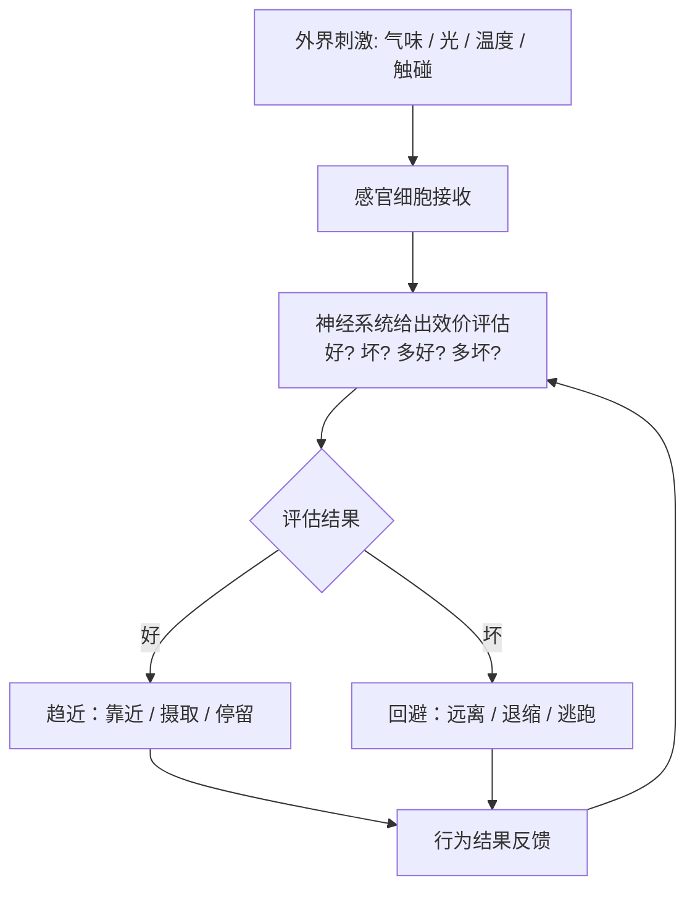

# 04｜大脑给世界贴上的第一个标签：“好”与“坏”

> 大脑如何从一团模糊信号里做出第一个决定？

---

## 一、先说结论

**第一次突破的核心产物，不是"方向"，而是"效价"（valence）——把外界的一切分成好的和坏的、该靠近的和该回避的。**

在效价出现之前，世界对生命只是一堆物理刺激：光子、分子、震动、温度。在效价出现之后，同一个世界突然有了意义：这个东西"对我有利"，那个东西"对我不利"。

班尼特认为，**这是智能史上第一次出现"意义"和"价值"。** 而它诞生的顺序非常关键：**价值评价先于复杂认知。** 大脑不是先"看懂世界"，再判断好坏；而是先"分出好坏"，再慢慢学着看懂。趋近—回避，是比"理解"古老得多的能力。

---

## 二、我们先理解一个问题

先看一个尴尬的事实。

你今天早上喝咖啡，是因为你觉得"咖啡是好的"。你躲开路上那摊积水，是因为你觉得"湿鞋是坏的"。你一整天做的几乎所有选择，背后都挂着一个小小的标签：**要 / 不要**。

问题是：这个标签是谁贴的？世界本身有"好"和"坏"吗？

一杯 60 度的温水，对刚跑完步的你是"好"的，对发烧到 39 度的你可能就是"坏"的。同一块糖，对饿的人是奖赏，对糖尿病患者是危险。**"好"从来不是刺激自身的属性，而是刺激和"我"之间的关系。**

这就引出一个非常深的问题：

> **大脑是怎么从一堆中性的物理信号里，凭空制造出"好"和"坏"的？而且，它为什么必须先制造出这个，才能做别的？**

---

## 三、作者到底提出了什么观点？

班尼特把"好坏的判断"称为第一次突破最核心的成果。它有几个特点，值得一条条拆开。

**第一，效价是一根轴，不是一堆标签。** 万物的刺激可以被压缩到一条从"极坏"到"极好"的连续轴上。不需要为每种刺激单独编码，只需要一个正负方向和强度。这是极其高效的压缩。

**第二，效价直接连着行动。** 好 → 靠近（approach）；坏 → 回避（avoid）。**它天然是"行动的接口"，不是"知识的接口"。** 你不需要知道狮子是什么，只需要知道要跑。

**第三，效价是主观的、相对于自身的。** 同一个东西，对饥饿的动物是好的，对吃饱的动物是无所谓的。这就意味着，效价已经内建了"自我"的位置——**它描述的永远不是世界，而是"世界对我"**。

**第四，效价先于认知。** 这一点最反直觉。我们习惯的顺序是"先认识，后评价"：先知道这是蘑菇，再判断能不能吃。但进化给的顺序是反的：**先有"这味道该吞还是该吐"，很久之后才有"这是蘑菇"。**

| 层面 | 存在的形式 | 更古老？ | 是否需要"知道这是什么" |
|---|---|---|---|
| 物理刺激 | 光子、分子、温度 | 最古老 | 不需要 |
| 效价（好/坏） | 靠近 / 回避 | 古老 | **不需要** |
| 情绪 | 恐惧 / 饥饿 / 满足 | 较晚 | 不需要 |
| 认知（这是什么东西） | 分类、命名、推理 | 最晚 | 需要 |

班尼特用一句话概括这张表的含义：**意义，是从身体的需要里长出来的，不是从世界的真相里长出来的。**

---

## 四、把这个观点翻译成人话

我们用**手机屏幕**来理解"效价"。

打开微信，未读消息是一个**红点**；打开健身 App，完成目标是一个**绿勾**；打开游戏，血条是**红色的**，能量条是**蓝色的**。

你有没有想过：这些颜色和形状，为什么能让你在零点几秒内做出反应？因为你的大脑天生就在跑一条极快的通道：**红 → 危险/注意 → 停下或躲开；绿 → 安全/可以 → 继续。**

这，就是效价。它不是理性分析的结果，而是**在你意识到之前就已经跑完的评估**。

再看第二个例子：**超市**。

你推着购物车走过货架，绝大多数商品你根本没"看"——没看清品牌，没比较价格。但你的手会停在某些东西上，会略过另一些。停下来的那些，往往不是"最划算"的，而是"此刻我最想要"的。

这就是效价在工作：**它在你还没开始思考之前，就已经把"想要"和"不想要"分好了。**

第三个例子，也许最能说明问题：**你根本不知道自己为什么会讨厌某个人。**

第一次见面，没有客观理由，但你就是觉得"不太对劲"。那很可能不是你在判断他的品格，而是你的身体先给出了一份极快的、说不清来源的效价评估。**理性后来才到场，它的任务往往不是做出决定，而是给已经做出的决定编一个理由。**

---

## 五、为什么会这样？

把这条逻辑走一遍：

**前提**：活命的关键，是"在正确的时间靠近正确的东西、远离错误的东西"。

**原因**：如果每个刺激都要先被"理解"再被判断，太慢了——辨别一只捕食者需要秒级的认知，而逃走的机会窗口可能只有一瞬。

**过程**：神经系统演化出一套机制，把感官输入直接映射到一个"好—坏"标量上，并把这个标量与运动输出绑定，形成"趋近—回避"的行为。

**结果**：生命获得了一种**无需理解、但足够正确**的高速判断装置；它成为后续情绪、学习、决策的公共地基。

这个图里最重要的一点是：**"理解刺激是什么"这整个环节，是不存在的。** 系统从感觉到行动，中间的桥梁不是知识，而是效价。

**这就是为什么它能在进化上跑赢：它用"省掉认知"换来了速度。**

---

## 六、举一个现实生活中的例子

我们用**游戏设计**来说明"效价"是如何被系统性地利用的。

电子游戏里几乎没有"中性"的元素。每一个视觉、声音、数值，都被设计成让你产生一个快速的好/坏反应：

- 掉血 → 红屏闪烁 + 低频震动 → 坏；
- 升级 → 金光四射 + 清脆音效 → 好；
- 宝箱 → 金色光效 → 好（哪怕里面常是垃圾）；
- 迷雾 / 黑暗 → 未知 + 阴影 → 坏（哪怕里面什么都没有）。

优秀的游戏设计师从不指望你先"理解"发生了什么，他们的目标是让**效价在你意识到之前就把你拉进情绪**。这就是为什么你明明知道那是个虚拟宝箱，手还是会去点。

再往生活里推一步：**网红店的装修、超市的背景音乐、App 的动效颜色，本质上都在做同一件事——不是让你理解，而是让你评价，而且是在你思考之前。**

这带来一个不太舒服的推论，也是班尼特这个观点最有锋芒的地方：

> **只要一个系统能持续给你"好"的信号，你甚至不需要它真的对你好。**

点赞、涨粉、连击、进度条，这些都不是真实收益，但它们是货真价实的"好"信号。**效价这条古老的通道，在数字世界里，被无限量地、精准地、廉价地供给着。**

---

## 七、回到书中重新理解

班尼特特别强调一个容易被忽略的事实：**最原始的趋利避害，根本不需要大脑。**

他说的是**细菌的趋化性**（chemotaxis）。大肠杆菌会朝营养浓度更高、远离毒素的方向游动。它没有神经元，没有大脑，甚至没有任何"感知器官"，但它确实在"趋好避坏"。

它靠的是什么？一套蛋白质信号通路：表面的受体会根据营养浓度变化，调控鞭毛的旋转方式，让细菌在"浓度上升"时保持直行、在"浓度下降"时翻滚换向。**这是一段纯粹的分子计算，却做出了标准意义上的"趋近—回避"。**

这个例子极其重要，因为它说明：

> **效价不是大脑发明的，而是大脑继承的。** 在神经元出现之前很久，"好与坏"就已经是生命的基本操作逻辑了。

于是整条脉络就清楚了：

- 细菌：用分子通路实现趋利避害；
- 早期动物：用神经网络把趋利避害做得更快、更精细；
- 有了脑之后：把效价评估、行动输出、结果反馈做成一个更完整的回路；
- 再往后：在这条"好—坏"的轴上，慢慢叠加上情绪、学习、目标、乃至价值观念。

**"好坏"是最底层的那一层，上面的一切，都盖在它上面。**

---

## 八、这个观点背后还有什么？

**第一，它把"意义"的来源，从"世界"搬到了"身体"。** 这是全书中一个很强的哲学立场：价值不是被发现的，而是被建构的——建构的参照系是"活着"本身。**活着，就是那根好坏轴的原点。** 这个立场能解释很多，但也必然引来争论（见下节）。

**第二，"效价先于认知"这个顺序，直接冲击了我们的自我认知。** 我们喜欢相信自己是先看清、再判断的理性动物。班尼特说的是：不，你先是先评价，后理解；理性很多时候只是事后补的解释。

**第三，它解释了为什么"情绪"比"理性"更有力量。** 如果所有决策最终都要落到"好/坏"这根轴上，那么能直接调动这根轴的机制（情绪），当然比只能间接推理的系统（理性）更快、更强。**这不是人类意志力薄弱，而是架构决定的。**

**第四，它和后来的强化学习是一条线。** 效价提供"这个方向是好是坏"，学习提供"怎么才能更好"。**先有标尺，后有优化。** 没有好坏，就没有"对错"可学。这也是为什么班尼特把效价放在第一次突破，而把强化学习放在第二次。

---

## 九、这个观点有问题吗？

**第一，"效价能否被完全还原为一段计算"，本身就有哲学争议。** 说细菌"趋利避害"，是一种方便的描述，还是真的意味着它"觉得"营养是好的？行为上的趋近，和主观上的"喜欢"，可能是两回事。**我们很容易把"会避免"说成"怕"，这一步跨得太随意。**

**第二，把"意义"定义为"与自身的关系"，是一个功能主义立场，不是所有人都接受。** 认为意义完全来自生存需要的人，会得到班尼特式的结论；但认为意义还有社会、语言、文化维度的人会反对——**人类说"这很美好"，未必是在说"这对我生存有利"。**

**第三，拟人化风险很大。** 一旦说"大脑给世界贴上好坏标签"，就很容易让人想象一个坐在脑子里贴标签的小人。**实际上没有"小人"，只有权重、放电和回路。** 语言在这里是方便，也是陷阱。

**第四，把复杂价值压缩成一根一维的轴，可能兜不住真实的行为。** 人会同时"想要"和"不想要"同一件事（比如既想告白又怕被拒绝）；会为了长期价值而忍受眼前的坏。**一维的效价轴，解释不了价值冲突。** 这也是为什么后面的突破必须出现（情绪、模拟、心智化），单靠"好/坏"走不远。

**第五，"好与坏是相通的还是各自独立的"这一问题尚未解决。** 心理学里有个长期争论：快乐和痛苦是否共用同一套系统（一根轴的两端），还是两套独立系统（奖励与惩罚各走各的）。目前证据支持后者也不少。**班尼特为了构图清晰，简化成了一根轴；真实情况可能至少是两根。**

---

## 十、今天再看这个观点

以下是基于班尼特思想的现代延伸，不是他在书里的原话。

如果你把"效价"当成一种可被工程化铺设的信号，那么今天最成功的产品，基本都是**效价工程**的杰作。

- 推荐算法的核心指标（点击、停留、完播），本质上是在给你的效价回路"喂答案"；
- 点赞、小红点、连续签到、动态徽章，是把"好"信号打散成高频、廉价、可无限供给的小剂量；
- 而"负向反馈"（删除、差评、取关）被刻意藏到深层菜单，因为"坏"信号会让人离开。

这带来一个我们必须清楚的区分：

**班尼特讲的是"效价是人类最古老的决策机制"；而现代的推论是——"这套古老机制，正被一个比你自己更了解它的系统持续利用"。** 前者是科学观察，后者是当代处境。

对个人来说，这里有一条很实用的提醒：**当你强烈地"想要"或"厌恶"某个东西时，先别急着相信它。** 那个反应可能只代表"我的古老回路被触发了"，而不是"这对我真的有利"。

对产品/组织来说，这条观点也有正面用法：**任何需要改变行为的设计，都必须回答"它落在效价轴的哪一端"。** 只讲道理不调动好坏，行为不会变。

---

## 十一、这一篇真正应该记住什么？

1. **第一次突破的核心产物是"效价"：把世界分成好的和坏的。** 这是智能史上第一次出现"意义"。

2. **意义来自身体的需要，不是世界的真相。** 同一刺激对不同状态的生命，可以是好的，也可以是坏的。

3. **"价值评价先于复杂认知"。** 大脑不是先看懂再判断，而是先判断，认知后来才补上。

4. **趋利避害比大脑古老得多。** 细菌的趋化性说明，好坏评估在没有神经元时就已经存在。

5. **效价是一根有效但过度简化的轴。** 它解释不了价值冲突、长期取舍，也难安放主观感受——所以后面还需要更多突破。

---

## 十二、留一个问题

> 如果"好"与"坏"最初只是身体内部的一根标尺，
> 那么当算法比你自己更擅长拨动这根标尺时，
> 你感受到的"想要"，还是你的需要，
> 还是别人为你设计好的需要？

---

**下一篇**：好坏的判断，听起来已经很像"情绪"了——喜欢、厌恶、害怕、想要。那么问题来了：情绪究竟是文明的装饰、是人类的奢侈品，还是这套"好坏机制"运行时的体感？

下一篇我们来看情绪从哪里来，以及为什么它比大脑本身还要古老。

---

*本系列基于 Max Bennett《A Brief History of Intelligence》整理，文中"班尼特认为/书中认为"均指作者观点；带"延伸"字样的段落为基于其思想的现代推演，不代表原作者。*
