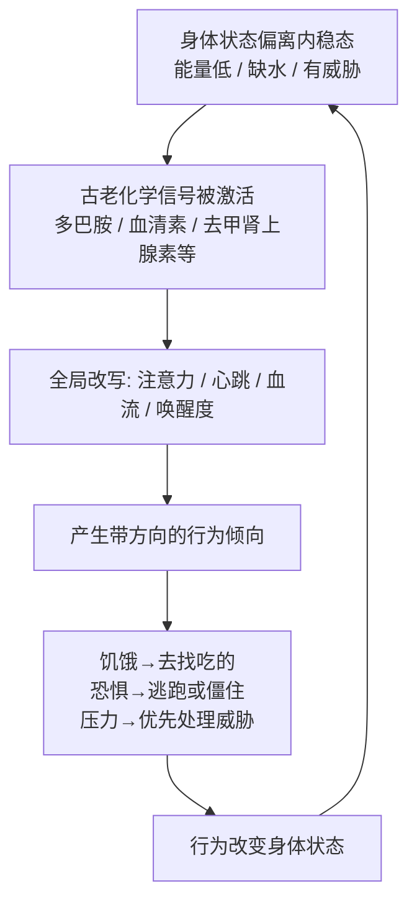

# 05｜情绪从哪里来？——喜怒哀乐的原始版本

> 情绪是文明的装饰，还是古老的计算机制？

---

## 一、先说结论

**情绪不是文明的装饰，而是最古老的决策系统。**

班尼特认为，多巴胺、血清素、去甲肾上腺素这类"情绪分子"，在第一次突破时就已出现，甚至比大脑本身还要古老——它们的祖先，可以追溯到单细胞生命用来感知环境、调节状态的化学物质。它们最初的工作不是"让你有感受"，而是**用身体状态快速告诉动物：现在该做什么**。

所以情绪的本质不是"感觉"，而是**一套基于内稳态（homeostasis）的快速行动指令**。饿、怕、累、满足——它们都是身体在说："去补充""去躲开""去停下""可以了"。

（注意：本篇只讲"情绪 = 原始决策系统"。至于多巴胺如何作为**学习信号**、如何计算"预测误差"，那要等到第二次突破，本书第 08 篇再讲。）

---

## 二、我们先理解一个问题

先请你回想一个场景。

凌晨一点，你还在刷手机。你已经困得眼睛发酸，明天还要早起。理性很清楚：**该睡了。** 但你就是放不下。你甚至能一边刷一边骂自己。

再想另一个场景。你和家人因为一件小事吵了起来。事后你冷静下来，知道"那句话根本不值得吵"。可在当时，你的语气、心跳、语速，全都不是你控制的。

这两个场景有一个共同点：**你"知道"什么是对的，但你没按它做。**

为什么？因为我们习惯把"情绪"和"理性"想成两股力量：理性是好的，情绪是捣乱的。情绪像是一个应该被驯服的野兽。

但班尼特要问一个更基础的问题：

> **如果情绪真的只会添乱，进化为什么没把它淘汰掉？**

它可是活了几亿年的东西。比语言古老，比文字古老，比理性思考古老得多。一个如此古老、普遍、又强大的机制，如果只是"文明的装饰"，说不通。

所以真正的问题是：**情绪，到底在替我们解决什么必须解决的问题？**

---

## 三、作者到底提出了什么观点？

班尼特的答案是：**情绪是一套"身体状态管理 + 快速行动选择"的系统。** 拆开来讲有四层。

**第一层：情绪分子比大脑古老。** 多巴胺、血清素、去甲肾上腺素、谷氨酸、乙酰胆碱这些"神经递质/神经调质"，在功能上并不专属于神经系统。它们在单细胞生物、植物、甚至细菌的信号系统里都能找到远亲或类似机制。**换句话说，"用化学物质来调节状态、响应环境"这件事，比神经元之间的突触古老得多。** 神经系统只是把这套古老的化学品，借过来当成了内部通信的语言。

**第二层：情绪服务的核心目标是内稳态。** 内稳态就是"把身体维持在一个适合活着的范围里"：体温、血糖、水分、盐分、氧气。偏离了这个范围，就得纠正；纠正的驱动力，就是情绪。**饿 = 能量低，去补充；渴 = 水低，去找水；怕 = 有威胁，去躲避；累 = 该休息了。**

**第三层：情绪是"快速、全局、跨系统"的行动指令。** 理性的特点是慢、局部、需要信息。情绪的特点是快、全局、不需要信息。恐惧一上来，心跳、呼吸、瞳孔、血流、注意力**同时**被改写——它不是一个念头，而是一次全身状态的切换。**它买的不是"正确"，而是"及时"。**

**第四层：情绪是一台"古老的决策器"，不等于"感受"。** 这是班尼特框架里很关键的一点：从功能上说，情绪首先是一套输出行动的机制。它带来的主观感受（"我好难受"）可能很晚才出现，甚至未必是所有动物都有的。**先把情绪当机制看，再看它是否伴随体验。**

| 情绪（原始版） | 身体/环境状态 | 它让你做什么 |
|---|---|---|
| 饥饿 | 能量不足 | 去找吃的，把注意力转向食物 |
| 饱足 | 能量充足 | 停下来，把注意力转向别的 |
| 恐惧 | 有威胁 | 逃跑 / 僵住 / 战斗 |
| 压力 | 资源紧张、不确定 | 提高警觉，优先处理威胁 |
| 满足 / 平静 | 需求被满足 | 放松，允许休息与恢复 |

请注意：**这张表里没有"快乐"或"悲伤"这种高级情绪，只有状态和行动。**

---

## 四、把这个观点翻译成人话

我们用**手机电量**来理解情绪。

手机电量 100% 时，你不会想它；电量 20%，弹出一个黄色的低电量提醒；电量 5%，屏幕变红、震动、弹窗、甚至自动进入省电模式。

请问：这个提醒"聪明"吗？它不理解你在干什么，不知道你正等一个重要电话，也不知道前面的地图导航有多重要。它只做一件事：**根据一个内部状态（电量），触发一个全局的、优先级的行动信号（赶紧充电）。**

情绪就是这套系统。而且它比手机做得更狠：

- 它不只弹窗，它**改写你的全部注意力**。饿了的时候，满街都是饭馆；不饿的时候，你根本看不见它们。
- 它不只提醒你，它**改变你的身体**。害怕的时候，你还没想清楚，心跳已经快了、手心已经出汗了。
- 它不只告诉你"缺什么"，它**直接推动你去补**。它给的不是报告，是冲动。

这就解释了那个最初的困惑：**为什么你困得不行却停不下来刷手机？** 因为在那一刻，"再刷一条"带来的即时状态改善，压过了"明早会很困"这个远期、抽象、需要模拟才能感知的坏处。**情绪系统天生偏向"现在"**——因为在它诞生的年代，"现在"几乎就是全部。

---

## 五、为什么会这样？

把因果链完整走一遍：

**前提**：生命必须把内部状态维持在可生存的范围内（内稳态）。

**原因**：维持内稳态需要"检测偏离"和"纠正偏离"；如果每次都要"想清楚"，太慢，而且早期生命根本没有"想"这个东西。

**过程**：身体演化出一套化学信号，把内部状态的变化（能量低、缺水、受伤、缺氧）直接翻译成全局的、带优先级的行动倾向；这套信号先以分子形式存在，后来被神经系统接管、放大和细化。

**结果**：情绪成为一种**基于身体状态的快速决策系统**——它先告诉你"该干什么"，理性再决定"具体怎么干"。

注意最后一步：**这是一个循环。** 情绪不是一次性事件，而是"状态—行动—新状态"的持续调节。这也是为什么情绪会起伏、会消退、会转移。

---

## 六、举一个现实生活中的例子

我们用**"饿怒"（hangry）**和**家庭里的情绪信号**来说。

**先说"饿怒"。** 你一定见过：某个平时脾气很好的人，一饿就变得暴躁，说话带刺，为一点小事发火。吃完饭后，立刻恢复温和。

他变了吗？没有。他的观点变了吗？也没有。变的是**血糖。**

当血糖偏低，身体进入"能量告急"状态，这套古老系统开始上调警觉和攻击性——因为对远古的动物来说，"能量不足"往往意味着"处境危险"。于是它给出的行动指令是：**提高唤醒度、准备争夺资源、对任何阻碍都不耐烦。**

然后，最精妙的部分来了：**大脑会把这种身体状态，归因到眼前的人或事上。** 你并不知道自己在"为血糖发火"，你只知道"他这句话太过分了"。**情绪系统给出状态，理性系统负责编一个看起来合理的故事。**

**再说家庭。** 你有没有发现，很多家庭的争吵，从来不是从"讲道理"开始的，而是从一个人进门时的**状态**开始的：脸色、语速、摔门的力度。其他家庭成员不看他"说了什么"，而是先感受他"处于什么状态"。

这就是最古老的沟通方式：**用身体状态广播"我现在危险/安全"。** 在一个群体里，这比语言快得多，也省得多。一个人紧张，全家紧张；一个人放松，全家落地。

**情绪从来不是私人事件，它是一套会被同类接收到的公开信号。** 这也是它为什么必须"外显"——脸上的表情、声音的调子、身体姿态，都是给别人的状态更新。

---

## 七、回到书中重新理解

班尼特在这里要打破一个我们习以为常的等级秩序。

我们习惯这样排：**理性 > 情绪 > 本能。** 情绪夹在中间，既不如理性高级，又比本能文明一点。甚至有句流行的话叫"情绪是理性的敌人"。

班尼特的重新排序是：**内稳态 → 情绪（状态决策）→ 理性（认知决策）→ 语言。**

在这个排序里，情绪不是理性的敌人，而是**理性的地基**。原因有三：

**第一，理性需要一个"目标"，而目标来自情绪。** 你为什么要努力工作？因为你想让家人过得好——"想让他们好"本身是一个被在意的东西，而"在意"是情绪系统的产物。**没有情绪，理性就不知道要往哪走。**

**第二，理性需要一个"优先级"，而优先级来自情绪。** 一天有无数件事，先做哪件？理性的计算需要时间，效率太低。是情绪快速地告诉你"这个更急""那个更重要"。**没有情绪，理性会被无限的选择瘫痪。**

**第三，理性本身就依赖身体状态。** 睡眠不足、血糖过低、长期压力——这些都会直接损害判断力。**你没法在一个失控的身体里，运行一个优秀的理性。**

所以班尼特那句话可以这样理解：**情绪不是文明在理性之外额外装饰的一层，它是最早的、也是最底层的决策层。** 后来长出的理性，是盖在它上面的。

这也解释了那个最初的困惑：**为什么"知道该睡"却停不下来刷手机？** 因为在进化的账本里，"现在爽一下"是一件实实在在的事，"明早困"只是一个需要模拟才能感受到的抽象，而模拟能力（第三次突破）在这套情绪系统诞生之后很久才出现。**情绪比模拟古老得多，所以它天然不听模拟的话。**

---

## 八、这个观点背后还有什么？

**第一，它把"情绪"重新定义成了"评价 + 行动倾向"，而非"感觉"。** 这是一个功能主义立场：一个系统只要在做"根据状态快速选择行为"这件事，就算有情绪，不管它有没有主观体验。这个定义的优点是能用进化和工程的语言谈情绪；代价是它把"感受"这件事悬置了（见争议）。

**第二，它建立了"身体先行"的隐含前提。** 班尼特反复强调身体状态先于认知：**你不是先觉得"危险"再心跳加速，很多时候是身体先进入警戒，你才发现"我有点紧张"。** 这个顺序对自我认知冲击很大——你以为你在指挥身体，很多时候是身体在提醒你。

**第三，它把情绪和"内稳态"绑在一起，于是情绪有了明确的"正确性标准"。** 一个情绪如果有助于恢复内稳态，它就是"功能正常"的；如果长期误报（比如对无害的东西持续恐惧），它就成了一种"故障"——这正是今天焦虑症、惊恐障碍的框架。

**第四，它为"情绪为什么会被算法劫持"埋下伏笔。** 如果情绪是"根据状态快速给行动指令"，那么只要能操纵你感知到的状态，就能操纵你的行为。**这一层在后面讲 AI 和互联网时会反复出现。**

---

## 九、这个观点有问题吗？

**第一，这是全书争议最大的一章之一：基本情绪到底存不存在。** 以保罗·埃克曼（Paul Ekman）为代表的一派认为，恐惧、愤怒、快乐、悲伤、厌恶、惊讶等基本情绪是普遍、先天、可跨文化识别的（他早期的跨文化研究是重要证据）。而以丽莎·费尔德曼·巴雷特（Lisa Feldman Barrett）为代表的"情绪建构论"认为：情绪不是天生刻在脑里的固定模块，而是大脑用过去的经验、概念和语言**现场建构**出来的；不同文化、不同个体对同一生理状态的加工可以完全不同，并不存在能靠面部或生理信号稳定识别的"基本情绪"。**这场争论至今没有定论**，班尼特采用的显然是偏"基本/进化"的叙事。

**第二，情绪的"神经定位"也远没有定论。** 过去流行的说法是"杏仁核管恐惧""伏隔核管快乐"，但近二十年的研究越来越显示：情绪很少对应单一脑区，而是多个大尺度网络的动态组合。**说"某个分子 = 某种情绪"，是很粗的近似。**

**第三，把情绪说成"决策系统"，可能低估了主观感受的地位。** 如果情绪只是一套行动选择机制，那它和"恒温器"有什么区别？很多人会坚持：**疼痛之所以是疼痛，恰恰在于它"疼"，而不只是它让你缩手。** 班尼特的框架能很好地解释功能，却对"感受"保持沉默——这是一种选择，也是一种遗漏。

**第四，拟人化和还原的双重风险。** 说"细菌在趋利避害""植物在感受压力"，很容易滑向两个极端：要么把一切都拟人化（"植物也会害怕"），要么把人类情绪完全还原（"爱情不过是多巴胺"）。**前者不科学，后者也不公平**——因为从"分子机制"到"人的体验"，中间隔着好几次突破，不能一步抹平。

**第五，把多巴胺、血清素直接叫"情绪分子"，本身就是一种简化。** 这些分子的功能极其多样，涉及运动、睡眠、消化、免疫。**把它们标签成某一种情绪的化学，是通俗化的说法，不是精确的科学表述。** 这也是本系列要提醒的：本书很多"分子=功能"的对应，是为了讲述方便。

---

## 十、今天再看这个观点

以下是基于班尼特思想的现代延伸，不是他在书里的原话。

情绪如果真的是"根据身体状态快速下达的行动指令"，那么今天最值得警惕的一件事就是：**我们正生活在一个前所未有的、精准刺激这套系统的环境里。**

- 社交媒体的红点、震动、未读数字，制造的是"状态偏离"的错觉；
- 无限下滑的信息流，提供的是永不枯竭的"再刷一下就有新东西"；
- 短促的高唤醒内容，把"警觉—奖励"的循环压缩到以秒计；
- 而"关掉通知、放下手机"这类行为，需要的是长期模拟能力（第三次突破）——**正好是情绪系统最不擅长的那一层。**

这带来一个必须区分的结论：

**班尼特说的是"情绪是古老的、功能性的决策系统"；而现代延伸是"这套系统的输入端口，如今大部分已经外包给了产品设计者"。** 前者是科学观察，后者是当代处境判断。

对个人有一条很实用的用法：**不要只处理"念头"，要处理"身体"。** 当你情绪失控时，深呼吸、走动、喝水、睡觉，往往比"想开点"更有效——因为你在调整的，本来就是一套身体状态系统，而不是一个逻辑推理程序。

对组织也有一条：**情绪不是"干扰决策的噪音"，而是"决策所需的状态输入"。** 一个长期让员工处于高压、缺觉、饥饿、恐惧状态的团队，不是"更拼"，而是**理性系统被持续降级**。管理情绪，本质上是在管理决策质量。

---

## 十一、这一篇真正应该记住什么？

1. **情绪是最古老的决策系统，不是文明的装饰。** 它用身体状态，快速给出"现在该干什么"的指令。

2. **情绪分子比大脑古老。** 多巴胺、血清素、去甲肾上腺素这类化学信号，其祖先可追溯到单细胞时代的信号机制。

3. **情绪的地基是内稳态。** 饿、渴、怕、累、满足——本质都是身体在偏离或回归"适合活着"的范围。

4. **情绪先于理性，理性是盖在情绪之上的。** 目标、优先级、判断力，都依赖情绪与身体状态。

5. **"基本情绪是否存在"仍有激烈争论。** 埃克曼的普遍情绪观与巴雷特的建构论至今对峙，本章采用的是偏进化、偏功能的一派叙事。

---

## 十二、留一个问题

> 如果情绪本来是一套"身体告诉你去做什么"的古老系统，
> 那么当算法抢在你身体之前，精确地预测并满足你的每一个状态需求时——
> 你还会听见自己的身体在说什么吗？

---

**下一篇**：好坏的判断有了，情绪的驱动也有了，但这套系统还不够——一只动物如果每次都要靠本能躲避危险，它只能在"已经遇到"之后才学会害怕。

那么，动物是怎么第一次学会"提前预判"的？——当铃声响起，食物还没出现，狗为什么就开始分泌唾液？

下一篇我们来讲学习的曙光：动物如何第一次把"两件事"联系起来。

---

*本系列基于 Max Bennett《A Brief History of Intelligence》整理，文中"班尼特认为/书中认为"均指作者观点；带"延伸"字样的段落为基于其思想的现代推演，不代表原作者。*
