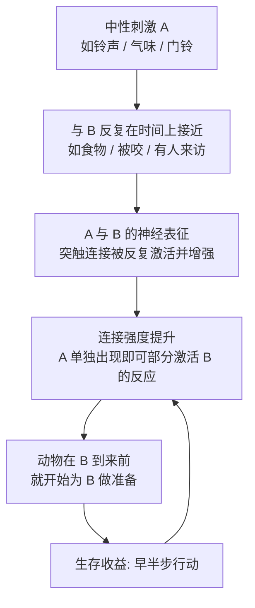

# 06｜学习的曙光：动物如何第一次把“两件事”联系起来？

> 动物第一次学会"预测"是什么时候？

---

## 一、先说结论

**第一次突破不只带来了转向、好坏的判断和情绪，还带来了"联想学习"——把两个原本无关的事件联系起来。**

班尼特认为，这是预测能力的雏形，也是后来所有学习的地基。当动物发现"A 之后常常跟着 B"，它就能在 A 出现时提前为 B 做准备。这在生存上意味着：**在危险真正到来之前，身体已经进入状态。**

但这套能力还非常"笨"。它只能学会**直接接触到的、在时间上紧挨着的关联**，无法为长远目标做规划，也不能为了未来牺牲当下。它给的是一根"近处的绳子"，而不是一张"远方的地图"。真正的规划能力，要等到第三次突破（模拟）。

---

## 二、我们先理解一个问题

先看一个生活细节。

你的手机在桌上，屏幕朝下。突然，它震了一下——**你还没拿起它，甚至还没确认是谁，你的心率已经微微变了。** 如果那个特定的震动节奏，是你对象、老板或孩子的专属提醒，你的身体几乎在你意识之前，就已经进入"准备好接听"的状态。

再想一个更古老的版本。

假设你是一只动物。昨天你在某片草丛里，先闻到一股特别的气味，随后被什么东西咬了一口。今天你又经过那片草丛，**还是那股气味飘来，你还没看见任何威胁，身体已经开始紧张。**

这里发生了什么？**你把"气味"和"被咬"这两件原本毫无关系的事，连在了一起。**

这就是"联想学习"。它是如此基础，基础到我们几乎意识不到自己在做它。但它背后有一个深刻的问题：

> **世界上的事情成千上万，为什么大脑知道该把"哪两件"连起来？而且，它凭什么相信"下一次还会一样"？**

---

## 三、作者到底提出了什么观点？

班尼特的答案有三层。

**第一层：联想学习的核心是"关联"本身，而不是"理解"。** 动物学会"铃声→食物"，并不是理解了铃声的含义，而只是发现两者在时间上反复一起出现。**它学到的是一句最朴素的预言："A 之后，常常有 B。"**

**第二层：它的规则，是"时间上的接近"。** 两个刺激如果反复在相近的时间内出现，它们的表征就会被连在一起。**接近（contiguity）就是全部的秘密。** 这也是为什么巴甫洛夫的实验中，铃声必须在食物之前一点点响——顺序和间隔，决定了学习能否发生。

**第三层：学习发生在"连接强度"上，而不是"新增知识"上。** 神经层面，反复共现会让两个神经元之间的突触变强。用一句后来广为流传的话就是："**一起激发的神经元，会连在一起**"（Cells that fire together, wire together）。

| | 第一次突破之前 | 第一次突破之后 |
|---|---|---|
| 对刺激的反应 | 天生的、固定的反射 | 可以被经验改写 |
| 预测能力 | 无 | 有，但只限"直接临近" |
| 学习内容 | —— | A 与 B 的关联 |
| 时间跨度 | 只看当下 | 能看"下一步" |
| 能否规划远期 | 不能 | 仍然不能 |

班尼特很看重这个"能看下一步、但看不到远方"的限定。因为它是理解第二、三次突破为什么必须出现的钥匙。

---

## 四、把这个观点翻译成人话

我们用**门铃**来理解。

外卖到了，门铃响。你从沙发上起身去开门。这个动作太自然了，自然到你不会觉得"我学会了一个东西"。

但如果你从零开始看这件事，它其实包含了一次非常了不起的学习：

- **第一次**：门铃响，你不知道是什么，可能只是"有声音"；你去开门，发现是外卖。
- **第三次**：门铃响，你开始预期"可能是外卖"。
- **第十次之后**：门铃一响，你直接起身——**你甚至不需要"想"**。

这中间发生了什么？你把"门铃的声音"和"门口有人/要到的东西"这两件事连在一起了。

再往前一步：**有些人的门铃和外卖、快递、物业、访客全都绑在一起，于是每次门铃响，他都要经历一次小小的期待和失望。** 这恰恰说明：联想学习不区分"这个关联有没有意义"，它只是忠实地记录"哪些事常常一起发生"。**它会学到真的关联，也会学到巧合。**

这就引出了它最本质的局限：

> **联想学习不认识因果，它只认识"同时发生"。**

一只被驯养的动物，可能因为"喂食的人在穿白大褂"而把白大褂和食物连起来；它不知道是"食物"让它饱，它只知道"白大褂之后常常有食物"。**它学到的是相关，不是道理。**

---

## 五、为什么会这样？

把因果链完整走一遍：

**前提**：能提前为即将发生的事做准备，是巨大的生存优势——早半步逃命，早半步进食。

**原因**：但要做到"提前"，必须能在事件真正发生前，识别出它的前兆；而前兆的识别，靠的是"反复共现"这一统计规律。

**过程**：两个反复在时间上接近的信号，会在神经层面被连接起来；当第一个信号出现时，它会提前激活第二个信号所对应的反应。

**结果**：动物获得了"用过去预测下一步"的能力——这是所有学习的公共地基，但它的视野仅限于"紧挨着的下一步"。

看图里最后回到 D 的那条线：**学习是循环的，越用越强，不用则消退。** 这也解释了为什么"条件反射"需要被不断强化——如果 A 之后不再总跟着 B，连接就会慢慢减弱。**大脑不保留它认为不再有效的预测。**

---

## 六、举一个现实生活中的例子

我们用**手机提示音**来理解，因为它可以说是现代人身上跑得最勤的一套条件反射。

你的手机每天响很多次。但仔细想想，你对不同提示音的反应是完全不同的：

- **微信提示音**：可能是消息，也可能是无关的群聊；你会"想看一眼"，但不一定起身；
- **电话铃声**：默认意味着"重要、紧急、需要回应"；多数人会在两秒内接；
- **日历提醒**：意味着"有个安排要开始了"；你会看一眼时间；
- **专属铃声**（给伴侣、父母、孩子设的）：一响，状态立刻切换。

同样是一段声音，你学会的联想完全不同。而且**你从来没"刻意学过"**——你只是在无数次"这个声音 → 那件事"的配对中，被动地记录下了关联。

这件事有个很有意思的推论：**提示音是可以被"改造"的。**

如果你把老板的消息提示音设成和某个焦虑源一样的音效（比如催债短信那种），你会在老板还没说话时，就已经紧张了。**你不是对老板紧张，你是对自己设置的关联紧张。**

这就是联想学习最实用的地方：**它不区分"这个关联是好是坏"，它只负责把一起出现的东西绑在一起。** 你想改变自己的反应，最有效的办法往往不是"说服自己不要紧张"，而是**把那个配对拆开**（换提示音、改环境、断开反复共现）。

---

## 七、回到书中重新理解

班尼特讲了两个绕不开的经典实验。它们一个来自心理学，一个来自神经科学。

**第一个，巴甫洛夫的狗。**

伊万·巴甫洛夫（Ivan Pavlov，1849–1936）本来研究的是消化生理——他因为这项工作获得了 1904 年的诺贝尔生理学或医学奖。但他在实验中发现了一个奇怪现象：狗还没吃到食物，光是看到喂食的人、听到脚步声，就开始分泌唾液。他把这叫"**心理性分泌**"。

于是他设计了著名的实验：先响铃声（中性刺激），紧接着给食物（无条件刺激）。反复配对之后，**光是铃声就能让狗分泌唾液。**

这个实验的意义在于，它第一次用严格、客观、可重复的方式证明：**一个原本毫无意义的信号，可以因为反复的配对，变成"有意义"的信号。**

**第二个，坎德尔的海兔。**

时间来到二十世纪六十年代。神经科学家埃里克·坎德尔（Eric Kandel，1929– ）做了一个当时被同事视为"学术自杀"的决定：**放弃猫，去研究地中海的巨型海兔（Aplysia californica，一种海蛞蝓）。**

他的理由非常"工程师"：
- 海兔只有约两万个神经细胞（人脑有上千亿）；
- 这些细胞集中在约十个神经节里；
- **而且它的神经细胞是动物界最大的，大到肉眼可见、可以逐个辨认。**

这让他可以做到一件当时几乎不可能的事：**追踪一个具体行为背后的具体神经连接，然后看着它因为学习而改变。**

他研究的是海兔的"缩鳃反射"：轻轻碰它的水管，鳃会缩回去。他发现：

- **习惯化**：如果反复轻轻触碰、又无害，反应会越来越弱（"没什么大事，不必躲"）；
- **敏感化**：如果先给一个强刺激（比如尾部电击），之后轻微的触碰也会引起强烈反应（"今天危险，草木皆兵"）。

更进一步，他和同事们发现，这些学习对应着突触强度的改变——**短期变化来自神经递质释放的多少，长期变化则涉及基因表达和新突触的形成。**

2000 年，坎德尔因这项工作获得诺贝尔生理学或医学奖。**他用一个"最笨"的动物，证明了"学习"可以不神秘：它就是神经连接强度的改变。**

**第三个概念，赫布规则（Hebb's rule）。** 心理学家唐纳德·赫布（Donald Hebb）在 1949 年提出一个猜想：**当两个神经元反复同时活动，它们之间的连接就会增强。** 这个"赫布学习"的直觉，正好和巴甫洛夫、坎德尔观察到的现象对上了。今天几乎所有人工神经网络的基本单元，都还带着它的影子。

把这三个串起来，班尼特的结论是：

> **第一次突破完成了一个伟大的跨越——它让"经验"第一次能够改变"行为"。在这之前，动物只能带着出厂设置活着；在这之后，动物可以带着一身被世界改写过的连接活着。**

而且注意它的界限：**它能学到的，只是"什么和什么常常一起出现"。它会预测下一步，但不会计划一整个未来。**

---

## 八、这个观点背后还有什么？

**第一，它把"学习"从"聪明"里彻底独立出来了。** 海兔只有两万个神经元、没有复杂大脑，却能学习。这说明学习不是高级智能的专属，而是一种**在连接层面上的普遍机制**。越简单的系统，反而越适合研究它。

**第二，它设定了后来一切的"零部件"。** 联想学习用到的三样东西——**表征、连接强度、预测**——正好也是今天神经网络的三样东西。历史的呼应非常明显：**一个以"调整权重"为核心的系统，天然能学会"关联"。**

**第三，它揭示了"预测"是学习的目的，而不是"理解"。** 大脑不是为了"知道世界为什么是这样"而学习，而是为了"下一步该怎么办"而学习。理解，往往是预测能力的副产品，而不是目标。

**第四，它埋下了"局限"的伏笔。** 因为联想学习只认"时间上的接近"，它就无法处理"很久以后才有回报"的事。这恰恰是下一代突破要解决的问题：**如何为一个不立刻发生的结果而行动？** 强化学习，就是从这里长出来的。

---

## 九、这个观点有问题吗？

**第一，联想学习到底能解释多少"学习"，是有争议的。** 行为主义曾一度想把一切学习都还原成条件反射，但后来的认知心理学发现：人会学习概念、规则、语法——这些很难说是"刺激配对"的产物。**联想学习是地基，但不是全部。**

**第二，"条件反射"和"认知学习"的边界并不清晰。** 有些看似简单的条件反射，动物行为里其实包含了"预期""注意""惊讶"这类认知成分（比如"阻断"现象：如果动物已经知道另一个信号能预测食物，新信号就学不进去）。**这说明即使在"低级"学习里，也可能有"推理"的影子。**

**第三，过度还原的风险很大。** "爱情是催产素""道德是多巴胺""学习是突触强化"——这类说法抓住了一部分真相，也丢掉了一部分真相。**机制层面的解释是必要的，但它不自动等于"完整解释"。**

**第四，把坎德尔的结论外推到人脑，要格外小心。** 海兔的缩鳃反射是一个极其简单的反射回路。人类记忆涉及的脑区、类型（陈述性/程序性）、时间尺度都复杂得多。**坎德尔发现的是"学习的一种分子机制"，而不是"学习本身"。** 这一点在科普传播中经常被夸大。

**第五，赫布规则也不是全部真相。** 后来的研究发现了各种修正（比如必须考虑信号的时间顺序、必须有"第三个信号"来指示重要性）。**"一起激发就连在一起"是一句好记的口号，不是精确的定律。**

---

## 十、今天再看这个观点

以下是基于班尼特思想的现代延伸，不是他在书里的原话。

联想学习在今天的数字生活里，几乎无处不在——只不过学习的主体从动物变成了机器。

**推荐系统的底层，就是一台巨型联想学习机。** "看过 A 的人也看了 B""买过 X 的人也买了 Y"——它不认识因果，也不需要理解你，它只需要统计"什么和什么常常一起出现"。**这正是巴甫洛夫式逻辑的工业化规模版本。**

**大语言模型的预训练，也在做同一件事的极致版：把词和词之间的共现关系，压缩进权重里。** 它学到的"知识"，很大一部分就是"哪些东西常常一起出现"。这也解释了它为什么会一本正经地编造——**它优化的是"像真的"，不是"是真的"；是相关性，不是因果。**

对个人来说，这里有一条很实用的提醒：**你会被反复出现的配对塑造，无论你愿不愿意。**

- 如果你的手机放在床头，你会自动关联"床 = 刷手机"；
- 如果你每次焦虑就吃甜食，你会自动关联"焦虑 = 甜食"；
- 如果你总是深夜工作，你会自动关联"夜 = 战斗状态"，然后难以入睡。

**改变反应，往往不是靠意志力对抗，而是靠重新设计配对。** 把手机移出卧室、把零食换到看不见的地方、给工作设一个明确的结束仪式——这些都是在**改写连接**，而不是在**对抗连接**。

但也要记得班尼特给这条能力的"上限"：**它能教你"下一步怎么办"，却教不会你"十年后要成为什么样的人"。** 后者需要的，是另一种能力——在脑子里先跑一遍未来。那是第三次突破，我们后面会讲到。

---

## 十一、这一篇真正应该记住什么？

1. **第一次突破带来了联想学习：把"常常一起出现"的两件事连起来。** 这是预测能力最早的雏形。

2. **它的全部秘密是"时间上的接近"，不是"理解因果"。** 它学到的是相关，也可能是巧合。

3. **巴甫洛夫证明了信号可以被学会，坎德尔证明了学习就是突触强度的改变。** 2000 年诺贝尔奖，来自一只海兔。

4. **赫布规则点出了底层语法：一起激发的神经元会连在一起。** 今天的神经网络，仍带着它的印记。

5. **它很笨——学不会长远目标，也不懂未来牺牲。** 局限正是下一次突破要解决的事。

---

## 十二、留一个问题

> 如果学习的起点只是"把常常一起出现的事连起来"，
> 那么今天那些靠海量共现关系训练出来的模型，
> 究竟是在"学习世界"，
> 还是只是把世界的相关性，压缩得比我们更极致？

---

**下一篇**：联想学习让动物能预测"下一步"，但它有一个天花板——它只能在"做过的事"上变聪明，而且必须有人先给奖励。

寒武纪到来，捕食者出现，光会联想远远不够了。第二次突破——**强化：用结果的好坏，反推出该做什么**——即将登场。下一篇，我们从一场把"捕食"变成常态的军备竞赛讲起。

---

*本系列基于 Max Bennett《A Brief History of Intelligence》整理，文中"班尼特认为/书中认为"均指作者观点；带"延伸"字样的段落为基于其思想的现代推演，不代表原作者。*
