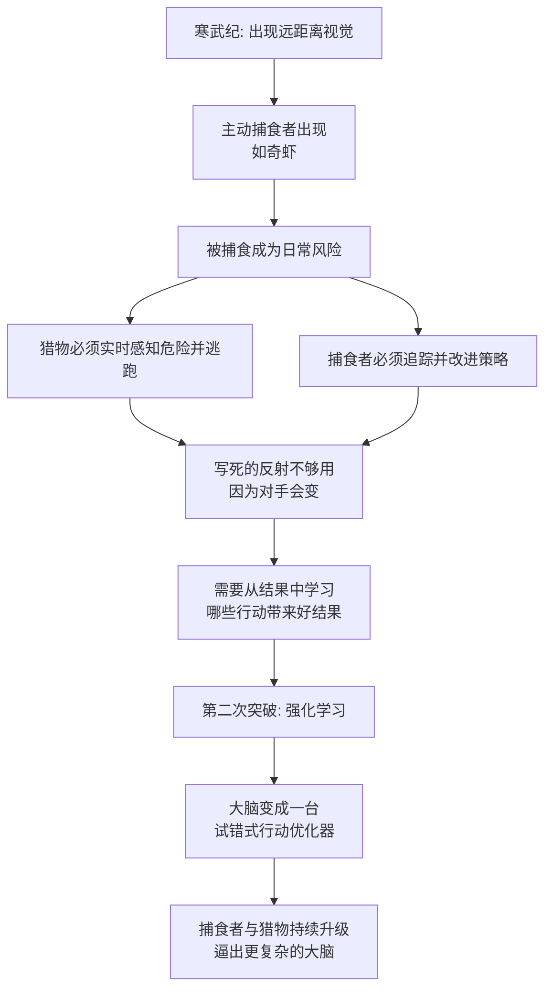

# 07｜寒武纪大爆发：一场把“捕食”变成常态的军备竞赛

> 为什么生命在 5 亿年前突然"卷"了起来？

---

## 一、先说结论

班尼特的回答是：**寒武纪大爆发不是一场"物种变多"的热闹，而是一台"捕食机器"被点着之后引发的连锁反应。**

当第一种动物学会主动追捕别的动物，海洋就从"各过各的"变成了"谁吃谁"的战场。猎物必须能感知、能逃跑、能记住哪里危险；捕食者必须能追踪、能判断、能改进策略。光靠第一次突破的"转向"已经不够用了——它逼出了第二次突破：**强化学习**，也就是通过"做—看结果—调整"来学会行动。

所以第二次突破不是某个天才动物的灵光一闪，而是被一场军备竞赛活活"卷"出来的。

---

## 二、我们先理解一个问题

先看一个让达尔文都头疼的事实。

在生命史上，前面的三十多亿年几乎是"慢动作"：细菌、藻类、简单的软体多细胞生物，安安静静地飘着、滤着、附着着。它们没有牙，没有壳，没有眼睛，也没有脑。

然后，在大约 **5.41 亿年前**开始的一段地质时间里（短到只占生命史的千分之一左右），化石记录里突然冒出了几乎所有现代动物门类的祖先：三叶虫、腕足类、软体动物的近亲、以及各种今天看来像外星生物的怪东西。这就是**寒武纪大爆发**。

达尔文在《物种起源》里就承认过，这件事让他不安：如果演化是缓慢渐进的，为什么地层里会像被谁按了快进键？

更奇怪的是另一个细节。生命没有大脑活了几十亿年，活得好好的——海绵不思考，水母没脑子，海鞘定居之后甚至把自己的神经节消化掉。**那为什么偏偏在这几百万年里，动物突然"需要"一颗能在试错中学习的大脑了？**

换句话说：不是先有聪明、再去用；而是先出现了某种严峻的处境，逼着大脑升级。这个处境是什么？

---

## 三、作者到底提出了什么观点？

班尼特的答案是：**寒武纪的关键新事物是"捕食者"，而捕食者把海洋变成了一场持续至今的军备竞赛。**

他把寒武纪的几项创新放在一起看，会发现它们其实是相互咬合的：

| 演化创新 | 带来的新能力 | 施加给对手的压力 | 被迫做出的回应 |
|---|---|---|---|
| 眼睛（如三叶虫的复眼） | 远距离发现目标 | 猎物无处藏身 | 需要伪装、硬壳、快速逃跑 |
| 硬壳与骨板 | 抵挡被咬、被穿刺 | 捕食者咬不动了 | 需要更强的口器、更好的追踪 |
| 主动捕食者（如奇虾） | 追捕、撕咬大型猎物 | 被捕食变成常态 | 需要感知、判断、记忆、学习 |
| 有方向感的身体（第一次突破的遗产） | 能朝一个方向主动移动 | —— | 让"追"和"逃"成为可能 |

请注意最后一行。**捕食这件事，是建立在第一次突破的成果之上的。** 如果动物还不会"转向"，不会朝某个方向移动，它连"追"这个动作都做不出来。这正好印证了全书的框架：第二次突破，必须踩在第一次突破的肩膀上。

同时，班尼特强调：捕食带来的不是"一次判断"，而是"一连串需要学习的行动"。猎物这次从左边溜了，下次要换方向；这个洞穴上次安全、这次有埋伏。**环境不再是静止的，而是有对手在实时反应。** 对付一个会反应的对手，写死的反射是不够的，你必须能从结果里学习。

这就是"强化"（Reinforcing）这个名字的由来：**行为被它的结果强化或削弱。**

---

## 四、把这个观点翻译成人话

把寒武纪想象成一个刚刚开服的网络游戏，而它刚开始时是一片"和平服"。

开服的头几十亿年，大家都是佛系玩家：有的原地挂机（海绵、海鞘），有的随波漂流（水母），谁也不用练级，反正没有 PvP。

然后，某个玩家解锁了一个新技能——**"我可以用嘴吃掉别人"**。一夜之间，整个服务器变了。

- 你以为躲在海床上很安全？对不起，有玩家进化出了眼睛，几百米外就看见你了。
- 你想靠软软的身体苟着？对不起，有人进化出了能咬穿贝壳的嘴，你只能去长壳、长刺、长装甲。
- 你想逃？那你就得能感知危险、能记住哪条路走过、能判断对手的速度。**光会"朝远离黑影的方向游"已经不够了。**

于是所有人被迫练级。而练级的核心能力，恰恰是"从结果中学习"：这次往左游活下来了，下次还往左；这次钻进石缝被堵死了，下次换一条。

有意思的是，这场军备竞赛没有终点。猎物长出硬壳，捕食者就进化出更强的口器；捕食者变快，猎物就进化出更灵敏的感官。**你变强，是因为对手变强了；对手变强，又逼着你更强。** 这就是所谓"红皇后效应"：必须拼命奔跑，才能留在原地。

---

## 五、为什么会这样？

我们把这条因果链完整地跑一遍。

这条链里有两个关键前提。

**第一，环境从"静态"变成了"有对手"。** 对付一块石头，你只需要一个固定反应；对付一个也在学习你的对手，你必须持续更新策略。这让"学习"第一次变成了刚需。

**第二，试错必须在有生之年完成。** 如果每个个体都要靠死掉来学习，种群早灭绝了。所以压力指向的，是一种能在个体活着的时候、通过奖惩来修改行为的能力。这正是强化学习要做的事。

**结果就是：大脑从"反射机器"升级成了"行为优化器"。** 它不再只是被刺激推着走，而是开始计算"我做这件事，会得到什么"。

---

## 六、举一个现实生活中的例子

**例子一：短视频平台的军备竞赛。**

最早的内容平台，用户上传什么都能火——就像"和平服"。可一旦有人发现"标题党 + 前 3 秒强钩子"能骗到更多播放，所有创作者就被迫跟进；观众被训练得越来越没耐心，创作者就得不断升级钩子强度；平台算法又根据完播率奖励更刺激的内容……

没有人是总设计师，但整个生态在互相逼迫中一路"卷"上去。**没有哪一方的能力是凭空长出来的，都是被对手逼出来的。** 这和寒武纪的逻辑一模一样。

**例子二：游戏里的 PvP 逼出真本事。**

很多玩家发现，自己单机刷怪刷到满级，觉得自己很强；一进竞技场 PvP，立刻被打回原形。因为 PvE（打怪）的对手是写死的程序，你背套路就行；PvP 的对手会观察你、反制你、学习你。**只有在"有反应的环境"里，真正的学习才会被激活。** 寒武纪干的事，就是给整个生命界开了 PvP 模式。

---

## 七、回到书中重新理解

现在我们能看清 07 这一篇在全书里的位置了。

它不是讲"寒武纪有哪些奇怪动物"，而是在回答一个结构性问题：**第二次突破为什么在这个时间、这个地点、被这样逼出来？**

班尼特想说的是：
- 第一次突破解决了"要不要动、往哪个方向动"——好坏的模型。
- 但面对一个会反应的对手，光有"好坏"远远不够。你必须知道"我这么做，接下来会发生什么"。
- 这就需要把"行为"和"结果"连起来，需要一个行动模型。**第二次突破就是给大脑装上了这台行动模型。**

而且，捕食军备竞赛还有一个副产品极其重要：它把动物的感官、运动、记忆一起往上抬。要追一个逃窜的猎物，你需要看得准、跑得快、还得记住它刚才往哪拐。**这些能力越强，可供"学习"的原材料就越多。** 换句话说，军备竞赛不仅提出了需求，还顺手把硬件也升级了。

这也是为什么第二次突破的主角是**脊椎动物（鱼）**——它们的神经系统第一次有了足够复杂的前脑和奖励回路，来支撑真正的试错学习。至于那个"奖励回路"里到底在算什么，就是下一篇要讲的多巴胺。

---

## 八、这个观点背后还有什么？

**第一，它把"竞争"放到了智能起源的中心。** 主流叙事常把智能归功于"觅食""适应环境"，班尼特更强调"对手"。因为只有在有对手的环境里，策略才有意义——捕食、逃跑、欺骗、预测，都要求大脑处理"另一个会动的东西"。这条线索后来会一路延伸到第四、五次突破（社会脑、政治智慧）。

**第二，它暗含一个"成本"前提。** 更复杂的大脑耗能极高，鱼脑的代谢开销并不便宜。如果捕食压力不够大，"长个大脑袋"反而是累赘。**所以大脑的升级，本质上是一笔在生存压力下被迫支付的账。**

**第三，它给"学习"赋予了一个功能定义。** 在这套框架里，学习不是"变聪明"的附属品，而是对付动态对手的生存工具。没有会变的对手，就不需要一个会学的脑子。

---

## 九、这个观点有问题吗？

有，而且学界对寒武纪的争论相当激烈。

**第一，"大爆发"这个词本身可能是被夸大的。** 越来越多的化石与分子证据显示，很多动物门类在寒武纪之前就已经分化了，只是它们身体软、不易形成化石。寒武纪的"突然"，一部分是"能保存下来的硬壳出现了"，而不是"生命真的在这一刻突然变多样"。**这是"化石记录偏差"，不是"演化爆发"。**

**第二，触发原因远没有定论。** 班尼特强调捕食，但其他主流解释包括：大气与海水**氧含量上升**（够大的动物才能呼吸）、**基因工具包**（Hox 基因等调控基因的出现让身体可以有更多形态）、以及**生态位空置**。捕食更可能是"多个因素之一"，而不是唯一引擎。

**第三，Andrew Parker 的"光开关假说"争议很大。** 他主张是三叶虫的复眼"看"出了捕食的必要，从而点燃大爆发。这个假说很漂亮，但被批评为把因果压得太单一——眼睛的出现本身就是演化结果，很难说它是大爆发的"总开关"。

**第四，捕食与大脑的先后关系并非铁证。** 有些最早的两侧对称动物可能已有简单神经网，而明确的捕食者化石（如奇虾）出现得稍晚。把"捕食者出现"精确地钉在"强化学习诞生"这一节点上，更像是作者为了叙事清晰而做的因果简化。

**所以更稳妥的说法是**：寒武纪确实提供了一个"竞争急剧升温"的环境窗口，把能够学习的神经系统筛了出来。但把它叙述成"捕食引发第二次突破"这么干净的一条线，是作者的框架，不是学界共识。

---

## 十、今天再看这个观点

以下部分是基于作者思想的现代延伸。

寒武纪的逻辑在今天的 AI 里几乎是逐字复现的，只是舞台从海洋换成了服务器。

**延伸一：多智能体竞争是能力的催化剂。** AlphaGo 之所以强，关键不是背棋谱，而是**自我对弈**——自己当自己的对手。这本质上就是在构造一个"对手会变"的环境，逼出更深的策略。这与寒武纪"被对手卷出能力"的机制如出一辙。

**延伸二：静态数据集练不出动态智能。** 只在一个固定数据集上训练，就像在 PvE 里刷怪；一旦进入真实世界、遇到会反应的对手，能力容易崩。这解释了为什么很多模型"考试很强、实战很弱"。

**延伸三：红皇后效应的 AI 版本。** 生成模型与检测模型、攻击与防御、垃圾邮件与过滤，全都在打一场永不停歇的军备竞赛。**在这类系统里，没有"学完"的那一天。**

---

## 十一、这一篇真正应该记住什么？

1. **寒武纪大爆发的核心新变量是"捕食者"。** 海洋从"各过各的"变成了"谁吃谁"的军备竞赛场。

2. **捕食军备竞赛逼出了第二次突破。** 面对会反应的对手，写死的反射不够用，必须学会"做了什么会得到什么"。

3. **强化学习是"被逼出来的"，不是"被设计出来的"。** 它解决了在个体活着时、用奖惩修正行为的问题。

4. **第二次突破踩在第一次突破之上。** 没有"转向"和"好坏的判断"，连"追"和"逃"都无从谈起——这再次印证智能不能跳级。

5. **"大爆发"的故事要打问号。** 化石偏差、氧含量、基因工具包等多种解释并存；捕食是重要线索之一，不是唯一答案。

---

## 十二、留一个问题

> 如果大脑是被"对手"逼出来的，
> 那么一个永远处在一片祥和环境里、没有任何竞争压力的物种，
> 还能长出智能吗——或者说，一个从不面对真正对手的 AI，会长出真正的智能吗？

---

**下一篇**：军备竞赛需要的不是"更用力地试错"，而是"从结果里学到东西"。而动物是怎么做到这一点的？答案藏在一个被严重误解的分子身上——多巴胺。它根本不是"快乐分子"，而是一位严格的老师。

下一篇我们就来拆解：**多巴胺为什么其实是大脑在计算"预测误差"？**

---

*本系列基于 Max Bennett《A Brief History of Intelligence》整理，文中"班尼特认为/书中认为"均指作者观点；带"延伸"字样的段落为基于其思想的现代推演，不代表原作者。*
