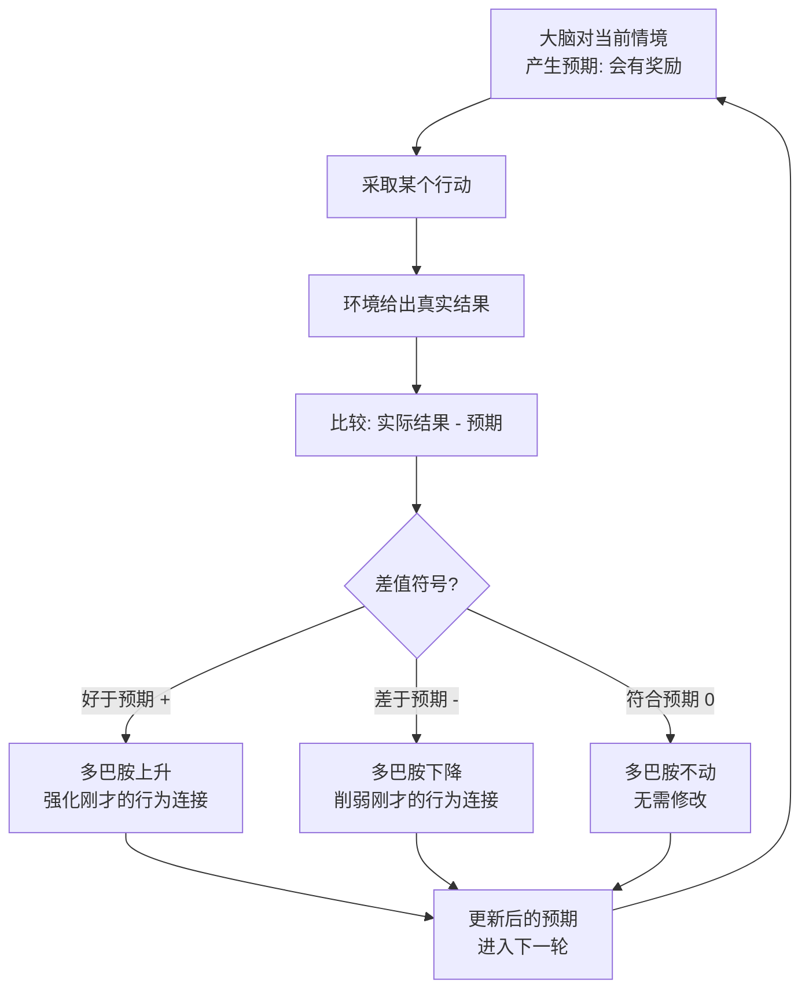

# 08｜多巴胺不是“快乐分子”，而是大脑的“预测误差”老师

> 我们到底是怎么通过"试错"学会一件事的？

---

## 一、先说结论

班尼特（以及他引用的主流神经科学）给出的答案是：**多巴胺不是"快乐"，而是"预测误差"。**

大脑在每一步都会先猜"接下来会怎样"。当结果**好于预期**，多巴胺神经元会短暂地猛放电，等于喊一句"记住刚才的动作"；当结果**差于预期**，多巴胺会掉到基线以下，等于说"这个别再做了"；当结果**完全如预期**，多巴胺几乎不动，等于说"没事，不用改"。

这套"比预期好就加强、比预期差就削弱"的机制，正是计算机科学里的**时序差分学习（TD learning）**。它不需要任何人告诉动物正确答案，只需要结果本身——这就是第二次突破的核心引擎：**无模型强化学习**。

而承载这套计算的中枢，是大脑深处的**基底神经节**。

---

## 二、我们先理解一个问题

先看一个几乎每个人都经历过的现象。

你点了一份外卖，App 说"预计 30 分钟送达"。第 25 分钟门铃响了——你什么感觉？没什么感觉，甚至有点理所当然。可如果 App 说"预计 45 分钟"，结果 25 分钟就到了，你会瞬间高兴一下，甚至想给它点个好评。

再看反面。同样说 30 分钟，结果 50 分钟还没到，你会烦躁、会想投诉、下次可能就不点这家了。

注意这里的关键：**外卖本身没变，变的只是它和你的预期之间的差距。**

现在把场景换成一只猴子、一条鱼、一只老鼠。它们没有语言，没有"好评差评"的概念，可它们同样能学会：往这个按钮按，会有食物；往那个按钮按，会被电一下。**它们是怎么知道"该记住什么"的？**

如果大脑需要一个"老师"来告诉自己"刚才做对了还是做错了"，这个老师是谁？它凭什么知道？

这个问题看起来简单，但它其实是第二次突破最核心的谜题：**大脑靠什么信号来更新行为？**

---

## 三、作者到底提出了什么观点？

班尼特梳理的核心观点是：**大脑用多巴胺编码"奖励预测误差"（Reward Prediction Error），而多巴胺的涨落就是行为学习的教学信号。**

我们对比一下两种理解：

| 维度 | 通俗旧理解："多巴胺 = 快乐分子" | 书中观点："多巴胺 = 预测误差" |
|---|---|---|
| 它代表什么 | 快乐、愉悦、满足 | 实际结果与预期的差 |
| 什么时候升高 | 得到好东西时 | 结果**好于**预期时 |
| 什么时候下降 | 得不到时 | 结果**差于**预期时 |
| 得到预期内的奖励 | 快乐 | 几乎无反应 |
| 功能 | 让人"感觉爽" | 告诉大脑"要改哪些连接" |
| 所属系统 | 情绪系统 | 学习系统（强化学习） |

这张表最关键的一行是"得到预期内的奖励：几乎无反应"。**如果多巴胺真是快乐分子，那么每次吃到爱吃的东西都该猛涨；但实验发现，一旦奖励被完全预测，多巴胺就安静了。** 它关心的从来不是奖励本身，而是"奖励和预期之间的落差"。

班尼特特别指出，这个信号在数学形式上和计算机科学家 Sutton 与 Barto 提出的 **TD 学习**几乎一模一样：

> 多巴胺反应 ≈ 实际得到的奖励 − 大脑预测的奖励

这不是隐喻，而是可测量的。**进化在五亿年前的鱼脑里，先把强化学习算法跑了起来；人类直到二十世纪后半叶，才在纸上把它写出来。**

---

## 四、把这个观点翻译成人话

把大脑想象成一个刚入职的实习生，而多巴胺是带他的导师。这位导师有个古怪的脾气：**他不表扬"做得好"，只表扬"比他自己预想的还好"。**

- 实习生第一次成功签下一单，导师眼睛一亮："不错！记住这个打法。"——这是**正预测误差**。
- 第二次，实习生又用同样方法签下一单。导师点点头，没什么反应——因为已经在他预期之内了。
- 第十次，同样打法，结果客户跑了。导师皱起眉头，多巴胺下探："嗯？这次不太对，想想哪儿变了。"——这是**负预测误差**。
- 如果他啥也没干，导师就一言不发。没变化，就不用学。

于是这个实习生慢慢明白：**能带来"意外之喜"的动作要加固，带来"意外之失落"的动作要削弱。** 他不需要有人提前告诉他标准答案，他只需要一个会对比"预期 vs 现实"的导师。

这就是强化学习的全部精髓。它不是"被教会的"，而是"被结果塑造的"。

这里还要澄清一个流传极广的误会：**多巴胺不是"快乐"，甚至不太管"当下爽不爽"。** 它更像一个拿计算器的人，一边盯着你脑子里的预期，一边盯着实际结果，然后迅速算出差值，把差值广播出去。至于"快不快乐"，那是另外一些系统和脑区的事。

---

## 五、为什么会这样？

我们把一次完整的试错学习拆成一条链。

理解这条链，要抓住三个前提。

**第一，必须有"预期"这个东西。** 这是第一次突破留下的遗产：联想学习让动物能把"提示音"和"食物"连起来，于是"提示音一响，食物要来了"就成了一种预期。没有预期，就没有"误差"可比。

**第二，多巴胺信号会随时间前移。** 一开始，动物在吃到食物的那一刻多巴胺飙升；学会之后，多巴胺的飙升会**提前到预测食物的那个提示音上**。这正是 TD 学习最漂亮的预言——**奖励的"教学作用"，会从结果本身转移到预测结果的那个线索上。**

**第三，学习必须是"无模型"的，也就是纯靠试错。** 它不需要动物理解"为什么"，只需要记住"这个状态—动作—结果"的组合统计上好不好。**代价是：它只在做过的事情上聪明。** 这一点我们留到 11 篇再展开。

---

## 六、举一个现实生活中的例子

**例子一：意外加薪为什么比年度调薪更让人上头。**

公司说好每年 4 月调薪，涨幅 5%。真到了那天，你顶多觉得"正常"。可如果某天老板突然叫你去，说"这个项目你做得太好了，现在就给你加 15%"——你会兴奋好几天，甚至到处讲。

用多巴胺的语言说：**年度调薪是"预期之内"，多巴胺不动；意外加薪是"好于预期"，多巴胺暴涨。** 而这次暴涨，会强烈加固你"多做那类项目"的行为倾向。这不是你"想通了"，是大脑在自动调参。

**例子二：游戏为什么要搞"随机爆装备"。**

固定掉落很快就会被玩家算清楚，变成打卡上班。**只要奖励变得可预测，多巴胺就不再兴奋，游戏就"不好玩"了。** 所以几乎所有抽卡、开箱机制，都刻意把奖励做成随机且低概率——**它利用的不是"奖励大小"，而是"预测误差"。** 一个永远差一点点、下一次可能暴富的机制，能让多巴胺系统长期保持在"有误差要处理"的状态。

**例子三：短视频的"不可预测奖励"。**

你永远不知道下一条是无聊还是爆笑。正是这种"下一条可能更好"的随机性，让预测误差持续产生，多巴胺持续"提醒你继续刷"。**让它上瘾的，恰恰是它没法被预测。**

---

## 七、回到书中重新理解

现在回到 Schultz 的实验，我们能读出更多东西了。

Wolfram Schultz 在 1990 年代的猴子实验中记录中脑多巴胺神经元。他发现：**当猴子还不会任务时，奖励出现的那一刻多巴胺放电；等它学会、奖励被提示音预测之后，多巴胺的放电转移到了提示音上，而真正拿到奖励时反而不动了。** 更关键的是，如果本该来的奖励没来，多巴胺会在"原定该发奖励的时刻"**跌到基线以下**。

这三点——"预测前对奖励反应""学成后移到提示上""缺失时下探"——**恰好就是 TD 学习算法要求教学信号具备的全部特征**。这是神经科学里少有的"算法预言被实验验证"的漂亮案例。

班尼特用这个发现支撑他的更大主张：**第二次突破的本质，是大脑获得了一个通用的、基于结果的行动优化器。** 它不关心你学的是抓鱼、走迷宫还是社交，它只关心"这个预期和结果的差是多少"。

还需要区分另一条线索。TD-Gammon 是 1992 年 Gerald Tesauro 写的西洋双陆棋程序，它给自己当对手、只用"赢/输"这个最终结果，通过自我对弈和 TD 学习，水平逼近世界顶尖人类，而且一开始几乎不带任何西洋双陆棋知识。**班尼特借它说明：第二次突破的算法，威力远大于"背套路"，只靠结果就能长出很强的策略。** 不过要提醒：这是 AI 的案例，不是生物实验，它证明的是算法能力，不是猴子大脑里真的在跑 TD。两者在形式上的对应，是作者的核心论证。

---

## 八、这个观点背后还有什么？

**第一，它把"情绪"重新定义成了"计算"。** 我们习惯把多巴胺、血清素当成"感觉"，但在这套框架里，它们更像信息信号——**情绪是身体在做预测与控制时留下的中间量**。这直接继承了第一次突破"效价"的思想。

**第二，它解释了"为什么预期如此重要"。** 同一件好事，期待越低越快乐；同一件坏事，期待越高越痛苦。**决定体验强度的不是事件本身，而是它和预期的差。** 这条规律能解释消费、职场、恋爱里的很多现象。

**第三，它给出了一条"如何养成好习惯"的操作原理。** 既然学习和误差挂钩，那么"把大目标拆成能不断带来小正误差的步骤"，比"一次性追求巨大结果"更符合大脑的机制。**这也解释了为什么长期主义很难：它把误差信号延迟了。**

**第四，它埋下了一个巨大的隐患。** 一套纯靠"预测误差"驱动的系统，天然会被"高随机性、高不可预测性"的刺激劫持。**赌场、短视频、抽卡游戏，本质上都在做同一件事：给多巴胺系统投喂误差。**

---

## 九、这个观点有问题吗？

有，而且这个领域最容易出现"把漂亮理论当全部"的毛病。

**第一，"多巴胺=预测误差"只是多巴胺的一部分功能。** 多巴胺还深度参与**运动控制**（帕金森病就是多巴胺能神经元退化导致运动障碍）、**动机与行动启动（wanting，即"想要"而非"喜欢"）**、以及部分**厌恶与警觉**反应。把多巴胺简化成一个教学信号，漏掉了它在别处的关键角色。**"多巴胺是快乐分子"是错的，"多巴胺只是预测误差"同样太窄。**

**第二，负预测误差到底由谁编码，仍有争论。** 有研究报告，奖励缺失时多巴胺的下探并不总是干净的镜像，有时由其他系统（如血清素、去甲肾上腺素）承担。**"一个分子管所有教学"的画面，可能过于整洁。**

**第三，TD 学习解释不了人类学习的全部。** 人会因为"理解了道理"而一次学会（洞察学习），会因为"别人说了"而改变行为（社会学习），会为了远期目标忍受长期无奖励。**这些远远超出"无模型试错"的范畴**，部分正是第三次、第五次突破的地盘。用 TD 解释一切学习，是典型的"手里有锤子，看什么都是钉子"。

**第四，"喜欢"与"想要"的分离是个真实难题。** 成瘾研究中，很多成瘾者对药物早已不再"快乐"，却依然强烈"想要"。这种分离说明：多巴胺更像是"去追求"的信号，而不完全是"学到的价值"。**把它叫做"预测误差老师"，抓住了重要一面，但不是全貌。**

**所以更准确的说法是**：多巴胺是大脑里最重要的"结果评估与行为调节"信号之一，"预测误差"是它最令人信服的一种功能描述；但它是多功能分子，不该被压缩成一句口号。

---

## 十、今天再看这个观点

以下部分是基于作者思想的现代延伸。

**延伸一：RLHF 就是现代版的多巴胺。** 训练大模型时，人类反馈给出的奖励信号，本质就是一个"外部多巴胺"：告诉模型"这个回答比预期好"或"差"。**模型并不知道标准答案，它只是被奖励信号反复调参。** 这与动物试错学习的结构惊人地相似。

**延伸二：推荐系统的"预测误差"生意。** 今天最赚钱的算法，很多都在做同一件事：用不可预测的内容投喂用户的多巴胺系统，换取停留时长。**当你理解了预测误差，你就理解了为什么"算法比你更懂怎么让你停不下来"。**

**延伸三：给 AI 装"内在奖励"的两难。** 如果给 AI 一个像多巴胺一样的内在奖励信号，它可以自主学习；但信号一旦被设计得不当，它可能会像成瘾者一样，把这个信号本身当成目标去优化。**这正是"奖励黑客"问题的生物学影子。**

---

## 十一、这一篇真正应该记住什么？

1. **多巴胺不是快乐，是预测误差。** 好于预期就升、差于预期就降、符合预期就不动。

2. **它是第二次突破的核心教学信号。** 不靠被告知答案，只靠结果与预期的差来修改行为。

3. **这套机制和计算机的 TD 学习高度对应。** Schultz 的猴子实验（奖励反应转移到提示音、奖励缺失时下探）是少见的"算法预言被验证"。

4. **预期决定体验。** 让好事惊喜的是低预期，让坏事难熬的是高预期——这是理解情绪与动机的一把钥匙。

5. **它既是学习引擎，也是被劫持的漏洞。** 赌场、抽卡、短视频都在给这套系统投喂"不可预测的奖励"。

---

## 十二、留一个问题

> 如果学习本质上依赖"预期与结果的落差"，
> 那么一个总能被精准满足的人，会不会反而越来越难学习、越来越难感到满足——
> 因为他的世界里，再也不存在"误差"了？

---

**下一篇**：多巴胺要算预测误差，前提是大脑能把混乱的感官输入压缩成少数有意义的"状态"。可世界如此复杂，大脑凭什么知道"此刻该把它看成什么"？

下一篇我们就来拆解：**大脑如何在无穷的感官信号里识别"模式"？**

---

*本系列基于 Max Bennett《A Brief History of Intelligence》整理，文中"班尼特认为/书中认为"均指作者观点；带"延伸"字样的段落为基于其思想的现代推演，不代表原作者。*
