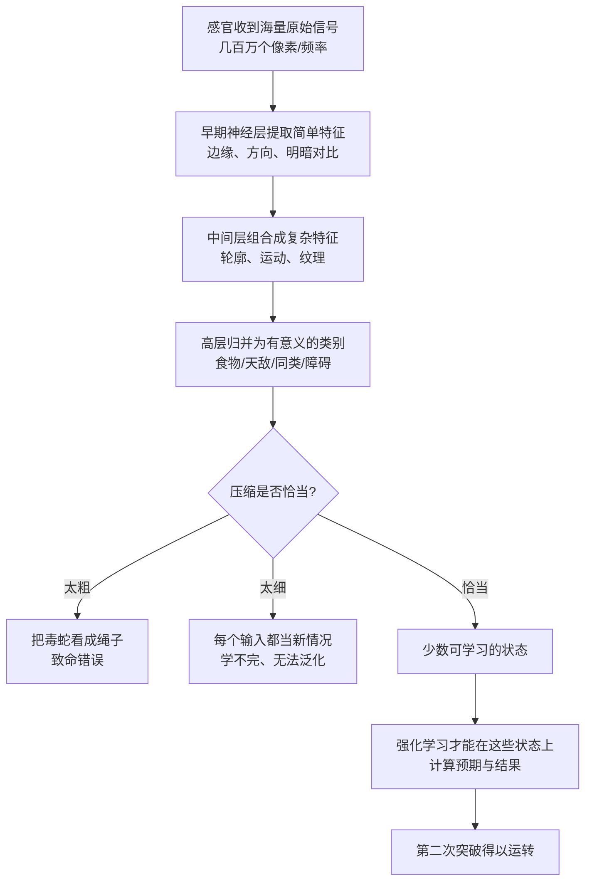

# 09｜面对混乱的世界，大脑如何识别“模式”？

> 世界这么复杂，大脑凭什么能"看懂"它？

---

## 一、先说结论

班尼特的答案是：**强化学习要能工作，前提是大脑先把无限复杂的感官输入，压缩成少数几个"有意义的状态"。**

一只鱼眼前的画面，是几百万个感光细胞各自收到的一个亮度值，每时每刻都在变。如果它要逐像素地学习"什么行为好"，那它一辈子也学不完。所以大脑必须做一件更聪明的事：**把像素级的输入，压缩成"这里有食物""那边有危险""这是同类"这样的少数状态。**

这就是模式识别问题。而它有一个天生的两难：**压缩得太狠，会丢掉关键区别（把毒蛇看成绳子）；压缩得太松，等于没压缩（信息量依旧爆炸）。** 大脑必须一边压，一边保留对生存重要的那些分界。

第二次突破的强化学习，正是踩在这套"状态压缩"能力上运转的。

---

## 二、我们先理解一个问题

先看一个你每天做几百次、却从没觉得难的动作：**人脸解锁手机。**

你抬起手机，光线可能在变、角度可能在变、你今天可能戴了口罩、可能刚剪了头发。对摄像头来说，每次输入的像素矩阵几乎都不一样。**可你从没怀疑过"这就是我"。**

再看一个反面：为什么同样这套技术，到了某些场景就翻车？比如双胞胎分不清，比如把海报上的脸识别成真人。

这里藏着模式识别最核心的难题：

> **世界从不会把同一个东西，用同一个样子呈现两次；但大脑却必须认出"它们其实是同一个东西"。**

这就是所谓的**知觉恒常性**：同一张脸，在明暗、角度、距离变化时，你仍觉得它是同一张脸；同一个杯子，无论从哪个角度看，你都知道它是一个杯子，而不是"一个椭圆的白色斑块"或"一个长方形的白色斑块"。

现在把问题切回鱼和老鼠。捕食者从水面上方俯冲下来，和从侧面游过来，在视网膜上是完全不同的光斑。**如果动物不能把这两种情况归为同一个"危险"，它就没法学会"遇到这种情况要躲"。**

所以问题是：**大脑到底做了什么，让世界从"无穷的信号"变成了"可数的状态"？**

---

## 三、作者到底提出了什么观点？

班尼特的观点可以概括成一句话：**智能的第二步，是把高维、连续、嘈杂的感官输入，映射成低维、离散、有生存意义的状态表征。**

我们用一个对比来理解"状态压缩"到底在干什么：

| 层面 | 原始感官输入 | 压缩后的"状态" |
|---|---|---|
| 形式 | 几百万个像素/频率/压力值 | 少数几个可命名的类别 |
| 数量级 | 近乎无限 | 可数、可穷举 |
| 变化性 | 每一刻都不同 | 相同意义的东西被归为一类 |
| 学习成本 | 每个输入都要单独学，学不完 | 可以跨情境泛化 |
| 例子 | "第 37281 号光信号" | "这是食物" |

班尼特强调，这背后是一个**权衡**：

- **分类（泛化）** 让你能把新情况归入旧经验——没见过的老虎也知道要怕。
- **区分（分辨）** 让你不被相似的表象骗到——蘑菇长得像能吃的，但有一种是剧毒的。

**太会分类，会犯致命错误；太会区分，就学不到任何通用规律。** 进化给动物找到的平衡点，是"对生存重要的区别必须保留，不重要的区别才敢抹掉"。

而在今天的 AI 里，这条问题一字不差地重现了：神经网络也是在一层一层地把原始输入，转成越来越抽象的特征。**区别只在于，大脑的特征是进化与经验一起塑造的，而机器的特征是从数据里学出来的。**

---

## 四、把这个观点翻译成人话

把大脑想象成一家物流公司的分拣中心。

每天送来几十万件包裹，每件都有独特的尺寸、重量、地址、外包装。如果分拣员对每一个包裹都单独处理，公司早就瘫痪了。

所以他们做的第一件事是**分类**：这是"本市件"，那是"跨省件"，另一个是"生鲜件"。**一旦贴上标签，原本无穷无尽的包裹，就变成了少数几个"状态"，后续流程可以统一处理。**

但分拣中心还必须有第二条规矩：**有些区别绝不能抹掉。** 生鲜件不能和普通件混在一起，易碎件必须单独标记。要是图省事把所有包裹都归成"普通件"，效率是高了，但用户会收到一箱烂掉的水果。

这就是模式识别的全部要义：**一边压缩，一边保住最重要的那些区别。**

而"哪些区别重要"，不是由世界决定的，是由"你必须活下来"这件事决定的。**对鱼来说，"水在震动"和"这里有食物"之间那条分界，值一条命。**

---

## 五、为什么会这样？

我们把"从像素到可学习的状态"这条链跑一遍。

这条链里藏着几个关键点。

**第一，特征提取是层层递进的。** 单个神经元不会"认出食物"，它顶多对某个方向的一条边反应强烈。**更高层的判断，是由更低层特征的组合拼出来的。** 这既是大脑的工作方式，也是卷积神经网络的底层逻辑。

**第二，必须解决"维度灾难"。** 如果状态数随维度指数爆炸——每多一个要考虑的变量，可能状态就翻一倍——那么再强的学习算法也会被淹死。**压缩状态，本质上是把指数级的世界，拽回到可处理的规模。**

**第三，"有意义"是相对于生存定义的。** 大脑不追求客观完整的表征，它只保留"够用"的那部分。**这既是聪明的省力策略，也是偏见与错觉的来源。**

---

## 六、举一个现实生活中的例子

**例子一：手机相册的自动分类。**

你拍了几年照片，相册能自动按"人物""风景""宠物"归类，甚至能认出同一个孩子从小到大的照片。它靠的不是记住每一张图，而是学会了"这些像素图案属于同一类"。**这跟鱼把"从上方来的阴影"和"从侧面来的阴影"都归为"危险"，是同一种能力。**

但你也一定遇到过它的翻车：把猫认成狗，把蛋糕认成白云。**这说明压缩是权衡——压得越狠，越省力，也越容易把不该混的混在一起。**

**例子二：语音助手听方言。**

训练时听的是标准普通话，一到用户带口音，识别率就掉。用户觉得"我说的明明很清楚"，但机器的状态空间里，"这个音的变体"根本没被当成同一个状态。**这不是它不聪明，是它的状态划分没覆盖到这种区别。** 而人类大脑，因为经年累月听过各种口音，很自然地学会了"这些不同发音其实是同一个词"。

---

## 七、回到书中重新理解

现在我们可以看清楚 09 在全书中扮演的角色了。

上一篇讲多巴胺怎么算预测误差，可如果连"我现在处于什么状态"都定义不了，预测误差根本无从谈起——**你没法预测一个你没能描述的东西。**

所以班尼特把模式识别放在第二次突破的内部，作为一种"使能条件"：

- 第一次突破给了动物"好坏"这个最粗的状态划分。
- 第二次突破要求更精细的状态：不只要知道"现在好不好"，还要知道"这是哪种处境、我上次在这种处境里做了什么、结果如何"。
- **于是大脑必须发展出一套把感官压缩成状态的能力，强化学习才有素材可用。**

班尼特引用 Hubel 与 Wiesel 的经典实验来支撑这一点。他们在 1959 年记录猫视觉皮层的单个神经元，发现很多神经元并不对"一个光点"反应，而是对**特定方向的线段**反应最强——你把一条光条以某个角度放在它面前，它疯狂放电；转个角度，它就没反应了。**这说明视觉系统不是照相机，它从第一站就在"提取特征"。**

这个发现的意义在于：**大脑在处理信息的最早阶段，就已经在做模式识别，而不是等"意识"来处理。** 状态压缩不是学习的副产品，而是学习能被发动的前提。

---

## 八、这个观点背后还有什么？

**第一，它把"感知"从"记录世界"改写成了"为行动服务"。** 传统观念里，眼睛像摄像机、耳朵像录音机，大脑负责"如实呈现"。但模式识别的视角说：**感知是一套为了活命而做的有损压缩。** 你看到的从来不是世界的全貌，而是"对你够用"的版本。

**第二，它解释了为什么"泛化"是智能的核心指标。** 一个系统能不能把学到的经验用到新情境，取决于它的状态划分是否抓到了本质规律。**只会背答案的系统，状态划分太细；乱套规律的系统，划分太粗。**

**第三，它埋下了"偏见"的根。** 既然压缩标准由生存压力塑造，那么所有认知都自带立场。**我们不是先看到世界再判断重要性，而是先有重要性、才决定看到什么。** 这也是许多认知偏误的进化来源。

**第四，它给"概念的起源"提供了一种唯物主义解释。** 抽象概念（食物、危险、朋友）不是先天的真理，而是被反复的生存经验压缩出来的稳定状态。**概念是用出来的，不是想出来的。**

---

## 九、这个观点有问题吗？

有，而且"表征到底怎么在大脑里编码"目前仍是开放问题。

**第一，大脑和神经网络的特征学习，机制并不相同。** 神经网络靠反向传播，把误差一层层往回传；而现在学界并不认为大脑有严格意义上的反向传播。**大脑更可能依赖局部学习规则、预测编码、甚至某种近似机制。** 说两者"在做同一件事"，是功能层面上的类比，不是机制上的等同。

**第二，"先天结构 vs 白板"之争远未结束。** 一个刚出生的婴儿，其实已经对"脸""数量""因果"有某些偏向，并不完全是靠后天压缩出来的。**先天骨架与后天经验各占多少，仍是认知科学的核心争论之一。** 班尼特的叙述偏重"经验塑造"，可能低估了先天结构。

**第三，神经编码方式本身就有争议。** 大脑的一个"概念"，究竟对应哪些神经元、是分布式还是稀疏编码、是速率编码还是时序编码——**没有定论。** 我们容易误以为"大脑里有一个'食物神经元'"，但真实情况很可能是一整片神经活动的模式。**把"状态"讲成一个清晰的类别，本身是一种简化。**

**第四，"维度灾难"在生物身上未必像在算法里那么严重。** 动物靠少量经验就能泛化，效率远超今天的很多模型。**这说明大脑的压缩策略里，一定有我们还不太理解的先验与结构。**

**所以更准确的说法是**：模式识别（把混乱输入压成有意义状态）确实是智能的必要环节；但"大脑如何做到这一点"仍是未解之谜，作者给的是一个有解释力的框架，而非已证实的机制。

---

## 十、今天再看这个观点

以下部分是基于作者思想的现代延伸。

**延伸一：表征学习就是今天 AI 的主战场。** 从词向量到图像特征，从自监督预训练到对比学习，**现代 AI 的大部分进展，本质都是在解决"如何学到更好的状态表征"**。这正是 09 篇的问题，只是换了一副技术语言。好的表征让下游任务变简单，差的表征让再强的算法也白搭。

**延伸二：为什么"数据分布之外"会崩。** 如果训练时状态划分没覆盖某种情况，模型遇到它就会错得离谱。**这跟鱼没见过某种天敌就不知道要逃，是同一类失败。** 泛化能力，取决于表征是否抓住了跨情境不变的规律。

**延伸三：人类的"少样本学习"优势，可能来自更好的先验。** 小孩看两三只猫就认识猫，模型却要几十万张。差别很可能在于：人脑带着进化给的结构先验，而不是从零开始压缩。**这提示 AI 下一步的突破口，可能不在更多数据，而在更好的"归纳偏置"。**

---

## 十一、这一篇真正应该记住什么？

1. **强化学习的前提是"状态压缩"。** 大脑必须把无限感官输入，压成少数有意义的可学习状态。

2. **模式识别是一场权衡。** 压缩太狠会犯致命错误，压缩太松等于没压缩，标准由"是否有利于生存"决定。

3. **特征提取是层层递进的。** Hubel 与 Wiesel 的猫视觉皮层实验证明，大脑从最早阶段就在认方向、认边缘，而不是被动记录。

4. **泛化的能力，取决于状态划分的质量。** 只背题的系统划分太细，乱套规律的系统划分太粗，抓住本质才叫会学。

5. **这也是 AI 的主战场。** 表征学习、分布外泛化、少样本学习，本质上都是 09 篇的问题换了技术外壳。

---

## 十二、留一个问题

> 如果大脑看到的世界，从来都是"为生存压缩过的版本"，
> 那么我们所认为的"客观事实"，
> 到底有多少是世界本来的样子，又有多少只是我们为了活下来而保留的那几条分界？

---

**下一篇**：压缩好状态之后，还有一个更麻烦的问题：如果某个行为已经稳定带来奖励，动物为什么还要冒险去试新的？答案关系到一条贯穿智能史的张力——探索与利用。

下一篇我们就来拆解：**生命为什么天生就"好奇"？**

---

*本系列基于 Max Bennett《A Brief History of Intelligence》整理，文中"班尼特认为/书中认为"均指作者观点；带"延伸"字样的段落为基于其思想的现代推演，不代表原作者。*
