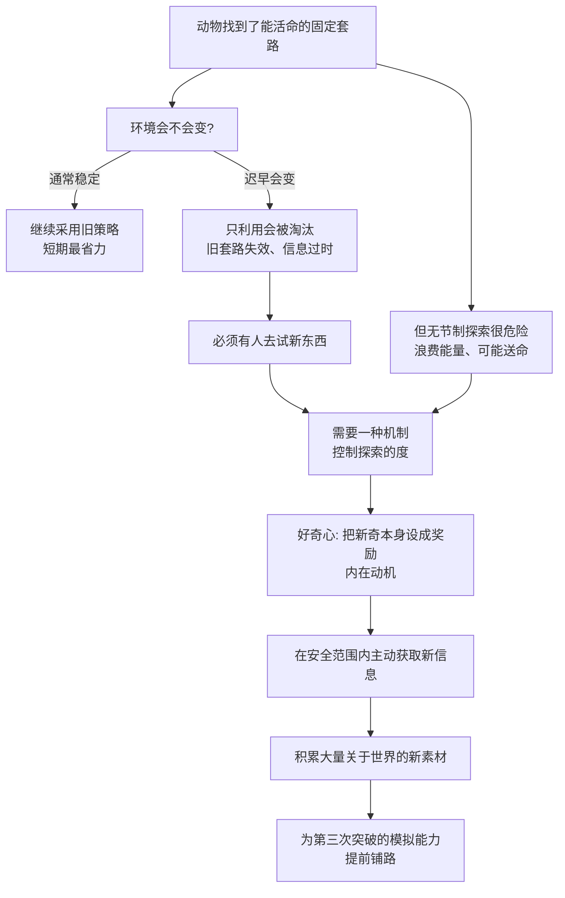

# 10｜为什么生命会“好奇”？——探索与利用的永恒两难

> 既然已经找到能活命的方法，为什么动物还要冒险探索？

---

## 一、先说结论

班尼特的答案是：**好奇心不是"闲得没事干"，而是第二次突破给动物装的一套生存保险。**

任何一个靠经验活着的动物，都会滑向一个致命的陷阱：**只做已经证明有效的事。** 但环境会变——老猎场会枯竭，旧路线会埋伏，熟悉的食物会消失。如果动物从不尝试新东西，它会在环境变化时被整体淘汰。

可反过来，**无节制地探索同样会死**：把能量浪费在没用的尝试上，或者一头撞进捕食者嘴里。

所以进化给出的解法是：**让"新奇"本身变成一种奖励。** 大脑把"遇到没见过的东西"直接标成"值得去看看"，从而在安全范围内主动获取新信息。这既让动物能应对变化，也为后来的第三次突破（模拟）提前攒下了素材。

---

## 二、我们先理解一个问题

先看一个有点反直觉的现象。

假设一只老鼠发现，某条通道尽头总有食物，稳定、安全、每次都有。按最简单的"趋利"逻辑，它应该从此只走这一条路，对吧？

可实验里，老鼠往往会**在吃饱之后继续东摸西看**。它会去嗅没走过的岔路，会去扒拉没碰过的东西，会为了"搞清楚那是什么"而绕路。**它并不是饿了才动，也不是为了眼下的奖励。**

同样的事在人类身上更明显。你明明有家最好吃的面馆，可路过一家新开的店，还是会想："要不试试？"你明明有固定的上班路线，某天却鬼使神差绕了另一条路——不是因为它更快，只是因为它"没走过"。

现在我们有了一只足够聪明的动物，它已经能通过试错学习找到生存之道。**那么问题来了：为什么它不满足于现状？为什么"没见过"这件事，本身就足以驱动一个生命去冒险？**

这个问题的正式名字，叫**探索—利用两难（exploration-exploitation dilemma）**。

---

## 三、作者到底提出了什么观点？

班尼特的观点是：**第二次突破不仅给了动物"从结果学习"的能力，还给了它一套"主动去找新结果"的动机机制，也就是好奇心。**

我们把两难的两端摊开看：

| 策略 | 做法 | 好处 | 危险 |
|---|---|---|---|
| 纯利用（Exploit） | 永远选已知最优解 | 短期收益稳定、省能量 | 环境一变就崩，信息停滞 |
| 纯探索（Explore） | 总在尝试新选项 | 能发现更好机会、更新信息 | 浪费能量、可能送命 |
| 恰当平衡 | 大部分时候利用，小部分时候探索 | 既稳又活 | 需要机制来调节 |

那这个"平衡"由什么来调？班尼特的答案是：**用内在奖励。** 也就是说，"获得新信息"这件事本身，就被大脑标成了"好"。这样动物哪怕没有吃到食物、没有躲开危险，仅仅因为"看到了新东西"，也会得到一点点正向反馈。

这在计算机科学里叫**内在动机（intrinsic motivation）**：奖励不只来自外部环境，也可以来自"探索本身"。一个系统如果只有外部奖励，它只会在已知范围内打转；只有当"减少未知"本身能带来奖励，它才会主动拓展自己的边界。

**而"拓展边界"这件事，恰好就是第三次突破的燃料。** 因为要模拟未来，你的世界模型里必须先有很多东西可模拟。

---

## 四、把这个观点翻译成人话

把这只动物想象成一个刚接手老店的年轻老板。

老店的招牌菜很稳，每天都有回头客。最省事的做法是：一辈子只卖这道菜，绝不动摇。这就是"利用"。

但风险也明摆着：**隔壁开了家新店怎么办？客人开始嫌腻怎么办？食材涨价了怎么办？** 如果你从来没试过别的菜，你连"该换成什么"都不知道。

于是你开始做小实验：每周抽一天，加一道新品试试水。卖得好就留下，卖不动就撤。这就是"探索"。

现在关键来了：**你愿意做这些实验的动力是什么？** 如果每次试新品都要等到"卖出爆款"才有奖励，你大概没什么动力；但如果"研究出一道新菜"本身就让厨师们兴奋、就让你觉得有意思，你就会持续去做。

**好奇心，就是这家店给"试新菜"发的奖金。** 它保证店里不会因为守着招牌菜而僵死，也不会因为天天瞎折腾而亏本。

---

## 五、为什么会这样？

我们把"探索—利用"的完整逻辑跑一遍。

这条链里有两个关键前提。

**第一，环境是"非平稳"的。** 如果世界永远不变，最优策略就是"找到一次正确答案，然后永远照做"，根本不需要好奇心。**正因为世界会变，探索才有正收益。** 这一点和 08 篇的预测误差有相通之处：都要求系统不能假设"世界静止"。

**第二，探索必须被"定价"。** 好奇心不是无条件开着的，它会随情境变化：**饥饿、恐惧、安全程度都会调节探索的强度。** 一只饿到极点的动物不会去看风景；一只感到危险逼近平息的动物会缩起来。**调节本身，就是进化给的"风险管理"。**

还有一个常被忽略的点：**探索的真正收益是"信息"，而不是"奖励"。** 哪怕你没能找到食物，光是"知道那条路是死的"，也是有价值的——它更新了你的模型。这是一笔短期的亏、长期的赚。

---

## 六、举一个现实生活中的例子

**例子一：逛超市时试新品。**

你的购物清单几乎固定，买了几年的酱油从没换过。可每次路过新品货架，你还是会拿起那瓶没见过的酱看看，甚至买一瓶试试。**你不是缺酱油，你是在"更新地图"**——万一它更好呢？万一老牌子哪天停产呢？这份"手会不由自主伸向新品"的冲动，就是好奇心在替你付探索成本。

**例子二：游戏里开地图。**

几乎所有开放世界游戏都设计成：地图上有一片黑雾，你不知道那里有什么。**驱使人去开图的，往往不是任务奖励，而是"那片黑雾让我难受"。** 游戏设计师非常清楚：只要把未知画出来，玩家自己就会去探索。这就是把"内在奖励"做进了产品机制里。

**例子三：职场里的"试试新方法"。**

一个团队用老流程做了三年，虽然能用，但越来越吃力。真正推动改进的人，常常不是被 KPI 逼的，而是"总觉得这么做不对劲""想看看别人怎么做的"。**如果组织只奖励确定产出、打压试错，好奇心就会枯竭，团队会失去应对变化的能力。** 这是"只利用"在企业层面的典型死法。

---

## 七、回到书中重新理解

现在回到班尼特的框架，我们能看清好奇心的位置。

它不是第三次突破（模拟）的产物，而是**第二次突破的组成部分**。为什么？

因为好奇心本质上是"用内在奖励去驱动行为"——它依然在强化学习的框架内运转，只不过奖励的来源从外部（食物、安全）扩展到了内部（新信息）。**它让第二次突破不再只是"对已经遇到的事变聪明"，而开始具备"主动去寻找没遇到的事"的倾向。**

班尼特引用心理学家 Daniel Berlyne 的研究来说明这一点。Berlyne 在 1960 年代的著作《冲突、唤醒与好奇心》中提出：**当外界刺激带有"新异、复杂、意外、不确定"这些属性时，会唤起一种"知觉好奇心"，驱动生物去探索。** 也就是说，好奇不是人类的专利，而是一种有生理基础的、可被实验测量的驱动力。婴儿反复扔东西、啃不该啃的物体、盯着旋转的玩具看，都是它在做的事：**用最小的代价，采集最大的信息。**

这里还有一个精妙的过渡意义。**好奇心让动物积累了大量"没直接用到"的经验。** 这些经验平时看不出价值，可一旦大脑进化出了"在脑内预演"的能力（第三次突破），它们立刻变成了想象力的原材料。**没有丰富的好奇积累，模拟就是无米之炊。**

---

## 八、这个观点背后还有什么？

**第一，它把"学习"从被动变成了主动。** 传统的强化学习图像是：环境给奖励，动物被动调整。好奇心加进来之后，动物开始**主动塑造自己会遇到什么**。这是一个重要的层级跃迁。

**第二，它解释了"为什么无聊会痛苦"。** 如果新奇本身是奖励，那么"没有新信息"就会表现为一种负向状态。**无聊不是矫情，而是"信息饥饿"的信号**，它逼着你去探索。

**第三，它把一个哲学问题变成了工程问题。** "生命为什么会好奇"听起来很人文，但在班尼特手里，它被翻译成了可实现的机制：如何设计一个内在奖励，让智能体自发拓展边界。**这是生物学与 AI 之间最直接的桥梁之一。**

**第四，它揭示了好奇与创造的关系。** 所有创造，本质上都是"在安全范围内做一次有控制的探索"。**敢于尝试的前提，是有一套机制允许你承受试错的成本。**

---

## 九、这个观点有问题吗？

有，而且"好奇心"这个词本身就容易把问题说糊。

**第一，好奇与冒险的边界并不清楚。** 同样是"尝试新东西"，有的是低风险的探索（尝个新口味），有的是致命的冲动（跳下悬崖）。**把这一切都叫"好奇心"，会掩盖它们背后可能完全不同的神经机制。** 好奇不等于莽撞，但两者的分界在哪，书中并未严格界定。

**第二，"好奇心是否纯内在"存在争论。** 有观点认为，很多所谓的内在动机，其实是**外在线索经过条件化后内化的结果**——比如某个新环境曾经和食物一起出现过。**把它视为一种独立的、天生的驱动力，可能高估了它的纯洁性。** 也有研究强调好奇与恐惧、焦虑共享同一套神经回路。

**第三，"内部奖励"在工程上极难调好（延伸争议）。** 在 AI 里给智能体装好奇心，最著名的问题是"**嘈杂电视问题**"：如果奖励是"看到新画面"，智能体可能会盯着一台雪花屏电视看一整天，因为每一帧都是新奇的。**这说明"新奇"本身不是好目标，必须区分"有用的新信息"和"无意义的新噪声"。** 生物似乎天然能区分这两者，机器还不能。

**第四，"探索—利用"的二分可能过于干净。** 真实行为往往同时包含两者：你在用老路线时也在观察路况，你在探索新店时也带着旧经验。**把它讲成两个可切换的开关，是为了好理解而做的简化。**

**所以更准确的说法是**：好奇心确实是一套有生理基础、能驱动动物主动获取信息的机制；但它的边界、来源和神经基础仍有大量争议，"新奇即奖励"只是一个抓得住重点的近似。

---

## 十、今天再看这个观点

以下部分是基于作者思想的现代延伸。

**延伸一：探索策略是强化学习的核心难题之一。** 经典算法里，智能体需要决定"多大比例的时间去试新动作"，试太少学不到更好策略，试太多学不收敛。**这正是动物面对的同一个两难，只是换成了数学形式。**

**延伸二：推荐系统的"探索—利用"每天在跑。** 平台要在"推你爱看的（利用）"和"试探你可能喜欢的新内容（探索）"之间取舍。**只利用会让你厌烦，只探索会让你流失。** 你刷到的每一条内容背后，都有一次这样的计算。

**延伸三：好奇心可能是通用智能的必要条件。** 一个不会主动提问、只等着被喂数据的系统，很难在开放世界里生存。**真正通用的智能，大概必须自己决定"下一步该去搞清楚什么"。** 这也是今天 AI 研究最热的方向之一：让智能体自己产生目标。

---

## 十一、这一篇真正应该记住什么？

1. **探索—利用两难是智能的永恒张力。** 只利用会被变化淘汰，只探索会浪费能量甚至送命。

2. **好奇心是进化的解。** 它把"新奇"本身设成奖励，让动物在安全范围内主动获取信息。

3. **好奇心的真正收益是"信息"，不是"奖励"。** 哪怕没找到食物，知道"此路不通"也是有价值的——短期亏、长期赚。

4. **它为第三次突破攒素材。** 没直接用到的好奇经验，日后会成为"在脑内预演"的原材料。

5. **好奇与冒险只隔一层纸。** "新奇即奖励"是抓重点的近似，真实机制复杂得多——包括 AI 里的"嘈杂电视"难题。

---

## 十二、留一个问题

> 如果好奇心是"为了应对环境变化"而被进化出来的，
> 那么在一个被算法精心设计得"永远有下一个"的信息环境里，
> 我们的好奇心，是在被满足，还是在被收割？

---

**下一篇**：好奇心让鱼积累了经验，多巴胺让鱼学会了行动，模式识别让鱼看懂了世界。可鱼到底能走多远？它有一个致命的极限——它只能在"做过的事情"上变聪明。

下一篇我们就来拆解：**第二个突破的极限在哪里？鱼脑里已经出现"世界模型"了吗？**

---

*本系列基于 Max Bennett《A Brief History of Intelligence》整理，文中"班尼特认为/书中认为"均指作者观点；带"延伸"字样的段落为基于其思想的现代推演，不代表原作者。*
