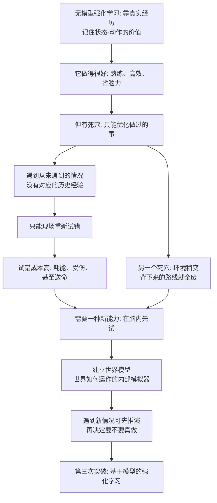

# 11｜第二个突破的极限：鱼脑里已经出现“世界模型”了吗？

> 无模型强化学习到底卡在哪里？

---

## 一、先说结论

班尼特的答案是：**第二次突破给动物的，是一套"无模型"的强化学习——它非常有用，但有一个死穴：只在"做过的事情"上变聪明。**

一条鱼可以学会"在这个水草边躲过天敌""听到这个震动就去那个角落找食物"。这些全靠一次次真实经历堆出来的统计规律。可一旦遇到**从没做过的情况**，它就没有办法了——因为它的学习里，从来没有"如果……会怎样"这种推演。

要应付从未遇到的情况，动物需要一个内部的"**世界模型**"：一套关于"世界怎么运作"的模拟器，能在脑内先跑一遍。**鱼已经出现了这个模型的雏形**（比如认路、走捷径），但真正意义上的世界模型，要等到哺乳动物的第三次突破。

所以 11 篇是第二次突破的收尾，也是第三次突破的入口。

---

## 二、我们先理解一个问题

先看一个很朴素的对比。

**鱼 A** 走迷宫学会了"从入口一直往右拐三次就到食物"。它靠的是反复试错，把一条具体路线背了下来。现在你把入口换到对面，或者把迷宫旋转一下——**它很可能整条路线全废了。**

**老鼠 B** 走同一个迷宫，学会的却像是"食物在房间的某个方位"。你把入口换掉，它还能大致朝着食物所在的方向走。**它学到的不是一条路线，而是一张地图。**

这个差别，就是本篇的核心：

> **无模型学习记住的是"在这种情况下我该做什么"；有模型学习记住的是"这个世界是怎么运作的"。**

现在我们能问出真正的问题了：**第二次突破的算法这么强，为什么还需要"模型"？它的极限究竟在哪？鱼有没有跨过这条线？**

---

## 三、作者到底提出了什么观点？

班尼特的观点可以概括成一句话：**第二次突破是无模型的强化学习；它能优化"做过的行动"，但无法应付"没做过的情况"，而后者要求一个内部世界模型。**

我们把两种学习方式摆在一起看：

| 维度 | 无模型强化学习（第二次突破） | 有模型强化学习（第三次突破） |
|---|---|---|
| 学的是什么 | 状态—动作的价值：这么做好不好 | 世界如何运作：做了会怎样 |
| 靠什么学 | 必须真的做过、真实经历 | 可以在脑内模拟、无需真实经历 |
| 遇到新情况 | 束手无策，只能重新试错 | 用模型推演，可能直接想出办法 |
| 成本 | 高，试错可能送命 | 低，在脑内试错 |
| 典型能力 | 习惯、条件反射、熟练技能 | 规划、走捷径、延迟满足 |
| 生物代表 | 鱼等早期脊椎动物 | 哺乳动物（尤其有发达新皮质） |

班尼特特别强调：**这两者不是"水平高低"，而是"性质不同"。** 无模型学习是"记住经验"，有模型学习是"理解规律"。前者像背题库，后者像懂原理。

而"鱼有没有世界模型"，其实是在问：**脊椎动物的神经系统，能走到哪一步？**

---

## 四、把这个观点翻译成人话

把这两套系统想象成两个司机。

**司机甲** 只记路线。他每天开同一条路，闭着眼都知道哪里该拐。可他一旦被扔到一个陌生城市，就完全抓瞎——他脑子里没有"地图"这个概念，只有一串背下来的动作：第三个红绿灯左转、看到便利店右拐。

**司机乙** 心里有一张地图。他知道"这条街往北，河在南边，目标在河的东侧"。所以哪怕路封了，他也能凭方位感绕过去。**他不靠背，靠理解空间关系。**

**好奇心（上一篇）负责让司机愿意下车看看新路；世界模型（这一篇）负责让他看完之后，能在脑子里把整个城市拼出来。**

而一条鱼，大致介于两者之间：它能认路、能用地标、甚至能抄近道，**说明脑子里不是纯粹的动作串，已经有一点空间结构了**。但它的结构还非常粗糙，经不起大的变化。**这就是"雏形"两个字的含义。**

---

## 五、为什么会这样？

我们把"无模型学习的极限"这条链完整推一遍。

这条链揭示了三个层层递进的困境。

**第一，经验是"局部"的。** 你经历过的状态，只是整个世界状态空间里极小的一块。**无模型学习只能覆盖你踩过的那些点，没踩过的点永远是空白。**

**第二，"背路线"不具迁移性。** 无模型学习把"世界的结构"和"具体的动作"绑死在了一起。环境一变，绑定的动作就失效了。**要迁移，就必须把"世界的结构"单独抽出来。**

**第三，试错有不可逆的代价。** 在真实世界里试错，错一次可能就死了。**所以"提前在脑内试错"是一种巨大的成本节约——而这正是世界模型的全部意义。**

---

## 六、举一个现实生活中的例子

**例子一：导航 App 有地图，你对某条老路只有肌肉记忆。**

你每天上下班开车，走久了不用导航也能到——但这是**无模型**：你背的是一条路，不是空间关系。哪天主干道封了，你瞬间不会走了。

而导航 App 里存的是**世界模型**：路网、连通关系、实时路况。它能算出"这条路封了，从旁边绕过去"。**同样是开车，一个是经验，一个是模型。** 鱼更像是"记忆老路的司机"，哺乳动物才开始拥有"内置导航"。

**例子二：背题型 vs 理解原理。**

学生 A 把 200 道题的解法都背下来。考试遇到原题秒杀，遇到变形题就崩——**这是无模型学习：记住了"这种题这么做"。**

学生 B 可能只做了 50 道题，但他理解了背后的原理。遇到从没见过的题，他也能一步步推出来——**这是有模型学习：他掌握了"这类问题是怎么运作的"。**

**第二次突破擅长培养 A，第三次突破才能培养 B。** 而真正的高手，往往是两者兼备：既有大量的解题经验，又能举一反三。

---

## 七、回到书中重新理解

现在回到班尼特的框架，我们能看到 07 到 11 这五篇构成了一次完整的能力升级，也看到了它撞上的天花板。

- 07 篇：军备竞赛逼出了第二次突破的需求。
- 08 篇：多巴胺/预测误差提供了学习信号。
- 09 篇：模式识别让感官输入变成可学习的状态。
- 10 篇：好奇心驱动动物主动探索、积累素材。
- 11 篇：可这套系统**只能在已经历过的经验范围内变聪明**。

于是就有了向前突破的必要。**班尼特认为，第三次突破的关键，是大脑获得了一个"生成世界模型"的新结构，主要建立在哺乳动物的新皮质与海马体上。** 这部分内容会在 12 到 16 篇详细展开，这里只先立一个里程碑。

而"鱼有没有世界模型"这个问题，班尼特给出的历史证据来自一个经典实验：**Tolman 在 1948 年发表的"认知地图"研究。**

简单说，Tolman 让老鼠走迷宫，发现了一件当时非常反常的事：**有些老鼠在没有奖励的阶段，看起来什么也没学会（错误率不下降），可一旦开始给奖励，它们的表现会"突然"变好。** Tolman 把这种现象叫**潜伏学习**——说明老鼠在没奖励时也在默默建立一张"地图",只是没有动机表现出来而已。

更漂亮的是"走捷径"实验：老鼠学会从一个复杂路线到食物后，Tolman 把它放到一条新的、放射状的通道上，结果老鼠倾向于选择**直接指向食物所在方位**的那条路，而不是回到原来训练过的路径。**这说明它学的不是动作序列，而是空间关系——一张地图。** 这是"动物拥有世界模型"最早、最有名的证据之一。

不过请注意一个重要区分：**Tolman 的老鼠是哺乳动物，不是鱼。** 班尼特用它说明的是"世界模型确实存在于动物脑中"，而"鱼只有雏形"这个判断，则来自鱼类空间学习研究相对受限、迁移能力较弱的一般性观察——**这部分证据比 Tolman 的实验要弱得多，也更受争议。**

---

## 八、这个观点背后还有什么？

**第一，它把"聪明"分成了两种质。** 一种是把经验用到极致，一种是用模型应对未知。**我们平时说的"聪明"，往往混指这两者**，但它们背后的机制很不一样。

**第二，它解释了"熟练"的代价。** 越熟练、越自动化，就越难被改变——因为无模型学习把一套动作焊死了。**这既是效率的来源，也是僵化的来源。** 老司机难学新规则、老专家难接受新范式，都有这层道理。

**第三，它给"想象"找到了功能定位。** 想象不是浪漫的副产品，而是**低成本的试错**。世界模型的进化意义，就是让你不必用命去换经验。

**第四，它暗示了一条通往规划与延迟满足的路。** 只有当你有了世界模型，才能评估"现在忍一忍，未来会更好"。**没有模型，就只能被当下牵着走。**

---

## 九、这个观点有问题吗？

有，而且这几年的新研究正在不断冲击"鱼是没有模型的低级动物"这个成见。

**第一，鱼类的智能被长期低估。** 近二三十年大量研究显示，鱼能进行空间学习、能利用地标、能在复杂环境中记住位置、甚至有研究者报告某些鱼能使用工具、识别同类个体。**"鱼只有雏形、没有世界模型"这个论断，正面临越来越多反例。** 它很可能不是事实，而是"我们过去没认真研究鱼"留下的偏见。

**第二，"世界模型"的定义太宽泛了。** 如果"能预测未来状态"就算世界模型，那么很多简单神经系统甚至一些无脊椎动物都符合。**如果要求"可显式推演、能灵活迁移"，那标准又变得很高。** 这个概念在不同研究者手里指的不是同一件事，用它做分界线，容易含糊。

**第三，无模型/有模型的二分过于干净。** 现代强化学习发现，两者常常混合：很多被归为"无模型"的行为，背后可能偷偷调用了模型；而"有模型"的规划，也大量依赖无模型的价值估计。**大脑很可能不是两套独立系统，而是一套连续谱。** 把鱼划到线的一边、哺乳动物划到另一边，是一种教学上的简化。

**第四，"物种高低"的叙事有目的论风险。** 说"鱼还不够、哺乳动物才到了下一步"，容易暗示进化在往更高级走。**但鱼活得好好的，它的神经系统对它的生态位来说完全够用。** 不是鱼"没进化出来",而是它"不需要"。

**所以更准确的说法是**：无模型强化学习确有"只在经验内聪明"的局限，世界模型确实是一次重要的能力跃迁；但用"鱼有没有世界模型"来划界，既低估了鱼，也把复杂问题压成了一条过于干净的线。

---

## 十、今天再看这个观点

以下部分是基于作者思想的现代延伸。

**延伸一：模型基强化学习是今天 AI 的热点。** 让智能体先学一个"世界模型"，再在模型里规划，能大幅减少真实环境中的试错成本。**这正是 11 篇问题的现代版本：如何让机器"想清楚再做"。**

**延伸二：视频生成模型的哲学意味。** 一些能预测视频下一帧的模型，被认为在无意中习得了一点"世界如何演变"的内部表征。**但要注意：能预测像素，不等于理解因果。** 这也是"世界模型"定义之争在 AI 里的翻版。

**延伸三：为什么机器人仍难落地。** 现实世界的试错代价极高，而机器的"世界模型"又常常只覆盖训练过的窄领域。**这正是第三次突破尚未被 AI 真正攻克的证据**，也是后续几篇会反复回到的主题。

---

## 十一、这一篇真正应该记住什么？

1. **第二次突破是无模型强化学习。** 它靠真实经历优化"做过的行动"，高效但只在经验范围内聪明。

2. **它的死穴是"从未遇到的情况"。** 没有历史经验可依，只能现场重新试错，而代价可能是命。

3. **世界模型是解法：在脑内先试。** 有模型的强化学习把"世界如何运作"抽出来单独学习，从而能规划、迁移、走捷径。

4. **Tolman 的老鼠实验是里程碑。** 潜伏学习与走捷径表明，动物学的可能是空间地图，而不是动作序列——但这是哺乳动物，不是鱼。

5. **鱼未必真的"不行"。** 鱼类智能长期被低估，"世界模型"定义宽泛、二分可能过于干净，这条界线要打问号。

---

## 十二、留一个问题

> 如果真正的分水岭不是"有没有脑"，而是"脑里有没有一张可以推演未来的地图"，
> 那么今天能画出惊人图像、却仍常常不懂因果的 AI，
> 它手里的到底是地图，还是一张画得极其逼真的旧路线图？

---

**下一篇**：第二次突破到此为止——鱼能学、能记、能好奇，但只能在经历过的世界里变聪明。要跨过这一步，需要一种全新的结构，而它的诞生地点出人意料：不是阳光下的海洋，而是恐龙脚下的黑夜。

下一篇我们进入第三次突破：**恐龙统治下的"黑暗时代"，哺乳动物在偷偷做什么？**

---

*本系列基于 Max Bennett《A Brief History of Intelligence》整理，文中"班尼特认为/书中认为"均指作者观点；带"延伸"字样的段落为基于其思想的现代推演，不代表原作者。*
