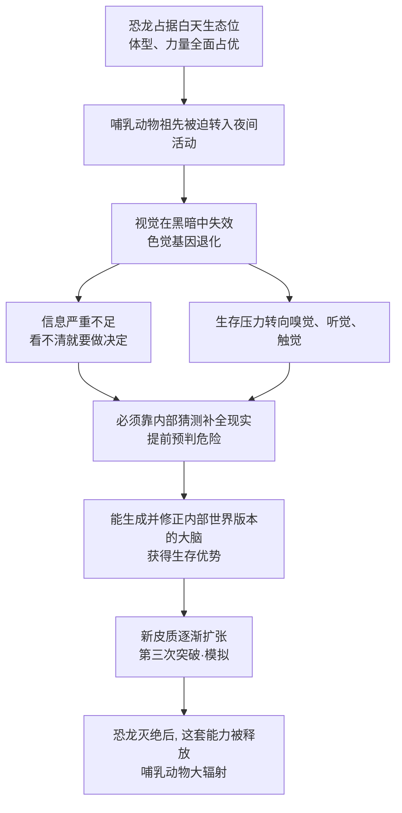

# 12｜恐龙统治下的“黑暗时代”，哺乳动物在偷偷做什么？

> 为什么"想象"这种能力诞生在弱小的哺乳动物身上？

---

## 一、先说结论

班尼特给出的答案是：**第三次突破不是强者发明的，而是弱者被逼出来的。**

在恐龙统治的中生代，哺乳动物的祖先体型小、昼伏夜出、以昆虫为食，白天根本不敢露面。它们被挤进了一个"黑暗的生态位"：看不清、跑不快、打不过，唯一的活路就是**在危险发生之前就预判到危险**。

正是这段长达一亿多年的夜间生涯，逼出了更强的嗅觉、听觉、触觉，以及一种全新的能力——在脑子里"提前演一遍"。这套能力后来长成了哺乳动物特有的新皮质。

所以，**那场恐龙脚下长达一亿五千万年的"黑暗时代"，不是哺乳动物的耻辱，而是模拟能力的产房。**

---

## 二、我们先理解一个问题

先澄清一个最常见的误解。

很多人以为，恐龙时代"没有哺乳动物"，哺乳动物是在恐龙灭绝之后才出现的。这是错的。

**哺乳动物的祖先和恐龙，几乎从头到尾都生活在一起。** 它们大约在两亿多年前就已经出现，一直熬到六千六百万年前恐龙灭绝——**共存了大约一亿五千万年**。它们不是迟到者，而是同住一个屋檐下、却永远只能躲在角落里的老邻居。

于是问题来了：

> **一个在体型、力量、速度上全面处于劣势的物种，凭什么能活过一个多亿年，还在最后接管了地球？**

如果把这场生存竞争看成一场"谁更强"的比赛，答案只能是：它不可能赢。

所以真正的问题其实是：**当你在所有硬指标上都输了，你还能靠什么？**

---

## 三、作者到底提出了什么观点？

班尼特的解释，可以浓缩成一个词：**夜间瓶颈（nocturnal bottleneck）**。

简单说就是：中生代的白天属于恐龙，哺乳动物被迫把活动时间挪到夜里。这个被迫的选择，反过来塑造了它们的大脑和感官。

| 维度 | 恐龙（白天阵营） | 早期哺乳动物（夜间阵营） |
|---|---|---|
| 体型 | 大，占据主流生态位 | 小，像今天的鼩鼱 |
| 活动时间 | 主要是白天 | 主要是夜间 |
| 感官依赖 | 视觉为主 | 嗅觉、听觉、触觉（胡须）为主 |
| 生存策略 | 力量、速度、体型 | 隐蔽、躲避、提前预判 |
| 大脑方向 | 不一定更"聪明" | 更依赖内部建模与模拟 |

班尼特特别强调两点。

**第一，退化不是失败，而是取舍。** 夜间用不上精细的色彩视觉，于是哺乳动物祖先的色觉相关基因大量丢失——今天大多数哺乳动物是"二色觉"，远不如鸟类和爬行动物的色彩世界丰富。**视觉让位，换来的是嗅觉、听觉和触觉的全面升级。**

**第二，黑夜里最值钱的能力，是"预测"。** 你来不及看清那团影子是什么，就必须先决定"跑还是不跑"。逼着大脑做的，不是更精细地"看"，而是更快地"猜"。

这就是第三次突破的起点：**大脑要能生成一个内部的世界版本，用来在感官信息不足时补全现实、预判危险。**

---

## 四、把这个观点翻译成人话

想象你在一栋完全陌生、停电的楼里找出口。

**白天版本**：灯亮着，你一眼就看清走廊、门、楼梯。你不需要"想象"，你只需要"看"。

**黑夜版本**：伸手不见五指。你只能靠脚底的地面感觉、墙面的粗糙程度、空气的流动、远处的回声。更关键的是，你必须**在脑子里先画出一张楼层的草图**：刚才左转过了，前面应该是大厅，如果摸到冷风说明有出口。你看不见任何东西，但你的大脑在不断地"猜"这栋楼长什么样，然后用手的触感去修正这个猜测。

**这套"先猜、再摸、再修正"的机制，就是新皮质的核心工作方式。**

换个更日常的场景：晚上起床上厕所，不开灯。你其实是在"心里走"这条路——床脚在哪、门框在哪、哪块地板会响。你之所以不撞墙，不是因为你看见了，而是因为**你的大脑已经预演过这条路了**。

恐龙时代的哺乳动物，一亿五千万年，每天晚上都在做这件事。

**强者用眼睛看当下，弱者用大脑算未来。** 这就是黑暗逼出来的本事。

---

## 五、为什么会这样？

这条因果链可以完整推一遍。

这条链里有三个关键转折。

**第一，约束决定方向。** 如果一直待在白天、目力充足，哺乳动物可能永远不需要"预判危险"这套高级功能。**是黑暗，强行把大脑往"生成模型"这条路上推。**

**第二，预判能力可以复用。** 一开始它只是为了"躲开天敌"，但同一套"在脑内演一遍"的机制，很快就能用于找食物、找路、找配偶。**一个为躲避而生的功能，后来变成了通用的想象力。**

**第三，机会只属于准备好了的人。** 六千六百万年前，一颗小行星终结了恐龙时代。白天的生态位突然空了出来。而此刻，哺乳动物手里已经握着一台能模拟、能规划、能适应新环境的大脑。**不是灭绝塑造了哺乳动物，而是灭绝给了它们一个展示早已练成的本领的舞台。**

---

## 六、举一个现实生活中的例子

**例子一：夜里开车。**

白天开车，你靠眼睛；夜里开车，你其实靠的是"预判"。前方一片漆黑，你看不见五十米外有没有弯道，但你会根据路边的护栏、远处的反光、前车的尾灯，在脑子里先构建出"路大概往哪拐"。**一旦这个内部模型错了，事故就发生了。** 夜间行车的累，本质是大脑"持续生成预测"的累。

**例子二：保安巡逻。**

一个尽责的保安，不会只在监控室里等出事。他会先在脑子里过一遍整栋楼的布局：哪个角落是盲区、哪扇门锁得不牢、哪条路线最可能被人翻进来。**他巡逻时看的不是"现在发生了什么"，而是"如果我是小偷，我会从哪进"。** 这就是把"模拟"用在了防御上。

**例子三：被挤到边缘的小公司。**

大公司占据主流市场时，小公司往往会去啃那些大公司看不上的细分、下沉、夜间市场。看起来是退让，其实是在无人竞争的空间里练出了别人没有的能力。等到市场变天，这些能力反而成了翻盘的资本。**哺乳动物就是那个被挤到边缘、却闷声练功的小公司。**

---

## 七、回到书中重新理解

现在再看班尼特大费笔墨讲"黑暗时代"，就明白他不是在讲古生物段子，而是在回答一个更大的问题：

> **为什么"想象"这种高级能力，会出现在最不起眼的动物身上？**

在 01 篇我们说过，第三次突破就是"世界模型"。而 12 篇要补充的是：**这个模型不是凭空长出来的，它有明确的生存动机和进化路径。**

班尼特认为，新皮质是哺乳动物第三次突破的硬件基础。它不是某一天突然出现的"天才结构"，而是长期夜间生存压力下，大脑逐渐发展出的"生成并修正内部世界版本"的能力。**黑夜要求大脑"无中生有"地补全信息，这份压力日积月累，最终变成了一台通用的模拟器。**

这也解释了一个反直觉的事实：**想象力最初不是用来浪漫的，而是用来保命的。** 今天的我们用它写小说、做规划、担心未来，但它的原始版本非常朴素——**在黑夜里，猜前面那团阴影是不是危险。**

---

## 八、这个观点背后还有什么？

**第一，它把"进化"讲成了一场关于生态位的博弈。** 不是谁更聪明谁就赢，而是谁被逼到必须更聪明。**位置的劣势，可能恰恰是能力的优势。**

**第二，它揭示了感官之间的"零和"。** 大脑的能量预算有限。视觉投入多了，嗅觉、听觉就少。夜行哺乳动物的"退化色觉 + 强化嗅听"，是一次典型的资源再分配。**你今天所有的天赋，都是别人在别处放弃的结果。**

**第三，"黑暗"其实是一种信息约束。** 模拟能力的价值，恰恰在信息不足时才凸显。信息充足时，你不需要猜；信息不足时，猜的能力就是生死线。**这也预告了 13 篇的主题：大脑不是被动接收，而是主动生成。**

---

## 九、这个观点有问题吗？

有，而且这里牵扯到一个非常重要的问题：**"夜间瓶颈"到底是不是科学共识？**

**第一，"夜间瓶颈"是假说，不是定论，而且提出者比班尼特讲的更早。** 这个概念最早由视觉研究者 Walls 在 1942 年提出。真正把它系统化、并评估其证据的，是 Gerkema 等人在 2013 年发表的综述。**换句话说，书中讲的是一个被广泛讨论、但并非铁板一块的科学假说，而不是一条板上钉钉的结论。**

**第二，恐龙未必全是"白天活动"，哺乳动物也未必全是"夜间活动"。** 原版假说的前提是"恐龙是昼行的变温动物，所以晚上是安全的"。但近年的研究显示，不少恐龙（尤其肉食性恐龙）可能本身就适应昏暗环境，甚至夜间捕猎。**如果捕食者晚上也出门，那"夜间避难所"这个前提就要打折扣。** 更有研究通过对早期哺乳形动物化石的分析提出，像摩根兽（Morganucodon）这样的动物，可能更接近"晨昏活动"，代谢水平也介于爬行动物和现代哺乳动物之间。

**第三，把"崛起"完全归功于恐龙灭绝，可能忽略了更早的积累。** 早在白垩纪晚期，也就是恐龙还在的时候，哺乳动物的多样性就已经开始上升。**K-Pg 灭绝更像是按下了加速键，而不是从零开始的起点。** 说"是灭绝成就了哺乳动物"，掩盖了它们长期埋头积累的事实。

**第四，化石证据本身有限。** 我们几乎无法直接看到早期哺乳动物的新皮质长什么样——大脑软组织不保存。所谓"新皮质在此时扩张"，很大程度上是依据现生动物比较和颅腔化石推断的，**证据链比听起来要弱。**

**所以更准确的说法是**：夜间瓶颈是一个有相当证据支持、但仍在被修正的假说；它很好地解释了哺乳动物感官的奇怪配置，但把它讲成一条干净的因果直线，是简化。

---

## 十、今天再看这个观点

以下是基于作者思想的现代延伸。

**延伸一：约束催生架构创新。** 在 AI 领域，最聪明的模型往往不是资源最充足时想出来的，而是在算力、数据、功耗受限时被逼出来的。**"缺什么，就发明什么"——这条规律在生物和技术世界里同样成立。**

**延伸二：感官取舍对今天的启示。** 智能体不可能在所有模态上都做到极致。如何根据任务和环境分配有限的感知与算力，是今天机器人设计的核心问题之一。**夜行哺乳动物，其实是一台"为低光环境优化过的智能体"。**

---

## 十一、这一篇真正应该记住什么？

1. **哺乳动物和恐龙共存了约一亿五千万年。** 它们不是恐龙灭绝后才出现的，而是一直在，只是活在夜里。

2. **夜间瓶颈是一种被广泛讨论的假说。** 最早由 Walls 在 1942 年提出，Gerkema 等人 2013 年做了系统综述。它解释力强，但仍有争议。

3. **视觉的退化，换来了嗅觉、听觉、触觉与"预判"的强化。** 进化不是全面升级，而是资源在不同能力之间的取舍。

4. **模拟能力是弱者被逼出来的。** 黑夜里信息不足，逼着大脑学会"先猜、再用感官修正"——这就是新皮质的工作方式，也是第三次突破的起点。

5. **机会只属于准备好了的物种。** K-Pg 灭绝打开了白天生态位，但真正抓住机会的，是早已练好模拟能力的那一支。

---

## 十二、留一个问题

> 如果"想象"最初只是黑夜里用来躲开危险的应急功能，
> 那么今天人类用它来写小说、做十年规划、担心从未发生的事——
> 我们到底是在使用一种被"挪用"的求生本能，
> 还是这个本能在漫长演化中，真的变成了一样全新的东西？

---

**下一篇**：黑暗逼出的这套能力，硬件上究竟长什么样？哺乳动物的脑表面多了一层皱巴巴的结构——新皮质。它到底是干什么用的？为什么越来越多研究者认为，它其实是一台"不断猜测世界、再用感官纠错"的机器？

下一篇我们进入一个大胆的猜想：**新皮质是一台"想象机器"吗？**

---

*本系列基于 Max Bennett《A Brief History of Intelligence》整理，文中"班尼特认为/书中认为"均指作者观点；带"延伸"字样的段落为基于其思想的现代推演，不代表原作者。*
