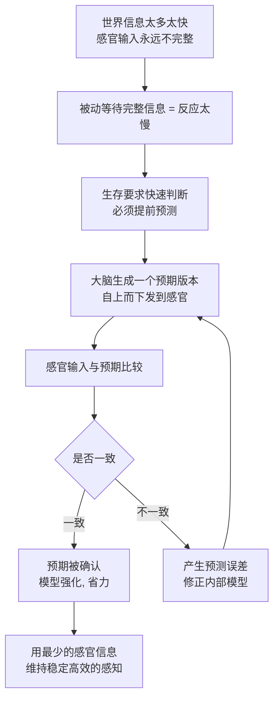

# 13｜新皮质是一台“想象机器”吗？——生成模型猜想

> 大脑里那块皱巴巴的新皮质，到底在算什么？

---

## 一、先说结论

班尼特给出的答案是：**新皮质不是一台被动的"信息接收器"，而是一台主动的"生成模型"——它先根据过去经验猜世界长什么样，再用感官输入去修正这个猜测。**

用一句话概括就是：**感知不是"看见现实"，而是"大脑的一版猜测被现实确认或推翻"。**

这个猜想最惊人的推论是：**我们平时感受到的"现实"，其实更接近一场被感官不断校正的"受控的幻觉"。** 你看到的不是世界的原样，而是大脑为你生成的一个最可能的版本。

这套"预测—比较—修正"的机制，正是今天预测编码理论与生成式 AI 的思想源头。

---

## 二、我们先理解一个问题

先做一个小实验。

看这句话：

> **研表究明，汉字序顺并不定一影阅响读。**

你应该几乎无障碍地读懂了它，甚至可能没立刻发现字是乱的。

再看一个更常见的例子：一句被遮挡了一半标语，你依然能"看"出它写的是什么；一张模糊的照片，你会自动把它"补"成一张清晰的脸。

问题是：

> **你到底是怎么读懂的？那些错字的信息，是谁替你补上的？**

传统观念会说：眼睛接收信息 → 大脑加工信息 → 你理解信息。这是一个"输入—处理"的模型，大脑像一台被动的摄像机加计算机。

但如果大脑只是被动接收，它应该被错字难住才对。

**它没有。这说明大脑在"主动补全"。**

于是真正的问题出现了：**大脑到底是在"读"世界，还是在"猜"世界？**

---

## 三、作者到底提出了什么观点？

班尼特的回答是：**从哺乳动物开始，大脑的核心工作变成了"生成并修正一个内部的世界模型"。**

这套机制的硬件，就是新皮质。它有几个关键特征：

| 维度 | 传统"输入—处理"模型 | 生成模型（预测）模型 |
|---|---|---|
| 信息的流向 | 自下而上：感官 → 大脑 | 双向：大脑先预测，感官再修正 |
| 大脑的角色 | 被动的接收者 | 主动的猜测者 |
| 感知的本质 | 对现实的忠实记录 | 对现实的最佳猜测（受控幻觉） |
| 出错时 | 信息不够就"看不清" | 信息不够就"脑补"，可能补错 |
| 学习方式 | 记住更多输入 | 减少预测与现实的差距 |

支持这个观点的，是两块拼图。

**第一块：皮层柱。** 神经科学家 Vernon Mountcastle 在 20 世纪 50 年代记录猫的躯体感觉皮层时发现，垂直于皮层表面穿行的电极，会连续遇到对同一种刺激、同一片区域作出反应的神经元。他由此提出：新皮质可能是由大量**垂直排列、功能相似的"柱"** 组成的重复单元。这个发现暗示，**整个新皮质可能用的是同一套"通用算法"，只是接入了不同的输入。**

**第二块：自上而下的连接。** 解剖学发现，大脑皮层里"从上往下"传递的连接，数量往往不比"从下往上"的少，甚至更多。**如果大脑只是被动接收，为什么需要这么多"向下"的线路？** 一个自然的解释是：**上面的层在给下面"发预告"，告诉感官"我预期会看到什么"。**

把这两块拼起来，就有了那个大胆的猜想：**新皮质是一台由大量相似单元组成的、自上而下驱动的预测机器。**

---

## 四、把这个观点翻译成人话

**类比一：手机输入法。**

你打字时，输入法会先根据前几个字**预测**你接下来要打什么，把候选词摆在你面前。你选了，它就更懂你；你不选，它就修正。**它不是在等你打完才理解，而是边猜边等你确认。**

按班尼特的理解，新皮质干的活和输入法非常像：**它根据过去的经验，先预测接下来会看到、听到、感觉到什么；然后拿真实输入来对答案；对了就强化，错了就修正。**

**类比二：边听边猜的对话。**

在嘈杂的餐厅里，朋友说话你其实听不全。但你能顺畅对话，因为你的大脑用上下文**提前猜**了他要说什么，再用手势、口型、语气去校正。**你不是"听清了每一个字"，而是"猜对了整句话"。**

**类比三：受控的幻觉。**

人在做梦时，大脑在没有任何外部输入的情况下，照样生成一整个栩栩如生的世界。清醒时和做梦时的区别，不在于"有没有生成画面"，而在于**清醒时感官会不断来"打假"**。所以有研究者把清醒感知称为"受控的幻觉"——**同样的生成机制，只是被现实拴住了。**

**你不是先看到、再理解；你是先猜、再看、再修。** 这就是新皮质的工作方式。

---

## 五、为什么会这样？

这套机制之所以成为主流方案，可以用一条链说清。

这里面有三层道理。

**第一，世界太快，完整处理来不及。** 等所有信息到齐再判断，往往会错过时机。**预测让你用"部分信息 + 先验经验"抢先做出反应。**

**第二，预测是省算力的。** 如果每个细节都从头计算，大脑根本算不过来。**先猜一个大概，只对"猜错的部分"精修，能大幅节省能量。** 这也是为什么熟悉的路开着开着就到了。

**第三，预测错误才是学习的信号。** 模型不是越准越好，而是"错的时候能改"。**真正推动学习的，不是信息本身，而是"预期与现实之间的落差"。**

---

## 六、举一个现实生活中的例子

**例子一：微信打字与语音转文字。**

你用拼音打字，输入法在你敲到第二个字母时就给出一串候选。它其实是在"生成"你可能的意图。**这套预测做得越好，你打字的成本就越低。** 这正是生成模型在日常生活里最直观的版本。

**例子二：模糊字照样读通。**

前文那句乱序汉字，如果你逐字死抠，反而读得慢；顺着整体意思读，一下就懂了。**说明你的大脑优先运行"整体预测"，而不是"逐字识别"。**

**例子三：VR 与视错觉。**

VR 之所以能让你"身临其境"，靠的是欺骗大脑的预测系统：画面、头部运动、声音需要高度同步，一旦不同步，人就会晕——**因为大脑的预测和感官反馈对不上，产生了大量"预测误差"。** 而各种视错觉，本质上是预测系统"猜过了头"，把不存在的形状、运动、明暗补了出来。

---

## 七、回到书中重新理解

现在再看班尼特的框架，13 篇的位置就清楚了。

12 篇讲的是：黑暗逼出了"内部模拟"的必要性。
13 篇讲的是：这套模拟的硬件——新皮质——**究竟以什么方式工作。**

班尼特把新皮质理解为一台生成模型，这解决了 11 篇留下的问题：**世界模型是怎么装进脑子里的？** 答案是：不是把整个世界的细节都存下来，而是**学会一套"生成世界"的规则**，用少量信息生成大量内容。

需要特别说明的是，**这个观点并非班尼特独创，他有明确的学术来源。**

- **实证起点**：Mountcastle 20 世纪 50 年代对皮层柱的发现，为"新皮质有统一微回路"提供了经典证据。
- **理论发展**：Karl Friston 等人提出的**预测编码与自由能原理**，把"大脑通过最小化预测误差来工作"推广成一套统一理论；Jeff Hawkins 也提出过类似的皮层预测理论。
- **重要区分**：这三者不是同一件事。班尼特讲的是进化史叙事，Hawkins 讲的是皮层算法假说，Friston 的自由能原理是一套数学框架。**把它们混为一谈，是常见的误读。**

---

## 八、这个观点背后还有什么？

**第一，它把"感知"和"想象"变成了同一种能力。** 如果感知就是"被现实校正的生成"，那想象就是"暂时不校正的生成"。**看和想，本质上是同一台机器的两种模式。**

**第二，它解释了为什么大脑如此在意"意外"。** 熟悉的东西大脑几乎不费力气，陌生的东西立刻拉响警报——因为它打破了预测。**好奇心和注意力，本质上都是预测误差在驱动。**

**第三，它暗示了一个更深的立场：我们永远无法直接接触"客观现实"。** 我们接触的，始终是大脑生成的版本，只是这个版本经过了感官的反复检验。**这是一个偏贝叶斯、偏建构主义的认知观，也把"意识从何而来"留成了一道没解的题。**

---

## 九、这个观点有问题吗？

有，而且这一篇涉及的是神经科学里最活跃、也最不确定的战场之一。

**第一，预测编码是很有影响力的理论框架，但远未成为定论。** 大脑是否真的在"最小化预测误差"，还是可以用别的机制解释同一批数据，学界仍有争论。**把"预测编码"当成已证实的机制，是过度延伸。**

**第二，"皮层柱"是否普遍存在，本身就是个争议话题。** Mountcastle 1957 年的发现开创了一个时代，但后续研究发现：不同物种、不同脑区的组织结构差别很大，某些动物（如小鼠）的皮层并不呈现清晰的柱状结构。有重量级综述甚至断言"皮层柱可能根本没有功能"，也有学者指出**学界至今没有对"皮层柱"的统一、公认定义**。**用一个定义模糊的概念去支撑"新皮质有统一算法"，地基并不牢。**

**第三，"受控的幻觉"是个漂亮的比喻，但它回避了核心难题。** 如果所有感知都是幻觉，那为什么幻觉和现实能被区分？"受控"这两个字，其实是把最难的问题轻轻带过了。**它描述了现象，却没有解释"为什么会有主观体验"。**

**第四，六层结构与"通用算法"的关系被说得太满。** 新皮质确实分层，也确实在不同区域有相似之处，但从"结构相似"推到"算法相同"，中间隔着一大步。**相似的组织，未必等于相同的计算。**

**所以更准确的说法是**：生成模型/预测编码是理解新皮质的一种非常有启发性的框架，它解释了大量现象；但它是"当前最有影响力的假说之一"，不是"已经确立的结论"。

---

## 十、今天再看这个观点

以下是基于作者思想的现代延伸。

**延伸一：生成式 AI 与"生成的大脑"互相印证。** 今天的图像、视频、文本生成模型，本质上都在做一件事：**学习一个数据分布的生成规则，然后用它"猜"出合理的新样本。** 这与"新皮质是生成模型"的猜想在形式上高度相似。**但要注意机制不同：AI 靠反向传播，大脑并不被认为有严格的反向传播。**

**延伸二：视频预测与世界模型。** 一些模型通过预测"下一帧会发生什么"来学习环境的内部表征，被认为摸到了"世界模型"的门槛。**但能预测像素，不等于理解因果。**

---

## 十一、这一篇真正应该记住什么？

1. **新皮质更像一台生成模型，而不是被动接收器。** 它先预测，再用感官输入修正。

2. **感知可能是一种"受控的幻觉"。** 你看到的是大脑生成的最佳猜测，而不是世界的原样。

3. **这个猜想有真实的学术来源。** Mountcastle 的皮层柱、Friston 的预测编码、Hawkins 的皮层理论，但它们是不同性质的工作，不能混为一谈。

4. **它解释力强，但远非定论。** 预测编码仍在争论，皮层柱是否普遍、是否有统一算法，都是开放问题。

5. **"看"和"想"可能是同一台机器的两种模式。** 这正是理解第三次突破的关键：模拟不是额外功能，而是感知机制的另一面。

---

## 十二、留一个问题

> 如果清醒时的"看"，本质上是被现实拴住的"想"，
> 那么当一台 AI 也能根据海量经验"生成"出以假乱真的画面与文字时，
> 它究竟是在模仿人类的**想象力**，
> 还是仅仅学会了人类**幻觉的那一半**，却从未学会被现实拴住？

---

**下一篇**：既然大脑是一台会"生成世界"的机器，那它凭什么比真实世界的试错更划算？答案很朴素：因为在脑子里试错，不用付出生命代价。而老鼠脑中的"位置细胞"和睡眠中的"重放"，第一次让科学家看到了"心理预演"的生理证据。

下一篇我们来看：**为什么在脑子里先跑一遍，能让学习变得如此廉价？**

---

*本系列基于 Max Bennett《A Brief History of Intelligence》整理，文中"班尼特认为/书中认为"均指作者观点；带"延伸"字样的段落为基于其思想的现代推演，不代表原作者。*
