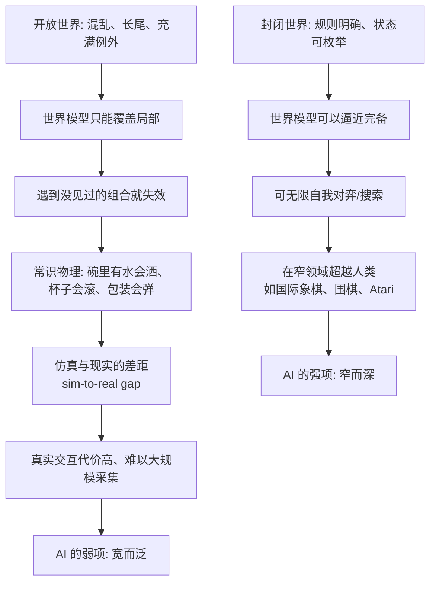

# 16｜为什么机器人会下棋，却不会洗碗？——模拟的边界

> 机器能赢国际象棋冠军，为什么摆不好洗碗机里的餐具？

---

## 一、先说结论

班尼特给出的答案是：**因为下棋和洗碗，属于两个完全不同的世界。**

国际象棋是**封闭世界**：规则写死、状态可枚举、每一手都有明确后果。机器可以在这个世界里疯狂自我对弈，把每一种可能都算清楚，最终超越人类。

洗碗是**开放世界**：盘子有各种形状、碗里可能有水、锅盖会挡住喷水臂、餐具会互相卡住。这里的"状态"几乎无穷，规则模糊，例外比规律还多。**你的世界模型必须能在没见过的混乱里泛化，这恰恰是今天 AI 最弱的地方。**

所以，"会下棋不会洗碗"不是技术的偶然落后，而是**第三次突破的核心能力——可泛化的模拟——还没有被 AI 真正攻克**。这背后有一个更古老的观察，叫**莫拉维克悖论**：对人类越容易的事，对机器反而越难。

---

## 二、我们先理解一个问题

我们先别急着笑机器人笨，先看看这个反差有多离谱。

一台机器可以在围棋——这个"变化比宇宙原子还多"的游戏里，把人类顶尖棋手打到退役。可同一时代，让它去**把一个杯子放进洗碗机**，它可能把杯子叠在另一只杯子上，然后自信地关上机门。

再看几个更日常的动作：

- 从一摞杂乱的盘子里抽出最下面那个，而不碰倒其他的；
- 端着一碗汤走过地毯，既不洒出来，也不撞到猫；
- 打开一个从没见过的塑料包装，还别把它撕坏。

这些事，一个三岁小孩做得比任何机器人都好。

于是问题来了：

> **为什么"下棋"这种人类公认的智力巅峰，机器反而先掌握了？而"摆碗""端汤"这种人类从不当回事的事，机器却始终做不好？**

这个反常，正是理解"模拟边界"的入口。

---

## 三、作者到底提出了什么观点？

班尼特的观点可以概括为一句话：**模拟的有效性，取决于世界模型覆盖的范围。封闭世界里，模型可以逼近完备；开放世界里，模型永远只是局部。**

我们把两个世界摆在一起看：

| 维度 | 下棋（封闭世界） | 洗碗（开放世界） |
|---|---|---|
| 规则 | 明确、写死、有限 | 模糊、隐性、随时例外 |
| 状态空间 | 可枚举 | 近乎无穷 |
| 反馈 | 清晰、即时、可判定胜负 | 模糊、延迟、没有标准答案 |
| 能否自我对弈 | 能，可无限次自我训练 | 不能，没法凭空生成真实物理交互 |
| 失败代价 | 输一局 | 摔碎、洒一身、卡坏机器 |
| 泛化要求 | 低：同一种棋盘 | 极高：每个厨房都不同 |
| AI 现状 | 已超越人类 | 仍远不如幼儿 |

班尼特强调三点。

**第一，不是"难易"的问题，而是"封闭/开放"的问题。** 下棋的搜索空间虽然巨大，但它**有边界**。有了边界，就能用算力和搜索把它啃下来。洗碗的难点不在搜索规模，而在**你根本不知道会遇到什么**。

**第二，越"人类无意识"的能力，越难被工程化。** 端汤、抓握、判断一个碗能不能叠——这些动作不经过我们的意识，所以我们从没意识到它们有多么复杂。**正因为看不见，所以被严重低估。**

**第三，这也是"第三次突破尚未被 AI 真正攻克"的证据。** AI 已经能"模拟"棋局，但还没有一套能像哺乳动物那样，在开放、混乱的物理世界里自由泛化的世界模型。

---

## 四、把这个观点翻译成人话

想象两个学徒。

**学徒甲**学的是下棋。棋盘就那么大，规则一本手册就写完。他可以和同伴日夜对练几百万局，每一局都能立刻知道输赢。**在这种环境里，只要练得够多，他必然成为高手。**

**学徒乙**学的是"在别人家做家务"。今天这家的厨房台面是斜的，明天那家的碗特别滑，后天主人临时改了东西摆放的位置。没有人能给他一本《所有家庭杂物手册》。**他只能在一次次真实经验里，慢慢积累一种说不清的"手感"。**

**"手感"是什么？** 就是一套高度泛化、但难以言传的世界模型：他知道碗里有水的时候不能倾斜、知道端盘子要看着前方而不是盯着盘子、知道抓一个滑的杯子要先试探重心。

**机器人缺的就是这种"手感"。** 它可以在一个精心搭建、光照稳定、物体固定的实验室环境里表现得很好；一旦换到真实家庭，台面反光、物体乱放、光照变化，它的模型就崩了。

一句话：

> **下棋考验的是"算得多"，洗碗考验的是"见过世面"。**

---

## 五、为什么会这样？

这条链解释了"模拟边界"是怎么形成的。

这条链里有三个关键点。

**第一，封闭世界的"可枚举"，是 AI 的天然主场。** 只要奖励明确、规则固定，机器就能靠海量自我对弈把策略磨到极致。**AlphaGo、AlphaZero 就是这么赢的。**

**第二，开放世界的"长尾"，是 AI 的天然坟场。** 真实世界的问题分布有一条长长的尾巴：罕见但致命的组合层出不穷。**你训练了一万种厨房，第一万零一种就能让它翻车。** 这就是自动驾驶的"长尾场景"难题。

**第三，物理交互的数据太贵。** 棋局数据可以无限生成，但机器人抓取的数据必须真实采集——每一次尝试都要花时间、耗损硬件、承担风险。**更糟的是，仿真里练好的技能，搬到现实里常常不灵，这就是 sim-to-real gap。**

---

## 六、举一个现实生活中的例子

**例子一：自动驾驶的长尾场景。**

识别红绿灯、保持车道，今天的自动驾驶已经做得不错。但真正难的是长尾：一个孩子追着球突然冲出来、一辆车在路口犹豫要不要让、一位老人推着购物车横穿。**这些场景每一种都很罕见，合起来却构成了事故的大头。** 而"那个行人到底会不会突然横穿"，甚至需要预测对方的**意图**——这已经不只是模拟物理，而是模拟人心。

**例子二：送餐机器人遇到旋转门。**

在写字楼大厅里送外卖，机器人能规划路径、能避让行人。但一扇旋转门就能让它犯难：门在转、缝隙在变、旁边还有人进出。**规则里没写过这种情况，训练数据里也几乎没有。** 它只能傻站着，或者冒险往里挤。

**例子三：家庭服务机器人。**

叠衣服、收拾玩具、把剩菜装盒——人类做起来毫不用心，机器人却极难。**因为每一件衣服的褶皱、每一个玩具的摆放，都是独一无二的。** 这不是算力不够，而是"见过世面"不够。

---

## 七、回到书中重新理解

现在，我们终于可以正面回答 01 篇埋下的那个问题了：**为什么机器能赢棋，却摆不好碗？**

- 下棋对应的是**行动模型**能解决的封闭问题：规则清楚、反馈清晰、可以无限试错。
- 洗碗对应的是**世界模型**才能覆盖的开放问题：混乱、长尾、需要常识物理与泛化。

而班尼特要说的更深一层是：**AI 在第三次突破上只走了一半。** 它学会了在**特定环境里模拟**，却没有学会哺乳动物那种**跨环境泛化**的能力。

这里必须介绍一个比班尼特更早的观察。

**莫拉维克悖论（Moravec's paradox）**：机器人学家 Hans Moravec 在 1988 年的《Mind Children》里写道，**"让计算机在智力测验或跳棋上表现出成人水平相对容易，而要给它一岁小孩在感知和运动方面的技能，却困难甚至不可能。"** 这个观察在 1980 年代由 Moravec、Rodney Brooks、Marvin Minsky 等人共同提出。Minsky 的说法更尖锐：**"我们最不意识的，恰恰是我们大脑做得最好的事。"**

**莫拉维克给的进化解释，和班尼特几乎同源**：感知和运动技能在动物身上进化了几亿年，早已高度优化，所以我们觉得毫不费力；而抽象推理是最近几万年才出现的新技能。**"难的事容易，容易的事难"，因为难度不是按人类感受排的，而是按进化时间排的。**

---

## 八、这个观点背后还有什么？

**第一，它重新定义了"智能"的难点。** 我们习惯把聪明等同于解难题、算得快、逻辑强。但真正的难点可能在于**在混乱中保持稳健**。**泛化能力，比峰值性能更能定义智能。**

**第二，它揭示了"数据从哪来"的根本不对称。** 棋类数据可以自我生成，物理数据必须真实付出。**这决定了 AI 在封闭领域会持续领先，在开放领域必须解决"数据生成"问题。**

**第三，它把"常识"变成了硬骨头。** 人知道"碗里有水会洒""装了汤的碗不能叠"，这些知识从没人教过，我们也不记得学过。**它们是我们在这个物理世界里"泡"出来的，而这恰恰最难复制。**

---

## 九、这个观点有问题吗？

有，而且这一篇是最容易被近年 AI 进展"打脸"的地方。

**第一，莫拉维克悖论是否仍然成立，正在被质疑。** 一些学者指出，这个悖论与其说是关于"哪些问题本质上更难"的预言，不如说是**"AI 研究界过去觉得什么值得做"的一种陈述**。随着大规模模型在视觉、语音、机器人抓取上的进展，一部分当年"极难"的技能已经被显著推进。**悖论可能仍成立，也可能只是描述了某个历史阶段的偏好。**

**第二，大模型能否解决泛化，尚无定论。** 一派相信，只要模型和数据足够大，开放世界的泛化会自然涌现；另一派认为，**真正的泛化需要显式的世界模型与因果理解，而不是更大规模的模式匹配。** 这场争论今天仍在进行。

**第三，端到端学习 vs 手工建模，路线之争没有结束。** 端到端让机器从数据里自己学，但样本效率低、可解释性差；手工建模注入物理先验，但难覆盖真实世界的复杂性。**两种路线各有所长，谁也还没赢。**

**所以更准确的说法是**：封闭/开放的区分非常有解释力，莫拉维克悖论也指出了真问题；但把"机器不会洗碗"当成 AI 的永久边界，可能低估了技术的进展。**它是一个当下的、有力的诊断，不是一条永恒的铁律。**

---

## 十、今天再看这个观点

以下是基于作者思想的现代延伸。

**延伸一：具身智能正在成为前沿。** 今天大量研究把大模型与机器人身体结合，让模型直接"看"和"动"，试图用大规模多模态数据来补上开放世界的经验缺口。**这正是"让 AI 走完第三次突破后半程"的努力。**

**延伸二：仿真与现实的鸿沟在被缩小。** 域随机化、可微分仿真、真实世界数据回传等技术，正在一点点缩小 sim-to-real gap。**但"仿真里学会、现实中可用"仍是最难的环节之一。**

**延伸三：真正的门槛可能不是物理，而是"常识"。** 机器人可以学会抓取，却很难知道"这个杯子是主人珍视的、不能碰"。**当开放世界的问题开始涉及意图和价值，它就悄悄滑向了第四次突破——心智化。**

---

## 十一、这一篇真正应该记住什么？

1. **下棋是封闭世界，洗碗是开放世界。** 前者可枚举，后者长尾、混乱、充满例外。

2. **模拟的有效性取决于模型覆盖的范围。** 封闭领域可逼近完备，开放领域永远只是局部。

3. **莫拉维克悖论说的是"进化时间决定难度"。** 感知与运动练了几亿年，抽象推理才几万年；越无意识的能力，越难工程化。

4. **AI 在第三次突破上只走了一半。** 它能在特定环境里模拟，却还没有哺乳动物那种跨环境泛化。

5. **这是诊断，不是铁律。** 大模型、具身智能、仿真技术都在冲击这条边界，结果仍未可知。

---

## 十二、留一个问题

> 如果 AI 终有一天学会了洗碗，靠的是海量数据堆出来的泛化，
> 那它到底算是走完了"第三次突破"，
> 还是只是把世界上足够多的厨房都背了下来，
> 却依然没有一个真正理解"碗里有水会洒"的**世界模型**？

---

**下一篇**：第三次突破到这里就讲完了——哺乳动物有了世界模型，能模拟、能规划、能泛化。但它们的模型，始终只关于"物"。当生存竞争的主角从自然环境变成同类，一种更高级的能力出现了：在自己的脑子里，模拟另一个脑子里在想什么。

下一篇我们进入第四次突破：**灵长类为什么进化出了"政治家的大脑"？**

---

*本系列基于 Max Bennett《A Brief History of Intelligence》整理，文中"班尼特认为/书中认为"均指作者观点；带"延伸"字样的段落为基于其思想的现代推演，不代表原作者。*
