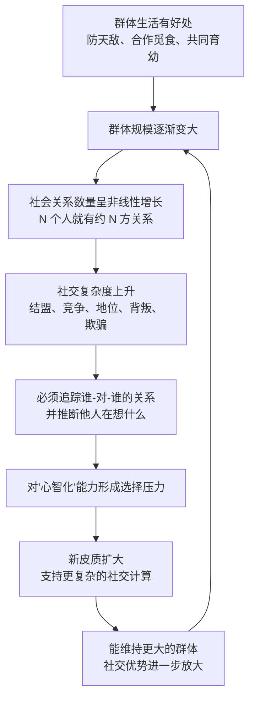

# 17｜灵长类为什么进化出了“政治家的大脑”？

> 为什么灵长类的大脑比同等体型的动物大得多？

---

## 一、先说结论

班尼特给出的答案是：**灵长类的大脑之所以异常大，主要不是因为要对付自然环境，而是因为要对付同类。**

按"社会脑假说"，真正逼迫大脑升级的压力，不是"果子长在哪棵树、怎么躲开猛兽"，而是**社会群体内部的复杂关系**——谁和谁结盟、谁背叛了谁、谁的地位正在上升、谁欠了谁一个人情。这些关系既看不见、又不断变化，还得推着彼此的心意去猜。

于是，第四次突破"心智化"就诞生在这里：**灵长类先有了一个更复杂的社交世界，才有必要长出一套"模拟别人心智"的大脑。** 政治家的头脑，是社交压力一步步逼出来的。

---

## 二、我们先理解一个问题

先看一个非常朴素的现象。

同样体型下，灵长类的脑子比别的哺乳动物大得多。黑猩猩、猩猩、人类，都是"脑容量超标"的物种。而很多同样靠采果子、同样要躲避捕食者的动物，脑子却远没有这么大。

过去最常见的解释是"**生态脑假说**"：觅食困难。要记住哪棵树什么时候结果、什么东西能吃、怎么挖出虫子，这些都需要聪明的大脑。

可是这里有个说不通的地方：一只能够飞越几百公里、精确回到果树的蝙蝠，能记住海岸线的海鸟，能找到埋藏食物的松鸦——它们面对的觅食难题一点都不简单，脑子却并没有按灵长类的方式膨胀。

于是问题变成了：

> **如果难的不是寻食，那灵长类到底在"难"什么？**

答案是：**同类。** 食物是死的，同类是活的。果子不会因为你想吃它就故意躲起来，但你的同伴会。所以社会生活的复杂度，可能远远超过自然环境本身。

---

## 三、作者到底提出了什么观点？

班尼特在书中引用的核心框架，来自英国人类学家 **Robin Dunbar** 的"社会脑假说"（social brain hypothesis，Dunbar 1992 年提出）。他统计了大量灵长类物种，发现两件事高度相关：

- 一个物种的**新皮质比例**（新皮质占整个大脑的比例）越大；
- 它生活的**社会群体规模**通常也越大。

这套观点的通俗版本，就是后来广为人知的"**邓巴数**"：Dunbar 由这条回归线外推到人类，得出一个约 **150 人**的数字——据称是个人能维持稳定关系的上限。

与之配套的还有另一个概念：**马基雅维利式社会智能**。1988 年，Byrne 与 Whiten 编了一本书《Machiavellian Intelligence》，用"政治手腕"来形容灵长类的社交：结盟、拉拢、离间、欺骗、操纵——**它们的关系不是单纯的竞争或合作，而是一场持续不断的博弈。**

| 维度 | 生态脑假说 | 社会脑假说 |
|---|---|---|
| 主要压力来源 | 觅食、找路、躲避天敌 | 群体内的盟友、地位、背叛 |
| 大脑用来算什么 | 自然环境的结构 | 其他个体的关系与意图 |
| 难度特点 | 复杂但相对稳定 | 动态、会反制、必须"读心" |
| 代表证据 | 饮食类型与脑容量相关 | 群体规模与新皮质比例相关 |
| 对应五次突破 | 偏第三次（世界模型） | 第四次（心智化） |

班尼特的立场很清楚：**第四次突破不是从天上掉下来的，它是"社会"这个复杂环境逼出来的适应。** 你没有理由去模拟别人的心智，除非你的生存真的取决于别人的心智。

---

## 四、把这个观点翻译成人话

想象你的大脑是一台服务器，它的核心指标不是"算力"有多强，而是"**能同时维护多少段关系**"。

一台只处理自然环境的服务器，需要存的是地图、食物位置、危险信号——**数据量虽大，但结构简单，而且不会主动骗你。**

一台处理灵长类社会的服务器，需要处理的却是这种东西：

- A 昨天替 B 梳毛，今天 B 在冲突里没有帮 A——这笔"人情账"怎么记？
- C 在 D 面前对我很客气，D 一走就翻脸——C 的真实态度是什么？
- E 和 F 看起来结盟，但 F 是不是在暗中跟 G 合作？
- 我刚才那个示威动作，被 H 看在眼里了吗？H 会不会告诉 I？

你会发现，这里面每一个问题，**都要求你去模拟另一个脑子里的状态**：他知道什么？他想要什么？他以为我知道什么？

这就是为什么"社会"比"果子"难得多：**果子不会因为你要预测它，就改变自己的行为；但同类会。** 你越懂别人，别人也在越懂你，双方不断升级——这才是那些"政治家的大脑"真正被锻炼的地方。

---

## 五、为什么会这样？

我们把社会脑假说的逻辑链完整推一遍。

这条链有一个关键特征：**它是一个正反馈循环。**

更大的脑让你能驾驭更大的群体；更大的群体又要求更大的脑。每一轮升级，都让"会读心的个体"比"不会读心的个体"活得更好。久而久之，整个类群的新皮质就一起膨胀起来。

这也解释了为什么灵长类的脑子是"慢慢变大"而不是"一步到位"：**社会复杂度不是一次性的障碍，而是一个持续加码的对手。** 你变聪明了，你的同伴也在变聪明，博弈永远没有终局。

---

## 六、举一个现实生活中的例子

**例子一：办公室政治。**

一家公司里，最能干的执行者未必升得最高。真正难的是另一套活儿：知道哪个项目是老板真正在意的、哪个同事表面支持你其实在观望、什么时候该说话、什么时候该沉默、出问题时该先找谁。

这些活儿和"能不能写代码""能不能做表"是两种能力。**前者对应的是第三次突破（世界模型：把业务搞明白），后者对应第四次突破（心智模型：把人搞明白）。** 很多技术很强的人在职场受挫，往往不是智商问题，而是"社会脑"这一层没被点亮。

**例子二：班级里的小团体。**

小孩子到了小学中高年级，会开始出现非常复杂的社交生态：谁和谁是好朋友、谁被排挤、小团体里谁说话算数、友情会不会因为一次告状就崩盘。老师常常低估这段时期孩子的心理压力——因为在孩子的世界里，"我明天还有没有朋友"就是天大的事。

**这其实就是灵长类社会的缩影：** 群体越小、越封闭，关系就越重要，因为逃不掉。

**例子三：游戏公会与微信群。**

一个几十人的游戏公会，会自然长出"管理层"：会长、副会长、骨干、边缘人。有分工、有资源分配、有站队、有"退群威胁"。研究者甚至真的在大型多人在线游戏里观察到类似"150 人分层"的社交结构。**人类一旦聚在一起，政治就自动生成——因为政治就是"多个人如何分配稀缺资源和地位"。**

---

## 七、回到书中重新理解

现在把这一篇放回五次突破的框架，就非常清楚了。

- 第三次突破（模拟）：给了动物一个"世界模型"，能预演物理世界会发生什么。
- 第四次突破（心智化）：把这个模型**指向另一个大脑**，开始预演"他会怎么想、怎么做"。

班尼特强调，**心智化不是凭空多出来的一种能力，而是对已有世界模型的"改装"**——你已经有了一台能模拟"如果……会怎样"的机器，现在把"世界"换成"另一个人"，机器就能继续用。

这也解释了为什么第四次突破发生在灵长类：**它们是最典型的高度社会化动物。** 一个独居的动物，没有理由进化出读心能力；一个只在繁殖季短暂聚群的动物，理由也很弱。只有当"读懂同类"成为日常生存的刚需，心智化才有被选择的机会。

而"社会脑"这个说法，本质上是给这本书的框架补上了一块关键的**因果起点**：社会复杂性，是第四次突破的"压力源"。

---

## 八、这个观点背后还有什么？

**第一，它把"聪明"重新定位了。** 我们习惯把智力想成"对付世界的能力"，会解方程、会造工具。但社会脑假说暗示：**智力的主要舞台可能一直是"对付同类"。** 这跟日常经验很吻合——真正烧脑的从来不是数学题，是人际关系。

**第二，大脑是极其昂贵的器官。** 人脑只占体重约 2%，却消耗约 20% 的能量。**进化不会为了"显得高级"而养一个昂贵的器官**——它必须每一分投入都换回生存收益。社会脑假说恰恰提供了这个收益：更强的社交能力，换来更好的食物、更安全的地位、更多的繁殖机会。

**第三，它暗示"社交是认知的健身房"。** 如果社会复杂度真的能驱动大脑进化，那么在个体层面，**复杂的人际环境可能也在持续塑造我们的大脑**。这为后面讨论"自我模型"和"语言"埋下了伏笔。

**第四，"政治"这个词要去掉道德色彩。** 说灵长类是"政治家"，不是说它们阴险，而是说它们**生活在一个必须协调多方利益、管理联盟与竞争的环境里**。政治在这里是中性的：它就是群体内部的关系管理。

---

## 九、这个观点有问题吗？

有，而且社会脑假说至今仍是**一个有力的假说，而不是已被证实的定论**。

**第一，生态脑假说的挑战。** 有研究发现，**饮食类型（比如吃果实还是吃叶子）可能是比群体规模更好的脑容量预测因子**（DeCasien 等 2017）。换句话说，是"果子难找"还是"同类难缠"逼大了大脑，这场争论并没有结束。

**第二，"邓巴数"本身受到严重质疑。** 2021 年 Lindenfors 等人重新分析数据后指出：用不同统计方法外推，得到的人类群体规模从 16 到 109 不等，而**置信区间宽到几乎没有信息量**（例如 3.8—520），因此"用一个具体数字（150）作为人类社交上限"在统计上是站不住的。Dunbar 本人则反驳说批评者用错了统计方法（忽略了数据分层、用了错误的回归与区间类型）。**这场争论至今没有共识。**

**第三，相关不等于因果，而且方向可能相反。** 新皮质比例和群体规模确实相关，但**到底是"大群体逼大脑"，还是"大脑袋允许了大群体"？** 也可能是第三个因素（比如更长的寿命、更大的活动范围）同时导致了这两者。这类比较研究很容易踩到统计陷阱。

**第四，"社会=更难"这个前提也值得推敲。** 觅食、导航、躲避天敌同样是极其复杂的计算问题。**把社会认知抬到"唯一/主要"的高度，可能低估了自然环境的难度。** 更可能的情况是：两者一起作用，而社会只是其中一份。

**所以更准确的说法是**：社会压力很可能是灵长类大脑膨胀的重要原因之一，社会脑假说也提供了一个极有解释力的视角；但"是社会而不是觅食逼出了大脑袋"这个强主张，目前证据还不足以下定论。

---

## 十、今天再看这个观点

以下部分是基于作者思想的现代延伸，不是书里的原话。

**延伸一：我们生活在"超大规模社会"里，但大脑还是旧的。**

现代人的微信群可能有 500 人，公司有几千人，社交媒体上关注了几百个陌生账号。**但我们的社会脑，是在几十到一两百人的小群体里进化出来的。** 这可能解释了很多现代人的社交疲劳、网络争吵、以及"我明明有一千个好友却很孤独"的落差——**我们的大脑并没有为这个规模设计过。**

**延伸二：组织设计其实在跟进化心理打交道。** 为什么很多公司拆成小团队效率更高？为什么一个组织超过某个规模就"开始变政治"？这可能不只是管理问题，也和人类处理社会关系的天然容量有关。

**延伸三：AI 的"社会智能"是下一个难关。** 今天的 AI 可以下棋、写文章，却很难真正在一个相互博弈、彼此试探的多人环境里周旋——因为它缺少第四层能力：**对他人心智的建模**。这正是后面几篇要展开的核心。

---

## 十一、这一篇真正应该记住什么？

1. **社会脑假说：灵长类的大脑子，很可能是"同类"逼出来的。** 难的不是自然界，是社会界。

2. **新皮质比例与群体规模相关，Dunbar 由此外推出"约 150 人"。** 这是最著名的推论，也是最受争议的部分。

3. **马基雅维利式社会智能：** 灵长类的社交是一场持续的结盟、竞争、欺骗与操纵的博弈。

4. **社会压力是一个正反馈循环。** 大脑袋支持大群体，大群体又要求大脑袋，双方一起加码。

5. **这是一个有力假说，不是定论。** 生态脑假说、"邓巴数"质疑、相关≠因果，都提醒我们要留有余地。

---

## 十二、留一个问题

> 如果灵长类的脑子真的主要是为"读懂同类"而长的，
> 那么今天我们一天里最烧脑的那件事——猜同事的弦外之音、猜伴侣为什么心情不好——
> 到底是工作之外的"分心"，还是智能最核心的老本行？

---

**下一篇**：社会脑假说告诉我们，压力来自同类。但"处理同类"到底靠的是什么本事？灵长类凭什么能猜出别人的心意？

下一篇我们正式进入第四次突破的核心机制——**心智化：如何在自己的脑子里，模拟"别人在想什么"？**

---

*本系列基于 Max Bennett《A Brief History of Intelligence》整理，文中"班尼特认为/书中认为"均指作者观点；带"延伸"字样的段落为基于其思想的现代推演，不代表原作者。*
