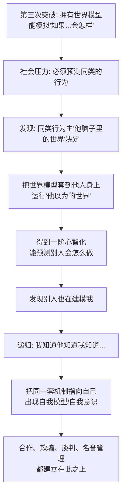

# 18｜心智化：如何在自己的脑子里，模拟“别人在想什么”？

> 什么是"心理理论"？它为什么如此困难？

---

## 一、先说结论

班尼特的答案是：**心智化，就是把已经存在的"世界模型"调转方向，去模拟另一个大脑内部的模型。**

你已经有一台能预演世界的机器（第三次突破：如果球滚到桌边，它会掉下去）。第四次突破做的事情，是让你能运行这样一个程序：**"他知道球在桌边；但他以为球还在桌上；而且他不知道我已经把球藏了起来。"**

这套能力，心理学上叫"**心理理论**"（theory of mind），也叫"心智化"。它的特殊之处在于**递归**：不是模拟一次世界，而是模拟"某个人脑子里的世界"，甚至可以再套一层——"我知道他知道我知道"。

班尼特进一步提出一个很有冲击力的猜想：**自我意识很可能不是先出现、再拿来读心的；恰恰相反，它可能是"读别人的心"这套机制指向自己时的副产品。** 当你把模拟器对准自身，脑子里就出现了一个叫"我"的东西。

---

## 二、我们先理解一个问题

先做一个小测试，不用真的回答，想想就知道答案：

> 小红把巧克力放进蓝色柜子，然后出门了。
> 她不在的时候，小明把巧克力挪到了绿色柜子。
> 小红回来时，她会先去哪里找？

任何一个四岁以上的孩子、绝大多数成年人都会说：**她会去蓝色柜子**——因为小红不知道巧克力被挪走了。

请注意这个答案有多"反物理"。从客观世界看，巧克力就在绿柜子里。但你知道的，是"**小红脑中的世界**"：那个世界里，巧克力还在蓝柜子。

这就是本篇的核心问题：

> **我们是如何做到在脑子里同时运行两个世界——真实的世界，和别人以为的世界——并且分开管理它们的？**

这件事之所以困难，是因为别人的心智**完全看不见**。颜色能看、重量能测、位置能标记，但"他相信什么"没有任何感官能直接读到。你只能从行为反推、从你自己的身体去类比。**要建模一个看不见、还会伪装、还会反过来猜你的东西，这是进化给出的最刁钻的题目之一。**

---

## 三、作者到底提出了什么观点？

"心理理论"这个概念，最早由 **Premack 与 Woodruff** 在 1978 年的一篇论文里提出，标题就是那句著名的问题：**"Does the chimpanzee have a theory of mind?"（黑猩猩有心理理论吗？）**

他们的定义是：**如果一个个体会把心理状态归因给自己和他人，就说明它拥有一套"心理理论"。** 之所以叫"理论"，有两个理由：

- 心理状态是**不可直接观察**的；
- 这套推断可以用来**预测行为**。

1983 年，Wimmer 与 Perner 做了一个对发展心理学影响巨大的实验，也就是后来广为人知的"**错误信念测验**"：让儿童看一个角色把东西放在某处、离开、东西被换位置，然后问"他回来会去哪里找"。**三四岁的孩子往往答错**（说他会去东西实际所在的地方），**大约四岁以后才开始稳定答对。** 这个"约四岁"的坎，成了儿童"心理理论"成熟的一个里程碑。（后来 Baron-Cohen 等人把它改编成经典的"Sally-Anne 测验"。）

班尼特把这一切纳入他的框架：**心智化 = 世界模型的递归调用。**

| 层级 | 模拟对象 | 例子 |
|---|---|---|
| 第三次突破 | 物理世界的状态 | 球滚到桌边会掉下去 |
| 心智化（一阶） | 他人脑中的世界 | 他以为球还在桌上 |
| 心智化（二阶） | 他人脑中的"我的模型" | 他以为我知道球在哪 |
| 心智化（三阶） | 再套一层 | 他想让我以为他不知道 |

每一层，都是把前一层当成"数据"，再往模型里塞一次。人类可以在几层之内玩得很溜，而层数一旦太多，连我们自己也会晕。

---

## 四、把这个观点翻译成人话

把大脑想象成一台**沙盘推演机**。

第一代沙盘只能放地形、河流、敌人位置——**这是第三次突破**：模拟物理世界。

第四代沙盘多了一层功能：它可以在沙盘上再摆一个小号沙盘，里面模拟"**对面指挥官脑子里的地图**"。于是你不仅知道敌人现在在哪，还能想到：

- 他会以为我会从正面进攻；
- 所以他可能把主力放在正面；
- 那我从侧面绕，他会不会已经料到？

**关键点在于：这第二层沙盘里装的不是"地形"，而是"另一个人的沙盘"。**

而"自我模型"就是这台机器的第三个用法——**把沙盘对准自己**：我是谁？我刚才为什么生气？我在别人眼里是什么形象？我如果现在撒谎，将来还圆得回来吗？

用一句话概括：

> **读心，是拿建模世界的机器去建模别人；自省，是拿同一台机器去建模自己。**

---

## 五、为什么会这样？

心智化为什么必须建立在世界模型之上，而不是凭空冒出来？我们推一遍。

这条链里最值得注意的是最后两步。

**第一，你之所以需要递归，是因为你的对手也在读你的心。** 如果只有你会读心，最多一层就够了；可现实中，对方也在猜你，所以你必须猜"他猜到了什么"。**这场"相互建模"的军备竞赛，把心智化推向了递归。**

**第二，一旦机制指向自己，就产生了"我"。** 班尼特认为，自我意识不需要另起炉灶——**它很可能就是心智化能力的"自指"用法**。这正好解释了一个奇怪的现象：能读懂自己的人，往往也很会读别人；而"自我认识"和"社会认知"在大脑里用的是高度重叠的区域。

---

## 六、举一个现实生活中的例子

**例子一：销售如何"揣摩客户"。**

一个平庸的销售只会背产品参数。一个好的销售在做的，其实是心智化：客户嘴上说"太贵了"，他脑子里真正担心的是什么？是这个价格超出了预算，还是他怕被同事比较？他是不是已经看了竞品，只是没说？他今天带着谁来，那个人会不会是真正的决策者？

**客户说的每句话，都是一层可以继续往下挖的状态。** 高手挖的不是"事实"，是"他心里那台沙盘"。

**例子二：哄孩子与谈判。**

哄一个哭闹的三岁孩子，光讲道理没用——因为他还没到"能用错误信念推理"的年龄。你得进入他的世界模型：他以为那块饼干"应该"是他的、他不知道等一会儿还有更多。**理解他"以为的世界"，比纠正"事实"更有效。**

而成年人之间的谈判也一样。你知道报价的底线，对方也知道你知道；你们要谈的从来不是数字，而是"对方**以为**你的底线在哪"。

**例子三：看悬疑片猜凶手。**

为什么我们能一边看剧一边推理"真凶是谁"？因为编剧和你玩的正是这套递归游戏：剧里的侦探塑造他相信的版本，反派塑造他以为侦探相信的版本，而你作为观众，要同时运行三四个人的"以为"。

**一部好的悬疑片，本质上是一场心智化的公开锦标赛。**

---

## 七、回到书中重新理解

这里有一个被很多人忽略的实验，班尼特也提到过它的分量——**Gallup 在 1970 年做的镜像自我识别实验。**

做法很巧妙：把动物麻醉后，在它脸上（它自己看不到的地方）点一个红点；等它醒来，让它照镜子。结果：

- **黑猩猩会伸手去摸自己脸上的红点**，说明它认出了镜子里那个"是自己"，还能发现"我脸上有个奇怪的东西"；
- **猴子则基本不会**，它把镜子里的影像当成另一只猴子，做出威胁或社交反应。

Gallup 由此认为：**能认出镜子里的自己，说明这个物种拥有某种"自我"的概念。** 这个测试后来成了研究"自我意识生物基础"最经典的范式之一。

而在人类身上，现代脑成像研究发现了一套相对稳定的"**心理理论网络**"，主要包括：

- **颞顶联合区（TPJ）**：处理和"他人视角"有关的信息，尤其在需要区分"我知道/他不知道"时活跃；
- **内侧前额叶（mPFC）**：在思考自己、思考他人、回顾社会情境时都会亮；
- 还有颞极、楔前叶等区域。

更耐人寻味的是：**思考自己**,和**思考别人**，激活的脑区高度重叠。这给"自我意识是心智化的副产品"这个猜想，提供了一点间接的支持。

---

## 八、这个观点背后还有什么？

**第一，它把"读心"和"自省"绑在了一起。** 我们习惯把它们当成两种能力，但按这个框架，它们是**同一台机器的两个朝向**：对外叫做共情/读心，对内叫做自省/自我。这解释了很多临床现象——一个人理解他人的能力受损时，往往自我认知也会出问题。

**第二，它给"欺骗"提供了地基。** 没有心智化，就不能真正欺骗。欺骗的前提是：**我知道你会根据你看到的东西做出错误推断。** 灵长类中那些善于"演戏"的个体，本质上是在操纵对方的心智模型。

**第三，它解释了"名誉"为什么重要。** 一旦你能建模"别人怎么看我"，你就会开始管理自己在别人心里的形象。**名誉、面子、信任，都是心智化推出来的社会产物。**

**第四，真正的难点不是"模拟"，而是"分开"。** 想象别人的世界不难，难的是**不让它和真实世界混在一起**。人类精神病性症状的一些表现（比如坚信自己的猜想就是事实），从建模角度看，就有点像"两个沙盘粘在了一起"。

---

## 九、这个观点有问题吗？

有，而且这篇的争议比前一篇更大，因为"心理理论"的研究长期是发展心理学与动物认知的战场。

**第一，动物到底有没有心理理论，至今未有定论。** Premack 与 Woodruff 提出后，Povinelli 等人在 1990 年代做了大量实验，给出的是**负面证据**：黑猩猩似乎只是在读"行为"，不是读"心"。后来的综述（如 Tomasello & Call）认为：黑猩猩确实能理解他人的**目标、知觉和知识/无知**，但**没有可靠证据表明它们能理解"错误信念"**。不过近年的眼动研究又报告，黑猩猩、倭黑猩猩、猩猩能预期一个"不知道真相者"的错误行为——**最新的研究正在重新动摇"只有人类有错误信念理解"这个结论。**

**第二，"能不能和语言解耦"是个大问题。** 有研究者认为，很多所谓的心智化表现，其实是在语言中学会的"讲故事"，而不是独立的心智模拟。反过来，也有失语症患者保留着良好的心智化能力，说明**两者并非必然绑定**。这场"心智化需不需要语言"的争论，直接关系到语言这一层该怎么排。

**第三，"自我意识"的神经基础远远没有解决。** 镜像测试到底测的是自我意识、自我身体识别，还是仅仅"镜中影像与自身动作同步的探测"？学界分歧很大。**把"照镜子摸红点"直接等同于"拥有自我"，是一个很大的跳跃。** "自我意识是心智化副产品"是个精彩猜想，但离被证实还很远。

**第四，心智化不是全有或全无。** 现实中人们在不同情境下表现差异极大：同一个人，可能很懂朋友、却完全读不懂伴侣。**把它当成单一能力，会掩盖这种情境性。** 更合理的图景可能是多种子能力（读目标、读知识、读情绪）的组合，各有各的发展曲线。

**所以更准确的说法是**：心智化=对他人心智的建模，这个框架极有解释力，也有大量实验支撑；但"递归如何实现""动物能做到哪一步""自我意识是否真是其副产品"，都还是开放问题。

---

## 十、今天再看这个观点

以下部分是基于作者思想的现代延伸。

**延伸一：AI 到底有没有"心理理论"，是当下最热的争论之一。**

有研究发现，足够大的语言模型在一些"错误信念"文字题上表现不错，于是有人宣布"心智化涌现了"。但反方指出：模型可能只是**从海量文本里学到了这类题目的统计模式**，而不是真的在内部运行一个"他人心智"的模型。

**用班尼特的框架问，就更清楚了：它是在"模拟一个人的心智"，还是在"预测下一个词"？** 这是第五次突破里最难的关卡。

**延伸二：心智化正在被用来对付你。** 推荐算法、客服话术、诈骗脚本、舆论操纵——**本质上都是在预测你的心智状态，然后对你施加影响。** 当读心的能力被工业化，个人的心理边界会面临前所未有的压力。

**延伸三：这也是"高功能社交焦虑"的根源。** 心智化太强的人，会不断运行"别人可能怎么想我"的模型，跑得越多越累。**读心能力是一把双刃剑：它让你更会合作，也让你更容易自我消耗。**

---

## 十一、这一篇真正应该记住什么？

1. **心智化=用世界模型去模拟另一个人的世界模型。** 它是模型的模型，核心特征是递归。

2. **自我意识很可能是这套机制指向自己时的副产品。** 读心与自省，用的是同一台机器。

3. **三个里程碑实验：** Premack & Woodruff 1978 提出问题；Wimmer & Perner 1983 的"错误信念"测验（约四岁才稳定通过）；Gallup 1970 的镜像自我识别。

4. **人类有一套"心理理论网络"（TPJ、mPFC 等），且思考自己与思考他人高度重叠。**

5. **动物是否有心理理论、心智化是否依赖语言、自我意识如何产生，都仍有争议。**

---

## 十二、留一个问题

> 如果"我"只是读心机制照向自己时产生的一个模型，
> 那么当 AI 也能熟练地预测他人的心智、并把这套模型指向自己时，
> 它算不算也长出了某种意义上的"我"？
> 还是说，"我"从来就不需要一个真正的内部观众？

---

**下一篇**：我们已经知道人类会读心。但"预测人心"到底比"预测物体"难在哪里？为什么一辆能识别红绿灯的车，可能永远搞不定过马路的行人？

下一篇我们就来拆解这个难度差——**预测物理容易，预测人心太难。**

---

*本系列基于 Max Bennett《A Brief History of Intelligence》整理，文中"班尼特认为/书中认为"均指作者观点；带"延伸"字样的段落为基于其思想的现代推演，不代表原作者。*
