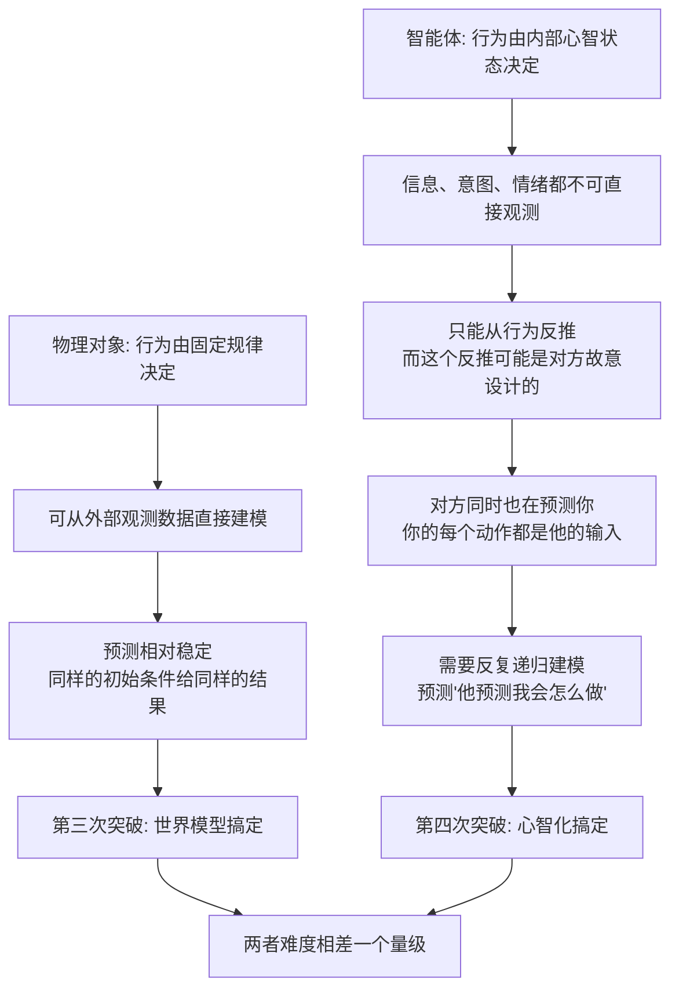

# 19｜预测物理容易，预测人心太难——“猴锤”与自动驾驶的启示

> 为什么预测"东西"容易，预测"人"很难？

---

## 一、先说结论

班尼特的答案是：**物理世界有稳定的规律，人心没有。**

一个球会不会落地、一杯水会不会洒、一块石头会不会挡住路，这些都有稳定的因果规律可循，而且**对象不会因为你预测它而改变自己**。但人不一样：一个人的行为取决于**他掌握了什么信息、他想要什么、他现在是什么情绪**——而这三点，你都看不见，还可能被对方故意藏起来。

所以第四次突破解决的问题，难度比第三次高一个量级：**从"预测物体"升级到"预测智能体"。** 前者是解一道有标准答案的物理题，后者是在跟一个同样在猜你的对手下棋。这也是为什么自动驾驶能识别红绿灯，却至今学不会"那个路口的人到底会不会突然窜出来"。

---

## 二、我们先理解一个问题

看一段 1944 年的实验，它至今仍是心理学课堂上最常被播放的片段之一。

**Fritz Heider 与 Marianne Simmel** 做了一段约两分半钟的无声动画：画面里只有一个大三角形、一个小三角形和一个圆。它们在屏幕上移动、绕圈、进出一个方块，仅此而已——**没有脸、没有声音、没有任何人类形象。**

然后研究者请被试描述看到了什么。结果是惊人的：

- 第一组 34 人里，**除了 1 个人，其余全部**把这段动画描述成"有生命的东西在行动"，绝大多数直接说成是"人"；
- 有人说那是"一个男人和女人在打架，还有个第三者想介入"；
- 有人说那是"大三角在追赶小三角和圆，圆去帮忙，最后一起逃跑"。

请注意：**没有任何东西告诉你谁想干什么。** 但你的大脑自动地、毫不费力地"读"出了一个充满意图、情绪和情节的故事。

这就引出了本篇的核心问题：

> **为什么看到一堆图形运动，我们的脑子会自动脑补出"谁想干什么"？而面对同一堆运动，今天的机器却要费尽力气去猜？**

答案藏在"预测对象"的性质里。

---

## 三、作者到底提出了什么观点？

班尼特把预测分成两种：

| 维度 | 预测物体（物理） | 预测智能体（社会） |
|---|---|---|
| 规律来源 | 稳定的物理定律 | 对方的内部状态（信息/意图/情绪） |
| 是否会被你影响 | 不会，它不在乎你 | 会，它也在预测你 |
| 可观测性 | 位置、速度可直接测量 | 心智不可直接观测 |
| 典型难度 | 可计算、可建模 | 充满欺骗、伪装、反制 |
| 失败代价 | 算错就撞上 | 猜错就被利用或伤害 |
| 对应突破 | 第三次·模拟（世界模型） | 第四次·心智化（心智模型） |

他的核心主张是：**第三次突破让动物能预测"世界"，第四次突破让它能预测"另一个智能体"。** 而后者，是本质上的困难升级——因为智能体会**反预测**。

这里有一个关键区别，值得反复强调：

> **物理预测的对象是"被动的"；社会预测的对象是"主动的"。**

一个下落的苹果不会因为你想接住它就改变轨迹。但一个正在过马路的行人，可能因为你减速而放心走过，也可能因为你减速而觉得"好，我要抢在车前面冲过去"——**你的行为本身，就是对方决策的输入。** 你预测他，同时也在被他预测。

---

## 四、把这个观点翻译成人话

把两种预测想成两个游戏。

**游戏一：接一个下落的球。** 球有速度、有重力加速度、有轨迹。你只要在脑子里跑一遍物理模型，就能知道它会在哪里落地。**这个游戏的关键是"算得准"。**

**游戏二：判断对面那个球员会不会传中。** 他可能真的想传中，也可能只是做一个假动作；他可能在观察你往哪边动，然后故意往反方向走；他甚至可能故意让你以为他要传，实际上那个"假动作"里还藏着第二个假动作。**这个游戏的关键不是算得快，而是"猜得对"——而且你还在被他猜。**

再看一个更贴近生活的对比：

- 预测"水什么时候烧开"——看火、看锅、看时间，规律稳定。
- 预测"我妈今天会不会生气"——得看她今天的工作、她的身体、她上一通电话讲了什么、以及她是不是已经误会了我。**每一层都需要建一个"她的心智模型"。**

第三次突破让你掌握了游戏一的模型；第四次突破才给了你玩游戏二的资格。

---

## 五、为什么会这样？

为什么"预测人"会比"预测物"难一个量级？把它推清楚。

这条链揭示了三个层层加码的困难。

**第一，不可观测。** 物体的位置能测，心智状态不能测。你只能靠"他刚才看了哪儿""他手往哪边动了"这些间接线索去推断，而这些线索本身就模糊。

**第二，可被操纵。** 正因为它不可观测，**对方就有了伪装的空间。** 假动作、虚张声势、假装无所谓、故意放出的错误信息——**社会互动天生带有"信号博弈"的成分。** 物理对象永远不会骗你。

**第三，会反制。** 最要命的是，你在建模他，他也在建模你。**这形成了一个无固定答案的循环**：我猜他会怎么做，基于他猜我会怎么做，而那个猜测又基于我猜他猜我……因此社会预测永远不可能像弹道计算那样得出一个确定解。

**这就是为什么"预测人心"不是物理预测的加强版，而是一个性质不同的战场。**

---

## 六、举一个现实生活中的例子

**例子一：开车遇到路边的行人。**

自动驾驶的传感器能把人识别出来：位置、朝向、速度，都很准。**但真正的难题是下一步：他会不会突然横穿？**

这个判断依赖的东西，传感器几乎都测不到——他是不是在看手机？他是不是在等人？他刚才往马路这边看了一眼，是准备过，还是只是随意一瞥？他是不是已经看到我的车了，所以会停下？

人类司机几乎是靠"心智化"在做这个判断：**"他看到我了，他应该会等我。"** 而当对方是个小孩、老人或者外卖骑手时，我们的默认假设又会改变——因为我们知道他们的行为模式不一样。

**自动驾驶最难的从来不是识别，而是这层"社会性预测"。** 这也是为什么这类系统会在罕见的"长尾场景"里栽跟头：那些场景恰恰是最需要读心的场景。

**例子二：篮球里的假动作。**

一个球员做出投篮的姿势，防守者跳起来封盖——结果球没投，人已经过了。**假动作之所以有效，正是因为它直接攻击了你的"心智化"：它制造了一个错误信念。**

而高手的反击是二级造假动作：**"我知道你会以为我要投，所以我假装要投，其实等你跳起来我还能传。"** 这就是第三节说的递归建模，在球场上以毫秒为单位发生。

**例子三：谈判里的虚张声势。**

"这已经是我们的底线了，再低就只能放弃。"——这句话可能真、可能假。你要判断的，不是数字，是**对方"以为"你的底线在哪、以及他是否相信你说的话**。

买卖、融资、薪资谈判，全都是心智化的搏杀。**信息不对称越严重、博弈越重复，人心就越关键。**

---

## 七、回到书中重新理解

现在回头看，第三次突破和第四次突破的差别，可以浓缩成一句话：

> **第三次突破让动物能预测"会发生什么"；第四次突破让它能预测"谁会做什么"。**

班尼特强调，第四次突破不是把第三次的能力"加强"，而是把它**指向了一个新的对象**。你已经有了模拟世界的机器，现在把"世界"换成"另一个大脑"，难度就暴涨——因为那个对象里，也装着一台同样的机器。

书中还提到一个很有力的证据：**婴儿在还不会说话的年纪，就已经在对"物体的运动"和"有意图的运动"做不同处理了。**

在"期待违反"范式的实验里，几个月大的婴儿会对"不符合物理预期的场景"（比如悬空的箱子不掉下来）注视更久，说明他们已经在建立初步的物理模型；同时，当动画里一个图形"追着"另一个图形跑时，婴儿也会把它读成有目标的行动，而不是随机运动。**换句话说，"预测物理"和"读懂意图"这两套系统，在人生很早的阶段就已经分头工作了。**

而动物工具使用（比如新喀里多尼亚乌鸦弯折树枝做钩子、黑猩猩用石头砸坚果）说明：**只要有稳定的物理规律可用，动物完全能学会精细的"物体预测+操作"。** 但这与"在博弈中预测另一个心智"，是两种不同的成就。

---

## 八、这个观点背后还有什么？

**第一，它给"长尾难题"提供了解释。** 凡是需要预测智能体的任务——驾驶、客服、谈判、医疗沟通、教育——都会出现"简单情况很容易、罕见情况极难"的特征。**因为难的从来不是平均情况，而是那些需要读心的情况。**

**第二，它解释了为什么"数据多"不一定管用。** 物理规律可以靠海量数据拟合；但人心是**非平稳的**（对手会变策略）、**对抗性的**（有人故意制造假数据）。**用历史数据训练出来的模型，天然对付不了会反制的对象。**

**第三，它把"合作"也放进了同一个框架。** 合作之所以难，是因为它需要你相信"对方会履约"。**信任，本质上是对他人心智和未来行为的一次高风险的预测。** 没有心智化，就没有信任，也没有长期合作。

**第四，它暗示社会智能和物理智能可能是两套系统。** 这跟一些神经科学的观察吻合：处理物理因果和处理社会意图，似乎会调用部分不同的脑区。**这为"把两者截然分开"提供了依据——也给第九节的争议埋了伏笔。**

---

## 九、这个观点有问题吗？

有，而且这一篇的"物理容易、人心难"这个二分，本身就该被质疑。

**第一，物理预测其实一点都不"容易"。** 三体问题没有解析解，天气预报超过一定天数就失效，湍流至今是物理学难题。**现实世界的物理系统常常是混沌的、非线性的**，长期预测根本不可能。所以"物理容易"更准确的说法应该是"**物理对象在给定范围内的短期行为相对可预测**"。

**第二，"物理 vs 社会"的二分可能过于干净。** 人类在预测物理时，也常常调用"直觉心理学"（比如觉得"重的物体落得快"）；而预测社会行为时，也大量依赖物理线索（表情、姿态、距离）。**大脑未必把两者当成两个独立模块**，更可能是交织在一起、共享部分机制。

**第三，自动驾驶的"长尾"未必全是读心问题。** 传感器噪声、极端天气、标注错误、罕见物体识别——这些也是长尾的来源。**把自动驾驶的困难全部归因于"社会认知不足"，可能高估了心智化的作用，低估了工程与感知问题。**

**第四，动物可能比我们以为的更会"预测智能体"。** 很多社会性动物（群居猴、狼、海豚、鸟类）都能进行复杂的联盟与博弈。**如果"预测人心"这么难，它们是怎么做到的？** 这提示：也许存在多层次的心智化，人类只是走得最远，而不是唯一在走的。

**所以更准确的说法是**：预测智能体确实在性质上不同于预测物体，且在任何需要与人打交道的系统里都是核心难点；但"物理容易、社会难"是一个便于理解的对比，不是一条严格的分界线。

---

## 十、今天再看这个观点

以下部分是基于作者思想的现代延伸。

**延伸一：自动驾驶的"社会预测"正在成为独立的研究方向。** 今天的前沿工作不只是"识别行人"，而是建立**行人意图预测模型**：他是否在等待、是否在注视车辆、是否可能突然移动。**这正是把第四次突破的能力工程化。**

**延伸二："预测下一个 token"不等于"预测一个心智"。** 大模型很擅长预测文本里的下一个词，但**它对文本背后的那个心智状态，建模得有多真实，是个开放问题**。文本是社会行为的痕迹；能不能从痕迹反推出心智，正是第五次突破要回答的。

**延伸三：为什么很多 AI 在"合作类游戏"里表现不佳。** 因为这类任务要求"我知道你知道""我知道你会背叛所以我先背叛"——**这正是博弈论与心智化的交叉点**，也是当前智能体研究里公认的难关。

**延伸四：一个反过来的警示。** 既然预测人心这么难、又这么有用，那么"伪装"和"操纵"就必然随之升级。**深度伪造、精准诈骗、情绪操纵，本质都是把"读心"武器化。** 能力越强，防御越重要。

---

## 十一、这一篇真正应该记住什么？

1. **物理对象遵循稳定规律，且不会反制你；智能体的行为由不可见的信息、意图、情绪决定，而且它会预测你。**

2. **Heider & Simmel 1944 的动画实验说明：人类会不由自主地把运动读成"意图与情节"。** 这种"读出意图"几乎是自动的。

3. **预测智能体难在三点：不可观测、可被操纵、会反制。** 它不是一个物理题，而是一场博弈。

4. **自动驾驶、假动作、谈判虚张声势，本质都是"社会性预测"的同一道题。**

5. **别把"物理容易"当成铁律。** 物理系统也可能混沌难测，物理认知与社会认知也未必泾渭分明。

---

## 十二、留一个问题

> 如果人生最难的预测对象是"另一个会反制你的心智"，
> 那么一个从不与人博弈、只在文本里预测下一个词的 AI，
> 究竟是在学习"人怎么想"，
> 还是只是在学习"人在这种情境下通常会写下什么"？

---

**下一篇**：我们已经知道预测人心很难。但"难"到底卡在哪一步？为什么老鼠能走迷宫，却没法完成一件连三岁小孩都嫌简单的事——去商店买东西？

下一篇我们就来看这个看似幼稚、实则尖锐的问题——**为什么老鼠不能去杂货店买东西？**

---

*本系列基于 Max Bennett《A Brief History of Intelligence》整理，文中"班尼特认为/书中认为"均指作者观点；带"延伸"字样的段落为基于其思想的现代推演，不代表原作者。*
