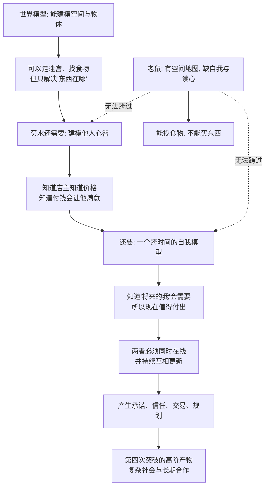

# 20｜为什么老鼠不能去杂货店买东西？——自我模型与复杂社会

> 老鼠会走迷宫，为什么不能完成"买东西"这种任务？

---

## 一、先说结论

班尼特的答案是：**逛一趟杂货店，需要的心智化操作多到离谱，而老鼠一样都没有。**

老鼠能学会走迷宫——那是第三次突破：它有一张空间地图（世界模型）。但"买东西"要求的不只是地图。它至少需要：

- 知道**店主知道价格**（别人的知识）；
- 知道**付钱会让店主满意**（别人的意图与情绪）；
- 知道**自己"将来"会需要某样东西**（一个跨越时间的自我模型）。

一句话：**老鼠能建模空间，却不能建模心灵，也不能稳定地建模"未来的自己"。**

第四次突破给了我们两样东西——**对他人心智的模型**，以及与之配套的**自我模型**。没有这两样，逛商店、比价、融资、规划人生，全都无从谈起。

---

## 二、我们先理解一个问题

先看一个感觉像脑筋急转弯、其实非常严肃的对比。

**任务 A：走迷宫。** 老鼠在迷宫里找到食物，学会走左边第三个岔路。这需要空间学习、路径记忆、目标导向——它做得很好，而且有大量实验证明它与海马体的"位置细胞"有关。**这是了不起的能力。**

**任务 B：去便利店买一瓶水。** 走进店里，拿起水，走到收银台，掏出钱，等店主找零，说谢谢，出门。

**为什么任务 B 反而"更难"？** 它看起来简单到三岁小孩都会，甚至不需要什么体力或技巧。但如果你把它拆开，会发现它其实是一串高度"心智化"的操作：

1. 我**相信**店里有水，**相信**价格是我能承受的；
2. 我**知道店主知道**价格，也知道他**想要**我把钱付给他；
3. 我**预期**如果我付了钱，他会**满意**、会让我带走水；
4. 我**知道**将来（回家路上、明天）我会**需要**这瓶水——所以现在值得花这笔钱；
5. 我**知道**他知道我没打算偷东西，我也**知道**他知道我知道这一点。

**注意：里面每一个环节，都是关于"心智"的，而不是关于"空间"的。**

所以真正的核心问题是：

> **能预测物理、能记住位置的老鼠，为什么跨不过"关于心智"的这一整类问题？**

---

## 三、作者到底提出了什么观点？

班尼特把第四次突破的成果概括为两个互相缠绕的能力：

**第一，心智模型：建模别人在想什么。**
**第二，自我模型：建模"我是谁、我在哪、我将来会怎样"。**

他认为这两者是**同一套机制的两个方向**：一台模拟器，对外用来预测他人，对内用来预测自己。而"逛商店"这种任务，恰好要求它们**同时在线、持续运行**。

| 任务 | 需要世界模型？ | 需要他人心智模型？ | 需要稳定自我模型？ |
|---|---|---|---|
| 老鼠走迷宫找食物 | ✔️ | ✘ | 弱 |
| 猴子结盟对付对手 | ✔️ | ✔️ | 弱 |
| 儿童学会"别人会被骗" | ✔️ | ✔️ | 弱—中 |
| 逛商店买东西 | ✔️ | ✔️ | ✔️ |
| 创业融资、长期规划 | ✔️ | ✔️ | ✔️✔️ |

班尼特的关键判断是：**自我模型是第四次突破里最晚、也最脆弱的一环。** 老鼠能建模外部空间，却缺乏一个"跨越时间的自己"——它很难为"明天的自己"做规划，也很难理解"我"这个概念在别人眼里意味着什么。

而人类之所以能买水、存钱、签合同、规划退休，正是因为我们在脑子里养着一个**稳定的"我"**，并让它和"他人心智"持续对话。

---

## 四、把这个观点翻译成人话

把"自我模型"想象成手机里的一张**个人档案**。

这张档案里存着：我是谁、我喜欢什么、我怕什么、我擅长什么、我上次做这类事结果如何、我未来想要什么。**每次做决定，你都会调用这张档案**："我上次买这个牌子踩过雷""我知道自己容易冲动，所以先放购物车等等再买"。

现在注意两个关键点。

**第一，这张档案必须"跨时间"存在。** 如果一个人只活在当下——没有"过去的我"、也没有"未来的我"——那"存钱""减肥""学习""守约"全都失去意义。因为这些事的本质都是：**现在的我，为将来的我，做一个可能有点难受的决定。**

**第二，这张档案必须能和"别人的档案"对接。** 买东西的时候，你在同时运行两张档案：我的（我需要水、我只有十块钱）和店主的（他进货花了钱、他想赚钱、他不会让我白拿）。**交易之所以能成立，是因为双方都在对方的自我模型里，放了一个"理性、会履约"的角色。**

老鼠缺的，正是这两样：**它可能有一点空间上的"目标"，但没有一个能跨越几天的"我"，也读不到"店主"心里那本账。**

---

## 五、为什么会这样？

我们把"为什么逛商店这么难"这条链推清楚。

这里有三层递进的意义。

**第一，世界模型是必要条件，但远远不够。** 没有空间导航，你连店门都找不到；但有了导航，你依然不会交易。**第三次突破解决"在哪"，第四次突破才解决"谁"和"我"。**

**第二，交易是一种"双重心理契约"。** 我付钱，是因为我相信你会交货；你交货，是因为你相信我会付钱。**这份信任里，既有对他人心智的预测，也有对自己"未来会守约"的承诺。** 缺了任何一半，交易就崩。

**第三，长期规划是"自我模型"的考试。** 存钱、锻炼、学习、买房，都是"现在的我"替"未来的我"做决定。**这要求你相信：那个未来的你，和现在的你，是同一个人，值得被照顾。**

而这恰恰是心智化最难的部分——**因为未来那个你，你也没法直接观测到。**

---

## 六、举一个现实生活中的例子

**例子一：便利店买东西。**

一个成年人进店买水，全程几乎不用思考。但请留意那些"自动发生"的心智操作：

- 拿起一瓶水时，你不是在检查"这瓶水存不存在"，而是默认**货架上的商品背后有一个定价与所有权系统**；
- 走到收银台时，你知道**要主动付款**，因为你知道店主**会盯着你**、也知道**他知道你知道他在盯你**；
- 刷卡时，你**相信**银行会记账、店主会认账——这是一连串关于"他人会守约"的预测。

**整场交易，其实是一场密不透风的心智化合作。** 我们之所以觉得它简单，只是因为它已经自动化到了意识之外。

**例子二：网购比价。**

你在几个平台之间比较同一款商品，加进购物车又删掉，等一个"可能的大促"。这里面有两层心智化：**一层是推测商家的策略**（他现在这个价是不是虚高？大促会不会更便宜？他是不是在"先涨后降"）；**另一层是推测"未来的自己"**（我现在真的需要吗？下周我还会想要吗？）。

**比价从来不只是比数字，它是在同时预测两个心智：商家的和未来的自己。**

**例子三：创业融资。**

创业者对投资人路演，本质上是在做高强度的双重心智化：一方面要建**投资人的模型**（他关心什么？他信不信这个市场？他最怕什么风险？他是不是已经投了竞品？）；另一方面要建**"未来公司"的模型**（这笔钱怎么花、三年后长什么样、我到时候还是不是那个能扛住的人）。

**投资人投的也从来不只是生意，而是"我信不信这个人能兑现他对未来自己的承诺"。** 这正是第四次突破能力，被推到了商业的最高阶。

---

## 七、回到书中重新理解

现在我们可以把"老鼠不能买水"这个玩笑，翻译成一条严肃的结论：

> **第四次突破的产物，不只是一个"读别人心"的工具，还包括一个"读自己心"的工具。而复杂社会，正是这两样东西共同撑起来的。**

班尼特框架里，有几条证据支持"自我模型是后起之物"这个判断：

**第一，儿童要到大约四岁，才稳定通过"错误信念测验"。** 在此之前，孩子很难理解"别人掌握的信息可能和我不一样"。而自我模型的发展与心智化的发展，时间上大致同步——**"我"和"别人"似乎是同时被点亮的。**

**第二，前额叶与自我控制高度相关。** 前额叶受损的病人，常常表现出冲动、难以规划、无法为长远目标克制当下欲望。著名的 Phineas Gage 案例（19 世纪一位工人被铁棍穿透前额叶后性格大变）以及后来大量的额叶研究都指向：**为"未来的我"做决定的能力，有其特定的神经基础。**

**第三，"延迟满足"把自我模型变成了可测量的东西。** Mischel 经典的"棉花糖实验"里，孩子面对"现在吃一颗"还是"等一会儿吃两颗"的选择。**能等更久的孩子，本质上是在用一个更强的"未来自我"来压过"当下自我"。** 后续研究（如 Hershfield 等人）进一步发现，"未来自我连续性"更强的人，储蓄更多、更愿意为长远打算。

**第四，动物是否有"心理时间旅行"，至今争议很大。** 有的研究（如 Clayton 与 Dickinson 对西丛鸦的研究）显示，会储藏食物的鸟似乎能为"明天早上没早饭"做准备，被一些研究者视为动物可能有"未来规划"的证据；但批评者认为这也可以用联想学习、本能或当下的饥饿状态来解释。**"动物能不能想到未来的自己"，正是这个领域最激烈的战场之一。**

---

## 八、这个观点背后还有什么？

**第一，它把"自我"从一个哲学概念，变成了一个工程概念。** "我"不是一个神秘的东西，而是一份**需要持续维护的内部档案**：记忆、偏好、目标、社会身份。**它也会出错、会断裂、会被改写**——失忆、人格解体、成瘾，都可以从这个角度看。

**第二，它解释了"信任"为什么珍贵又脆弱。** 交易需要"我相信你会守约"，而守约需要"你有一个能约束当下冲动的自我模型"。**一个社会如果人人都只活在当下，交易成本会高到经济无法运转。** 制度、契约、声誉，都是在给"未来的我"上锁。

**第三，它给"自由意志"问题提供了一个新角度。** 当你为未来的自己做决定时，究竟是谁在替谁决定？**这个"跨越时间的自我"，本身就是一个被建构出来的模型**，而不是一个一直坐在脑子里的稳定小人。

**第四，它暗示：教育的一个重要任务，是帮孩子建好这张"自我档案"。** 学会延迟满足、学会为后果负责、学会理解别人也在为他们的未来打算——**这些都不是知识，而是心智化与自我模型的发育。**

---

## 九、这个观点有问题吗？

有，而且"人类独有自我模型"这个立场，正在被动物研究不断挑战。

**第一，动物未必真的没有"未来自我"。** 前面提到的西丛鸦储藏食物、卷尾猴的经济行为、黑猩猩的长期联盟，都可能被解读为"为将来打算"。**反过来，认为动物"只能活在当下"，也可能只是我们实验设计不够好。** 这条界线，目前画得并不牢固。

**第二，"承认动物有初级心智化"会削弱人类独特性吗？** 这是很多争论背后的情绪。**但科学上，更可能的图景是连续的**：从"读目标"到"读知识"到"读错误信念"，很多动物各占一段。人类或许只是把每一段都推到了很深的层次，而不是唯一拥有。

**第三，把复杂社会行为都归因于"心智化"，可能是过度解释。** 一个行为看起来像"为别人着想"，也可能只是本能、条件反射、或简单的联想学习。**"它看起来在规划"不等于"它在模拟未来的自己"。** 这是行为解释中最常见的陷阱。

**第四，自我模型是否真的"统一"，值得怀疑。** 心理学里越来越多的证据显示，人并非只有一个统一的自我，而是有许多**情境化的自我**（工作中的我、家庭中的我、网络上的我），彼此甚至互相矛盾。"一个稳定的自我模型"可能本身就是一种方便的说法。

**所以更准确的说法是**：把"逛商店"拆解成"他人心智+跨时间自我"是极有洞察力的；但"老鼠完全没有、人类完全拥有"这种黑白分明的划分，既可能低估动物，也可能高估我们自我的一致性。

---

## 十、今天再看这个观点

以下部分是基于作者思想的现代延伸。

**延伸一：消费信贷与"未来的我"。** 分期付款、花呗、信用卡，本质是在**交易"未来的我"的承诺**。这个系统能运转，靠的是绝大多数人拥有一个"会还钱的未来自我"。而当这种连续性被削弱（比如短视、成瘾、极端压力），违约就会上升。

**延伸二：AI 没有"自我模型"这件事，比想象中重要。** 一个没有稳定自我模型、也没有"未来意图"的系统，可以在单次任务里表现惊人，却很难**承担长期承诺**。这就是为什么"让 AI 替你谈判、替你签约、替你经营一段关系"，会带来一种根本的不安——**它没有那个会为明天负责的"我"。**

**延伸三：产品设计在偷偷利用你的自我模型。** 会员、连续打卡、进度条、养成类游戏，都在制造一种"未来的我"的承诺感，让你为"不想让过去的努力白费"而持续投入。**这也是心智化的武器化。**

**延伸四：一个反复出现的信号。** 从第 17 篇到现在，AI 的短板一直落在同一个地方：**它擅长处理可观测的世界，不擅长处理那个不可观测的"内部世界"——无论是别人的，还是自己的。** 这将是判断"第六次突破"的关键。

---

## 十一、这一篇真正应该记住什么？

1. **逛商店是"心智化马拉松"：** 要同时建模店主的心理和"未来自己"的需求，缺一不可。

2. **老鼠能建模空间（世界模型），却不能建模心灵与跨时间的自我。** 这概括了第三次与第四次突破的差距。

3. **自我模型与心智模型是同一台机器的两个方向：** 对外读人，对内读己。

4. **证据线索：** 儿童约四岁通过错误信念测验、前额叶与自我控制、棉花糖式的延迟满足、"未来自我连续性"研究；动物是否有"心理时间旅行"仍有争议。

5. **交易、信任、长期规划、契约，都是"他人心智+跨时间自我"共同撑起来的社会产物。**

---

## 十二、留一个问题

> 如果"能替未来的自己负责"才是第四次突破最深的那一层，
> 那么一个能预测世界、能陪聊、却没有任何"未来自我"的 AI，
> 它到底是缺少了一种能力，
> 还是根本缺少一个愿意为明天负责的"谁"？

---

**下一篇**：到这里，四次突破都讲完了。但真正让人类甩开其他物种的，还不是读心——而是一种能把脑内的模型"复制"到别人脑子里的能力。

下一篇我们进入第五次突破：**人类到底特殊在哪里？——寻找"独特性"的三条线索。**

---

*本系列基于 Max Bennett《A Brief History of Intelligence》整理，文中"班尼特认为/书中认为"均指作者观点；带"延伸"字样的段落为基于其思想的现代推演，不代表原作者。*
