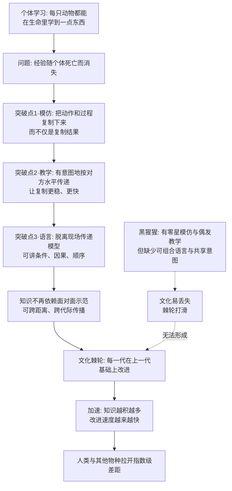

# 21｜人类到底特殊在哪里？——寻找“独特性”的三条线索

> 在智能的进化史上，人类究竟特殊在哪里？

---

## 一、先说结论

班尼特的答案是：**我们并不是赢在感官、力气或者记忆，甚至不是赢在某一种别的动物完全没有的能力上。**

真正的候选答案只有三条线：**语言、模仿、教学**。单看每一条，黑猩猩都沾一点边——它们有简单的声音交流，能模仿一些动作，偶尔也会"教"幼崽。人类特殊的地方，不是拥有某一件黑猩猩没有的零件，而是**这几样能力叠加成了一套"把知识稳定传下去"的机制**。

换句话说：**独特性不在零件里，在组合里。** 黑猩猩有零件却装不成机器；人类把零件拼成了一台会自我加速的传承装置。

---

## 二、我们先理解一个问题

先问一个看似简单、其实很扎人的问题：**如果把你和一只黑猩猩同时丢进森林，谁活得更好？**

答案大概是黑猩猩。它爬树更快、力气更大、感官更灵、对野外环境的直觉判断也远胜你。论"单兵作战能力"，人类在动物界里顶多算中下游：跑不快、咬不动、皮薄、幼崽还特别晚熟。

那为什么最后统治地球的是我们，而不是黑猩猩？

一个常见的直觉答案是"因为我们更聪明"。但这几乎是同义反复——**问题恰恰是：这个"更聪明"到底指什么？** 是记忆更好？算得更快？还是感知更细？

现代研究给出的答案有点反直觉：人类的**个体学习能力**并没有比类人猿强多少。在不少一对一测试里，黑猩猩在工作记忆、数字快速辨识、空间推理上甚至能赢过大学生。人类真正夸张的地方，不在"我一个人能学会什么"，而在**"我们一群人能一起积累什么"**。

于是真正的问题变成了：

> **在语言、模仿、教学这三条线索里，究竟哪一条才是人类独特性的钥匙？还是说，钥匙不是其中任何一条，而是它们的组合？**

---

## 三、作者到底提出了什么观点？

班尼特在讲第五次突破时，把问题从"哪一种能力让人特殊"重新表述为"**哪一套机制让知识可以累积**"。

他列出三条候选线索，并逐一指出：人类和黑猩猩的差别，往往不是"有与无"，而是"深与浅、稳与不稳"。

| 线索 | 黑猩猩有什么 | 人类多了什么 | 差别的性质 |
|---|---|---|---|
| 语言 | 简单呼叫、手势，能表达"我要那个" | 可组合的符号系统，能表达"如果……那么……" | 不是有没有，而是能不能承载抽象与嵌套 |
| 模仿 | 能观察并复制结果（工具能撬出食物） | 连"动作的细节和过程"一起照搬 | 不是会不会，而是复制得准不准 |
| 教学 | 偶发地放慢动作、留出机会 | 主动、有意图、按对方水平调整 | 不是会不会，而是有没有"我想让你学会" |

请注意这张表的逻辑：**每一条线索上，黑猩猩都不是零，人类也不是从零到一。** 真正的分水岭在于，人类这三条线索是**互相咬合**的——

- 教学需要模仿：老师得能预演"学生看到我这样做会学成什么样"；
- 模仿需要心智化：得把对方的动作理解成"有意图的行为"，而不只是"环境发生了变化"；
- 语言让前两者能脱离现场：不必当着面示范，一句话就能把方法传下去。

班尼特的关键判断是：**单独任何一条线，都不足以解释人类；三条线叠加，才产生了"文化棘轮"这种别处没有的加速现象。**

而 Tomasello 的研究正是这条思路最重要的证据来源。他提出"**共享意向性**"（shared intentionality）：人类特有的，不只是"我知道你在想什么"，而是"**我们俩知道我们在共同做同一件事**"。黑猩猩会为了各自的目标并行行动，但很难真正共享一个目标；而一岁多的人类幼童，已经会通过"共同注视"和"给信息"来建立一种"我们"。

---

## 四、把这个观点翻译成人话

用一个更直白的比喻：**人类不是拥有一块别人没有的肌肉，而是拥有了一整套"接力装置"。**

黑猩猩像是一个天赋极高的独跑选手——单圈速度可能比你快，但它跑完自己那一圈，成绩就归零了。它的经验会随它一起死掉。

人类像一个接力队。每个人跑得未必最快，但**接力棒不会掉**：上一代摸索出来的方法，能原封不动地交到下一代手里，下一代再往上加一点。跑一千年，差距就不是"快一点"，而是"多出整整一段赛程"。

这里要特别注意三件事：

**第一，"模仿"不等于"照着做"。** 黑猩猩看到同伴用石头砸开坚果，它学到的是"石头能砸开坚果"这个结果，然后用自己的方式去砸。人类小孩学到的是"他是这样拿、这样敲、这样翻面"——连效率看起来不高的细节都照抄。这种"过度模仿"乍看很傻，实则是文化传承的关键：**它保证了方法的原样保存，包括那些一时看不出用处、但将来可能有用的步骤。**

**第二，"教学"不等于"示范"。** 一只猫把老鼠带给小猫，那是让小猫自己琢磨；而人类老师会**根据学生的水平调整**——他知道你已经会哪一步、卡在哪一步，然后专门补那一步。这要求老师在心里同时运行"我知道什么"和"你以为你知道什么"两个模型。这正是第四次突破的心智化能力。

**第三，"语言"不等于"发声"。** 会喊叫的动物很多，能把"我先做 A，如果不行再做 B"讲给别人听的动物几乎没有。语言的厉害不在于有声音，而在于它**能携带一个模型**：时间顺序、条件、因果、否定。

---

## 五、为什么会这样？

为什么偏偏是这三条线凑在一起，才产生了"文明"这种别人没有的东西？

这条链有三层递进。

**第一层：模仿解决"复制保真度"。** 没有高保真的模仿，每一步传递都会走样，改进就无法累积。就像传话游戏，每传一次就变形一次，最后跟原话毫无关系。**高保真复制，是累积的前提。**

**第二层：教学解决"复制效率"。** 光靠自己观察，学习慢且容易漏。教学相当于把"试错成本"从学习者身上转移给老师——老师用自己已有的模型，为学生指出捷径。这让知识传递从"随机、昂贵"变成"定向、便宜"。

**第三层：语言解决"脱离现场"。** 示范和模仿都需要双方在场。语言一旦出现，模型就能被压缩成符号，隔着时间、空间、甚至隔着死亡传递下去。**文字出现后，这根接力棒甚至可以不依赖任何活人先记住它。**

结果就是：**别人的文化会丢失，人类的文明会累积。** 这不是因为人类更聪明，而是因为人类建立了一个别人没有的、会自我加速的循环。

---

## 六、举一个现实生活中的例子

看看你身边最普通的三个场景，它们其实都是这三条线索的现代版本。

**场景一：公司里的师徒制与新人培训。**

一个新员工入职，公司不会让他从零摸索"报销怎么走流程""客户为什么在这个环节最容易翻脸"。这些经验被压缩成员工手册、SOP、内部分享。老师傅带徒弟，是一种面对面的模仿与教学；而写进文档的流程，就是语言的延伸。

**一家公司真正的护城河，往往不是它现在有多少高手，而是它能不能把高手脑子里的东西，稳定地交给下一批人。** 有些公司人一走业务就塌，问题不在员工，在于它的"棘轮"是坏的——知识没能被复制、被保留。

**场景二：刷短视频学做菜。**

你看着一个视频学"红烧肉怎么做"。注意你在做什么：你不是在"看结果"，你在**逐帧模仿**——先焯水、再炒糖色、加多少水、炖多少分钟。视频无法互动，你甚至会把"没必要"的步骤也照做（比如博主习惯性加一句"来点料酒去腥"，你明明没有料酒也要想办法）。

这就是**过度模仿**最日常的样子：我们倾向于完整复制一套流程，而不是只复制"能立刻见效的那部分"。它看起来浪费，却正是让一道菜、一门手艺在千万人之间保持一致的机制。

**场景三：孩子模仿大人。**

三四岁的孩子会学大人打电话、拿杯子、甚至学大人叹气的语气。他并不理解为什么要这样做，他是在**复制一个角色**。这背后正是"共享意向性"在发育：孩子不只是模仿动作，他在努力成为"像你那样的人"，进入"我们"这个世界。

---

## 七、回到书中重新理解

现在我们可以把这一篇放回班尼特的框架里。

前四次突破，解决的都是"**一个大脑内部**"的问题：怎么分辨好坏、怎么学会行动、怎么想象未来、怎么揣摩他人。而第五次突破解决的，是一个全新的问题：

> **怎么把某个大脑内部的模型，复制到另一个大脑内部？**

这就是为什么"独特性"是一条组合线索，而不是一个天才零件。语言、模仿、教学，本质上都是"复制模型"的不同通道：

- 模仿复制的是**动作模型**；
- 教学复制的是**经过优化的动作模型**；
- 语言复制的是**抽象的世界模型和心智模型**。

三条通道叠加，人脑就不再是一座座孤岛，而是一张可以互联的网络。**单个大脑再聪明也比不过集体；而人类第一次让"集体"这个词有了实质意义。**

班尼特想强调的是：人类的独特之处是**社会性认知**的胜利，而不仅仅是某个认知模块的胜利。这也解释了为什么人类婴儿如此"无能"却有如此强的可塑性——**他不需要从零重建一套模型，他生下来就是为了接收前人已经建好的模型。**

---

## 八、这个观点背后还有什么？

**第一，它把"文化"从软话题变成了硬机制。** 文化不再只是"风俗、艺术、习惯"，而是一套**信息传递系统**，其核心指标是保真度和累积速度。这让"文化演化"可以用近似生物演化的方式来研究：变异（创新）、选择（有用与否）、遗传（模仿与教学）。

**第二，它重新定义了教育。** 如果人类的核心优势是"累积"，那教育就不是知识灌输，而是**在维护和加速棘轮**。一个社会的教育水平，本质上决定了它的棘轮转得多快。

**第三，它暗示"共享意图"比"共享信息"更根本。** 信息传递动物也能做一些；难的是双方都明白"我们在共同完成一件事"。这是人类合作的底层操作系统，也是信任、契约、规范得以出现的心理前提。

**第四，它给 AI 提出了一个尖锐问题。** 如果一个系统能高效复制知识，却没有任何"共享意图"，那它算不算进入了第五次突破？还是说，它只是一个人在没人的房间里自言自语？

---

## 九、这个观点有问题吗？

有，而且"人类独特性"本身就是学术圈争论最激烈的战场之一。

**第一，"独特"到底是质变还是量变，没有公论。** Tomasello 一派强调人类有"共享意向性"这种质的不同；另一派（如一些比较认知研究者）则指出，很多差异在更精细的实验里会缩小——黑猩猩在合适的社会环境里，模仿和工具使用能力可以比早期实验显示的强得多。**把"我们特殊"讲得太绝对，可能只是实验方法还没找对。**

**第二，"其他动物也有文化"已经被大量证据支持。** 不同地区的黑猩猩有不同的"习俗"（用石头砸坚果、用树叶钓白蚁的手法各不相同），鲸鱼和鸟类也有代际传递的"歌曲方言"。所以更准确的说法或许是：**动物有文化，但没有会"打滑"的文化**——它们的传统容易丢失，难以累积。重点在"棘轮"，不在"文化有无"。

**第三，语言是不是唯一关键，存在严重分歧。** 有学者认为，人类的成就是模仿和合作先行的结果，语言只是后来的放大器；也有学者（如 Chomsky 传统）认为语言才是那个"枢纽"。班尼特的"组合论"是一种折中，好处是不得罪任何一方，坏处是——**它也可能因此难以被证伪。**

**第四，"组合论"容易变成事后解释。** 当一种能力被证明动物也有，我们就说"关键在于组合"；当组合也说不通时，我们还可以说"关键在于意图"。**这种灵活是优点，但也提醒我们：它更像一张理解地图，而不是一个可检验的科学定律。**

---

## 十、今天再看这个观点

以下部分是基于作者思想的现代延伸。

**延伸一：企业的"文化棘轮"比人才更重要。** 一个组织能不能穿越人员流动而保持能力，取决于它的知识是否被保真复制——SOP、文档、师徒制、复盘会，本质都是在修棘轮。**只靠招聪明人的公司，往往跑不过会沉淀的公司。**

**延伸二：社交媒体的模仿是双向刃。** 短视频把"模仿"的成本降到接近于零，一个动作、一套流程、一种话术，可以在几天内传遍全网。但高保真复制也会复制**错误和偏见**——谣言、伪科学、极端行为，同样能"棘轮"式地累积和变体。**复制机制的强度，不等于复制内容的质量。**

**延伸三：AI 的出现第一次让"知识复制"不再需要人。** 孩子学母语要几年，老师带徒弟要几年，而模型蒸馏、微调、prompt 可以在一夜之间把一套能力复制到任意多个副本。**人类引以为傲的"把知识传下去"，正在被一种机器复制机制接管。** 这会让棘轮转得史无前例地快，也让我们更该问：**这次是谁在拧棘轮，拧向哪里？**

**延伸四：一个反复出现的信号。** 从前几篇到现在，人类真正难被复制的，从来不是"处理信息"，而是"想和别人一起做一件事"。**共享意图，可能比共享知识更接近人之为人的核心。**

---

## 十一、这一篇真正应该记住什么？

1. **人类不是赢在某个独特零件，而是赢在组合。** 语言、模仿、教学，每一项黑猩猩都沾一点边，叠加起来才成为"传承机制"。

2. **模仿的价值在"保真"，教的价值在"定向"，语言的价值在"脱离现场"。** 三者分别解决复制、效率、距离的问题。

3. **人类个体学习能力并不比类人猿强多少，真正的差距在"集体累积"。** 别把物种的胜利误读成个体的聪明。

4. **共享意向性（Tomasello）是重要线索：** 人类不只知道对方在想什么，还能建立"我们在一起做同一件事"的共同目标。

5. **关键概念是"棘轮"而非"文化有无"：** 动物也有传统，但只有人类的文化会稳定累积、不会轻易打滑。

---

## 十二、留一个问题

> 如果人类的特殊性只是"三条线索的组合"，
> 那么当 AI 能以机器的速度和保真度复制知识，
> 它缺少的那条线索，究竟是共享意图，
> 还是它根本不需要意图，也能把整台棘轮转得比我们更快？

---

**下一篇**：我们已经找到人类独特性的三条线索，其中最难被解释的，是语言。语言到底是一种与生俱来的"新器官"，还是被通用大脑"安装"上去的一套学习程序？

下一篇我们就来拆这个问题：**语言是一种新器官，还是一套"学习程序"？**

---

*本系列基于 Max Bennett《A Brief History of Intelligence》整理，文中"班尼特认为/书中认为"均指作者观点；带"延伸"字样的段落为基于其思想的现代推演，不代表原作者。*
