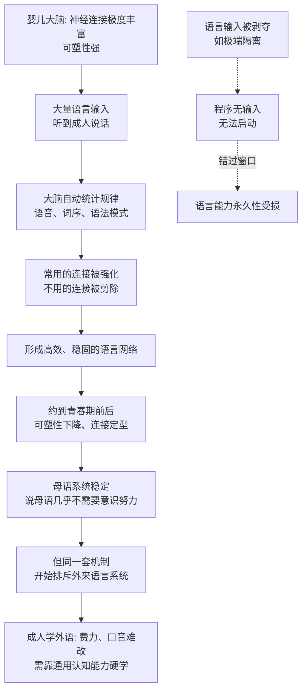

# 22｜语言是一种新器官，还是一套“学习程序”？

> 人脑里有没有一块专门管语言的"区域"？

---

## 一、先说结论

班尼特的答案是：**人脑里没有一块别的动物都没有的、单独负责语言的"新器官"。**

我们有的，是一套别处没有的**学习程序**——一套让儿童在几年之内、不用背语法、不用被纠正，就能自动把母语学会的行为模板。布罗卡区、威尔尼克区是真实存在的，但它们是**参与语言加工的通用网络节点**，不是一块"语言专机"。

这个区分很重要，因为它解释了一个奇怪的现象：**学语言越早越容易，越晚越难。** 如果语言是硬件，那装上就应该能用；但事实是，这套程序有窗口期。语言更像被"安装"进通用大脑的一套软件，而安装窗口只在童年敞开。

---

## 二、我们先理解一个问题

先看一个几乎每个人都经历过的对照。

一个孩子，从不会说话到能说一口流利的母语，只需要三四年。没人给他讲"主谓宾"，没人让他做语法填空，他听到的还是充满口误、断句混乱、方言混杂的日常对话。可他就是学会了，而且学会的是**规则**——他会说出"我从来没听过、但完全正确"的句子。

同一个成年人，学一门外语，花了十年。他背了单词、刷了语法书、做了无数练习题，考试能考高分，可一开口仍然别扭，发音、语感永远差一口气。

**为什么"小孩子毫不费力就学会"的事，成人投入巨大努力却很难达到母语水平？**

一个常见解释是"小孩记忆好、成人惰性大"。但这解释不通：成人背单词的记忆力明明更强，成人也更自律、更有毅力。真正的原因，似乎不是努力问题，而是**大脑的运行方式变了**。

于是问题变成：

> **语言到底是被"长"在脑子里的一个器官，还是一段被"安装"进来的程序？如果是程序，那么它的安装窗口为什么会关闭？**

---

## 三、作者到底提出了什么观点？

传统上，人们倾向于把语言看成一个"器官"：大脑里应该有一块或几块专门管语言的区域，就像心脏有瓣膜、眼睛有视网膜一样。

班尼特（与许多现代认知科学家的方向一致）更倾向另一种看法：**语言使用大脑里本来用于其他用途的通用回路，只是把它们重新组织了一遍。** 换句话说，没有"语言脑"，只有"被语言征用的大脑"。

他把第五次突破描述为：**给一个已经能模拟世界、能读心的通用大脑，加装了一套"可共享模型"的机制。** 语言不是凭空多出来的器官，而是这套共享机制的产物。

我们用一个表来对照两种观点。

| 问题 | "新器官"假说 | "学习程序"假说 |
|---|---|---|
| 语言能力从哪来 | 专门的先天模块，天生就有 | 通用回路 + 一套先天学习本能 |
| 脑区 | 布罗卡区/威尔尼克区是"语言器官" | 它们是加工网络节点，也参与其他任务 |
| 为什么孩子学得快 | 因为模块在发育成熟 | 因为学习窗口在童年打开 |
| 为什么成人难学 | 模块已"关闭" | 学习窗口收窄，大脑已重组 |
| 动物为何学不会 | 它们没有这个器官 | 它们没有这套教学/共享意图 |
| 关键证据 | 语言损伤有特定脑区定位 | 关键期、FoxP2 的调节作用、输入的作用 |

**请注意：这两个假说并不完全互斥。** 现代主流更接近一种折中：人类确实有**先天的语言准备**（比如对语音、对句法结构特别敏感），但这些准备更像"学习程序"而不是"完整器官"——它必须先被语言输入触发，才能长成真正的语言能力。

---

## 四、把这个观点翻译成人话

用一个更贴近生活的比喻：**语言不是出厂预装的软件，而是一段"必须联网、在特定时期自动下载安装"的程序。**

想一想你手机里的系统更新。它有几个特点：

**第一，它自动、无需理解。** 一个孩子学会语法，就像系统自动更新，他完全不知道"什么是指代、什么是递归"，但装完之后就能正确运行。**这就是为什么学母语不用背语法书——因为规则是被"吸收"的，不是被"理解"的。**

**第二，它有安装窗口。** 如果错过了那个窗口，再想装就变得极其别扭。成人学外语，像是在系统已经稳定运行多年之后，硬塞进一套新模块——能装，但会和现有系统冲突，运行起来总不顺畅。

**第三，它需要输入才能安装。** 程序本身是准备好了的，但没有语言环境，它不会启动。**这就是为什么"狼孩"或极端隔离环境下的孩子，即使大脑完好，也学不会语言。**

**第四，它不是某个单独零件，而是调用整台机器的能力。** 说话要用到听觉、发音肌肉、记忆、语义、社交理解——语言不是一块芯片，而是**整个大脑协作的一种新用法**。

这就是"学习程序"这个说法的核心：**人类真正独特的，不是拥有一块语言零件，而是拥有一段"看到别人说话，就自动学会说话"的冲动和机制。**

---

## 五、为什么会这样？

为什么"学习程序"必须有窗口期？为什么越晚越难？

这条链有三个关键点。

**第一个关键点：学习靠的是"统计吸收"，而不是"规则讲解"。** 一个婴儿听到的语料里，"我吃"总在"饭吃"之前出现，某些音节总是跟着某些音节。大脑自动把这些规律变成直觉。**我们以为自己在"学语法"，其实是在"统计环境"。**

**第二个关键点：可塑性是把双刃剑。** 儿童大脑连接丰富、可塑性强，所以学什么都快；但可塑性意味着"还没定型"。随着发育，常用的连接被强化、不用的被剪掉，大脑变得更高效，也更难改变。**母语之所以稳固，正是因为它把大脑"定型"了——而定型也是成人学外语困难的根源。**

**第三个关键点：窗口不是一扇门，而是一段逐渐收窄的坡。** 关键期不是某一天突然"关门"，而是能力随年龄递减。有人能在成年后学到接近母语的水平，只是概率更低、代价更高。**所以"关键期"更准确的理解是"敏感期"。**

---

## 六、举一个现实生活中的例子

**例子一：孩子学母语——看不见的"程序安装"。**

一个两岁的孩子从没被教过"过去式"。可到了某个阶段，他会突然说"我吃过了""我跑掉了"——甚至会**过度规则化**：把"go"说成"goed"，把"跑"说成"跑了"然后再纠正成"跑过去"。

这个现象本身就说明：孩子不是模仿大人说的每一句话（大人不会说"goed"），而是在**主动提取规则、生成新句子**。这正是"学习程序"在运行——它不是录音机，它是一台会自动归纳语法的机器。

**例子二：成人学外语——程序与系统打架。**

成年人学英语，往往先想中文、再翻译成英文，说话慢、口音重。这不是不努力，而是他必须调用"通用认知能力"（记忆、逻辑、翻译）去补偿已经收窄的语言学习窗口。孩子学语言是"吸收"，成人学语言是"攻克"——**一个是让系统自动更新，一个是手动改系统配置。**

**例子三：方言的自动习得。**

一个在四川长大的孩子，不需要学"四川话语法"，就能听懂、能说。而一个成年后才到四川的人，往往只能说"标准普通话腔调 + 几个方言词"，永远进不去那种语感。**方言和外语的差别，只在"有没有在窗口期泡在里面"，不在难度本身。**

**例子四：AI 学语言 vs 孩子学语言。**

大模型可以"读完"整个人类的文本，能写出通顺的文章，但它没有关键期，也没有一个"想和别人共同做事"的意图。它学的是**语言的分布规律**，孩子学的是**语言背后的心智和世界**。这一点，是后面几篇要反复回到的分界线。

---

## 七、回到书中重新理解

现在把这一篇放回班尼特的框架。

第五次突破的关键，不是"人类长出了说话器官"——猩猩的声带和大脑其实具备不少条件。关键是：**人类拥有了一套愿意、也能够把模型复制出去的学习机制，并且这套机制有一个天然的发育窗口。**

这解释了几个一直困扰人的事实。

**第一，为什么语言是"人人都有"的能力？** 因为它是程序，不是天赋。任何一个在正常环境里长大的孩子，不论智商高低，都会说母语——**语言不是聪明人的专利，而是人类的标配。** 班尼特强调这一点的用意是：语言不是一个"高级技能"，而是一个"基础设施"。

**第二，为什么布罗卡区、威尔尼克区这么出名？** 因为损伤它们会带来特定的语言障碍，这让人误以为"找到了语言器官"。但更准确的图景是：**它们是语言网络里的关键枢纽，而不是为语言专门设计、别的功能一概不干的零件。** 同一个区域在别的认知任务里也可能被调用。

**第三，为什么语言能力会随年龄退化？** 因为它依赖可塑性，而可塑性是"发展期"的礼物。**这不是大脑变懒了，是大脑成熟了。** 成熟带来效率，也带来僵化。

班尼特想让我们看到的是：**语言不是神秘的奇迹，而是一套可以被理解、也应该被理解的机制。** 理解了它，才谈得上理解"为什么 AI 学语言这么快，却还是不像人"。

---

## 八、这个观点背后还有什么？

**第一，它把"先天 vs 后天"从对立变成了组合。** 语言既不是纯粹天生，也不是纯粹环境教出来的。它更像**先天程序 + 环境输入**的合奏：程序提供学习的能力和偏好，环境提供学什么的内容。这个框架比"全先天"或"全后天"都更符合证据。

**第二，它给"母语思维"提供了物理基础。** 为什么人很难摆脱母语的思维习惯？因为母语在窗口期塑造了大脑的连接结构，它不只是"会说的语言"，而是**思考世界的默认格式**。

**第三，它解释了教育的"时机价值"。** 语言、音乐、某些运动技能，都有关键期。**在这些窗口里投入，事半功倍；窗口过了再补，事倍功半。** 这不是鸡汤，是神经可塑性的经济学。

**第四，它给 AI 的"语言天才"泼了一点冷水。** 如果人类语言能力的关键是"以共享意图为目标的、在发育窗口里自动吸收的学习程序"，那么一个只优化"下一个词预测"的模型，即使输出再流畅，走的也可能是另一条路。

---

## 九、这个观点有问题吗？

有，而且这是全书争议最集中的一章。

**第一，Chomsky 传统会强烈反对"语言只是学习程序"。** 乔姆斯基一派主张人类有先天的"普遍语法"，语言能力的核心是一套与生俱来的结构约束，而不是统计吸收。他们认为，儿童接触到的语言输入太少、太杂（所谓"刺激贫乏"），不足以靠统计学会语法，所以必有先天结构。**这一派与"统计学习派"的争论至今没有定论。**

**第二，"语言是人类独有"这个前提本身在被挑战。** 有些研究显示，动物在训练后能掌握符号组合、能理解简单句法；也有研究认为，动物交流系统比我们以为的复杂得多。**人类语言和动物交流之间，可能也是连续的，而不是断崖式的。**

**第三，关键期并没有那么绝对。** 大量案例表明，成年后学语言达到很高水平是可能的，只是更费力。"关键期"更像统计上的敏感期，而不是不可逾越的墙。**把它讲得太绝对，容易变成对成人学习者的心理暗示。**

**第四，失语症案例的解读需要非常小心。** 布罗卡和威尔尼克的工作是里程碑，但个案（比如有名的"Tan"病人）往往被后人过度简化、甚至猎奇化。**极端剥夺案例（如"野孩子"Genie）更是如此：它们确实揭示了语言与发育窗口的关系，但这些孩子同时承受了严重的心理创伤，把他们的遭遇简单当成"语言实验"，既不科学，也不道德。** 读这些案例时，应当保持克制与敬意。

**第五，语言与思维的关系没有定论。** 语言是否"决定"思维，是上一个世纪延续到今天的争论。强版本（语言决定论）基本被否定，但弱版本（语言影响某些认知）有不少证据支持。**这个问题我们会在第 24 篇正面遇到。**

---

## 十、今天再看这个观点

以下部分是基于作者思想的现代延伸。

**延伸一：AI 的"语言能力"和孩子的"语言能力"不是一回事。** 孩子学语言，目标是**理解并参与共同活动**；模型学语言，目标是**预测下一个词**。前者自带世界与意图，后者只有统计规律。这就是为什么模型可以妙笔生花，却可能在最简单的常识上翻车。

**延伸二：语言的"安装窗口"正在被工具补偿。** 翻译软件、语音输入、实时字幕，正在把"语言能力"外包给机器。**这对成年学习者是解放，但也可能让人类整体的语言学习动机下降。** 一项能力一旦可以外包，它的普及度往往会退化。

**延伸三：会多门语言的人，不只是"多会几套词"。** 如果语言塑造了思维的默认格式，那么掌握多门语言，可能意味着拥有多套思考世界的方式——**这或许是一种被低估的认知财富。**

**延伸四：对 AI 的真正考验，不是"说得像不像人"，而是"它有没有一个可以被语言共享的内部模型"。** 如果它内部没有一个稳定、可被指涉的世界模型和心理模型，那么它的语言再流畅，也只是"语言的影子"，而不是"心灵的窗口"。**这正是下一批文章要追问的核心。**

---

## 十一、这一篇真正应该记住什么？

1. **语言不像"新器官"，更像"学习程序"。** 它是被安装进通用大脑的能力，而非一块专门硬件。

2. **布罗卡区、威尔尼克区是真实的关键节点，但不是专属"语言器官"。** 它们参与语言加工，也可能参与其他任务。

3. **关键期（或敏感期）解释了"越早越容易"。** 儿童靠自动吸收，成人靠通用认知硬学，差别在可塑性而不在努力。

4. **语言是人类的"标配"，不是天赋特权。** 正常环境下人人都会母语，说明它是一套基础设施，而非高级技巧。

5. **关于语言的起源有多种竞争理论（乔姆斯基的普遍语法 vs 统计学习）。** 把任何一派当成定论，都为时过早。

---

## 十二、留一个问题

> 如果语言真的只是一套"学习程序"，
> 那么当一个模型读遍了人类所有的文字、却从未在童年"安装"过它，
> 它学会的究竟是语言本身，
> 还是一套极其逼真的语言仿制品？

---

**下一篇**：语言是一套程序，但程序要发挥作用，还得有配套的机制。语言、模仿、教学三者一旦撞在一起，会发生什么？

下一篇我们就来看这场"完美风暴"：**语言、模仿与教学如何叠加出文明？**

---

*本系列基于 Max Bennett《A Brief History of Intelligence》整理，文中"班尼特认为/书中认为"均指作者观点；带"延伸"字样的段落为基于其思想的现代推演，不代表原作者。*
