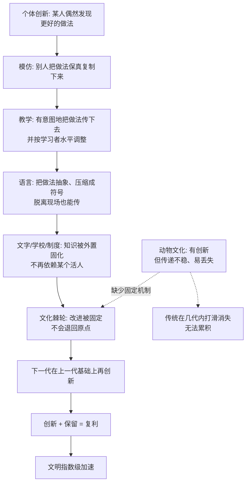

# 23｜“完美风暴”：语言、模仿与教学如何叠加出文明？

> 为什么只有人类能把知识一代代累积起来？

---

## 一、先说结论

班尼特的答案是：**因为人类同时凑齐了三样东西——语言、模仿、教学，它们撞在一起，形成了一台"文化棘轮"。**

语言让一个人脑中的模型可以被复制进另一个大脑；模仿让技能被保真地复制；教学让复制变得定向而高效。三者叠加，知识就不再随个体死亡而消失，而是**每一代都站在上一代的肩上往上走**。

单个人只能活七十多年，但知识可以活几千年。别的物种也有文化，但没有这套棘轮——所以它们的传统会丢失，而人类文明会加速。

---

## 二、我们先理解一个问题

先看两个实验，放在一起看会非常刺眼。

**第一个：黑猩猩有"地方文化"。** 在野外，不同地区的黑猩猩群体有不同"习俗"：这一群用石头砸坚果，那一群用树叶钓白蚁；这一群有某种理毛姿势，那一群没有。这些差异不是基因决定的，而是**学来的、传下去的**——这就是文化。

**第二个：人类的"棘轮"。** 人类的技术几乎从不停留在原地：石斧变成了铁斧，铁斧变成了蒸汽机，蒸汽机变成了芯片。每一代人都不是"重新发明一遍"，而是**从上一次停下的地方继续往前推**。

现在关键的问题来了：**既然黑猩猩也有文化，为什么它们的文化几万年几乎没变，而人类的技术会指数级增长？**

答案不是"人类更有创造力"。黑猩猩也发明新东西，乌鸦会用工具，海豚会传技巧。**问题不在"能不能创新"，而在"创新能不能留住"。**

于是真正的问题变成：

> **为什么人类的创新会被保存、叠加、复利，而其他物种的创新往往用一次就丢了，甚至从群体里彻底消失？**

---

## 三、作者到底提出了什么观点？

班尼特借用了 Tomasello 的一个核心概念：**文化棘轮（ratchet effect）。**

"棘轮"是一种只能单向转动的齿轮：你可以把它往前拨一格，它不会自己退回去。人类的文化就是这样——**改进一旦发生，就有机制把它固定住，等下一次改进叠加上来。** 而动物的文化更像"打滑的轮子"：好不容易往前一步，稍不留神就滑回原点。

那么，棘轮的"齿"是什么？班尼特认为是三样东西的合力。

| 机制 | 它解决的问题 | 缺了它会怎样 |
|---|---|---|
| 语言 | 模型可以脱离现场传递 | 知识只能靠当面示范，传不远、传不久 |
| 模仿 | 复制要有足够保真度 | 每传一代就走样，改进无法累积 |
| 教学 | 传递要定向、高效 | 学习靠碰运气，成本高、速度慢 |

请注意：**这三样没有一样是"人类全新发明的"。** 黑猩猩有手势、有模仿、偶尔有"教"。人类的特殊之处，是这三样**同时达到足够高的水平，并互相咬合**——模仿为教学提供内容，教学为模仿提供效率，语言把两者从现场解放出来，让它们可以跨越时空。

Tomasello 用一句话概括了棘轮的核心：**人类文化的独特，不在于我们更会创新，而在于我们"更忠实地传递"创新。** 忠实传递，听起来一点都不酷，但它是复利的前提。

---

## 四、把这个观点翻译成人话

用一个最直白的比喻：**文明不是一场百米赛跑，而是一场接力赛。**

想想两种团队。

**第一种团队：每个人都单干。** 每个人跑一棒，跑完就换人，交接的时候手忙脚乱，经常掉棒。跑一百年，成绩加起来也就那样——因为每一棒几乎都要从头开始。

**第二种团队：有可靠的交接。** 队里有一套清晰的交接规则（语言）、标准化的握棒动作（模仿）、还有专门教新人怎么接棒的老队员（教学）。一百年下来，他们不只是"跑得久"，而是**每一棒都从更好的位置起跑**。

人类就是第二种团队。而且更狠的是：**我们的"接力棒"不只是动作，还包括想法、制度、工具、故事。**

这里有三个特别值得注意的点。

**第一，棘轮的关键是"保真"，而不是"聪明"。** 一道菜谱、一份图纸、一个配方，只要能被完整地抄下来，哪怕抄的人并不懂原理，也能保证它不丢失。**很多传统工艺的传承者未必理解"为什么这样做"，但正是这种忠实照搬，让工艺熬过了几百年。**

**第二，语言把"人"变成了"图书馆"。** 在语言之前，知识只能存在活的大脑里；在语言之后，知识可以存在符号里。文字出现后，甚至**不再需要有人记得它**——它躺在书里，等着被下一代重新激活。这让文明第一次拥有了"外置硬盘"。

**第三，棘轮也会锁死错误。** 一个错误的方法一旦被稳定复制，也会像正确方法一样被保留下来，甚至更难清除。**棘轮不分对错，只负责"不倒退"。** 这既是文明的引擎，也是偏见和迷信的温床。

---

## 五、为什么会这样？

为什么"忠实传递"能带来指数级增长？这背后是一条复利的链条。

这条链有四层含义。

**第一层：创新是随机的，保留才是稀缺的。** 每个物种都会偶尔撞上"更好的做法"，但大多数物种留不住它。**人类的优势不是创意更多，而是不轻易丢。**

**第二层：保留带来"组合爆炸"。** 一旦有了 A 和 B，下一代就可以发明 A+B；有了 A+B 和 C，再叠加。创新不是线性累加，而是**在已有发明上不断组合**——所以越到后面越快。

**第三层：外置化让棘轮脱离生物限制。** 语言让知识离开大脑，文字让知识离开活人，印刷让知识能批量复制，互联网让知识能瞬间同步。**每一次"外置化"，都是在给棘轮换一个更大的齿轮。**

**第四层：火与烹饪是经典案例。** 掌控火、烹饪食物、处理食材——这些都需要复杂的技术和知识，而且**必须被传递**。一个孤立长大的个体不可能独自重新发明一整套用火的知识。火不只烤熟了食物，它还烤出了一条"必须共同传承"的知识链。**技术越复杂，越依赖棘轮；越依赖棘轮，人类越必须合作与传承。** 这是一个自我强化的循环。

---

## 六、举一个现实生活中的例子

**例子一：开源社区与维基百科。**

Linux 的代码不是一个人写的，而是几万人几十年一层层叠出来的。维基百科的词条也不是一次成稿，而是被反复修改、补充、纠错。它们的共同点是：**有一个机制，让每个人的改进都能被稳定地保留下来，供下一个人继续改。**

这就是活生生的"文化棘轮"——一个人加一行代码、修一个错字，看起来微不足道，但**只要不被退回，它就会成为别人继续往上盖的地基。**

**例子二：公司制度的传承。**

一家公司真正的资产，往往不是现在的产品，而是它沉淀下来的流程、规范、复盘机制。这些东西让一个新人**不必重走前人踩过的坑**。一家公司如果每次换人都要从零摸索，它就是"打滑的棘轮"；如果它能稳定地把经验制度化，它就拥有了复利。

**制度，就是被语言和文字固定下来的集体经验。**

**例子三：菜谱与工艺。**

一道菜、一件瓷器、一门刺绣，能流传几百年，靠的不是某位天才，而是**可复制的记录和代际传授**。景德镇的制瓷工艺、老字号的配方，都是典型的"棘轮产物"：一代代的微小改良被保留、被叠加，最终形成新手难以企及的复杂度。

**注意：这里的每一步"改良"可能都极小，小到当事人自己都没意识到自己在"创新"。但棘轮不在乎大小，它只在乎"有没有被留住"。**

**例子四：科研"站在巨人的肩膀上"。**

牛顿那句话不是谦虚，而是对棘轮的精确描述。一个研究者花三年做出的结论，会被写进论文、被同行引用、被教科书收录，下一批研究者**直接从这一步开始**。科学不是一个人跑得快，而是**整个人类共享一根不断加长的接力棒。**

**这也是为什么现代科学的进步速度，远超任何个体天才的想象。**

---

## 七、回到书中重新理解

现在把这一篇放回班尼特的框架。

前四次突破，人类和动物共享了大部分底层能力。真正把人类甩开的，是第五次突破带来的**"模型可共享"**。而 23 篇要补上最关键的一环：**光能共享还不够，还要能"不丢失地"共享。**

班尼特的判断可以概括为一句话：

> **文明的本质，是人类给自己造了一台不会倒退的棘轮。**

这台棘轮把"单个大脑的智能"升级成了"集体的、跨代的智能"。从此，一个物种的能力上限，不再取决于某个个体的寿命和记忆，而取决于**整个群体累积和传递知识的效率**。

这也解释了一个很深的悖论：**为什么人类个体在动物界并不突出，却能统治地球？** 因为人类比拼的从来不是个体，而是**整个棘轮转动的速度**。当一种动物的知识可以传一千年、一万年，它和"每代从零开始"的物种之间的差距，就不再是一个量级的问题了。

---

## 八、这个观点背后还有什么？

**第一，它把"文明"从抽象概念变成可分析的机制。** 一个文明强弱，可以看它的棘轮是否顺畅：语言是否统一、教育是否普及、知识是否被记录、创新是否被保护、错误是否能被清除。

**第二，它解释了"为什么封闭社会会衰退"。** 如果一个社会切断了知识的传递与更新，它的棘轮就会停滞，甚至倒转——**知识会因为失传而流失，文明会因为断裂而倒退。** 历史上不止一次发生。

**第三，它让"教育"和"记录"成为文明的核心基础设施。** 学校、图书馆、档案、标准，看起来是琐碎的制度，实则是棘轮的齿。**破坏了记录与教育，就等于拆掉了棘轮。**

**第四，基因与文化的协同演化值得注意。** 文化棘轮一旦转动，就会反过来对基因施加选择压力：比如对乳糖的耐受、对淀粉的消化、对复杂社会规则的适应。**文化和基因不是两条平行线，而是互相塑造的双螺旋。**

---

## 九、这个观点有问题吗？

有，而且"棘轮是否人类独有"这个问题，正被新证据不断搅动。

**第一，"棘轮是人类独有"的说法在松动。** 有研究显示，某些鸟类、鲸类、灵长类的文化行为也可能缓慢累积。人类可能只是**把同一套机制推到了极高的保真度和规模**，而不是从无到有。这条界线，目前画得并不干净。

**第二，模仿与教学谁更关键，学界没有共识。** Tomasello 强调忠实模仿是高保真传递的核心；另一派则认为，真正拉开差距的是**教学的规范性和共享意图**。还有人认为，关键在于**群体规模**——人多了，创新更容易发生，也更容易被保住。到底哪个是主因，仍在争论。

**第三，"棘轮"也可能是一种幸存者叙事。** 我们看到的是被保留下来的那些知识，看不到无数被淘汰、被遗忘的想法。**"文化会累积"可能是结果，而不是原因**——也许只是一个社会足够大、连接足够多之后，自然显现的统计现象，而非某种独特机制。

**第四，累积不总是好事。** 复杂制度、繁复流程、层层叠加的规范，也会变成"官僚主义的棘轮"——**为了保留而保留，为了不倒退而拒绝改变。** 当棘轮只会往前走、却无法清理旧齿时，它就从引擎变成了负担。

**第五，基因-文化协同演化的具体机制仍不清楚。** 说"文化反过来塑造基因"是对的，但具体到哪些基因、什么时间、以什么方式，很多还是推测。**这条线索很有前景，但远未定论。**

---

## 十、今天再看这个观点

以下部分是基于作者思想的现代延伸。

**延伸一：互联网把棘轮的速度推到了新量级。** 开源、维基、论文预印本、Stack Overflow，让知识在全球范围内实时被复制、修订、叠加。**人类第一次拥有了一个"几乎不掉棒"的全球接力系统。**

**延伸二：但棘轮也第一次被"污染"得这么快。** 错误信息、虚假科研、AI 批量生成的低质内容，同样会被稳定复制、反复引用，形成"错误的棘轮"。**当复制成本趋近于零，真正稀缺的就不再是"传播"，而是"筛选"。**

**延伸三：AI 让"棘轮"第一次脱离了人。** 过去，知识传递必须经过人脑；现在，模型可以直接继承另一个模型的权重、微调、蒸馏。**人类花了几十万年才建起的传承装置，机器几年就跑到了终点——而且它传的是"能力"，不再需要语言、模仿和教学。**

**延伸四：一个值得警惕的问题。** 当 AI 可以"无损复制能力"时，人类那套"靠语言、模仿、教学慢慢积累"的老棘轮，还是不是文明的核心竞争力？**也许我们要担心的不是 AI 学不会，而是它学得太快，我们的棘轮相对之下会显得太慢。**

---

## 十一、这一篇真正应该记住什么？

1. **人类的关键不是"更会创新"，而是"更会保留创新"。** 棘轮的本质是抗倒退，而不是生产新东西。

2. **语言、模仿、教学三者咬合，才拼出文化棘轮。** 单独任何一件，别的动物都沾一点；组合起来，别处没有。

3. **棘轮的两种"齿"：** 模仿提供保真度，教学提供效率，语言提供跨时空传递，文字/制度提供外置存储。

4. **累积带来复利和组合爆炸。** 每一代站在上一代肩上，技术不是线性增长，而是加速增长。

5. **棘轮不分对错。** 它既能锁住进步，也能锁住偏见——所以筛选与更新机制同样关键。

---

## 十二、留一个问题

> 如果文明的秘密不在于"更聪明"，而在于"不丢失"，
> 那么当 AI 让知识复制变得免费又无损时，
> 人类棘轮最该保留的，
> 究竟是那些"被证明有用"的知识，
> 还是那套"允许被推翻、允许倒退一步"的更新能力？

---

**下一篇**：我们已经知道语言能复制模型、能累积文明。但语言最深的力量，还不止于此——它能让一整个陌生人社会，运行同一个想象。

下一篇我们就来看语言最厉害的一手：**把一个人的想象变成全人类的资产。**

---

*本系列基于 Max Bennett《A Brief History of Intelligence》整理，文中"班尼特认为/书中认为"均指作者观点；带"延伸"字样的段落为基于其思想的现代推演，不代表原作者。*
