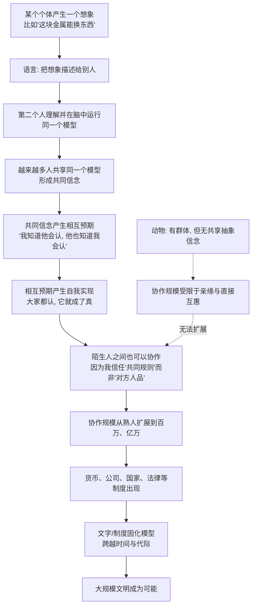

# 24｜语言的真正力量：把一个人的想象变成全人类的资产

> 语言最大的作用，是交流信息，还是别的什么？

---

## 一、先说结论

班尼特的答案是：**语言最强的地方不是"说事"，而是"共享想象"。**

它能把只存在于一个人脑中的模型，转换成别人脑中**可以运行**的模型。金钱、公司、国家、法律、货币信用——这些"共同想象"之所以能成立，正是因为语言能让**无数陌生人运行同一个模型**：大家都相信同一套规则，于是这套规则就真的生效了。

一个人相信一张纸值一百块，那张纸没什么用；一亿人相信，它就成了货币。**语言最深的力量，是把"我认为"变成"我们认为"，从而让大规模陌生人协作成为可能。**

---

## 二、我们先理解一个问题

先看一个每天发生、但极其诡异的动作。

你掏出手机，对准一个二维码，屏幕上数字减掉一些，"叮"一声，商家就把东西给你了。

现在把这件事拆开看：**中间到底发生了什么物理变化？** 没有任何实物从你这里搬到商家那里。你减少的是一串存在服务器里的数字，商家增加的也是另一串数字。你们双方都接受了这件事，交易成立。

**钱到底是什么？** 它不是纸，不是金属，不是那串数字。它是一种**共同想象**：所有人都相信"别人会认这个东西"，于是它就真的能换到东西。

再想深一层：**银行、公司、国家、产权、法律，全都是同一种东西。** 一家"公司"不是一个具体的房子或人，它是一个法律上的"虚拟人"，它可以签合同、可以被起诉、可以拥有资产。你在工商登记系统里找不到它的实体，但它真实地存在于**所有人共同的信念里**。

于是真正的问题出现了：

> **这些看不见、摸不着的东西，凭什么能指挥真实世界的千军万马？语言究竟做了什么，能让一亿个互不相识的人，按同一套规则运行？**

---

## 三、作者到底提出了什么观点？

班尼特把语言的这一层能力，放在第五次突破的最顶端。他说，语言让**心智模型可以共享**——而共享之后，它就升级成了一种全新的东西：**集体模型。**

差别在哪？

- **个人模型**：只在我脑子里。我知道这家店的东西贵，但这是我的私人判断。
- **共享模型**：我们共同约定。所有人都认为"这张纸是钱"，于是它就成了钱。

一旦模型被共享，它就获得了两个个人模型不可能有的性质。

**第一，它能约束所有参与者的行为。** 不是因为它物理上强迫你，而是因为**每个人都知道别人也会遵守**。我不偷钱，不是因为钱有锁，而是因为我知道偷了钱社会会惩罚我，而社会会惩罚我，是因为所有人都认同这套规则。

**第二，它能反过来塑造物理世界。** 一笔转账能让货轮起航、让工厂开工、让一个陌生人为你送饭。**看不见的信念，产生了看得见的行动。**

用一张表来对照"个人想象"与"共同想象"。

| | 个人想象 | 共同想象 |
|---|---|---|
| 存在于 | 一个大脑 | 无数大脑，通过语言同步 |
| 例子 | 我觉得明天会下雨 | 货币、公司、国家、法律 |
| 强制力来源 | 我个人信不信 | 大家是否都相信别人也信 |
| 能否调动陌生人 | 不能 | 能，且规模可以无限扩展 |
| 靠什么维持 | 经验、推理 | 语言、仪式、教育、制度、暴力背书 |

**班尼特想强调的核心是：人类之所以能组织起几亿、几十亿人的协作，不是因为每个人都信任另一个人——那不可能——而是因为大家信任同一套"共享的想象"。**

**我们信任的不是陌生人，而是陌生人也会遵守的那套故事。**

---

## 四、把这个观点翻译成人话

用一句话讲清楚：**语言让人脑和人脑之间，可以"联网运行同一个程序"。**

想象所有人类大脑都是电脑。语言之前，每台电脑都是离线的，只能靠自己积累数据。语言之后，一台电脑可以把一段程序**发送**给另一台，两台就能运行同一套逻辑。

如果只有两台，意义不大。但当这个网络有八亿台时，就发生了一件质变的事：

> **整个网络可以运行同一套"虚构程序"，于是这个网络的行为，就像一台超级计算机。**

货币就是最典型的"共享程序"：

- 程序名：**钱**
- 输入：你付出劳动
- 输出：一张凭证
- 规则：所有人都承认这张凭证能换东西

**这条程序从来不是物理定律，它只写在人类的共同信念里。但它比很多物理定律更能决定你的生活。**

这里有一个深刻的点要特别强调：**共同想象的"虚构"，不等于"假的、没用的"。** 它和谎言有本质区别：

- **谎言**：说的人知道是假的，目的是骗你。
- **共同想象**：所有人其实都知道它是"约定出来的"，但所有人都**愿意一起当真**，因为它让协作成为可能。

你说"钱是纸"没错，你说"公司是人"也没错——但在约定层面，它们确实起作用。**人类的聪明不在于"只看真实"，而在于能分清"什么时候要按约定运行"。**

---

## 五、为什么会这样？

为什么"共享想象"能撑起大规模陌生人协作？这条链是这样的。

这条链里有三个转折点。

**第一个转折点：从"我信"到"我们信"。** 个人信念不能指挥别人；共同信念可以。**关键不在于内容真假，而在于"是否同步"。**

**第二个转折点：从"信任人"到"信任规则"。** 熟人社会靠关系，陌生人社会靠制度。**制度是"我信任你会守规则，因为我知道所有人都被同一套规则约束"。** 这让协作突破了邓巴数（人类能维持稳定关系的约 150 人上限），扩展到数百万甚至数十亿。

**第三个转折点：从"口头共识"到"文字固化"。** 口头共识会随记忆消散、随人口更替而断裂；文字把约定写下来，让**几百年后的陌生人也能运行同一套模型**。法律、契约、宪法，都是"被固化下来的共同想象"。

**班尼特想说的关键是：文明不是靠好人堆出来的，而是靠一套能让"陌生人之间也敢合作"的共享模型堆出来的。**

---

## 六、举一个现实生活中的例子

**例子一：扫码支付——你相信的是一串数字。**

你在菜市场扫码付钱，摊主看一眼手机就放你走。你没给他任何实物，他也没真的"收到"什么。你们共享的信念是：**这串数字被系统承认，而系统背后有所有人的共同认可。**

有意思的是：**如果哪天所有人都突然不再相信这套系统，你的余额会在一天之内变成一堆无用数据。** 货币的坚固，不在于技术，而在于信念的同步。

**例子二：公司章程——一个法律上的"虚拟人"。**

一家公司可以签合同、贷款、被起诉、拥有房产，甚至可以"永续存在"——股东会老、会死，公司不会。它没有身体，却拥有权利和责任。

**成立一家公司，本质上是用语言凭空创造出一个"人"，然后让整个法律体系承认它、与它打交道。** 这是共享想象最惊人的操作：我们不是在描述世界，我们是在**创造世界**。

**例子三：社保与医保——陌生人之间的互助承诺。**

你每月缴社保，并不是因为你认得几十年后的退休老人。你相信的是：**这套制度会运转，将来也会有人按同一套规则为我缴费。** 你信任的不是具体的人，而是那套**被所有人共享的规则**。

**这也是为什么制度的公信力一旦崩塌，破坏力会远超一次具体的欺诈——它动摇的是"大家一起当真"这件事本身。**

**例子四：粉丝群体。**

一群从未谋面的人，因为共享同一套叙事（偶像的故事、团体的意义、某种价值观），就能组织应援、筹资、控评、跨国协作。**他们之间没有血缘、没有合同，共享的只是"同一套想象"。**

粉丝社群是"共同想象"的最小实验场：**一套故事，就能把陌生人变成一支部队。**

---

## 七、回到书中重新理解

现在把这一篇放回班尼特的框架，会看到一个完整的闭环。

前四次突破给了个体：好坏模型、行动模型、世界模型、心智模型。
第五次突破分了三步：
- **21 篇**：我们找到了独特性的三条线索（语言、模仿、教学）。
- **22 篇**：我们看清了语言是一套可被安装的学习程序。
- **23 篇**：我们看到了语言、模仿、教学叠加出的文化棘轮。
- **24 篇**：我们抵达了语言最深的一层——**它能创造一个"我们共同生活的世界"。**

这一步为什么是决定性的？因为它让**协作不再受限于"认识"和"信任"**。

在只有心智化的世界里，你能合作的对象是有限的熟人：你读过他的表情、记得他的名声、能直接回报或报复他。而一旦有了共享想象，你就能和**一辈子都不会见面的陌生人**合作——只要你相信他也会遵守同一套故事。

**人类文明的所有大规模制度，本质上都是"共享想象"的不同形态：**

- 货币 → 共享"交换价值"
- 公司 → 共享"法人身份"
- 国家 → 共享"共同体边界与主权"
- 法律 → 共享"规则与惩罚"
- 宗教 → 共享"意义与秩序"

班尼特想说的其实很朴素：**人类的强大，不是因为每个人更强，而是因为几亿人能在同一套想象上同步运行。而这一切的技术前提，是第五次突破——语言。**

---

## 八、这个观点背后还有什么？

**第一，它把"制度"从道德问题变成了技术问题。** 制度之所以有效，不靠圣人，而靠**能不能让共享模型稳定运行**：叙事是否自洽、执行是否一致、背叛是否被惩罚。**制度的强弱，是"共享模型维护能力"的强弱。**

**第二，它解释了"叙事"为什么是权力。** 谁能定义共同想象，谁就能定义世界的运行规则。**货币的发行权、历史的书写权、法律的定义权，本质上都是"讲述共享故事"的权力。**

**第三，它让"信任"有了新的解释。** 现代社会的信任，不是"我相信你不会骗我"，而是"**我相信我们被同一套规则约束**"。这就是为什么法治、征信、契约能降低交易成本。

**第四，它给"文明的脆弱"提供了视角。** 共同想象是自我实现的，也可能是自我瓦解的：一旦大家不再相信，制度就会瞬间失去力量。**信念的同步需要长期维护，而崩塌可能只在一夜之间。**

**（这里可以对照《人类简史》中"想象的共同体/共同想象"的说法，角度确实相通。但要提醒：赫拉利讲的是宏观叙事，班尼特讲的是**认知机制**——共享想象为什么可能，靠的是第五次突破给出的心智模型复制能力。两者是不同层面的解释，不需要混为一谈。）**

---

## 九、这个观点有问题吗？

有，而且这里每一个争议都牵动很深。

**第一，"语言是否决定思维"（萨丕尔-沃尔夫假说）有强弱版本之分。** 强版本认为语言决定你能想什么，这基本被现代证据否定——没有语言的人也并非无法思考，只是缺少某些抽象工具。弱版本认为语言**影响**某些认知（比如颜色分类、空间参照、责任归因），这类证据有不少，但影响通常是部分的、可被绕过的。**"语言塑造思维"可能是对的，但"语言囚禁思维"是错的。**

**第二，"共同想象"与"谎言"的边界并不总是清晰。** 我们说货币是约定，但如果有人告诉你某个投资产品"一定保本保收益"，那可能就是谎言。**当共享想象被少数人用来牟利、而多数人误以为它是客观事实时，它就滑向了欺骗。** 这条边界在金融、政治、营销里最危险。

**第三，把"制度"都归结为共享想象，可能低估了暴力与物质基础。** 货币背后有国家强制力，法律背后有警察和监狱，产权背后有军队和边界。**共享想象能让规则运转，但规则的最后保障往往是权力。** 只谈"信念"而忽视"强制"，容易把一个复杂系统讲得太温柔。

**第四，AI 能批量生产叙事，这让"共同想象"第一次可能被大规模操纵。** 虚假故事、伪造共识、生成式宣传，成本几乎为零。**当"讲故事"的权力可以被机器放大到无限，共享想象就从凝聚社会的力量，变成了可以撕裂社会的武器。**

**第五，反过来说，是否所有"共同想象"都值得维护？** 有些共享信念曾经凝聚了社会，后来却成了压迫的来源。**共同想象的价值，最终要由它带来什么样的生活来评判，而不是由它"能不能形成"来评判。**

---

## 十、今天再看这个观点

以下部分是基于作者思想的现代延伸。

**延伸一：区块链是一场"信任实验"。** 它的核心设想是：既然信任人很难，那就让大家信任一套公开、不可篡改的规则。**这本质上是把"共享想象"外包给算法和账本**，让信念不必再依赖某个中心机构。它成不成立，取决于人们是否真的愿意相信代码。

**延伸二：品牌、平台、信用分，都是现代版共同想象。** 品牌让你相信"这个商标代表某种品质"，平台让你相信"这个评分反映真实口碑"，信用分让你相信"这串数字反映一个人的可靠度"。**我们生活在一个越来越依赖共享符号来判断陌生的世界。**

**延伸三：AI 生成的内容，可能制造"没有主体的共享想象"。** 一个由模型批量生成的"共识"，既没有真正相信它的作者，也没有共同约定的过程，却可能被所有人当作既成事实。**这是共享想象史上从未出现过的形态——也是它最大的风险。**

**延伸四：回到本系列的主线。** 前四次突破让个体能"预测世界和他人"，第五次突破让"预测模型可以被共享"。**但真正的分水岭在于：共享的模型能不能被检验、被更新、被推翻。** 一个只会复制、不能纠错的社会，棘轮会锁死；而 AI 时代，纠错能力可能比复制能力更稀缺。

---

## 十一、这一篇真正应该记住什么？

1. **语言最深的力量是"共享想象"，不是"交流信息"。** 它把个人脑内的模型变成无数大脑可以共同运行的程序。

2. **货币、公司、国家、法律都是共同想象。** 它们不是物理实在，却因为大家共同相信而真实生效。

3. **共同想象让陌生人也能大规模协作。** 信任的不再是具体的人，而是"所有人都会遵守的同一套规则"。

4. **共同想象 ≠ 谎言。** 关键区别在于：大家是否知道这是约定，并愿意一起当真；被少数人利用、让多数人误信时，才滑向欺骗。

5. **共享想象依赖持续维护，可以瞬间崩塌。** 文字与制度让它跨越代际，而 AI 让叙事第一次可能被无限批量生产。

---

## 十二、留一个问题

> 如果文明的底座，是几亿人愿意共同"当真"的同一套想象，
> 那么当 AI 能以零成本生产出无数套逼真的"共同想象"时，
> 我们靠什么，去分辨哪一套值得我们一起运行，
> 哪一套只是被批量生产出来的、精致而空洞的故事？

---

**下一篇**：到这里，第五次突破——语言与共享模型——就讲完了。五次突破全部到齐，是时候把它们串成一条统一的规律了。

下一篇我们进入全书的收束：**五次突破有什么共同规律？——智能是"层层叠加的模型"。**

---

*本系列基于 Max Bennett《A Brief History of Intelligence》整理，文中"班尼特认为/书中认为"均指作者观点；带"延伸"字样的段落为基于其思想的现代推演，不代表原作者。*
