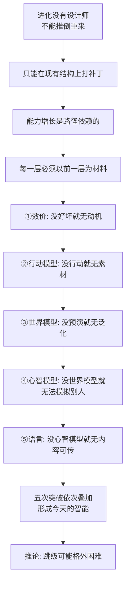

# 25｜五次突破有什么共同规律？——智能是“层层叠加的模型”

> 把五次突破串起来，有没有一条统一的主线？

---

## 一、先说结论

班尼特给出的答案是：**五次突破不是五项互不相干的发明，而是同一个动作重复了五次——给大脑再加装一层新的"模型"。**

好坏模型（该靠近还是躲开）→ 行动模型（做了会怎样）→ 世界模型（在脑中预演）→ 他人心智模型（他在想什么）→ 可共享模型（把想法复制给别人）。后一层必须站在前一层之上，前一层是后一层的原料和脚手架。

所以全书最核心的一句话可以压成：**智能不是"某项能力有多强"，而是"一套系统已经装到了第几层"。** 也正因为如此，"直接造出通用智能"可能比很多人以为的更难。

---

## 二、我们先理解一个问题

先别急着背诵那五个名字，先问一个更本质的问题。

进化从单细胞走到人脑，花了大约十亿年。这十亿年里，它并没有均匀地"变聪明"，而是绝大部分时间在同一个水平上打转，偶尔才跃升一次。**为什么会这样？如果智能只是"算力变大、脑容量变大"这种量变，曲线本该平滑上升；但真实的曲线是长期平台、突然跳一格。**

还有第二个反常。如果五次突破是五件独立的能力，那它们理应可以随机先后出现。但事实是：它们出现的顺序高度稳定，几乎不能颠倒。**为什么"想象"没有早于"趋利避害"？为什么"读心"没有早于"想象"？**

这两个反常指向同一个问题：

> **五次突破之间，到底是"并列关系"，还是"依赖关系"？它们有没有一条共同的内在规律？**

---

## 三、作者到底提出了什么观点？

班尼特的回答是：这五次是**层层叠加**的，每一次都在旧大脑上新增一层模型，且每层解决的是前一层**根本无法解决**的新问题。

| 第几次 | 新加的那层模型 | 它回答的新问题 | 比喻 |
|---|---|---|---|
| 第一次·转向 | 好坏模型（效价） | 这东西对我有利还是有害？ | 红绿灯 |
| 第二次·强化 | 行动模型 | 我做了这个动作，结果会怎样？ | 奖罚训练 |
| 第三次·模拟 | 世界模型 | 如果我不真做，先演一遍会怎样？ | 沙盘推演 |
| 第四次·心智化 | 他人心智模型 | 他脑子里在想什么？ | 读心 |
| 第五次·语言 | 可共享模型 | 我怎么把脑中的模型搬到你脑中？ | 拷贝 |

他给了三条判断。

**第一，每一层都是"新增"，不是"替换"。** 有了世界模型，不代表丢掉行动模型——哺乳动物依然会试错；有了语言，不代表丢掉心智化——人依然会读脸色。新层是叠加在旧层之上的，旧层继续在底层默默工作。

**第二，每一层都以前一层为原料。** 没有"好坏"，就没有动机去"行动"；没有"行动模型"，世界模型就没有可供预演的动作素材；世界模型又给"模拟别人"提供了通用引擎；而语言要传递的，正是前四层建起来的那些模型。

**第三，五次突破共用同一种底层逻辑：建模 + 预测。** 无论在哪一层，大脑都在做同一件事——根据过去的经验，生成一个对未来的猜测，然后用现实去修正它。差别只在于"被建模的对象"从物理世界，升级到了别人脑中的世界。

---

## 四、把这个观点翻译成人话

把它想成一款游戏的**技能树**。

你不能一上来就点"终极技能：读心术"。你必须先解锁前置技能：先会"分好坏"，才能解锁"趋利避害"；先会"趋利避害"，才能解锁"预判走位"；先有"预判走位"，才谈得上"猜对手意图"；最后才能点出"组队指挥、把战术讲给队友听"。

每解锁一层，你并没有失去下层能力——你只是能站在下层之上，做更大范围的判断。**而且系统不允许你作弊：你想跳级点技能，接口会直接拒绝，因为你缺少必要的经验池。**

教育是最好的现实版例子。小学必须先学加减，再学乘除；先学乘除，才谈得上分数；先有分数，才谈得上代数和函数。**没有一个老师能让一年级孩子直接理解微积分**——不是孩子笨，而是那条"技能树"的依赖链不允许跳。

---

## 五、为什么会这样？

关键在于进化的工作方式。

这条链里有三个环节值得停一下。

**第一，进化的"不能推倒重来"决定了路径依赖。** 它永远是在旧结构上修修补补：鱼脑的某些区块被保留、被改造，成了哺乳动物新皮质的原料。所以每一步都被上一步锁死，想绕路必须先有路。

**第二，每一层的"接口"都定义了上一层的用途。** 效价系统原本只用来决定靠近或躲避，但到了强化学习层，它变成了"奖励信号"；世界模型原本用来预测猎物动向，到了心智化层，它变成了模拟他人的通用引擎。**旧能力在新层里被重新征用。**

**第三，这也解释了"为什么进化花了十亿年"。** 如果智能是五层依赖的工程，那么每一层都要等前一层稳定、可用、并积累出足够多的"经验"才能往上盖。**慢，是因为地基要一层层夯实。**

---

## 六、举一个现实生活中的例子

**例子一：新员工为什么"带不动"。**

很多公司会犯一个错：招一位总监，却希望他直接具备"战略眼光、团队管理、业务手感"三样。但按叠加逻辑，这三样正是三层能力：业务手感（我怎么干能出结果）→ 团队管理（别人怎么想、怎么激励）→ 战略眼光（几年后世界会变成什么样）。

一个只做过一线、没带过人的管理者被直接推上战略岗位，往往不是不聪明，而是**"读人"那一层是空的**：他能画出漂亮的路线图，却带不动团队落地。

**例子二：孩子学外语的"关键期"。**

成年人学外语，常常发音和语感都难达到母语水平。班尼特式的解释是：语言层的建立依赖更早的"模仿与教学"程序是否在关键期内被激活。**这不是态度问题，而是安装窗口的时机问题。**

---

## 七、回到书中重新理解

现在，全书那条最锋利的推论就浮出来了：**如果智能真是层层叠加、且依赖关系不可跳过，那么"直接造出通用智能"可能比很多人想的更难。**

这也是理解今天 AI 的一把钥匙。AI 的成长路径和生物是**反着来的**：它不是先学会"转向"再学会"强化"，而是在海量文本上一次性训练出来的。它像一个"先装了第五层语言、再回头看前三层缺什么"的系统。

所以班尼特真正的意思是：**AI 表现得像人，不代表它真的把人走过的路走了一遍。** 它可能只复制了最上面那层漂亮的"语言外壳"，而底下几层是另起炉灶凑出来的。**表面相似，不等于路径相同。**

---

## 八、这个观点背后还有什么？

**第一，它其实指向一个更大的统一理论：既然所有智能都是"建模与预测"，那能不能用一个原理把五层全包住？** 当代神经科学里，**预测编码（predictive coding）** 试图说：大脑每时每刻都在自上而下地预测输入，只把"预测误差"往上送。更进一步，Karl Friston 的**自由能原理**提出：一切生物系统都在最小化自身的"意外"，以维持生存。**这些是当代延伸，并非学界已定论的共识。**

**第二，"智能=压缩"是另一条亲缘线索。** Jürgen Schmidhuber、Marcus Hutter 等人主张：智能就是找到世界的最短描述（压缩），预测能力随压缩能力上升。这与"建模"是同一枚硬币的两面。

**第三，把五层说成"模型"，实际上重新定义了"理解"。** 理解一个东西，不再是"拥有关于它的知识"，而是"能在脑中运行一个可预测它的模型"。**这条定义最有野心，也最需要警惕。**

---

## 九、这个观点有问题吗？

有，而且这一篇恰好是全系列争议最集中的地方。

**第一，也是最硬的一条：AI 可能就是"跳级"的活反例。** 大语言模型没有先学"转向"、再学"强化"、再学"模拟"，却在很多任务上表现出了类似"世界模型"的能力。这说明**生物那条路可能只是智能的一种实现方式，而不是唯一道路**。"不可跳级"是作者从生物学归纳出的经验规律，不是被证明的定律。用它去给 AI 设上限，本身需要更多论证。

**第二，模块化 vs 整体论。** 把大脑切成"五层模型"很清晰，但现代认知科学有一派强调大脑高度分布式、整体工作，很难干净分层。更有研究提示各层之间可能**部分解耦**：有的动物似乎有"心理理论"雏形却无发达语言；有的失语症患者保留完好的心智能力。**存在依赖链，不等于严丝合缝。**

**第三，"突破叙事"自带目的论与后见之明风险。** 站在这条线的终点回看，一切都很顺；但真实的进化充满了死路、重复和偶然（"眼睛"在进化史上独立演化了几十次，根本不存在"那一次突破"）。**把连续渐变剪成五个台阶，清晰是优点，也可能是代价。**

**第四，五层之间是否真的"依次"，也可能被文化颠倒。** 人类的文化与语言，有时会反过来强烈塑造底层：语言里的分类方式会影响人怎么感知颜色和空间。**"底决定顶"这条单向箭头，可能过于整齐。**

**所以更准确的说法是**：这是一张极好用的"认知地图"，它把纷繁的智能现象压缩成五层，解释力惊人；但它是一张为了理解而画的地图，不等于地形本身。

---

## 十、今天再看这个观点

以下内容是**现代延伸**，不是班尼特书里的原话。

今天的 AI 争论，核心就是"这条依赖链能不能被绕过"。"规模派"赌的是：模型和数据继续变大，第三、四、五次突破会自然从参数里涌现；"架构派"赌的是：不会，因为心智化与语言可能对应完全不同的机制，就像给马车加马力也变不出飞机。

班尼特框架的价值，不在于替你选边，而在于给出一个**共同的提问方式**：别吵"它是不是智能"，先回答"它完成了哪几层、卡在哪一层"。2024 年之后，AI 界对"世界模型"的关注明显升温，本质上也是在补第三层。——**这些是书出版之后的现代延伸，不代表原作者。**

---

## 十一、这一篇真正应该记住什么？

1. **五次突破是同一种动作重复五次：给大脑叠加一层新模型。** 好坏→行动→世界→他人心智→可共享。

2. **每层都建在前一层之上，依赖关系是全书最核心的暗线。** 前一层是后一层的原料与脚手架。

3. **智能的本质是"建模+预测"，对象从物理世界逐层升级到他人的心智世界。**

4. **"不可跳级"是作者从生物学归纳的规律，不是定律。** AI 的逆序成长，正是对它最有力的挑战。

5. **这张地图最大的用途，是当一把尺子。** 下一篇我们就拿它去量 AI。

---

## 十二、留一个问题

> 如果智能真的是"层层叠加、越往上越依赖地基"，
> 那么一个跳过了地基、却把顶层语言练到极致的 AI，
> 它究竟是已经拥有了整座楼，
> 还是只是把最上面那层装修得特别漂亮，而下面几层还是空的？

---

**下一篇**：规律讲完了，接下来做一件更实用的事——**给今天的 AI 打分**。它到底点亮了五次突破里的哪几层？自动驾驶、AlphaGo、生成式视频模型、"像懂你"的聊天机器人，分别站在第几层上？

下一篇我们进入对照：**AI 走到哪一步了？——用五次突破给今天的 AI 打分。**

---

*本系列基于 Max Bennett《A Brief History of Intelligence》整理，文中"班尼特认为/书中认为"均指作者观点；带"延伸"字样的段落为基于其思想的现代推演，不代表原作者。*
