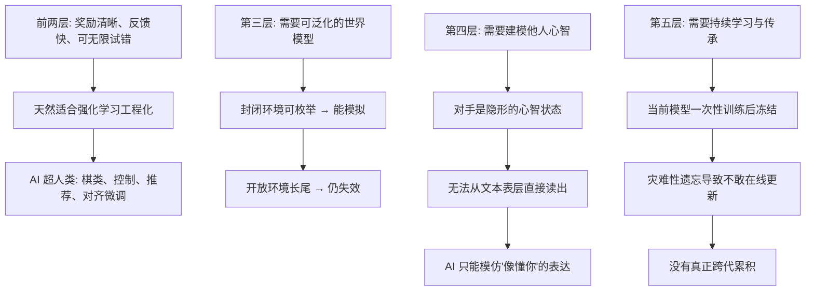

# 26｜AI 走到哪一步了？——用五次突破给今天的 AI 打分

> 今天的 AI 已经完成了五次突破中的哪几次？

---

## 一、先说结论

班尼特给出的答案可以概括成一句话：**AI 已经相当漂亮地完成了第一次和第二次突破，部分触及第三次，但第四次和第五次仍然很薄。**

用五层清单打分：转向/控制（第 1 层）★★★★★，强化学习（第 2 层）★★★★★，世界模型（第 3 层）★★★☆☆，心智化（第 4 层）★☆☆☆☆，可共享并累积的模型（第 5 层）★★☆☆☆。

他反复强调：**与其继续争论"它到底算不算智能"，不如拿这张清单去逐层打分。** 因为"是不是智能"是立场之争，"装到第几层"是可检验的问题。

---

## 二、我们先理解一个问题

先看一组让人精神分裂的事实。

同一年的 AI：一个能靠强化学习把围棋下到人类看不懂，能通过律师资格考试，能生成以假乱真的视频；另一个却可能把你家的扫地机器人卡在椅子腿之间，或者一本正经地编造一个根本不存在的法律条文。

**如果我们把"智能"当成一个整体打分，就会陷入无休止的争吵：** 说它聪明，它翻车给你看；说它笨，它又常常惊艳。这个"整体分"根本没有信息量。

那换个问法呢？

> **如果把智能拆成"五次突破"这五层，今天的 AI 究竟点亮了哪几层，又卡在哪一层？**

带着这个问题，我们就能把模糊的"智能"变成一张可以逐项打勾的清单。

---

## 三、作者到底提出了什么观点？

班尼特的观点是：**AI 不是"有没有智能"的问题，而是"在哪一层强、哪一层弱"的问题。** 他给每层配了对照表。

| 突破层 | 那一层在做什么 | AI 现状（书中 2023 年判断） | 分层解读 |
|---|---|---|---|
| 第 1 次·转向 | 判断好坏、靠近或躲避、控制运动 | 已完成 | 自动驾驶、温控、扫地机器人早已超出生物水平 |
| 第 2 次·强化 | 靠奖励/惩罚试错，学会一连串动作 | 已完成，且很强 | AlphaGo/AlphaZero、RLHF 都是这一层的巅峰 |
| 第 3 次·模拟 | 在脑内预演，用世界模型泛化 | 部分完成 | 能在封闭环境模拟，开放世界仍弱 |
| 第 4 次·心智化 | 建模他人心智、稳定自我模型 | 很薄 | 看似"懂你"，实为模仿表达方式 |
| 第 5 次·语言 | 共享模型、持续学习、代际累积 | 只有外壳 | 语言形式极强，却没有持续学习与真正传承 |

他给了三条关键判断。

**第一，前两层之所以被 AI 轻松拿下，是因为它们天生适合工程化。** 奖励清晰、反馈及时、可以无限试错——这正是强化学习的完美土壤。

**第二，第三层是分水岭，也是"半成品"。** AI 已经能在规则封闭的环境里模拟（棋类、部分游戏、部分物理场景），但还没学会哺乳动物那种在混乱开放世界里的泛化。

**第三，第四、第五层是真正的短板。** 不是弱一点，而是**基本尚未点亮**：没有稳定的他人心智模型，也没有像人一样活着活着就变聪明的持续学习能力。

---

## 四、把这个观点翻译成人话

把这五层想成**招聘一个员工时的能力清单**。

- **第 1 层（转向）**：他能不能分清好活坏活、别往坑里跳？——这是入职底线。
- **第 2 层（强化）**：他能不能干活、重复地干、从反馈里改？——这是熟练工。
- **第 3 层（模拟）**：他能不能在方案落地前，先在脑子里跑一遍后果？——这是骨干。
- **第 4 层（心智化）**：他能不能猜到老板没明说的顾虑、读懂同事的情绪？——这是管理者。
- **第 5 层（语言）**：他能不能把本事讲清楚、带出徒弟、让经验留在公司？——这是合伙人。

现在看今天的 AI：**它是一个执行力惊人、学习速度飞快的骨干型选手，但在"读人"和"带团队"这两栏上几乎是空的。**

它可以在你写清楚的题目范围内做到远超人类的水平，因为题目越清楚，前两层越吃香。但你要它"猜猜客户为什么没签单""想想老板这句话背后的意思"，它给的不是洞察，而是**听起来很有洞察的措辞**。

一句话：

> **AI 擅长的是"把明说的要求做到极致"，不擅长的是"理解那些没有明说的东西"。**

---

## 五、为什么会这样？

这条链解释了"为什么前两层强、后两层弱"。

三个环节最关键。

**第一，能带来清晰奖励的问题，AI 一定赢。** 只要你能把目标和反馈写成可计算的信号，强化学习就能把性能推到极致。前面几层里，越靠下越像这种问题。

**第二，越往上，"正确答案"越不可能被写死。** "客户为什么不签单"没有标准答案，"这句话会伤到谁"也没有奖励函数。**当问题从"可判定"变成"需要理解人心"，AI 就失去了它最锋利的武器。**

**第三，第五层的死结是"学完就冻结"。** 当前大模型训练完成后参数固定，想更新就得重训或微调，而微调又会**灾难性遗忘**旧知识。于是它无法像人一样"每天学一点、积累一辈子、再传给下一代"。——这一点，留到下一篇细讲。

---

## 六、举一个现实生活中的例子

我们直接给几个常见 AI 产品做一张五层打分表（分数为本文基于班尼特框架的**现代延伸打分**，非书中原文）。

| 产品 | 第1层 转向/控制 | 第2层 强化 | 第3层 世界模型 | 第4层 心智化 | 第5层 持续学习 |
|---|---|---|---|---|---|
| 扫地机器人 | ★★★★★ | ★★★☆☆ | ★★☆☆☆ | ☆☆☆☆☆ | ★☆☆☆☆ |
| 智能音箱/客服 | ★★★★☆ | ★★★☆☆ | ★☆☆☆☆ | ★☆☆☆☆ | ★☆☆☆☆ |
| 聊天助手（ChatGPT 类） | ★★★★☆ | ★★★★☆ | ★★★☆☆ | ★★☆☆☆ | ★☆☆☆☆ |
| 围棋/游戏智能体 | ★★★★★ | ★★★★★ | ★★★★☆ | ★☆☆☆☆ | ★☆☆☆☆ |
| 蛋白质结构预测 | ★★★★★ | ★★★★☆ | ★★★★☆ | ☆☆☆☆☆ | ★☆☆☆☆ |

几点观察。

**观察一：越靠"封闭、可判定"，分数越高。** 围棋智能体在第 2、3 层都很强，因为棋局规则封死、反馈明确。而智能音箱在第 3 层几乎为零——它并不知道"打开客厅灯"在你的物理世界里意味着什么。

**观察二："心智化"那一列几乎全是空的。** 聊天助手能说"我理解你的沮丧"，但这不是第 4 层的能力，而是第 5 层语言表层的能力——**它学会了"表达理解"，而没有"拥有一个你的心智模型"。**

**观察三："持续学习"那一列是整张表最刺眼的。** 所有产品都是学完冻结，你每天和它聊，它不会因此更懂你（除非外部存了记忆）。**这正是第五次突破最反直觉的地方：语言形式被复制了，但语言背后的"累积机制"没有。**

**再补一个职场类比。** 公司里最稀缺的从来不是"执行强"的人，而是"能读懂空气、还能把经验沉淀下来"的人。AI 现在像一个执行满分、情商待补、且每天上班都会失忆的新人：**单点能力惊人，累计能力为零。**

---

## 七、回到书中重新理解

现在我们可以正面回答全系列最初那个问题了：**为什么机器能赢棋，却摆不好碗、读不懂人？**

- 赢棋在第 1、2 层，甚至借第 3 层在封闭世界里模拟；
- 摆碗要求第 3 层在开放世界泛化；
- 读懂人要求第 4 层；
- 把经验传下去要求第 5 层。

**AI 的问题从来不是"整体不够聪明"，而是"高层基本还空着"。** 班尼特作为 AI 创业者，给出的判词其实相当克制：不是说 AI 不行，而是说**它走的路和生物不一样，因此强项和短板的位置也不同**。

---

## 八、这个观点背后还有什么？

**第一，它把"智能评估"从哲学变成了工程。** 与其问"有没有意识"，不如问"这一层的可测指标是什么"。这是个务实且有力的转向。

**第二，它暗示"数据规模"与"层级高度"可能不是一回事。** 更多的文本数据能继续加固第 2、5 层的形式能力，却不一定能自动长出第 4 层。**用低层的方法堆料，未必能换来高层的跃升。**

**第三，它给了一个判断 AI 新闻的实用筛子。** 下次看到"重大突破"，问三句：它真用上了世界模型，还是只记住了很多数据？它建模了对方心智，还是在模仿人类说话？它的知识能稳定传给下一个模型，还是每次都得从头训练？

---

## 九、这个观点有问题吗？

有，而且这张打分表是最容易被时间打脸的地方。

**第一，"规模派 vs 架构派"至今没有赢家。** 一派相信只要继续扩大模型和数据，第 3、4 层会自然涌现；另一派认为必须换架构。班尼特的框架来自生物，天然偏向架构派，**但这只是一方的证据，不是裁决**。

**第二，"涌现能力"本身受到严重质疑。** 有研究（Schaeffer 等，2023）指出，很多所谓"涌现"可能只是**评测指标的错觉**：换成连续指标，能力曲线就变得平滑，并不存在某个神秘的临界点。如果涌现是度量假象，那用"第几层"来切分也可能失真。

**第三，benchmark 不等于真实能力。** 模型可能"刷爆"某个测试，却在真实场景一塌糊涂；也可能在标准测试上平平，却在实际使用中很好用。**用一张清单打分，简洁，但难免粗糙。**

**第四，"第 3 层部分完成"的判断正在被快速侵蚀。** 具身智能、视频生成、可交互世界模型在 2024 年后推进很快，书里 2023 年的判断可能已经过时。**这是一张会过期的地图——本书出版于 2023 年，之后的一切都必须当作"现代延伸"来看。**

---

## 十、今天再看这个观点

以下均为**现代延伸**。

书出版后的两三年里，最明显的变化发生在两处。其一是**第三层的补课**：大量研究把大模型与视频、仿真、机器人身体结合，试图补上"可泛化世界模型"这块短板（视频生成模型、具身智能、可预测环境的交互式世界模型等）。其二是**第五层的补丁**：长上下文、外部记忆、检索增强、以及各类持续学习/模型编辑技术，都在试图缓解"学完冻结、一更新就忘"的死结。

但要诚实地说：这些进展更多是**在既有架构上打补丁**，而不是真正点亮了第 4、5 层。**它们让 AI 更像"记住了更多"，而不是"理解得更深"。** 至于这些补丁最终能否堆出质变，目前没有定论。

---

## 十一、这一篇真正应该记住什么？

1. **AI 已经拿下第 1、2 层，部分触及第 3 层，第 4、5 层仍然很薄。**

2. **前两层强，是因为奖励清晰、反馈快、可无限试错，天然适合工程化。**

3. **第 3 层是分水岭：封闭环境能模拟，开放世界仍难泛化。**

4. **"像懂你"不等于"懂你"——那是第 5 层语言形式在伪装第 4 层的心智化。**

5. **用分层清单打分，比争论"是不是智能"更有信息量；但要记住这张表会过期。**

---

## 十二、留一个问题

> 如果 AI 在第 5 层（语言）考了高分，却在第 4 层（心智）几乎零分，
> 那我们每天被它"说得很懂你"所打动的时候，
> 感动的到底是它真的理解了我们，
> 还是我们自己太渴望被理解了？

---

**下一篇**：上一节说 AI 的第五层只有"外壳"，第四层几乎为零。但为什么它说起话来那么像懂你？为什么它能写诗、能安慰人，却依然"读不懂"你？要回答这个，得先理解语言到底是什么——它究竟是心灵本身，还是心灵的一扇窗户。

下一篇我们进入全书最关键的一次批判：**ChatGPT 与"心灵之窗"：它为什么仍然读不懂你？**

---

*本系列基于 Max Bennett《A Brief History of Intelligence》整理，文中"班尼特认为/书中认为"均指作者观点；带"延伸"字样的段落为基于其思想的现代推演，不代表原作者。*
