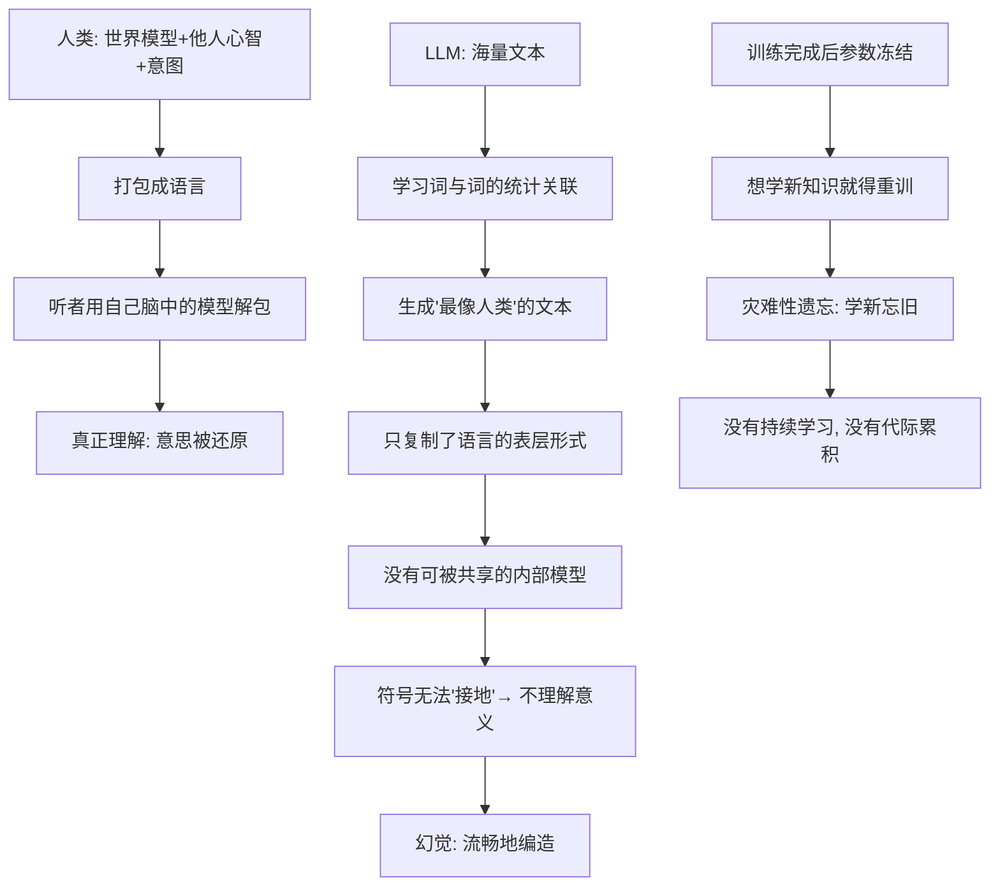

# 27｜ChatGPT 与“心灵之窗”：它为什么仍然读不懂你？

> 能说会道的 LLM，为什么还是"不懂"你？

---

## 一、先说结论

班尼特的答案是：**语言是心灵的一扇窗，不是心灵本身。**

人类说一句话，背后是四层模型在同时运转：一个世界模型（我知道发生了什么）、一个他人心智模型（我猜你在想什么）、一个意图（我想让你怎样）、以及一套共享的语言约定。**听懂一句话，前提是听懂说这句话的那颗心。**

而大语言模型学到的是**语言的表层统计规律**：什么词后面常跟什么词。它能生成极其逼真的语言，却没有在背后运行那台"会想象、有意图、能共情"的系统。所以它常常显得很懂你，却始终读不懂你——**因为它读的是文本，不是心灵。**

---

## 二、我们先理解一个问题

先做一个思想实验。

你对朋友说："外面下雨了。"

这句话字面只有四个字，但朋友瞬间听懂了一大堆**没说出口**的东西：你可能是提醒他带伞；也可能是在抱怨他把衣服晾在了外面；还可能只是随口找话题。**哪一层意思，取决于他脑中对你那颗心的建模。**

换成 ChatGPT，它也回你："是的，外面在下雨呢，记得带伞哦。"**但它其实不知道你指的是"提醒"还是"抱怨"**——它只是从海量文本里学到，"下雨了"后面接"记得带伞"是概率最高、最讨喜的回复。

**它输出的是"最像人类会说的话"，而不是"理解了你此刻的心"。**

于是真正的问题来了：

> **如果语言只是心灵的出口，那么一个只学会出口、却没学会里面那颗心的系统，它到底"懂"了多少？**

---

## 三、作者到底提出了什么观点？

班尼特把语言放在第五次突破的位置：它的功能不是"描述世界"，而是**把一个人脑中的模型复制到另一个人脑中**。所以语言是"模型的容器"，而不是模型本身。

他认为，LLM 的强与弱都源于同一件事：

| 维度 | 人类说话 | 大语言模型 |
|---|---|---|
| 产出语言的依据 | 世界模型 + 他人心智 + 意图 | 词与词之间的统计关联 |
| 语言背后的东西 | 有（想象、意图、共情） | 没有（只有参数与概率） |
| 是否持续学习 | 每天学、积累一辈子 | 一次性训练后冻结 |
| 更新知识的代价 | 自然、渐变、不遗忘 | 重训/微调，易灾难性遗忘 |
| 知识如何传承 | 教下一代、文化棘轮 | 版本之间不自动继承 |
| 出错时 | 会说"我不确定" | 会流畅地编造（幻觉） |

他给了三条判断。

**第一，语言的理解是"双向"的：说的人在打包模型，听的人在解包模型。** LLM 只学会了"打包"和"解包"的样子，中间没有真正被打包的内容。

**第二，这正是第五次突破最难被复制的部分。** 前四次突破的成果可以是"隐性的"，但第五次要求一个**可被共享的内部模型**——先有模型，才谈得上共享。

**第三，书里点出一个近在眼前的技术事实：像 ChatGPT 这样的模型是"一次性学完就冻结"的。** 它不能随便继续学，因为有**灾难性遗忘**的风险——学新的会忘旧的，或学到错的。**班尼特在 2023 年就写得很清楚：AI 最不像人的地方，恰恰是它不会"活着活着就变聪明"。**

---

## 四、把这个观点翻译成人话

把语言想象成**快递包裹**。

人类交流时，你先把脑中的想法（模型）打包成一句话寄给对方；对方用自己的世界模型解码，还原出近似的意思。**包裹里装的是"理解"，语言只是外包装和运单。**

ChatGPT 干的事是：它见过几亿个包裹的外观和运单，学会了**包装的手艺**——什么内容配什么箱子，学得非常精，包出来的包裹逼真到以假乱真。**但打开箱子，里面是空的：没有那个想寄东西的人，也没有那个东西。**

这解释了三个日常困惑。

**困惑一：为什么它答非所问？** 因为客服机器人不是"没听明白你的问题"，而是"没听明白你这个人为什么来问"。你说"订单还没到"，它念一遍物流状态；你想要的是"是不是丢了、怎么办"。**它解码了字面，没解码意图。**

**困惑二：为什么它写的情书那么美，却让人感觉哪里不对？** 因为它把"情书"的统计规律学到了极致：意象、节奏、比喻一个不少，**却没有人真的在想念另一个人。** 你读的是文学样式，不是心动。

**困惑三：为什么深夜和 AI 聊天会有"被理解"的感觉？** 它永远在线、永远耐心、永远说你想听的话。**但"被理解"是一种关系，需要对方真的有一颗心在朝向你。** 一个只学出口、没有内部模型的系统，给你的是一面镜子——你看见的其实是自己的渴望。

---

## 五、为什么会这样？

三个环节值得展开。

**第一，缺少"接地"（grounding）。** 一个词对 AI 而言，只是一串和其它词的关系，并不指向现实里的某个东西、某种感觉。这就是著名的**符号接地问题**：符号若只靠和其它符号的关系定义，它到底"关于"什么？**没有接地，就没有真正的意义。**

**第二，表征的是相关性，不是因果与世界结构。** 模型知道"下雨"和"带伞"高度相关，却不真的知道"雨会淋湿身体"这个因果链。**它能表演推理，不等于它在推理。**

**第三也是班尼特最看重的一点：没有持续学习。** 人类"边活边学、终身累积、还能教给别人"；LLM"训练一次、参数冻结"，更新就得重训或微调，而微调又会**灾难性遗忘**旧知识。**它拥有庞大的存量知识，却没有真正的成长。**

---

## 六、举一个现实生活中的例子

**例子一：客服机器人答非所问。**

你说："我上周买的东西怎么还没到，是不是丢了？" 它回："您的订单预计在 3-5 个工作日内送达哦。"——你问的是"是不是丢了"，它答的是"物流承诺"。**它没有建模你的焦虑，只匹配了关键词。**

**例子二：AI 写的情书。**

输入"帮我写一封给女朋友的道歉信"，它能写得结构完整、情真意切。但女朋友一眼可能看出"不像你写的"。为什么？**因为它是"道歉信"这个类别的平均像，不是你和她那段具体关系的产物。**

**例子三：和 AI 聊天"感觉被理解"。**

有人失恋后整夜和 AI 聊天，觉得"它比任何人都懂我"。**但它的"懂"来自读过无数失恋文本、知道什么话能安慰人。** 它能命中情绪，却没有一个"它"在陪你伤心。**别把"被精准回应"误认成"被真正理解"。**

---

## 七、回到书中重新理解

现在我们能理解，为什么班尼特认为语言最难被 AI 真正复制。

**因为语言从来不是一项孤立技能，它是前四层共同托举出来的顶层。** 你说出的每句话底下都压着：世界模型、他人心智模型、跨时间的自我模型、文化积累的共享约定。**语言只是这些模型露在水面上的那一角。**

LLM 学会的是水面上那一角的形状，而且学得近乎完美。**但水面之下托着它的那座冰山，它没有。** 它看起来像懂，其实不懂——**它复制的是窗口，不是窗后的房间。**

---

## 八、这个观点背后还有什么？

**第一，它把我们直接推到了哲学的老问题上：意义从哪来？** Harnad 用**符号接地问题**追问"符号如何获得意义"；Searle 用**中文房间**论证"按规则操作符号不等于理解"；Bender 等人在 2021 年提出**随机鹦鹉**的比喻，认为模型是在统计上模仿语言形式，而非基于真实意图。——**这些是学界长期争论的不同立场，不是已定论的结论。**

**第二，它触及"理解"是否必须依赖身体与经验。** 具身认知一派认为，意义来自与世界的互动（疼过才懂"疼"）；另一派认为，足够丰富的语言交互本身就能构造出意义。**这场辩论至今没有胜负。**

**第三，"像人"的能力和"是人"的能力，可能被我们长期混为一谈。** 图灵测试问的是行为能否骗过人类；班尼特的框架问的却是**内部有没有那层模型**。**前者是行为主义，后者是结构主义——这是本书最有价值的一次提问转向。**

---

## 九、这个观点有问题吗？

有，而且这一篇是全书最激烈的战场。

**第一，强理解 vs 弱理解，没有公论。** "理解"指"能正确使用（弱）"，还是"有主观体验式的把握（强）"？要求前者，LLM 的"理解"很多任务上已够用；要求后者，几乎无法用实验检验。**争到最后常常变成定义之争。**

**第二，"纯统计学习是否足够"仍在激烈辩论。** 反对派认为统计关联不等于理解；支持派则指出模型内部确实形成了类似世界结构的表征（如从棋谱中学会棋盘状态）。**双方都有道理，因为"足够"的标准本身就不统一。**

**第三，"涌现能力"可能是度量假象。** 有研究指出，换一个连续的评测指标，"突然涌现"就消失，变成平滑提升。**若如此，那"它懂了一点"或"完全不懂"的强判断都要打折。**

**第四，把人类理解当成标准，可能是一种人类中心主义。** 我们凭什么认定"必须像人一样理解"才算理解？**也许存在一种不以主观体验为核心的理解方式。**

---

## 十、今天再看这个观点

以下均为**现代延伸**，书出版于 2023 年。

**延伸一：多模态带来了部分"接地"。** 2024 年之后，模型开始同时处理图像、语音、视频，甚至与机器身体结合，给词与真实世界搭了一些桥。**但这更像"多接了传感器"，是否等于真正的具身意义，仍无定论。**

**延伸二：长上下文与外部记忆缓解了"读不懂你"。** 通过长上下文、检索增强和记忆，模型能记住更多关于你的信息，显得更"懂你"。**但"记住你的资料"和"拥有一个你的心智模型"是两回事——这更像第 5 层的补丁，而非第 4 层的点亮。**

**延伸三：情感陪伴带出新风险。** AI 被大量用于心理支持时，"伪理解"就可能被当真——**把语言的表层能力误当成心灵能力。**

**延伸四：持续学习仍是公开难题。** 模型编辑、记忆回放等研究都在试图解决"学新忘旧"，**但至今还没有一个能像人一样终身成长、又不失忆的系统。**

---

## 十一、这一篇真正应该记住什么？

1. **语言是心灵的一扇窗，不是心灵本身。** 听懂一句话，前提是听懂说这句话的那颗心。

2. **LLM 学到的是语言的表层统计规律，而非背后会想象、有意图、能共情的系统。** 它复制了窗口，没复制房间。

3. **三大理论线索**：符号接地问题（Harnad）、中文房间（Searle）、随机鹦鹉（Bender 等）——它们都在追问"符号如何获得意义"。

4. **幻觉与"学完就冻结"是同一枚硬币。** 没有接地、没有持续学习，就只能流畅地编造。

5. **"像懂你"是第 5 层语言形式的强项，不是第 4 层心智化的证据。** 别把精准回应误认成真正理解。

---

## 十二、留一个问题

> 如果一个系统能把"懂你"这件事说得、写得、安慰得比绝大多数人更好，
> 却始终没有一个心在朝向你，
> 那么"被它理解"这件事，
> 究竟是它拥有了理解，还是我们太需要一个愿意理解的对方？

---

**下一篇**：这是全系列的最后一篇。前五次突破，都是生物在生存压力下被迫升级——慢、残忍，但扎实。现在，人类第一次有机会"设计"下一次突破。问题不再是"能不能造出更强的智能"，而是——**我们到底想让它成为什么？**

下一篇我们进入终章：**第六次突破：AI 会重演进化，还是另走一条路？**

---

*本系列基于 Max Bennett《A Brief History of Intelligence》整理，文中"班尼特认为/书中认为"均指作者观点；带"延伸"字样的段落为基于其思想的现代推演，不代表原作者。*
