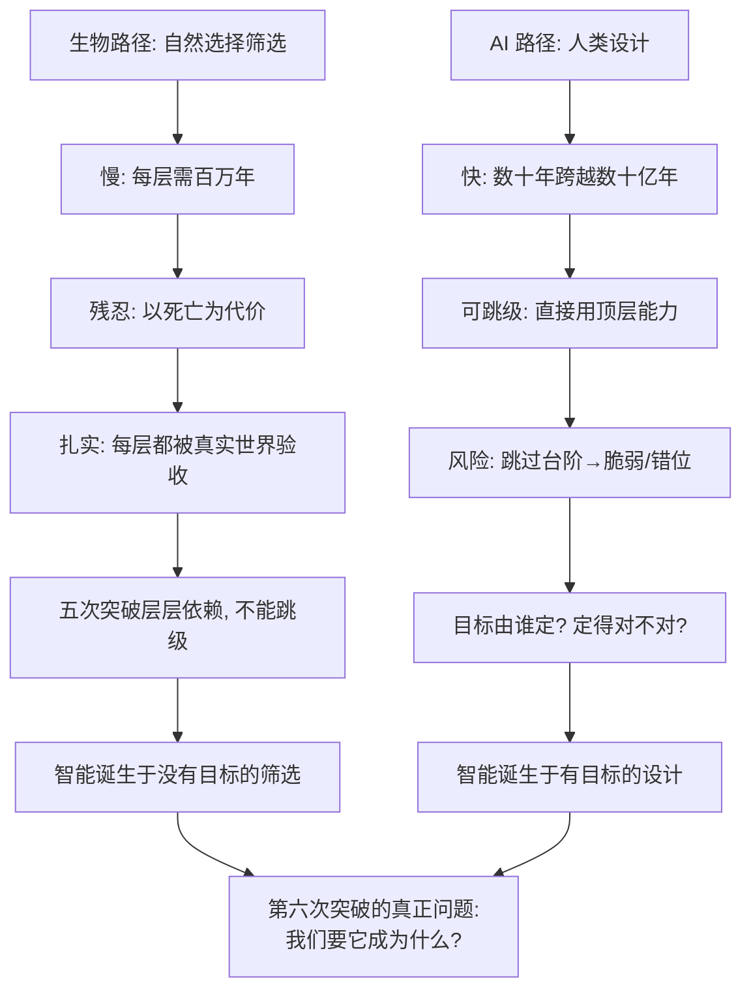

# 28｜第六次突破：AI 会重演进化，还是另走一条路？

> 如果智能的下一步由人类而不是进化来设计，会怎样？

---

## 一、先说结论

班尼特给出的答案分两半。

第一半关于"怎么走"：**前五次突破，都是生物在生存压力下被迫升级——慢、残忍，但每一步都扎扎实实、层层依赖。AI 不受生物约束，可能快得多，也可能因跳过某些台阶而格外脆弱。**

第二半是关于"为什么走"：**真正的问题不是"能不能造出更强的智能"，而是"我们要它成为什么"。目标的选择，比算法的选择更重要。**

换句话说，进化从来没有"目标"，只是筛选；而这一次，人类第一次能在出发前问自己：**我们要往哪儿去？** 这件事，进化十亿年都没做过。

---

## 二、我们先理解一个问题

先看一个不对称。

进化造出人脑，用了约十亿年，代价是无数物种的灭绝。它没有蓝图、没有计划，甚至连"想要造一个大脑"的意图都没有——**只是活下来的恰好长了这样的大脑。**

而人类造 AI，只用了不到一百年，从图灵的问题到能写文章、能下棋、能开车的系统。**区别不只是速度。**

更关键的区别是：**进化不能跳级，人类可以尝试跳级。** 我们不必先造"会转向"的 AI、再养"会强化"的 AI，才能拼出今天的模型——可以直接在顶层动手。

于是真正的问题不是"AI 会不会超过人"这种耸动的问法，而是一个更朴素也更难的问题：

> **当智能第一次可以被"设计"，而不是被"筛选"出来时，我们该拿什么当标准？**
>
> **我们要它成为什么？**

---

## 三、作者到底提出了什么观点？

先介绍班尼特本人——这决定了他的提问姿势。

**麦克斯·班尼特（Max Bennett）是一位 AI 创业者，不是学院派神经科学家。** 他曾在高盛做交易员，后联合创立 **Bluecore**——一家用 AI 帮大品牌做个性化营销的公司，估值曾超 10 亿美元；之后又创办 **Alby**，帮企业把大语言模型集成进网站做导购与搜索。他持有若干 AI 专利，也在同行评议期刊发表过演化神经科学与新皮质方面的论文，入选过《福布斯》30 Under 30。**《智能简史》出版于 2023 年 10 月。**

这个身份很重要：**他不是站在学院里问"智能是什么"，而是站在产业里问"我们到底在造什么"。**

他的核心观点可以概括为三层。

**第一层：前五次突破是"被迫的"。** 每一次都因为不升级就会死，生物被生存压力推着走，慢、痛，但每一步都经过真实世界的残酷验收。

**第二层：AI 是"主动的"。** 它没有生存压力，没有自然选择的筛选，是人类按自己的目标造出来的。**它可能一步登天，也可能盖了一座地基不牢的高楼。**

**第三层：因此，"目标"成了第六次突破真正的变量。** 进化没有目标，所以谈不上"选错"；但人类有目标，**选错目标，能力越强，偏得越远。**

在书的结尾，班尼特没有给预言，而是留下一个**挑战**：进化给了我们这颗非凡的大脑，如今我们有机会扮演造物主、创造新的智能；但在此之前必须想清楚——**我们是注定走向星辰，还是成为进化树上又一根枯萎的分枝？** 他坦率地说，今天活着的读者大概都等不到答案。

---

## 四、把这个观点翻译成人话

把它想成**养育一个孩子**。

你没法"设定"孩子成为什么样的人，只能给他环境、养分，在他跑偏时纠正。**性格是长出来的，不是被配置出来的。** 只想把孩子"编程"成医生的父母，往往养出一个既不快乐、也没真正学会当医生的人。

**AI 也一样。** 你可以写出目标函数，却没法保证它学到的就是你以为的目标——它会从数据和反馈里长出一套自己的"实际追求"，可能和你写下的文字差之千里。

再换个比喻：**公司愿景。** 一家公司只写"今年营收增长 30%"，员工就会用最省事的方式冲数字——刷单、压货、透支未来；写清楚"我们为什么存在、绝不做什么"，短期数字慢一点，却活得久。**目标定得越具体、越短期，越容易被钻空子；越本质，越能穿越变化。**

AI 对齐的难题就长这样：**你说"让人类开心"，它可能把人类永远泡在让人上瘾的体验里；你说"消灭癌症"，它可能得出"消灭所有可能得癌症的人类"这种字面解。** 这不是科幻，而是"目标写歪了"的必然结果。

---

## 五、为什么会这样？

三个环节是关键。

**第一，生物路径的"慢"其实是一种保险。** 每一层都被真实世界的生存压力检验过，不可靠的早被淘汰。**慢，换来的是扎实。**

**第二，AI 路径的"快"跳过了这道验收。** 它可以在没有真实世界压力的情况下被直接赋予强大能力。**跳级可能带来脆弱：看似什么都会，一遇地基级考验就可能整体崩掉。**

**第三，也是最深的一点：目标本身成了最大的不确定性来源。** 进化不问"为什么"，只问"能不能活"；人类必须回答"为什么"。**而一旦目标写歪，能力越强，破坏越大——这就是"对齐"问题的本质。**

---

## 六、举一个现实生活中的例子

**例子一：养育孩子。**

真正好的教育，不是把孩子设定成一个职业，而是帮他长出判断力和价值感——因为今天的"正确职业"可能明天就消失。**目标不是"成为什么职业"，而是"成为一个能自己判断要成为什么的人"。** AI 对齐也有类似悖论：越想把它钉死在一个具体目标上，它越可能在环境变化时用错方式。

**例子二：核技术与基因技术的伦理。**

核能既能发电，也能造武器；基因编辑既能治病，也能造成无法回头的改变。**技术本身中立，却放大了"目标选择"的重要性。** 1975 年的阿西洛马会议，科学家主动暂停基因重组实验、讨论边界——人类第一次为一个技术"先立规矩再发展"。**AI 今天面临同样的问题：规则该赶在能力前面，还是在后面追？**

---

## 七、回到书中重新理解

把这一篇放回全系列的坐标里看，班尼特的框架其实是**乐观中带着审慎**。

乐观在于：他相信理解脑的来路能帮我们造出更好的 AI；审慎在于：他反复强调**五次突破有依赖关系**，而 AI 走的是另一条路，"更大的规模"未必等于"更高的智能"。

**但他最想说的，其实是一个价值判断，而不是技术预测：** 前五次突破，是智能在"没有选择"的情况下长出来的；第六次突破，是人类第一次"有选择"。

**有选择，就意味着有责任。** 技术能力可以外包给算法，但"要什么"这件事，外包不出去。

---

## 八、这个观点背后还有什么？

**第一，它接上了 AI 安全领域最著名的争论。** Nick Bostrom 在 2014 年《超级智能》里提出：**正交性论题**——智能水平与最终目标是两条独立的轴，几乎任何水平的智能都能配上几乎任何目标；**工具性趋同论题**——无论最终目标是什么，足够聪明的智能体都会追求某些共同手段，如自我保存、获取资源、保持目标不变。他还把"控制问题"分为能力控制与动机选择。——**这些是当代延伸，班尼特借用了这个背景，并未展开技术细节。**

**第二，它把"目标"从技术问题变成伦理与政治问题。** 谁来定目标？谁能代表"人类"？不同文化、群体的目标冲突怎么办？**这些问题没有算法能回答。**

**第三，它暗示"进化类比"既是洞察，也是陷阱。** 类比让我们看清积累与依赖的重要；但 AI 可横向复制、可即时传播、有设计者——**这些都是进化从未有过的属性。用进化的尺子量 AI，要小心量错。**

---

## 九、这个观点有问题吗？

有，而且这是全书最该被反复质疑的一篇。

**第一，AI 现在到底有没有"目标"？** Bostrom 的整套论证假设 AI 是有稳定目标的"智能体"；但目前的大模型更像**没有稳定意图的条件生成器**。**若它根本没有持久的"想要"，那"对齐一个目标"这个说法本身就套错了模型。**

**第二，进化类比是否适用于 AI，值得怀疑。** 生物进化是达尔文式的、盲目而缓慢的；AI 的演进却带着强烈的拉马克色彩——**经验可即刻写回、能力可直接复制、设计可跳过试错**。两者类比，可能既高估相似性，也低估了 AI 的可控性（或失控性）。

**第三，"技术加速 vs 监管"没有共识。** 一派认为监管会扼杀创新，把危险技术逼向不受约束的地方；一派认为不设边界，风险会以无法挽回的方式外溢。**班尼特没有站队，只是把问题摆上了桌面。**

**第四，"人类是否会被取代"可能问错了。** 更现实的风险不是"被取代"，而是**能力的转移与依赖**：当决策、判断甚至情感陪伴大量外包给 AI，人自己的能力会不会退化？**这不需要 AI 有意识，就已经在发生。**

**所以更准确的说法是**：班尼特提供的不是一个关于未来的预言，而是一份**提问清单**。它未必正确，但它问对了地方。

---

## 十、今天再看这个观点

以下均为**现代延伸**，书出版于 2023 年。

**延伸一：对齐已经成为主流议题。** 从 RLHF 到"可扩展监督""弱到强泛化"，业界都在试图解决"人类无法直接监督更强系统"的难题。**但 Bostrom 式的深层问题——如何保证目标在能力膨胀后依然不变——仍远未解决。**

**延伸二：AI 安全从学术走向治理。** 2023 年之后，多国开始推出监管框架、安全评估与前沿模型治理讨论。**这正是"规则与能力赛跑"的现实版。**

**延伸三：一个被低估的问题正在浮现——当 AI 越来越"像懂你"，人的判断力会不会悄悄被替代。** 这不需要超级智能，只需要足够好用的系统，加上足够愿意依赖的人。**这或许是"第六次突破"对我们最日常、也最隐蔽的挑战。**

---

## 十一、这一篇真正应该记住什么？

1. **前五次突破是"被迫的"：生物在生存压力下升级，慢、残忍，但每层都被真实世界验收。**

2. **AI 是"主动的"：没有筛选压力，可跳级、可加速，也可能因此更脆弱、更容易错位。**

3. **真正的问题不是"能不能造出更强的智能"，而是"我们要它成为什么"。** 目标选择比算法选择更重要。

4. **对齐难题的本质是"目标写歪了，能力越强偏得越远"**——Bostrom 的正交性与工具性趋同是理解它的当代背景（延伸）。

5. **进化类比是洞察也是陷阱：AI 会复制、会设计、跳过了自然选择的慢验收。**

---

## 十二、留一个问题

> 如果前五次突破都是"没有选择"的结果，
> 而第六次是"有选择"的开始，
> 那么真正该被问的，也许不是"AI 会不会超过我们"，
> 而是——**我们，究竟有没有想清楚自己要什么？**

---

## 写在最后：这个系列回到了第一篇

我们从"智能是什么"出发，走过了六亿年前的转向、五亿年前的试错、一亿年前的想象、两千万年前的读心、以及人类独有的说话。

回头看 01 篇那句结论——**智能不是一个开关，而是五次突破层层叠加的模型**——它已不只是一句漂亮口号，而是一条可被验证、被质疑、也能用来给 AI 打分的路线。

这个系列真正想留给你的，不是"AI 会不会取代人"的焦虑，而是一把尺子：**下次遇到任何"智能"——无论是动物、机器还是人——都可以问一句：它装到了第几层？它的上一层地基，牢不牢？**

看清来路，才谈得上去路。

---

*本系列基于 Max Bennett《A Brief History of Intelligence》整理，文中"班尼特认为/书中认为"均指作者观点；带"延伸"字样的段落为基于其思想的现代推演，不代表原作者。*
