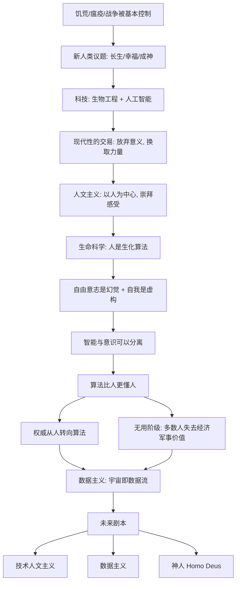

# 《未来简史》深度解读系列

## 系列简介

《未来简史》是赫拉利继《人类简史》之后的续篇。前一本讲人类如何从动物走到今天，这一本问的是：**接下来会怎样？**

赫拉利的判断是：当饥荒、瘟疫和战争这些困扰人类几千年的问题基本被控制后，人类会把目光转向新的目标——**长生不死、永远快乐、以及"成神"**：用生物科技和人工智能改造自己，获得曾经属于神的能力。

但支撑现代世界的信念——**人文主义**，即"人是意义的来源、要听从自己的内心"——正面临来自生命科学和人工智能的双重挑战。如果所谓的自由意志只是神经元的电化学反应，如果算法比你自己更了解你的欲望，那么"以人为本"还站得住吗？

赫拉利预言：权力可能从人类转移到算法，社会可能从"以人为本"转向"以数据为本"，甚至出现一个被系统判定为"不再被需要"的**无用阶级**。他还提出了一个耐人寻味的概念——**数据主义**：一种可能取代人文主义的新"宗教"。

本系列围绕 **20 个核心问题**，从人类的新目标、现代性的交易、自由意志的迷思，一路讲到数据主义与"神人"，帮读者理解这部关于"明天"的思想实验。

---

## 全书核心问题

| 层次 | 问题 |
|---|---|
| 目标问题 | 当生存问题基本解决，人类会把目标转向哪里？ |
| 意义问题 | 现代人赖以生活的"意义"来自哪里？它为什么会动摇？ |
| 主体问题 | 如果自由意志是幻觉、算法更懂我们，人的价值还剩什么？ |
| 权力问题 | 权力与权威会转移到哪里？人类的未来有哪几种可能？ |

---

## 全书知识地图



---

## 全系列目录

### 第一部分：人类的新目标

#### 01｜饥荒、瘟疫、战争真的被解决了吗？

核心问题：赫拉利说人类已经基本驯服了饥荒、瘟疫和战争，这个判断成立吗？

核心观点：从长期数据看，暴力死亡、饥荒致死和传染病致死的比例在 20 世纪后大幅下降，人类整体第一次有了"这些问题可控"的错觉；但这种"解决"是脆弱的、不均衡的，新冠等事件就提醒我们它远未终结。赫拉利借此说明：人类的议程正在从"活下来"转向"活得更好"。

理解难度：★★☆☆☆

关键词：新人类议题、饥荒、瘟疫、战争、脆弱性

---

#### 02｜当生存问题解决，人类会追求什么？

核心问题：如果饿死、病死、战死不再是主要威胁，人类会把精力投向哪里？

核心观点：赫拉利认为会出现三大新目标——长生不死（ immortality）、永远快乐（happiness）、以及"成神"（divinity，获得神一般的能力）。它们不再是科幻，而是已被资本和科技认真对待的方向。

理解难度：★★★☆☆

关键词：长生、幸福、成神、新人类议题

---

#### 03｜追求永生和快乐，为什么可能是陷阱？

核心问题：长生、幸福、成神看起来都是好事，为什么赫拉利要提醒我们警惕？

核心观点：这三个目标可能带来巨大的不平等与失控——只有少数人能"升级"，多数人可能被抛下；追求永恒快乐可能摧毁意义；追求成神则意味着人类把自己变成另一种存在。目标本身不坏，问题在于"谁能得到"和"后果由谁承担"。

理解难度：★★★★☆

关键词：不平等、升级、失控、伦理

---

### 第二部分：现代性的交易与人文主义

#### 04｜现代人跟“意义”做了一笔什么交易？

核心问题：现代社会为什么让人类既获得了空前力量，又失去了宇宙意义？

核心观点：赫拉利提出"现代性的交易"：人类同意放弃"宇宙有既定意义"的旧信念，换取"我们可以用知识和力量改造世界"的新能力。代价是——意义不再由天定，而要由人自己创造。

理解难度：★★★★☆

关键词：现代性、意义、力量、交易

---

#### 05｜“以人为本”为什么成了现代世界的新宗教？

核心问题：人文主义不是宗教，为什么赫拉利把它称为现代世界最主流的"信仰"？

核心观点：人文主义把"人的感受与选择"当作最高权威，取代了上帝的权威。它不问"神想要什么"，而问"人感觉如何"。自由、人权、民主、市场经济背后，都是同一个信念：人的主观体验是意义与权威的来源。

理解难度：★★★☆☆

关键词：人文主义、自由、人权、感受、权威

---

#### 06｜“听从你的内心”真的可靠吗？

核心问题：人文主义让我们相信"内心感受"是最可靠的指引，这个前提站得住吗？

核心观点：赫拉利指出，人被教导要"做自己""听从内心"，但现代科学恰恰在拆解"内心"——欲望、情绪和选择都可以被生物机制解释，甚至被外部操纵。当"内心"不再神圣，人文主义的根基就开始松动。

理解难度：★★★★☆

关键词：内心、感受、操纵、人文主义危机

---

### 第三部分：自我、意识与自由

#### 07｜你真的有“自由意志”吗？

核心问题：我们以为自己在自由选择，但科学能不能证明"自由意志"存在？

核心观点：赫拉利综合脑科学指出：人的决定往往在意识察觉之前就已由神经活动启动。我们有"我在选择"的感受，却没有证据证明存在一个不受因果决定的自由选择者。自由意志可能是演化给出的有用幻觉。

理解难度：★★★★★

关键词：自由意志、神经科学、决定论、幻觉

---

#### 08｜如果行为由生化机制决定，“我”还剩下什么？

核心问题：如果欲望和选择都是生化算法，那个"做决定的自己"究竟是什么？

核心观点：赫拉利认为，"人"更像一套由基因、激素和神经元组成的算法系统。这并不等于人没有价值，但它动摇了"人人都有一个神圣的、自由选择的内核"这一现代信念——而这正是人权与民主的哲学前提。

理解难度：★★★★★

关键词：生化算法、自我、人的价值、哲学危机

---

#### 09｜你脑子里有几个“你”？

核心问题：我们常说自己有一个统一的自我，可"自我"真的是一个整体吗？

核心观点：赫拉利区分"体验自我"和"叙事自我"：前者是此刻的感受流，后者是事后讲述、整合故事的那个自我。做重大决定时，往往是叙事自我在替我们做主——我们记住的不是真实体验的总和，而是一个被讲出来的故事。

理解难度：★★★★☆

关键词：体验自我、叙事自我、记忆、故事

---

#### 10｜智能和意识是两回事吗？

核心问题：一个系统可以极其聪明，却完全没有感受吗？

核心观点：赫拉利区分"智能"（解决问题的能力）和"意识"（感受痛苦与快乐的能力）。二者常被混为一谈，但可能彼此独立——AI 可以拥有超级智能，却没有主观体验。这一区分是现代思想中最容易被忽略、后果最深远的一点。

理解难度：★★★★★

关键词：智能、意识、AI、感受、分离

---

#### 11｜智人到底有没有独特的“灵魂火花”？

核心问题：人类一直相信自己是万物之灵，有什么独特的东西，这个信念还成立吗？

核心观点：赫拉利逐一审视"灵魂""意识统一性""自由意志"这些让人特殊的候选者，结论是：人类并没有一个不可替代的神圣火花；我们与动物的差别是程度问题，而非本质问题。这为"人能否被算法替代"埋下伏笔。

理解难度：★★★★☆

关键词：人类的火花、灵魂、动物、特殊性、演化

---

### 第四部分：智人失去控制

#### 12｜算法为什么可能比你自己更了解你？

核心问题：一个机器凭什么比我们自己更清楚我们想要什么？

核心观点：赫拉利认为，当算法掌握了足够多的行为数据、又拥有更强的计算力时，它可以从外部"看穿"你的欲望、恐惧和选择倾向，甚至比你的自我认知更准确。到那时，"听从自己"可能变成"听从算法"。

理解难度：★★★★☆

关键词：算法、大数据、自我认知、预测、权威

---

#### 13｜当大多数人不再被需要，“无用阶级”会出现吗？

核心问题：如果机器能替代越来越多的工作，那些失去经济与军事价值的人会怎样？

核心观点：赫拉利提出"无用阶级"概念：不是失业者，而是在经济与军事体系里都不再被需要的群体。历史上，普通人至少能当士兵和劳动力；如果这两项价值都被机器取代，社会将第一次面对"多数人无用"的局面。

理解难度：★★★★★

关键词：无用阶级、自动化、就业、价值、社会分裂

---

#### 14｜权威为什么要从人转向算法？

核心问题：为什么"谁说了算"这个问题的答案，可能从人类手里溜走？

核心观点：赫拉利认为，当算法在医疗、就业、投资、择偶上给出比人更准的建议时，人们会逐渐把决策权交出去。这不是被迫的，而是"因为更好用"而自愿发生的——权力以一种温柔的方式转移。

理解难度：★★★★☆

关键词：权威转移、算法决策、自由、便利

---

#### 15｜自由主义为什么会陷入危机？

核心问题：二十世纪最成功的政治哲学——自由主义，为什么可能撑不过二十一世纪？

核心观点：自由主义建立在"每个个体都能自由感受、理性选择"的假设上。但生命科学说感受是可被计算的，AI 说算法比你更懂你——如果个体不再是可靠的意义与决策中心，自由主义的三大支柱（自由意志、个体、感受）就一起动摇。

理解难度：★★★★★

关键词：自由主义、自由意志、个体、危机、政治

---

#### 16｜什么是“数据主义”？

核心问题：赫拉利提出的"数据主义"，到底是一种什么样的新信念？

核心观点：数据主义认为，宇宙由数据流组成，任何事物的价值在于它对数据处理的贡献。它把人类也只看作数据处理系统中的一个环节，并可能像人文主义取代宗教那样，成为下一代主导的"宗教"。它已经悄悄藏在搜索引擎、社交平台和智能设备里。

理解难度：★★★★★

关键词：数据主义、信息流、算法、新宗教、价值

---

#### 17｜数据主义会取代人文主义吗？

核心问题：如果数据主义真的兴起，人文主义会被怎样替代？

核心观点：赫拉利看到两种可能：一是"技术人文主义"，仍以人为中心，只是用科技升级人；二是"数据主义"，让更高效的数据系统接管决策，人从中心退场。前者保留人文主义的价值，后者则可能把人文主义送进历史。

理解难度：★★★★★

关键词：取代、技术人文主义、数据主义、过渡

---

### 第五部分：未来与选择

#### 18｜人类的未来可能有哪几种剧本？

核心问题：综合全书，赫拉利为人类准备了哪几条可能的未来路径？

核心观点：大致有三种。第一，生物工程/技术人文主义：改造身体与大脑，人仍是主角。第二，半机械人与算法融合：人机边界消失。第三，"神人"出现：少数人升级为 Homo Deus，与普通人拉开物种级差距。三条路都指向同一个问题——谁来定义"人"。

理解难度：★★★★☆

关键词：未来剧本、生物工程、人机融合、神人、分化

---

#### 19｜“神人”会取代智人吗？

核心问题：赫拉利所说的 Homo Deus（神人）究竟意味着什么？它会终结智人吗？

核心观点：Homo Deus 指通过科技获得神一般能力的新人类。赫拉利并不认为智人会像尼安德特人那样被消灭，而更可能被"分化"和"降格"：一部分人升级为新的主导者，另一部分人失去被需要的价值。这不是物种灭绝，而是物种内部的撕裂。

理解难度：★★★★★

关键词：Homo Deus、神人、分化、物种、升级

---

#### 20｜如果算法比我们更了解自己，我们还能选择什么？

核心问题：在一个算法无处不在的未来，人类个体还剩下哪些真正的选择？

核心观点：赫拉利没有给出乐观或悲观的答案，而是留下一组追问：当"做什么"越来越由系统建议，"想成为谁"还能不能由自己决定？也许人类唯一的出路，是重新思考"价值"到底来自数据处理，还是来自那些无法被计算的东西。这也是全系列留给读者的终极问题。

理解难度：★★★★★

关键词：选择、自由、价值、意义、终极问题

---

## 推荐阅读顺序

**主线顺序（推荐）：01 → 20，逐篇阅读。**

按认知难度和逻辑依赖，分五段推进：

```text
第一段｜新目标（01–03）
   问题基本解决 → 转向长生/幸福/成神 → 警惕陷阱
        ↓
第二段｜意义与人文主义（04–06）
   现代性交易 → 以人为本 → 内心的可靠性
        ↓
第三段｜自我与意识（07–11）
   自由意志 → 生化算法 → 多重自我 → 智能/意识分离 → 没有火花
        ↓
第四段｜失去控制（12–17）
   算法更懂你 → 无用阶级 → 权威转移 → 自由主义危机 → 数据主义
        ↓
第五段｜未来与选择（18–20）
   三种剧本 → 神人 → 我们还能选择什么
```

**阅读建议：**

- **想先抓住全书骨架**：读 02、04、07、10、16、19 六篇，即可拼出完整主线。
- **对 AI 与算法议题感兴趣**：直接从 10、12、14、16 切入。
- **对政治哲学感兴趣**：重点读 05、15、17 三篇。
- **想练习批判性阅读**：重点看 01、03、07、15 四篇，它们争议最集中。

---

## 全系列状态

> 本系列 20 篇正文已全部完成，每篇独立成文，均采用统一结构：先说结论 → 提出问题 → 作者观点 → 翻译成人话 → 推理链 → 现实例子 → 回到书中 → 深层逻辑 → 争议 → 现代延伸 → 核心结论 → 留一个问题。
>
> 每篇都严格区分「赫拉利的书中观点」「科学/事实」「学界争议」「现代延伸」，并对争议处保持开放。
>
> 建议阅读顺序：从 **01｜饥荒、瘟疫、战争真的被解决了吗？** 开始，依次读到 **20｜如果算法比我们更了解自己，我们还能选择什么？**
