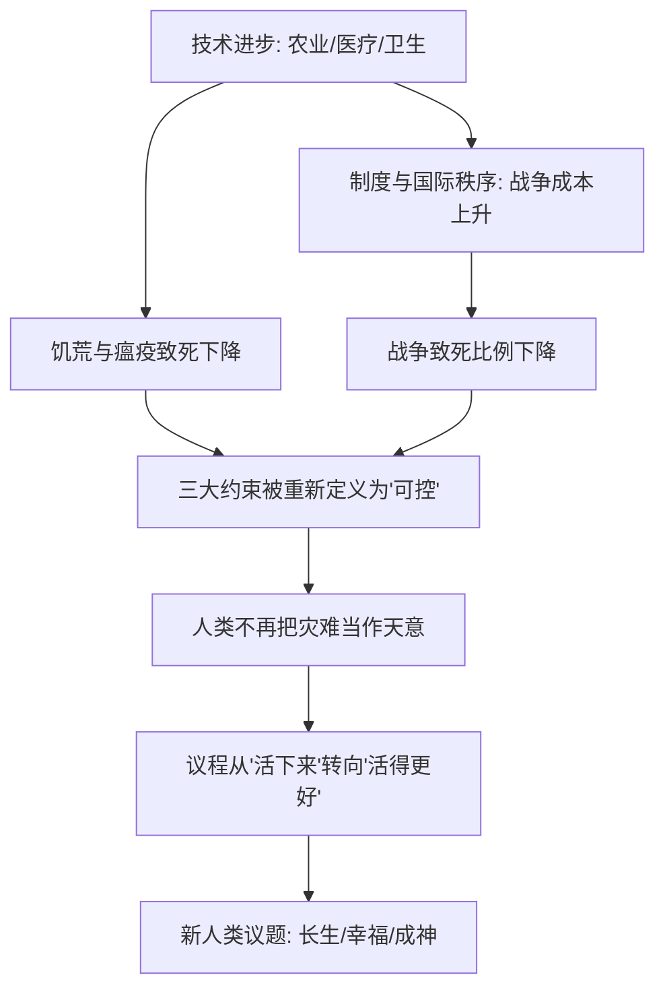

# 01｜饥荒、瘟疫、战争真的被解决了吗？

> 赫拉利说人类已经基本驯服了饥荒、瘟疫和战争，这个判断成立吗？

---

## 一、先说结论

赫拉利在书的一开头就抛出一个大胆判断：到了 21 世纪初，饥荒、瘟疫和战争这三个人类几千年来最大的敌人，已经从"不可抗拒的天灾"变成了"可以管理的难题"。

他引用统计数据说，这三者造成的死亡占比，已经降到人类历史上的最低点。过去，一场旱灾就能饿死一个国家；一次鼠疫就能抹掉欧洲三分之一的人口；一场战争就是常态而非例外。而现在，人类第一次有底气认为：这些问题即使没有彻底消失，至少是**可控**的。

但请注意赫拉利用的是"可控"，不是"解决"。这个区分，恰恰是理解全书的关键。

---

## 二、我们先理解一个问题

我们从小到大听到的历史，几乎就是一部"灾难史"：饥荒、瘟疫、战争轮番登场。中世纪的黑死病、爱尔兰的土豆饥荒、两次世界大战……人类似乎一直在跟死亡赛跑。

可如果换一个问法，事情会变得很奇怪：

> 今天，一个普通国家里最可能杀死你的是什么？
> 是饿死、瘟疫、战乱，还是心脏病、癌症、车祸和肥胖？

在大多数现代国家，答案是后者。这意味着一个历史性的转折：**人类的主要死因，第一次从"外部灾难"变成了"自身生活方式"。**

那么问题就来了：赫拉利凭什么说人类已经"驯服"了这三个老对手？这个判断有多少是事实，有多少是一种乐观的错觉？

---

## 三、作者到底提出了什么观点？

赫拉利在《未来简史》第一章"新人类议题"里，给出了他的核心判断。

他认为，人类在 20 世纪完成了一次身份的转变：

- 过去几千年，饥荒、瘟疫、战争是**不可避免的自然力量**，人只能祈祷和忍受；
- 到了 20 世纪末、21 世纪初，这三者逐渐变成**可以被技术、制度和政策管理的风险**。

赫拉利特别强调，这不代表问题消失了，而是代表**人类的态度变了**：我们不再认为"饿死人、病死人是天意"，而是认为"这是我们本可以避免的失误"。一旦一个社会把某类死亡重新定义为"可以避免的"，它就会投入巨大的资源去对抗它。

这就是他所谓的"新人类议题"的起点：当老问题变得可控，人类的注意力就会转向新的目标——而不再只是"活下去"。

---

## 四、把这个观点翻译成人话

我们可以用"致死原因排行榜"来理解这个转变。

假设你生活在三百年前的一个普通村庄。那时候，最可能让你死掉的是什么？大概是：一场传染病、一次歉收导致的饥荒、或者一次土匪或军队的劫掠。这些事你几乎无法控制，只能靠运气。

再看今天的一个普通城市居民。最可能让他死亡的是什么？多半是：心血管疾病、癌症、糖尿病、车祸，以及和生活方式有关的慢性病。这些当然也不完全可控，但它们不再来自"天降的灾难"，而更多和"我怎么生活"有关。

看出区别了吗？**过去，死亡像天气；现在，死亡像账单。** 天气你没法商量，账单却可以管理——你可以少花、可以分期、可以提前预防。

赫拉利想说的正是这种转变：人类看待灾难的方式，从"这是命"变成了"这是可以避免的失败"。而这种心态的转变，才是真正的分水岭。

---

## 五、为什么会这样？

赫拉利的推理可以拆成一条链：

关键在于 **E → G** 这一步。

当人类相信灾难可以被管理，它就会追问一个此前奢侈得无法想象的问题：**既然我们不必忙着活命，那我们要把命活成什么样？**

这不是道德觉悟的结果，而是能力增长的结果。人不是因为变善良了才停止互相残杀，而是因为战争的代价变得太高；不是因为有信仰了才不挨饿，而是因为农业、运输和医疗让它变得罕见。

赫拉利的冷静之处就在这里：他讲的不是"人类变好了"，而是"人类的处境变了"。

---

## 六、举一个现实生活中的例子

看一个反差极大的对比：**恐怖袭击与交通事故。**

一次恐怖袭击往往占据全球头条，引发恐慌、安检升级、甚至战争。但从死亡人数看，它造成的死亡远远少于日常交通事故。赫拉利在书中正是用类似的反差来说明问题：恐怖分子真正的武器不是杀人数量，而是**制造恐惧的能力**。他们能把"被杀死"的想象放大到整个社会，从而改变人们的行为和政治议程。

而与此同时，每天因为交通事故、饮食不当、吸烟而死去的人，数量要大得多，却很少成为新闻——因为它们是"可预期的、分散的、不戏剧化的"。

这个例子说明了两件事：

第一，人类对"灾难"的感受，并不与死亡数字成正比，而取决于它是否制造恐惧和失控感。

第二，正因为今天的老灾难已经变得"平淡"，人类的注意力才有余裕被新的焦虑占据。**当饿死不再常见，我们才有精力去恐惧一场远方的恐袭。**

---

## 七、回到书中重新理解

现在再回看赫拉利的开篇，就顺了。

他之所以要在书的开头用大量统计来说明"饥荒、瘟疫、战争变得可控"，不是为了庆祝人类有多伟大，而是为了铺垫一个更惊人的转向：

> 既然这三件事不再是人类议程的中心，那人类接下来会追求什么？

他的答案是三个新目标：**长生不死、永远快乐、以及"成神"。**

赫拉利的逻辑是：一个人饿的时候，只想吃饱；一旦吃饱了，就会想活得久一点、活得好一点，最后甚至想变成超越普通人的存在。人类作为一个整体，走的也是同一条路。老问题一旦被视为可控，新欲望就会立刻接管议程。

所以第一章真正重要的，不是那些死亡数据，而是这句话背后的潜台词：**人类即将第一次为"无法实现的欲望"而非"无法解决的生存"发愁。**

---

## 八、这个观点背后还有什么？

有几个隐藏的前提，值得单独拎出来。

**第一，"可控"是一种主观判断，而非客观事实。** 赫拉利自己承认，饥荒和瘟疫并没有被消灭，只是被"重新定义"为可管理的风险。这个定义一旦成立，政府就有了责任，人民就有了期待——而一旦期待落空，反噬也会很大。

**第二，这个判断高度依赖"统计平均值"，掩盖了巨大的地区差异。** 对发达国家来说，饥荒瘟疫已经成为历史记忆；但对部分贫困地区，它仍是日常现实。用全球平均数字说"人类驯服了灾难"，对生活在战乱和饥荒中的人是不公平的。

**第三，"新议题"不是自然产生的，而是资本和科技推动的。** 长生、幸福、成神之所以进入议程，是因为有人愿意为它们投资、有市场为它们买单。赫拉利后面会指出，这些目标的背后站着巨大而冷酷的商业逻辑。

**第四，它为整本书埋了伏笔。** 只有先接受"生存问题基本解决"，后面关于"人要不要改造自己""算法要不要接管选择"的讨论才成立。第一章不是背景介绍，而是全书的逻辑起点。

---

## 九、这个观点有问题吗？

有问题，而且争议相当大。这里要特别提醒：**赫拉利的判断是一种有启发的框架，不是学界共识。**

**第一，全球数据可能高估了"解决"的程度。** 就在赫拉利出版之后的几年，新冠疫情就暴露出全球公共卫生体系的脆弱；地区性战争、饥荒、难民危机也从未真正中断。一些学者指出，用"平均死亡率长期下降"来论证灾难已可控，可能掩盖了趋势可能逆转的风险。

**第二，暴力下降本身在学界就有争议。** 关于"人类暴力长期下降"的判断，一些学者（如斯蒂芬·平克）持支持态度，但也有不少人认为这个结论依赖对古代数据的粗略估计，可能低估了历史上的战争与杀害，也可能高估了当代和平的稳固性。关于这一问题，学界存在不同解释。

**第三，"可控"的说法有概念偷换的风险。** 把"死亡率下降"等同于"问题被驯服"，中间跳过了一个问题：下降是因为人真的能控制它，还是因为某些条件暂时有利（如相对和平的国际格局、抗生素的黄金时代）？如果是后者，那它就不是"可控"，而是"侥幸"。

**第四，影响最大的批评是：赫拉利把复杂的全球状况，压缩成了一条过于干净的进步曲线。** 这种叙事很有力量，也很容易让人忽略那些正在恶化、或者被平均数字藏起来的部分。

**所以更准确的说法是**：赫拉利提供了一个极有冲击力的观察——人类的主要死亡模式和注意力焦点确实发生了历史性转移；但"饥荒、瘟疫、战争已被驯服"是一个需要打上很多限定条件的判断，而不是一个可以照单全收的事实。

---

## 十、今天再看这个观点

以下部分是基于赫拉利思想的现代延伸，不是他在书里的原话。

赫拉利写的"新议题"是长生、幸福和成神，但放在今天看，第一章其实给了一个更普遍的提醒：**危险不会消失，它只会换一种形式。**

过去，人类最怕的是自然和同类；今天，我们最怕的可能是系统性的、慢性的、难以归因的风险：气候异常、金融连锁崩溃、大流行、以及人工智能带来的失控。它们和老灾难有相似的结构——不可预测、跨越国界、需要集体协作——但更难被人直观地感受，因此也更难被认真对待。

而这正好落回赫拉利的核心问题：当人类以为最大的敌人已经被驯服，它会不会反而放松了对新型威胁的警觉？传染病、战争、饥荒也许从未真正走远，它们只是在等待一个人类自我感觉良好的时刻卷土重来。

---

## 十一、这一篇真正应该记住什么？

1. **三大老问题从"天灾"变成了"可控风险"。** 赫拉利认为，饥荒、瘟疫、战争在 20 世纪后逐步被重新定义为可管理的难题，而非不可抗拒的宿命。

2. **真正的转变是"态度"，不是"事实"。** 问题并未消失，是人类不再接受"这些死亡是不可避免的"，从而愿意投入资源去对抗。

3. **恐惧与死亡数字不成正比。** 恐怖袭击致死远少于交通事故，却能主导政治议程，说明人类对灾难的反应取决于失控感而非统计。

4. **老问题一旦被视为可控，新目标就会接管议程。** 长生、幸福、成神之所以出现，是因为人类第一次有余力为"活得更好"而不是"活下来"发愁。

5. **这个判断需要大量限定。** 全球平均值掩盖了地区差异，新冠和地区冲突也提醒我们："可控"可能只是暂时的、脆弱的。

---

## 十二、留一个问题

> 如果饥荒、瘟疫、战争从来都只是被"暂时管理"，而不是被"彻底解决"，
> 那么当人类把全部注意力转向长生、幸福和成神时，
> 会不会正把最危险的赌注，押在一个我们早已松开手的旧问题上？

---

**下一篇**：既然生存问题被认为基本解决，人类这个"闲不住"的物种，会把目光投向哪里？赫拉利说，答案可能比我们想象的更野心勃勃——不仅想活得好，还想活得更久，甚至想变成神。

下一篇我们就来拆开这个问题——**当生存问题解决，人类会追求什么？**
