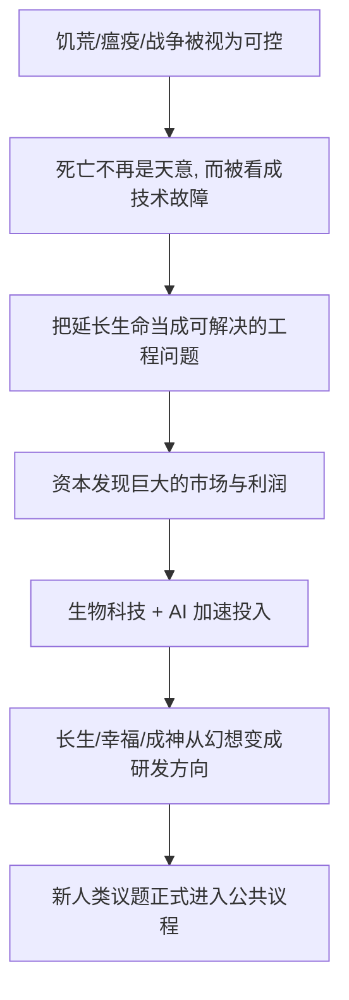

# 02｜当生存问题解决，人类会追求什么？

> 如果饿死、病死、战死不再是主要威胁，人类会把精力投向哪里？

---

## 一、先说结论

赫拉利认为，当饥荒、瘟疫、战争从"不可抗拒的命运"变成"可以管理的风险"，人类不会就此满足，反而会把目光投向三个更野心勃勃的目标：**长生不死、永远快乐、以及"成神"**。他给这三件事起了一个名字——"新人类议题"。

关键在于，赫拉利不是说这些是科幻幻想。他指出，它们已经在被资本和科技认真对待：有人投资延长寿命，有人研究如何直接调节幸福感，有人尝试改造基因、创造新的生命形式。换句话说，人类的下一个议程，可能不再是如何活下去，而是如何不再受普通人的限制。

---

## 二、我们先理解一个问题

先别急着评判这三个目标是否荒唐，我们试着做一次思想实验。

假设你生活在一个食物充足、医疗可靠、治安稳定的城市。大概率饿不死、多数传染病有药可治、战争离你很远。那么，接下来你会为什么而活？

答案看起来很多：赚钱、家庭、爱好、理想。但如果把这些具体目标一层层剥掉，你会发现它们背后往往指向三个更根本的愿望：**活得久一点、过得好一点、变得更强一点。**

个体如此，人类作为一个整体可能也是如此。于是问题就出现了：

> 如果"活下来"已经不再是难题，人类会不会把"活得更久、更快乐、更有力量"从愿望升级成正式目标，甚至不惜动用最前沿的科技去实现它？

赫拉利的判断是：会，而且已经开始。

---

## 三、作者到底提出了什么观点？

在《未来简史》第一章里，赫拉利提出，人类历史上第一次，把三件事当作可以认真推进的"项目"，并称之为"新人类议题"。

需要特别说明的是，这三个目标的真实含义，比字面上要克制一些。

| 目标 | 通俗说法 | 赫拉利所指的真实含义 |
|---|---|---|
| 长生不死 | 永远不死 | 把死亡当作可以延缓的技术问题，不断延长健康的寿命 |
| 永远快乐 | 天天开心 | 不只是消除痛苦，而是追求一种可持续的、被科学调校过的幸福状态 |
| 成神 | 变成神 | 获得创造和改造生命的能力，成为地球生命的设计者，而不只是使用者 |

赫拉利认为，这三者并不是孤立的愿望，而是同一条逻辑的三种表现：**当人不再被生存束缚，就会试图突破自身的生理与生物极限。**

他还强调，这些目标之所以值得认真对待，不是因为它们一定能实现，而是因为它们正在吸引真实的资金、人才和制度投入——一旦一件事被当成"工程"来做，它就不再只是幻想。

---

## 四、把这个观点翻译成人话

用一句大白话概括赫拉利的判断：**过去人类忙着不饿死，现在开始琢磨怎么不当普通人。**

我们可以把人类的追求想象成一个需求阶梯：

- 最底层：别饿死、别病死、别被打死；
- 往上一层：活得健康、活得长久；
- 再往上一层：活得开心、最好一直开心；
- 最顶层：干脆改造自己，获得过去只有"神"才有的能力。

有意思的是，这条阶梯和我们个人很像。年轻时为温饱发愁，温饱解决后开始养生、健身、买保险，再往后追求情绪价值、心理健康，最后有人开始研究基因、长寿、乃至"意识上传"。

赫拉利想说的不是"人变贪心了"，而是：**人的欲望会自动往上一格。** 满足了低层的需求，高层的需求就会浮现，而且看起来同样理所当然。

---

## 五、为什么会这样？

赫拉利的推理可以拆成一条链：

这条链里最关键的两步，是 **B** 和 **D**。

先说 B。一旦人们不再认为"死亡是命中注定"，而开始认为"死亡是身体这台机器的故障"，那么治病就不再以"恢复健康"为终点，而会顺势延伸到"能不能修得更久一点、更好一点"。医学的目标从"对抗疾病"滑向"对抗衰老本身"。

再说 D。赫拉利指出，这些目标之所以能进入现实，不是靠哲学家的呼吁，而是因为背后有资本。只要足够多的人愿意为"多活几年""更快乐""更年轻"付钱，就会有人把它做成产品、做成产业。商业模式一旦成立，技术进步就会被按下加速键。

---

## 六、举一个现实生活中的例子

最能说明这种趋势的，是**医美与抗衰老产业**，以及**硅谷富豪的"续命"投资**。这两件事其实是一枚硬币的两面：一边是大众市场，一边是尖端实验。

先说医美与抗衰老。它早已不只是"整容"，而扩展为一个围绕"看上去更年轻、身体状态更好"的庞大产业：护肤品、医美项目、营养补剂、体检与健康管理。赫拉利引用数据称，现代人对"衰老"的态度发生了根本变化——过去它被接受为自然规律，现在它越来越像一种需要被干预的"症状"。

再说高端的部分。据一些公开报道，部分科技行业的富豪投入大量资金，资助长寿与抗衰老研究，甚至有人公开表示，衰老应当被视为一种"可以治愈的疾病"。这些投入未必立刻兑现，但它们说明了一件事：**"活得极长"正在从神话变成某些人认真下注的赛道。**

把这两头放在一起看，逻辑就很清楚了：大众市场提供资金与需求，顶层实验提供想象力与技术突破，两者互相喂养，"长生"就这样从一个宗教式愿望，变成了一个产业命题。

需要说明的是，赫拉利本人的论述更偏框架和警示，他不会简单地说"人类都在追求长生"，而是提醒：**当"延长寿命"被当成生意，它首先被服务的，往往是付得起钱的人。** 这一点，下一篇会重点展开。

---

## 七、回到书中重新理解

现在再回看赫拉利的第一章，就不只是"人类有三个新梦想"这么简单了。

他真正想做的，是把这三个目标重新摆到"现代性"的框架里。过去的宗教告诉人：死亡、痛苦、渺小都是命中注定，你应当接受它、超越它（比如寄希望于来世）。而现代科技给出的回答是：**这些不是命运，而是问题；既然是问题，就可以被解决。**

赫拉利把这个转变看得很重。因为它意味着人类第一次集体承认：**我们不满意自己的出厂设置，并且打算改。** 长生针对的是生命的长度，幸福针对的是感受的质量，成神针对的是能力的边界——三者合起来，就是对"人是什么"的正面挑战。

所以第一章不是科普，而是一个宣言式的观察：人类的议程变了，而这次要改的可能不只是环境，而是人自己。

---

## 八、这个观点背后还有什么？

这个观点背后藏着几个不那么显眼的前提。

**第一，它默认"死亡是一个技术问题"。** 这是一个非常强的假设。很多文化和宗教传统恰恰认为死亡是意义的来源，而不是待修的故障。赫拉利是从"技术可行性"的角度谈问题，他绕开了价值判断，但价值判断并没有消失。

**第二，它把"幸福"当作可以被测量、被工程化的对象。** 赫拉利在后面会指出，快乐其实是生化机制，可以被药物、刺激或算法调节。这既让"幸福工程"看起来可行，也埋下了一个大问题：如果快乐可以被直接制造，它还是我们想要的快乐吗？这个问题会在下一篇详细讨论。

**第三，它暗示"力量优先于意义"。** 先有改造世界的能力，意义的问题被推迟到后面。这正是全书第二部分"现代性的交易"的前奏：人类用放弃宇宙既定意义，换来了改造世界的力量。

**第四，"成神"其实是对"人"这个概念的重新定义。** 如果人可以被改造、被设计、被创造，那"人"就不再是一个固定物种，而是一个可以迭代的项目。这直接通向后面关于"神人"和物种分化的讨论。

---

## 九、这个观点有问题吗？

要分三层来看：哪些有说服力，哪些有争议，哪些可能被过度简化。

**有说服力的部分。** 赫拉利观察到的事实方向基本清楚：延长寿命、抗衰老、情绪干预、基因编辑等领域确实在获得越来越多的关注与投资。历史记录显示，新技术往往先被少数人使用，再逐步扩散；而"人一旦有余力就会追求更好"也是一个被反复验证的规律。

**有争议的部分。** 关于这三个目标是否真的会成为"人类的共同议程"，学界存在不同解释。一些历史学家和文化研究者认为，不同社会的价值取向差异很大，宗教传统、集体主义文化可能并不把"长生"和"成神"当作值得追求的目标。把全人类都描述成在朝同一个方向狂奔，可能低估了文化和信仰的多样性。

**可能被过度简化的部分。** 第一，赫拉利倾向于把"人类"当成一个统一的行动者，但现实中的人类高度分裂：有人追求长生，也有人拒绝；有人投资抗衰老，也有人认为这是在加剧不平等。第二，他把技术趋势讲得相当确定，但从"有人在做"到"整个社会都在追求"，中间还隔着制度、伦理和市场的不确定性。第三，"永远快乐"这个目标本身就存在内在矛盾——赫拉利自己在书里也承认，快乐是会被适应的生化反应，这让"永远的快乐"在生理上就值得怀疑。

所以更准确的说法是：赫拉利用"新人类议题"这个框架，敏锐地抓住了人类注意力转移的方向；但把它读成"全人类正在一致追求长生、快乐和成神"，则是一种过度整齐的概括。

---

## 十、今天再看这个观点

以下部分是基于赫拉利思想的现代延伸，不是他在书里的原话。

赫拉利写作时，谈长生、幸福、成神还更像是"趋势预言"。放到今天看，它们已经进入了更具体的形态：长寿科技成为投资热点，AI 被用于药物研发与健康预测，消费级的健康监测设备普及，关于生殖与基因技术的伦理讨论不断出现。与此同时，"幸福"也越来越被当作一个可干预的指标——从心理健康 App 到情绪相关的产品，商业力量正认真经营"让人更快乐"这件事。

这种延伸带来的新问题，比赫拉利当年面对的还要直接：**当"优化自己"成为一门生意，它到底是解放，还是新的分层？** 谁能买得起更好的体检、更好的药物、更好的"优化"？如果答案不均等，那么"人类追求长生、快乐、成神"这句话背后的"人类"，可能并不指所有人。这正是下一篇要拆的东西。

---

## 十一、这一篇真正应该记住什么？

1. **三大新目标：长生、快乐、成神。** 赫拉利认为，生存问题一旦被视为可控，人类议程就会转向延长寿命、追求幸福和获得"神一般"的能力。

2. **长生不是"永远不死"。** 它的现实含义是把死亡当成技术问题，尽可能延长健康的寿命，而非追求神话式的永生。

3. **快乐被当成可工程化的对象。** "幸福工程"不只消除痛苦，还试图制造可持续的快乐——而这一点恰恰埋着陷阱。

4. **成神是能力的升级，不是身份的自封。** 它指人获得创造与改造生命的力量，从而不再只是生命的使用者，而成为设计者。

5. **这不是幻想，而是有资本推动的方向。** 医美、抗衰老、长寿投资等现实产业，正是这些目标进入议程的证据。

---

## 十二、留一个问题

> 如果"活得久、更快乐、更强大"真的成为人类的正式目标，
> 那么第一个要回答的问题或许不是"能不能做到"，
> 而是——**这些东西，最终会属于谁？**

---

**下一篇**：长生、幸福、成神，听起来都是好事。可赫拉利为什么反复提醒我们要警惕它们？因为在这三个美好的词背后，藏着不平等、失控和伦理的裂缝。

下一篇我们就来拆开这个问题——**追求永生和快乐，为什么可能是陷阱？**
