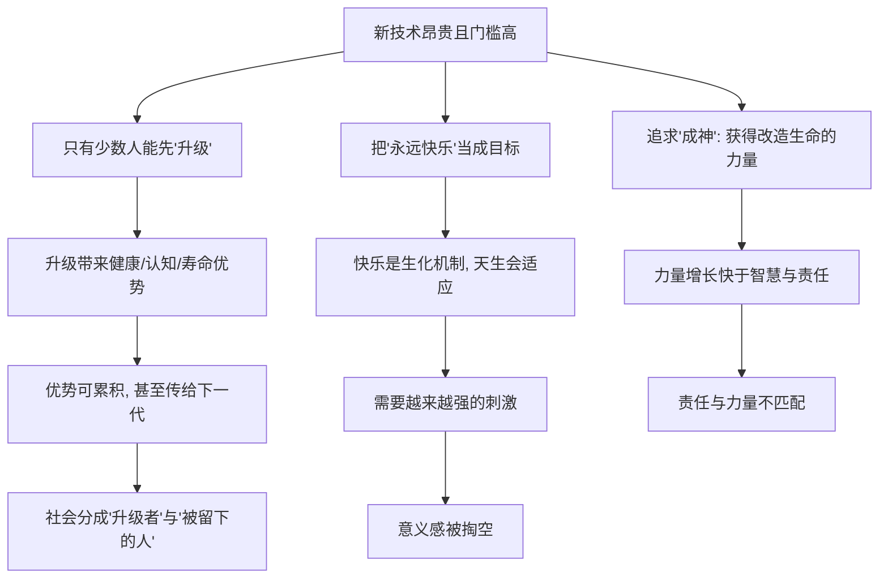

# 03｜追求永生和快乐，为什么可能是陷阱？

> 长生、幸福、成神看起来都是好事，为什么赫拉利要提醒我们警惕？

---

## 一、先说结论

赫拉利的警惕不在目标本身，而在**分配**和**后果**。他在书中反复强调：长生、幸福、成神都不是坏事，真正危险的是三个问题——**这些能力会被谁得到、以什么代价得到、后果由谁承担。**

具体来说：如果延长寿命的技术只对少数人开放，社会可能分裂成"升级者"和"被留下的人"；如果"永远快乐"被当成工程目标，它可能因为生理机制而根本无法实现，反而掏空意义；如果人类真的获得"成神"的能力，力量与责任很可能严重不匹配。目标没错，错的可能是一路走来的方式。

---

## 二、我们先理解一个问题

先看一个逻辑上的困惑：一件好事，为什么可能变成陷阱？

答案其实很日常。好东西变坏，通常不是因为它本身坏，而是因为三种情况之一：

- **它不均匀。** 只有一部分人能拿到，另一部分人被排除在外；
- **它会反噬。** 追求它的方式，破坏了让这件事有价值的前提；
- **它超过了驾驭能力。** 拿到它的人，还不具备用好它的智慧与责任。

把这三种情况套到长生、幸福、成神上，赫拉利的担忧就变得具体了：

> 如果长生只属于富人，如果快乐可以被无限刺激到麻木，如果成神的人并没有变得更负责——那这三件事，还是"好事"吗？

这就是本文要拆的问题：不是"要不要追求"，而是"追求的方式会不会把好事变成陷阱"。

---

## 三、作者到底提出了什么观点？

赫拉利在书中并没有简单地说这三个目标"有害"。他的担忧可以归结为三条。

**第一，升级会带来分化。** 赫拉利提出一个关键区分：新技术往往先服务于付得起钱的人。如果延长寿命、增强认知、改造身体的能力可以被购买，那么社会可能不再是贫富差距，而是**生物学意义上的差距**——一部分人"升级"成新的存在，另一部分人停留在原地。

**第二，永恒快乐在生理上可能是个悖论。** 赫拉利指出，快乐来自体内的生化机制，而这类机制天生会"适应"：第一次带来强烈快感的事，重复之后就会变淡。这意味着，想要维持同等快乐，就需要不断加码的刺激。追求"永远快乐"，可能不是到达幸福的终点，而是陷入一个永远追不上的循环。

**第三，成神意味着责任与力量不匹配。** 如果人类获得创造和改造生命的能力，却没有相应的智慧和克制，那么这份力量更像是一个危险品。赫拉利提醒：人类有能力做一件事，和有能力承担它的后果，是两回事。

---

## 四、把这个观点翻译成人话

把这三条翻译成大白话：

- **不平等这条**：就像一款游戏里，只有充得起钱的少数玩家能升级装备，普通玩家还在原地挨打。久而久之，这不再是"同一个游戏里的强弱差距"，而是"两个完全不同的游戏"。
- **快乐这条**：就像一直吃糖。第一颗很甜，吃多了就不甜了，于是要吃更多、更甜。追求"永远快乐"的人，可能最后得到的是"永远想要更多快乐"。
- **成神这条**：就像一个小孩拿到了核按钮。按钮是真的管用，但拿按钮的人未必知道该不该按、什么时候按。

赫拉利真正想说的其实是同一件事：**问题不在目标，而在"谁能得到"和"后果由谁承担"。** 长生、幸福、成神本身没有道德属性，是分配方式和权力结构决定它的好坏。

---

## 五、为什么会这样？

三条担忧背后，是三条可以分开看的推理链：

先看第一条。技术扩散通常有先后：先是少数人能负担，然后逐步降价。问题在于，如果被升级的是**人的身体和大脑本身**，那么这段"先后差距"可能不会被时间抹平，反而会被拉大。因为升级带来的健康、寿命、认知优势可以累积，甚至可能通过基因或资源传给下一代。赫拉利担心的是：那时的差距，不再只是钱包的差距，而是生命本身的差距。

再看第二条。快乐的生化机制有一个特点：它是相对的。科学研究显示，人对持续刺激会逐渐适应，同样的好事重复出现，带来的快感会递减。所以"永远快乐"若被理解为"持续保持高峰体验"，它在生理上就很难成立。更麻烦的是，如果一个人只追求快乐本身，他可能会越来越依赖外部刺激，而原本赋予生活意义的东西——目标、关系、付出——会被慢慢挤走。

最后看第三条。人类获取力量的速度，常常快过理解力量后果的速度。赫拉利认为，如果改造生命的能力真的到手，人类要面对的不再是"能不能做"，而是"该不该做、由谁决定、出事谁负责"。而现有的伦理和法律体系，恐怕来不及跟上。

---

## 六、举一个现实生活中的例子

最能体现"追求即时快乐的陷阱"的，是**刷短视频**。

场景你大概很熟：本来只想看五分钟，结果一抬头已经过去两小时；明明眼睛发酸、心里发空，手指还是停不下来。每滑一次，都有一点小刺激——好笑的、意外的、刺激情绪的内容——平台也会根据你的反应，不断把更"上头"的内容推给你。

这条链是怎么运作的？

- 第一步：刺激带来即时快感；
- 第二步：快感很快适应，需要更强或更新的刺激；
- 第三步：为了维持那点快感，你继续刷，时间被吞掉；
- 第四步：停下来之后，往往不是满足，而是空虚和疲惫。

这个例子和赫拉利的观点高度呼应：**快乐是一种会被适应的生化反应。** 你想追求的是快乐，最后得到的却可能是"越来越难被满足"。赫拉利在书里谈的是快乐作为生化机制这一原理，而短视频是把这套原理放进今天生活的一个具体场景——它说明"追求即时快乐"为什么可能反过来削弱我们。

需要说明的是，赫拉利本人并未用短视频作为例子，这里的对应关系属于对其观点的现代延伸，不是作者原话。

---

## 七、回到书中重新理解

现在再回看赫拉利的原意，就会清楚他并不是在唱衰科技。

他的立场更像一个冷静的观察者：**长生、幸福、成神都是强大到危险的东西。** 强大，所以值得追求；危险，所以必须提前想清楚。他在书中真正反复追问的是分配问题——历史上每一次重大技术红利，几乎都先被少数人享用。如果这一次被"优化"的对象是生命本身，那后果可能不是"有人先富起来"，而是"有人先变成另一种存在"。

这也把第一章和他后面的论述接了起来：升级的分化，会走向"无用阶级"（不是失业，而是在经济与军事体系里都不再被需要）；追求长生与幸福的权力，可能逐渐交给算法；而"成神"则对应着"神人"的出现。**这一篇讲的三个陷阱，其实是后面十几个问题的伏笔。**

---

## 八、这个观点背后还有什么？

**第一，它默认"技术不会自动平等"。** 赫拉利不认为市场会自动把好东西分给所有人。这个前提有历史依据——很多医疗技术确实先服务富裕人群；但也有反例，某些技术一旦成熟会大幅降价普及。这一点是争议的核心。

**第二，它把"欲望"看作没有上限的。** 快乐会被适应、力量会想要更多，这是赫拉利对人性的一贯假设。如果这个假设成立，那么"满足"永远只是暂时的，追求本身可能变成目的。

**第三，它暗示伦理总是滞后于技术。** 人类往往先造出东西，再回头争论该不该造。赫拉利提醒的是：在人被改造之前，也许该先想清楚"人"要往哪儿去。

**第四，它与"现代性的交易"直接相关。** 人类用意义换力量，于是力量增长得很快，意义却要靠自己现造。当长生、幸福、成神都变成可追求的"力量"，意义的问题就更容易被搁置。

---

## 九、这个观点有问题吗？

这里必须保持平衡。赫拉利的担忧既有说服力，也有明显的争议，不能简单说他对或错。

**支持他的一面。** 历史上新技术确实常先被少数人掌握，医疗与教育资源的分配长期不均；科学研究显示快乐存在适应现象，这为他的"快乐悖论"提供了支撑；而权力与责任脱节的风险，在核武器、环境危机等议题上已经反复出现。

**反对他的一面。** 关于技术是否会永久加剧分层，学界存在不同解释。一种常见反驳是：技术往往先贵后廉，手机、互联网、GPS 都曾是少数人的工具，最终却普及到大众；医疗进步本身就在不断延长普通人的寿命，把"延长寿命"一概视为威胁，逻辑上有点说不通。还有人认为，赫拉利低估了民主制度、公共政策和伦理规范对技术的调节能力——正是因为有监管和舆论，危险的技术才没有失控。

**认为他杞人忧天的一派。** 他们主张：问题会出现，社会也会应对；技术恐惧是一种历史反复出现的情绪，从火车到电力到基因编辑，每次都有人预言灾难，结果大多被消化掉了。因此，把长生、幸福、成神预设成陷阱，可能是一种悲观的叙事偏好。

**认为他警示不足的一派。** 相反，也有人认为赫拉利还说得太温和：不平等、成瘾式快乐和"升级"带来的伦理问题，在现实中已经露头，紧迫性比他描述的更强。

**可能被过度简化的地方。** 第一，他把社会分成"升级者"和"被留下的人"，但现实更可能是一个连续的光谱，而非泾渭分明的两类。第二，他假设人们会一致追求这些目标，忽略了有人会主动拒绝——正如今天也有人选择不使用某些技术。第三，他更擅长提出问题，却不擅长给出答案，这也是他一贯的风格：不是预言家，而是提问者。

所以更准确的说法是：**赫拉利提出的是一种"风险框架"，而非确定的预言。** 它有价值，是因为它逼我们提前思考分配与责任；但把它当成必然到来的灾难，也同样是一种过度解读。

---

## 十、今天再看这个观点

以下部分是赫拉利思想的现代延伸，不是作者原话。

赫拉利写作时，这些担忧还偏理论。到今天，争议已经有了更现实的载体：高昂的精准医疗与基因疗法，让人担心"健康"会不会变成一种奢侈品；脑机接口和认知增强的研究，让"升级自己"不再只是比喻；而算法推荐与成瘾式产品设计，则让"追求即时快乐反而更空虚"这件事，变成了很多人每天都在经历的日常。

把这些放在一起看，赫拉利的问题在今天更尖锐了：**当"优化自己"成为可以购买的选项，社会该怎么保证它不变成新的特权？当快乐可以被产品直接制造，我们还有没有能力分辨"真正想要的生活"和"被喂给我们的快乐"？** 这些都不是科幻问题，而是正在发生的选择题。

---

## 十一、这一篇真正应该记住什么？

1. **目标不坏，分配才关键。** 赫拉利的警惕指向"谁能得到、后果由谁承担"，而不是反对长生、幸福、成神本身。

2. **升级可能带来生物学层面的分化。** 如果改造生命的能力只对少数人开放，社会可能分裂成"升级者"和"被留下的人"，而不只是贫富差距。

3. **永恒快乐在生理上可能是个悖论。** 快乐是会被适应的生化反应，追求持续高峰，往往换来"永远想要更多"。

4. **力量与责任需要匹配。** 获得改造生命的能力，不等于具备承担后果的智慧，这正是"成神"最危险的地方。

5. **这是风险框架，不是必然预言。** 有人认为是杞人忧天，也有人认为警示还不够，两种立场都值得认真对待。

---

## 十二、留一个问题

> 如果长生、幸福、成神终将到来，真正决定它们是好是坏的，
> 也许不是技术有多强，而是我们有没有先想清楚：
> **什么样的不平等是我们可以接受的？什么样的代价是我们不愿意付的？**

---

**下一篇**：赫拉利说，人类之所以能一路追求力量，是因为先跟"意义"做了一笔交易——放弃宇宙预先安排好的意义，换取改造世界的能力。这笔交易到底换来了什么，又失去了什么？

下一篇我们就来拆开这个问题——**现代人跟"意义"做了一笔什么交易？**
