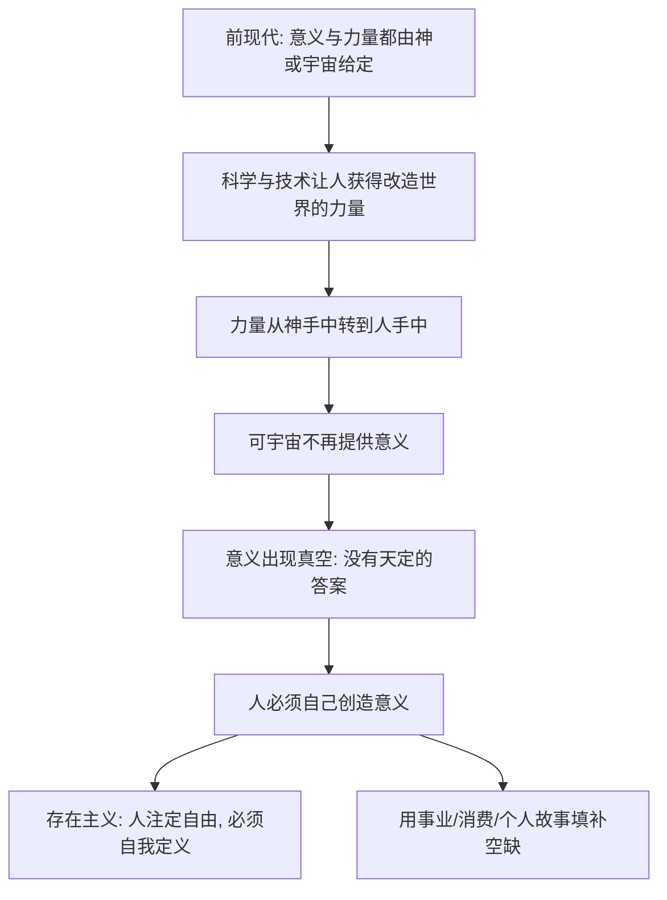

# 04｜现代人跟“意义”做了一笔什么交易？

> 现代社会为什么让人类既获得了空前力量，又失去了宇宙意义？

---

## 一、先说结论

赫拉利认为，现代人做成了一笔深刻而不易察觉的交易：我们放弃了"宇宙本来就有一套既定意义、人只需去遵从"的旧信念，换来了"我们可以用知识和力量改造世界"的新能力。

这笔交易带来了空前的收益——科学、经济、医疗、寿命都因此起飞。但代价同样沉重：**意义不再由上天规定，而必须由人自己创造。** 赫拉利称之为"现代性的交易"。

## 二、我们先理解一个问题

前现代社会几乎不需要为"意义"发愁，因为答案早就写好了：世界是神创造的，人生有既定目的，苦难有它的解释。人不需要发明意义，只需要找到并服从它。

可现代人不一样。我们能预报天气、能治愈疾病、能登上月球，力量前所未有。但力量能回答"我该往哪去"吗？能回答"这一切到底为了什么"吗？

问题就在这里：**一个人可以既无比强大，又完全不知道方向。** 现代人为什么会陷入这种处境？

## 三、作者到底提出了什么观点？

赫拉利认为，前现代与现代社会之间，发生了一场关于"意义"和"力量"的重新分配。

在前现代的世界观里，这两样东西是绑在一起的，而且都由外部给定：意义来自神或宇宙秩序，力量也在很大程度上仰仗祈祷、祭祀和天意。人不能自己定义什么算成功，也不能自己决定世事如何运行。

现代性做的第一件事，是把这两样东西拆开：

- **力量**交给人：我们相信世界不是神秘意志的产物，而是一套可以被认识、被计算、被改造的规律。
- **意义**却被悬空了：既然没有一个更高的声音来规定人生目的，那么"该追求什么"就不再有天定答案。

赫拉利把这描述成一份"契约"：人类用"不再追问宇宙意义"换来了"可以改造世界的力量"。他并不认为谁真的坐下来签了字，而是说，这是现代社会作为一个整体，事实上接受的一种交换。

## 四、把这个观点翻译成人话

可以这样理解：

前现代的人像是在一本**别人写好的剧本**里演戏。角色、台词、结局都定好了，你只需演好。意义是现成的，困惑很少，尽管自由也很少。

现代人则像是**剧本突然被抽走**的演员。舞台、灯光、道具（也就是技术、资本、制度）全都在你手上，你可以演任何角色——但没人告诉你该演什么。你必须自己写剧本，还得自己承担写砸的后果。

于是出现了现代人特有的一种疲惫：**不是没有能力，而是不知道值不值得。**

## 五、为什么会这样？

赫拉利的推理可以整理成一条链：

关键的一步是 **C → E**：力量被拿回来了，意义却没有跟着一起被继承。人类赢得了对世界的控制权，却同时失去了"世界本来要我们做什么"的答案。这笔交易划算与否，取决于你认为"力量"和"意义"哪个更值钱。

## 六、举一个现实生活中的例子

最能说明这种转变的，是**求雨**。

在前现代，一个村庄遇到旱灾会做什么？多半是祈祷、献祭、举行求雨仪式。这不是愚昧，而是当时唯一合理的行动：他们相信雨由更高的力量掌管，人能做的只有恳请天意。意义和力量都握在神手里。

今天呢？我们不会祈雨，而是看气象预报、做人工降雨、搞水利调度、建灌溉系统。旱灾依然可能发生，但它变成了一道**技术和管理问题**，而不是一道"天意"的问题。

这个对比里藏着一个巨大的心理变化：**过去，雨是神的答复；现在，雨是大气环流的一个变量。** 当我们把雨从"神的意志"变成"可计算的物理过程"，我们确实赢得了行动能力，但也就同时失去了那种"上天在通过雨向我们说话"的意义感。

## 七、回到书中重新理解

现在再看赫拉利的"现代性交易"，就清楚了。

他并不是在歌颂科学、也不是在哀叹信仰的失落，而是在描述一个结构性的事实：现代社会之所以能持续进步，恰恰建立在这样一个前提上——**我们承认自己不知道宇宙的意义，但仍愿意用力量去改善处境。**

这也解释了为什么现代人一方面空前自信，一方面又普遍焦虑。自信来自力量：我们能治病、能造飞机、能延长寿命。焦虑来自意义的空缺：做得越多，"这些到底为了什么"这个问题反而越响。

## 八、这个观点背后还有什么？

有几个隐含前提值得指出。

**第一，"交易"本身是一种理论比喻，不是历史事件。** 没有人真的在某个时间点签字放弃意义。赫拉利用"契约"来描述一种集体性的、缓慢的文化转向，它是一种阐释框架，而不是可考的证据。

**第二，它假定前现代的人真的活在"意义充沛"里。** 这个前提值得怀疑：对大多数古代普通人来说，生活更多是苦难和生存压力，未必有时间享受"宇宙意义"。

**第三，它暗示意义必须是"天定"或"自创"二选一。** 现实中，人们的意义来源往往介于两者之间——来自家庭、传统、社群，而不完全是个人发明。

**第四，它把"力量"和"意义"当成可以交换的两样东西。** 但也许二者根本不在同一个层面：力量解决"能不能"，意义回答"该不该"，用一方换另一方，可能从一开始就是错配的比喻。

## 九、这个观点有问题吗？

关于"现代人失去了意义"这一判断，学界存在不同解释。

支持者认为，赫拉利抓住了一个真实的现代困境：当宗教和传统权威退场，个体确实必须独自面对"我为什么活着"的问题，这正是存在主义、虚无主义等思潮兴起的背景。这种说法很有解释力。

但也有不少批评。一些思想史学者认为，赫拉利把"前现代等于意义确定、现代等于意义缺失"的对照讲得过于干净，实际上前现代的人同样怀疑、同样迷茫，而现代人也从科学、艺术、社群、爱情中获得大量意义。另一些人则指出，所谓"意义的空缺"可能只是知识分子的焦虑，对多数普通人来说，生活目标从来是具体的、务实的，而不是宇宙性的。

所以更准确的说法是：**赫拉利提供的是一个有力的叙事框架，而不是一个被普遍接受的事实。** 它揭示了现代性的某种张力，但把它说成"人类集体做了一笔交易"，本身就带着很强的文学化色彩。

## 十、今天再看这个观点

以下部分是基于赫拉利思想的现代延伸，不是他在书里的原话。

在赫拉利的时代之后，"意义空缺"的填补方式变得更加明显，也更加商品化。人们用**事业成就**来证明自己没白活，用**消费**来购买身份和快乐，用**社交媒体上的人设**来讲述一个"我是谁"的故事。这些做法未必是坏的，但它们都有一个共同点：把"意义"外包给了外部指标——职位、粉丝数、消费能力。

这也让赫拉利的问题变得更尖锐：当意义由外部指标来提供，而外部指标又由平台和资本设计，**我们创造的究竟是自己的人生，还是一个被推荐给我们的人生？**

## 十一、这一篇真正应该记住什么？

1. **现代性的交易是"意义换力量"。** 赫拉利认为，人类放弃宇宙既定意义的旧信念，换来用知识和力量改造世界的能力。

2. **力量回答"能不能"，不回答"该不该"。** 技术进步能解决无数问题，却无法告诉你这些努力最终为了什么。

3. **意义从"给定"变成"自造"。** 前现代的意义是继承来的，现代的意义必须自己创造，这既带来自由，也带来负担。

4. **现代人的焦虑有其结构性来源。** 强大的行动力加上悬空的目的，是现代社会反复出现的精神张力。

5. **这是一个有启发的框架，而非定论。** "交易"是比喻，前现代是否真的意义充沛、现代是否真的意义缺失，都仍有争议。

## 十二、留一个问题

> 如果现代人真的用"意义"换来了"力量"，
> 那么当力量已经足够强大时，
> 我们有没有可能，反过来用力量去买回一点意义？
> 还是说，正是这种"想买回意义"的冲动，本身就已经是交易的一部分？

---

**下一篇**：现代人放弃了一个由神规定的意义体系，可一个庞大的社会总不能悬在半空。那么，什么接替了上帝的位置，成为现代世界默认的最高权威？赫拉利给出了一个出人意料却又处处可见的答案——人自己。

下一篇我们就来拆开这个问题——**"以人为本"为什么成了现代世界的新宗教？**
