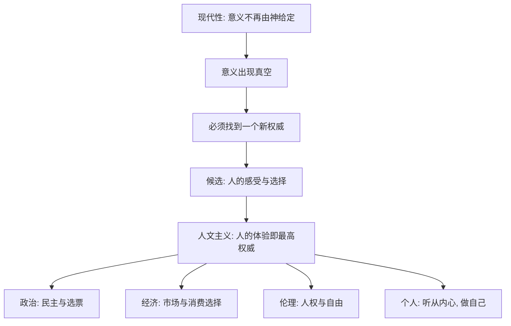

# 05｜“以人为本”为什么成了现代世界的新宗教？

> 人文主义不是宗教，为什么赫拉利把它称为现代世界最主流的"信仰"？

---

## 一、先说结论

赫拉利认为，人文主义是接替上帝位置的现代主导信仰。它把"人的感受与选择"当作最高权威：不再问"神想要什么"，而问"人感觉如何"。自由、人权、民主、市场经济看起来各说各话，底层却共享同一个信念——**人的主观体验，是意义和权威的最终来源。**

## 二、我们先理解一个问题

现代社会明明是一个"祛魅"的世界：科学不信神，法律不谈灵魂，市场只看价格。可奇怪的是，我们依然有一套不容置疑的"神圣"语言：人权不可侵犯、民主天经地义、顾客永远是对的、"要相信自己的感受"。

这些观念从哪来？如果上帝已经退场，它们的权威又建立在哪里？

赫拉利的问题正是：**当神不再说话，谁说了算？**

## 三、作者到底提出了什么观点？

赫拉利认为，答案是"人"。

他把这个以人为中心的信仰系统称为**人文主义（humanism）**。它的核心公式很短：**意义和权威不来自天上，而来自人的内心体验。** 于是，判断一件事对不对、好不好，标准从"是否符合神的旨意"变成了"是否让人感觉良好、是否符合人的意愿"。

赫拉利特别指出，人文主义虽然通常不被看作宗教，却在功能上扮演了宗教的角色：它提供了一套关于"什么是善、谁有权威、人生该追求什么"的完整答案，让整个社会可以在没有统一神明的情况下，仍然拥有共同的价值观。

## 四、把这个观点翻译成人话

用一句话对比：

- 前现代问："神要求我们怎么做？"
- 现代问："人们自己觉得怎样最好？"

这就是权威来源的搬家。以前，权威从天上往下发；现在，权威从一个个人的感受里往上汇聚。

一个直观的检验方法是看"谁有最终否决权"。在古代，是祭司、经典和神谕。在今天，最常见的是：**投票结果、民意调查、用户评分、消费者偏好。** 当一件事"人民不答应"或"消费者不买单"，它就没有合法性——哪怕它再符合传统或权威。

## 五、为什么会这样？

关键在于 **D → E**：既然没有外部声音能替我们决定，那么唯一还剩的"合法来源"，就是人自己的体验。民主是用选票表达它，市场是用购买表达它，人权是用"个人不可被侵犯"表达它。

## 六、举一个现实生活中的例子

看两件看似不同、其实同源的事：**选举投票和顾客评价。**

选举里，一张选票代表"我认为谁该执政"。顾客评价里，一颗星代表"我认为这个产品好不好"。一个决定谁来治理国家，一个决定哪个商家能活下来——但它们用的是同一套逻辑：**个人感受汇总起来，就成为权威。**

赫拉利想说的正是这一点：选票和好评，本质上都是"人的主观体验在投票"。它们不诉诸神意、不诉诸传统，只诉诸"人们感觉如何"。当足够多的人如此感受，结论就获得了合法性——这就是人文主义在日常生活里最普通、也最有力的样子。

## 七、回到书中重新理解

赫拉利在书中把人文主义分成几个分支，理解它们有助于看清全貌：

- **自由人文主义**：强调每个个体的自由与感受最重要，是今天西方主流的版本。
- **社会人文主义**：强调集体、平等与共同体，认为个体要通过社会整体来实现价值。
- **进化人文主义**：认为人类的"优胜劣汰"本身可以成为标准，主张让更"优"的人胜出。

这三个分支都同意"人是中心"，但对"哪些人的体验算数""该怎样组织人类"给出了完全不同的答案——自由人文主义走向个人权利，社会人文主义走向集体与平等，进化人文主义甚至可能滑向种族主义。赫拉利指出，这种内部分裂，本身就是人文主义的一个隐患。

但它们的共同底色是一致的：**权威不在天上，在人身上。**

## 八、这个观点背后还有什么？

**第一，"人是权威"其实是一个信念，而不是科学结论。** 科学本身不会告诉你"应该"听从谁的感受，它只描述"是什么"。把人的体验当成最高标准，是一个价值选择。

**第二，它需要"感受可加总"这个前提。** 民主和市场都假定：把许多个人的偏好加在一起，就能得到一个正当的集体决定。但这个前提并不总是成立——多数人的偏好也可能伤害少数人。

**第三，它默认人可以清楚地知道自己的感受。** 这是后面最容易被科学挑战的一点。如果人的感受是可以被塑造甚至伪造的，那么"以感受为权威"就变得很不稳。

**第四，它与"现代性交易"是配套的。** 意义既然不再由天定，就必须由人来定；人文主义正是那套"由人来定"的操作系统。

## 九、这个观点有问题吗？

赫拉利把人文主义称为"现代世界最主流的信仰"，这个判断既有洞察力，也存在争议。

支持者认为，这个框架确实抓住了一个常被忽略的事实：许多现代人一边宣称自己不信仰任何宗教，一边却毫无保留地相信"个人感受最重要""自由选择不可侵犯"，这种态度在结构上确实与信仰无异。

但批评者也提出几点。一些哲学家认为，把人文主义叫作"宗教"是一种过度类比——它没有神、没有经典、没有来世，其内部还包含大量理性论证，与宗教的运作方式并不相同。另一些学者则指出，赫拉利把差异巨大的自由主义、社会主义、进化人文主义打包成一个"信仰"，可能模糊了它们之间根本性的政治对立。还有人提醒，现实中大量社会并非以"个人感受"为权威，而是以集体、传统或权威人物为中心，所谓"全球默认的政治正确"其实带着很强的西方视角。

所以更准确的说法是：**赫拉利看准了人文主义在功能和地位上"像宗教"，但是否应当直接称之为宗教，学界并没有共识。**

## 十、今天再看这个观点

以下部分是基于赫拉利思想的现代延伸，不是他在书里的原话。

赫拉利的观察在今天反而更加明显。商业上，"用户评价""点赞""关注"成了产品生死的裁决；公共讨论中，"我觉得""我的感受"越来越常被当作论证的终点；企业宣称"顾客是上帝"，平台宣称"以用户为中心"，本质上都是把人的偏好供上神坛。

但与此同时，也出现了一些反向信号：当算法可以批量影响评价、当情绪可以被流量放大，"人的感受"是否还是那个可信的最高权威，就成了悬而未决的问题。这正好把讨论推向下一步。

## 十一、这一篇真正应该记住什么？

1. **人文主义把权威从天上搬到了人身上。** 不问"神想要什么"，只问"人感觉如何"，这是现代价值体系的核心转向。

2. **自由、人权、民主、市场共享同一套逻辑。** 它们都相信个人感受汇总起来就是权威，只是表达方式不同。

3. **人文主义内部分裂早已存在。** 自由、社会、进化人文主义都承认"人是中心"，却对"谁算数、如何组织"给出对立答案。

4. **"以感受为权威"暗含三个前提。** 人有真实感受、感受可以加总、感受应当被尊重——其中任何一个动摇，整套体系都会紧张。

5. **它"像宗教"是洞见，"是宗教"则仍有争议。** 把它称为新宗教是一个有力的框架，但学界对此并无共识。

## 十二、留一个问题

> 如果现代世界的最高权威是"人的感受"，
> 那么只要有一天，有人能证明你的感受是可以被设计、被制造、被购买的，
> 这套权威还站得住吗？
> 换句话说，我们究竟是听从了内心，还是听从了某个替我们塑造内心的力量？

---

**下一篇**：既然最高权威来自"人的感受"，那一切就取决于一件很朴素的事——我们的内心是否真的可靠。赫拉利会毫不客气地指出：现代科学正在把"内心"拆开来看，而拆开之后，它可能不再那么神圣。

下一篇我们就来拆开这个问题——**"听从你的内心"真的可靠吗？**
