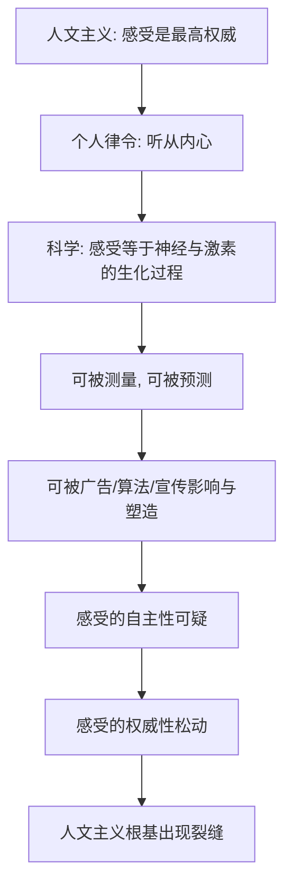

# 06｜“听从你的内心”真的可靠吗？

> 人文主义让我们相信"内心感受"是最可靠的指引，这个前提站得住吗？

---

## 一、先说结论

赫拉利认为，"听从内心""做真实的自己"是人文主义最重要的律令，但它建立在一个正在被科学拆掉的前提上。现代生命科学把欲望、情绪和选择解释为神经元的生化过程，而不是来自灵魂的神圣声音；更麻烦的是，这些过程可以被广告、算法和政治宣传影响甚至塑造。**如果感受可以被制造，"感受就是权威"这条信念就开始松动。**

## 二、我们先理解一个问题

我们几乎本能地相信：不管外面怎么吵，只要静下来听自己的心，就能找到最真实、最正确的答案。电影、歌词、励志书、毕业演讲，都在重复这句话。

但请试一个反问：**那个"心里的声音"，如果它其实是可以被外部悄悄写进去的，它还算是"你的"吗？**

这不是抽象的哲学游戏。广告、算法推荐、舆论操纵每天都在做类似的事。于是问题变成：我们把"内心"当作最后的裁判，可这个裁判本身，是不是早就被人影响过？

## 三、作者到底提出了什么观点？

赫拉利的论证分两步。

第一步，**"听从内心"是人文主义的核心律令。** 人文主义把人的主观体验当作最高权威，那么落实到个人身上，就是你要相信自己的感受、跟随自己的欲望、忠于自己的选择。民主、市场、教育、心理治疗，全都在鼓励这件事。

第二步，**但"内心"正在被拆解。** 赫拉利引用生命科学指出：我们的爱恨、恐惧、判断，并不是某种神秘的自我在发声，而是大脑中神经活动、激素和基因共同作用的结果。也就是说，那个被当作最高权威的"内心"，本质上是一套**生化算法**。

如果感受只是算法，那么在原理上，它就可以被外部输入影响，也可以被精确预测。人文主义把"感受"请上王座，而科学恰恰在质疑这位国王的合法性。

## 四、把这个观点翻译成人话

可以打个比方。

人文主义告诉你："你心里有一位法官，他永远公正，你只要听他的。"

科学则走过来说："这位法官不是天生的，他的判决书一半来自基因，一半来自你从小经历的事——包括你看过的广告、刷过的视频、身边的人。而且，别人还可能在你不知情时，往卷宗里塞进新的材料。"

于是你才发现，"听从内心"可能不是"听从最真实的自己"，而是"听从各种外部力量在你心里留下的回声"。它依然强烈、依然真实，但未必**自主**。

## 五、为什么会这样？

关键的一步是 **E → F**：一个东西可以被外部制造，就很难再被当作不容置疑的内在真理。这不是说感受是假的，而是说"感受最能代表真实的你"这个假设，开始站不住了。

## 六、举一个现实生活中的例子

一个极其日常的场景：**网购时看销量和好评。**

你打开购物软件，本来想凭自己判断这个商品值不值得买。但页面上写着"已售 10 万件""4.9 分""98% 好评"。于是你没有真的研究参数，而是直接选了评分最高的那一个。你以为自己做了一个"个人的决定"，实际上是让成千上万陌生人的评分，替代了你自己的判断。

更微妙的是，这些评分本身可能是被刷出来的、被引导的。你以为你在"听从自己"，其实是在听从一组被外部塑造过的信号。

这个例子正是"内心可靠性"问题的缩影：**当判断的依据可以被外部操纵，那"我的感受"和"别人的安排"之间的界线，就变得模糊了。**

## 七、回到书中重新理解

现在再回看赫拉利对人文主义的处理，就能看出他为什么把重心放在"感受"上。

在他那里，人文主义不是一套空洞口号，而是一条非常具体的指令：**遇到选择时，向内看，相信自己的感觉。** 民主投票是对它的大规模应用，消费选择是它的日常实践，心理咨询是它的技术化形式。

而赫拉利真正想说的是：这条指令的有效性，取决于一个未经检验的前提——**人的感受是真实、自主、值得信赖的**。当生命科学把这个前提拿出来检查时，它发现"感受"既非不可解释，也非不可操纵。

因此，被挑战的并不只是"自由意志"这个抽象概念，而是现代人每天都在实践的生活方式：跟随你的感觉。一旦感受不再神圣，整个以感受为基础的意义系统和制度安排，都要重新寻找根基。

## 八、这个观点背后还有什么？

**第一，它区分了"真实"和"自主"。** 感受是真实的（你真的感到快乐），但不一定是自主的（这份快乐的来源可能被设计过）。赫拉利动摇的是后者，不是前者。

**第二，"可被影响"不等于"总是被操纵"。** 人的感受确实受外部影响，但影响不必然是操纵——父母的爱、教育的引导、文化的熏陶也在影响我们。关键在于是谁、为何、以何种方式在影响。

**第三，它承认科学本身也是一种权威来源。** 如果科学说感受是生化过程，那我们就等于用科学来审判人文主义——这本身就是一次权威的转移，值得警惕。

**第四，它为后续讨论铺路。** 只有先承认"感受可被操纵"，后面"算法比你更懂你""权威从人转向算法"的推论才立得起来。

## 九、这个观点有问题吗？

这是一个争议极大的判断，应当两面都看。

支持赫拉利一方认为，广告、推荐算法、政治宣传确实在系统性地影响人的情绪与偏好，这在事实层面不难观察。科学上，情绪与决策和神经活动、激素水平相关，也有大量研究支持。因此"感受是纯粹自主的内在声音"这个想法，确实过于天真。

但批评者的意见同样有力。一些哲学家指出，**能被生物机制解释，不等于就不真实、不重要**——爱情和疼痛也都能用生化解释，却没有人因此认为它们没有意义。另一些思想家强调，感受之所以重要，恰恰因为它是唯一无法被别人替代的个人体验来源；即便它受外界影响，"我疼不疼""我快不快乐"仍然只有当事人才有发言权。还有人提醒，人权并不依赖"感受是否神圣"，而是建立在"人不应被任意伤害"之上，所以科学对感受的解释，未必能真正撼动人权的哲学基础。

所以更平衡的结论是：**赫拉利成功地指出了"听从内心"这条律令的脆弱之处，但"感受可被影响"并不自动推翻"感受值得尊重"。** 前者是事实层面的发现，后者是价值层面的主张，两者之间还隔着一道需要论证的鸿沟。

## 十、今天再看这个观点

以下部分是基于赫拉利思想的现代延伸，不是他在书里的原话。

赫拉利写作时，挑战"内心"的主要还是广告和有限的算法。今天，这道题被推到了新的量级：推荐系统能根据你的点击、停留、犹豫，推测你的偏好并不断投喂；短视频用即时反馈训练你的注意力；政治传播用情绪动员来塑造立场。人的"喜欢"越来越像是在与一套系统互动的产物，而不是一个孤立内心的独白。

由此引出一个更尖锐的问题：如果我的偏好是系统塑造的，而系统又声称"因为它最懂你，所以该替你做决定"，那么**所谓"听从内心"，究竟是在听从自己，还是在听从那个被系统看穿并精心喂养出的自己？**

## 十一、这一篇真正应该记住什么？

1. **"听从内心"是人文主义落实到个人的核心律令。** 它是民主、市场、心理治疗和励志文化的共同底层。

2. **科学把"内心"解释为生化过程。** 欲望与情绪可以被测量、预测，从而也可能被影响和塑造。

3. **感受真实，但未必自主。** 被外部输入的判断依然是真实的体验，却不再能证明它完全属于"我"。

4. **这动摇了人文主义的根基，但没有一举推翻它。** 科学发现的是"感受可被影响"，而"感受应否被尊重"是另一个层面的价值问题。

5. **真正的危机在于承认。** 一旦我们承认内心可被塑造，就很难再天真地把"我感觉"当作最终真理。

## 十二、留一个问题

> 如果连"我的感受"都可能是被设计出来的，
> 那么当我说"这是我自己的选择"时，
> 说的到底是我的自由，还是别人替我编好的一句台词？

---

**下一篇**：要回答这个问题，就必须追到更深的一层——那个正在做选择的"我"，真的存在吗？我们以为自己在自由决定，可神经科学发现，决定有时早在你意识到之前就已经启动了。

下一篇我们就来拆开这个问题——**你真的有"自由意志"吗？**
