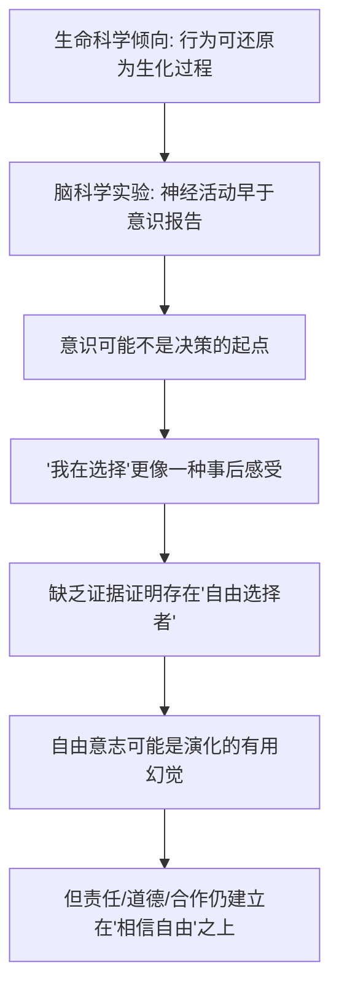

# 07｜你真的有“自由意志”吗？

> 我们以为自己在自由选择，但科学能不能证明"自由意志"存在？

---

## 一、先说结论

赫拉利综合脑科学的发现，给出了一个让人不太舒服的判断：我们以为自己"先想清楚、再做决定"，但一些实验提示，**大脑的神经活动可能在意识察觉到"我要这么做"之前就已经启动了**。

换句话说，那个"我在做选择"的感受，也许不是选择的**原因**，而更像是事后浮现的一个**结果**。赫拉利由此推断：我们拥有的是"自由的感觉"，却缺乏证据证明存在一个不受因果链条支配的"自由选择者"。自由意志，可能是演化给我们装配的一种有用的幻觉。

需要先说清楚：这是赫拉利的解读，不是科学界的共识。

---

## 二、我们先理解一个问题

上一篇我们聊到"听从你的内心"未必可靠——欲望和情绪可以被生物机制解释，甚至被外部操纵。如果顺着这条线再往下追一步，会撞上一个更硬的问题：

> 当你"决定"今天晚上吃面而不是吃饭，这个决定是谁做的？

直觉的答案很直接：当然是"我"做的。我权衡了、我考虑了、我选了。

但科学想问的是另一个层面的事：在做这个决定的过程中，那个"我"到底出现在哪一刻？是在你意识到"我要吃面"的那一瞬间，还是更早，早到你根本没察觉？如果神经活动先动了，意识后到，那"我在选择"这句话，还剩下多少字面上的真实性？

这就是自由意志问题最锋利的地方：它不是在问"你能不能自由"，而是在问**"那个做决定的你，究竟存不存在"**。

---

## 三、作者到底提出了什么观点？

赫拉利在《未来简史》里，把生命科学对自由意志的挑战概括成一条线索。

他指出，生命科学有一个越来越强的倾向：**把人的行为看作生物化学过程的结果**。你的想法、情绪、选择，都能对应到神经元、激素、基因的活动。如果每一个"决定"背后都有可追溯的生理机制，那么"自由"是在哪个环节插进来的？

赫拉利特别借助了一类经典的脑科学实验来说明问题。这类实验大致是这样：让受试者做一个简单动作（比如按按钮），同时记录脑电活动，并让他们报告"我意识到自己想动"的时刻。一些研究结果提示，与动作相关的脑部电位，**在受试者报告"我意识到要动"之前就已经出现**。

赫拉利据此认为：意识不像是一个发号施令的指挥官，更像一个事后被告知结果的发言人。我们有"我是发起者"的感受，但这个感受本身可能是被制造出来的——它能带来连贯的自我体验，却不一定对应一个真正的自由起点。

他还强调，即便自由意志是幻觉，它也有实际效用：正因为人们相信自己在做选择，才会有责任感、才会有道德约束、社会合作才得以运转。

---

## 四、把这个观点翻译成人话

可以把意识想象成一家公司的**新闻发言人**。

公司内部的决策（神经活动）早就开完了会、定了方向，然后发言人走上台，对着镜头说："经过深思熟虑，我们决定这么做。"发言人确实"感受到了"这个决定，也确实把它讲了出来——但他不是拍板的人。

这不是说发言人在骗人。他是真诚的，他真的以为自己参与了决策。问题在于，**"真心以为"和"真是原因"是两回事**。

生活里我们都有类似的体验，只是通常不去深究。比如你突然想喝可乐，你会觉得"是我想喝"。但真的是"你"这个念头先冒出来，然后身体去执行吗？还是身体的某种状态先出现了一个"渴"或"馋"的信号，然后你的意识才把它翻译成"我想喝可乐"？

赫拉利想提醒的正是这个翻译过程：我们习惯把意识读到的内容，当作意识的原创。但如果它只是个翻译，那作者就不是它。

---

## 五、为什么会这样？

把赫拉利的推理拆成一条链，大概是这样的：

关键在 **B → C** 这一步：如果神经活动**先于**意识，那意识就很难被当作"第一因"。而一旦它不再是第一因，"自由选择"就失去了最直觉的落脚点。

注意这里的推进方式：赫拉利不是从哲学前提"一切都被决定"出发的，而是从**实验观察**出发的。他想说的是——哪怕你不接受决定论，光是这些实验的时序，就已经让"自由意志"这个词变得不太好解释了。

最后一步 **F → G** 同样重要：赫拉利并不主张"既然没有自由意志，那就随便吧"。恰恰相反，他认为这套幻觉之所以被演化保留，很可能正是因为它**有用**。

---

## 六、举一个现实生活中的例子

**超市货架摆放与冲动购买。**

你在超市里走到收银台前，排队的时候顺手拿起了一包口香糖或一块巧克力。你的感受是："我突然想吃了，就拿了。"

但如果你去看超市的设计逻辑，会发现这个"突然"并不太突然。冲动购买区域通常放在你**必须停留**的地方——收银台前面；商品放在视线和伸手的黄金高度；包装的颜色、位置、大小，都是被反复测试过的。商家知道，人在排队、等待、无聊、血糖下降的时候，更容易被触发购买。

这里有两层值得注意。

第一，你体验到的"我想买"，是真实的感受。你没有撒谎。

第二，但这个感受，很可能是在**外部刺激**和**内部生理状态**（比如饿、累、无聊）共同作用下浮现的，而不是一个凭空升起、完全自主的决定。你以为是自己"临时起意"，其实是被一个精心布置的环境推了一把，然后意识才把它读成"我想要"。

这正是赫拉利那个比喻的现实版：**念头可能是被引发的，意识只是把它接收并署名。**

---

## 七、回到书中重新理解

现在回看赫拉利的论述，会更清楚他在说什么。

他不是在说"你从来没有做选择"。他是在拆一个问题：我们平时所说的"自由"，通常有三种含义混在一起——

| 我们以为的"自由" | 赫拉利追问的问题 |
|---|---|
| 我能按自己的意愿行动，没人强迫我 | 这一层大多成立，算不上争议 |
| 我的意愿是我自己"想出来"的 | 意愿是否先于意识？实验提出了疑问 |
| 存在一个不被因果决定的"选择者" | 这一层缺证据，也是争议核心 |

赫拉利真正瞄准的是第三层：**那个不隶属于任何因果链条的"自由主体"，有没有证据？** 他的答案倾向于"没有"。

这就是为什么他把自由意志称为"演化给出的有用幻觉"。这句话有两个重音：**幻觉**，指它也许不对应真实存在的自由起点；**有用**，指它的社会功能是真实的——人正因为相信自己在选择，才会觉得"我应该为此负责"。

---

## 八、这个观点背后还有什么？

有几个隐含前提，值得单独拎出来。

**第一，它把"时序"当成了关键证据。** 神经活动早于意识报告，这在逻辑上确实重要。但从"早"到"所以意识不是原因"，中间还隔着一步推理。为什么"早"就一定意味着意识无效？这是赫拉利式解读里最容易被追问的地方。

**第二，它依赖"意识是单一时刻"的假设。** 实验要受试者报告"我什么时候意识到"，但"意识到"本身可能是一个逐渐形成的过程，未必有一个清晰的时刻点。如果它是一段过程，那么"早于/晚于"这个框架本身就可能有问题。

**第三，它把"自由意志"和"因果决定"对立起来。** 这是许多人默认的框架：要么自由，要么被决定。但哲学史上还有第三种立场，下面会讲。

**第四，它服务于整本书的走向。** 只有先让"自由意志"可疑，"个体"才可能可疑，"听从内心"才可能变得不可靠，后面"算法比你更懂你"的讨论才有地基。这一篇不是孤立的知识点，而是第三部分的入口。

---

## 九、这个观点有问题吗？

有问题，而且这是全系列争议最集中的地方之一。必须强调：**"自由意志是幻觉"是一个哲学化的解读，不是科学定论。**

**第一，实验本身的解读存在争议。** 前面提到的这类研究，自提出以来就不断被讨论。一些研究者认为，受试者报告"意识到"的时间点很难精确测量，可能被低估或误报；也有人指出，实验测到的脑活动未必对应"决定"，也可能只是注意力、准备状态的波动。关于这些实验结果该怎么解释，学界存在不同意见。

**第二，从"神经活动先出现"推不出"意识没有作用"。** 神经活动先启动，并不自动意味着意识只是旁观者。一个可能的理解是：意识参与的是"批准、否决、调整"的环节，而不是发起环节。这样看，意识仍然有功能，只是角色和我们的直觉不同。

**第三，决定论与自由意志未必矛盾。** 这是非常重要的一点。许多哲学家持"相容论"立场：他们认为，"自由"不需要一个脱离因果的开端。一个人如果按自己的意愿、不受外部强迫地行动，即使他的意愿本身有生理原因，也仍然可以算作自由。在相容论看来，赫拉利式的挑战建立在一个**本来就有争议**的"自由"定义上。

**第四，"自由意志是幻觉"这个说法本身需要小心。** 说一个感受是"幻觉"，通常意味着它错误地表征了某物。但"自由意志"要对标的是什么东西？如果不清楚它主张的是什么，就很难说它是假。这也是不少哲学家认为该判断"过强"的原因。

**所以更准确的说法是**：脑科学确实给"自由意志"制造了真实的麻烦，让我们不能再把"我想选就选"当作理所当然；但由此直接跳到"自由意志是幻觉"，是从实验证据跨到了哲学立场。**问题被搅动了，但没有被科学关档。**

---

## 十、今天再看这个观点

以下部分是基于赫拉利思想的现代延伸，不是作者原话。

赫拉利写的是脑电实验，但这个观点在今天有了更日常的版本。

最明显的是**推荐系统与算法**。当你打开购物软件、短视频或音乐平台，你看到的"你可能喜欢"，是基于你过去行为的预测。你点进去，觉得"这正是我想看的"。你有这个感受，也确实是你在点。但那个"想要"本身，有多少是被系统提前诱发和塑造的，很难分清。

还有**行为设计**：从手机的震动提醒，到游戏里的每日签到，到外卖界面的"再来一单"，大量产品都在用外部刺激去触发你的"临时起意"。这门生意之所以成立，前提正是赫拉利说的那件事——**人的选择，未必像我们以为的那样由内而生。**

于是问题变得更实际：如果自由意志至少有一部分是可被外部触发的，那么当这些触发机制被大规模工程化，"自主选择"的空间到底还剩多少？这已经不只是哲学问题，而是每天发生在你手机屏幕上的事。

---

## 十一、这一篇真正应该记住什么？

1. **一些脑科学研究提示，神经活动可能先于意识报告。** 赫拉利据此认为，意识更像事后接收，而非决策的起点，但这一解读本身仍有争议。

2. **"我在选择"的感受是真的，但"我是原因"未必。** 感受的真实性和它的因果地位，是两件必须分开看的事。

3. **自由意志即使可疑，社会功能却是真实的。** 责任、道德与合作的运转，很大程度建立在人们相信自己能做选择之上。

4. **反对意见同样有力。** 实验解读有争议，相容论也表明决定论未必与自由意志冲突。这不是一个已经被科学"判死"的问题。

5. **警惕从证据到立场的跨越。** "实验有麻烦"与"自由意志是幻觉"之间，隔着一段需要论证的距离。

---

## 十二、留一个问题

> 如果那个"做决定的自由主体"始终找不到，
> 我们是否就该放弃"责任"和"自主"这些概念，
> 还是说，它们本来就不需要一个形而上学的基础，也能继续成立？

---

**下一篇**：如果连"我在自由选择"都变得可疑，那接下来的问题就绕不开了——那个做出决定的"我"，究竟是什么？赫拉利给出的答案是"生化算法"，而它冲击的，正是现代世界最珍视的那个信念：每个人都有一个神圣的、自由选择的内核。

下一篇我们就来拆开这个问题——**如果行为由生化机制决定，"我"还剩下什么？**
