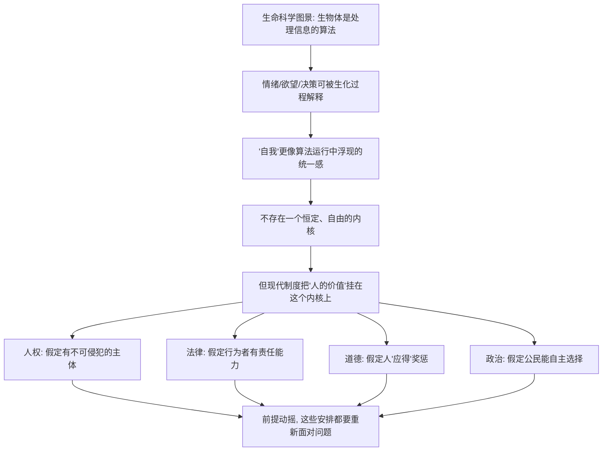

# 08｜如果行为由生化机制决定，“我”还剩下什么？

> 如果欲望和选择都是生化算法，那个"做决定的自己"究竟是什么？

---

## 一、先说结论

上一篇拆的是"选择"，这一篇拆的是"选择者"。

赫拉利的判断是：**"人"更适合被理解为一套由基因、激素和神经元组成的算法系统。** 你的欲望、情绪、判断，都是这套系统在运行中产生的输出。

这不等于说人没有价值。但它确实动摇了一个现代世界特别依赖的信念——**每个人心里都有一个神圣的、自由选择的内核**。而这个人格内核，恰恰是"人权""民主""个人责任"这些制度安排的哲学前提。

前提一动，后面的东西就都要重新面对问题。

---

## 二、我们先理解一个问题

现代社会的很多制度，都是围绕一个假设搭建的：

> 每个人都是一个独立的、能为自己做主的**主体**。

因为你能为自己做主，所以你的选票算数；因为你能为自己做主，所以你要为自己的行为负责；因为你能为自己做主，所以你的权利不可侵犯。

这个假设如此基础，以至于我们很少去问它成不成立。

但如果我们把上一篇的结论稍微推进一步：假如人的欲望和选择，都能被还原成生物化学过程，那么"那个做主的自己"到底在哪里？是某个具体的脑区，是某种稳定的"人格"，还是一个我们讲给自己听的说法？

一旦开始追问，麻烦就来了：**如果"我"不是我以为的那种东西，那建立在"我"之上的一切，还牢靠吗？**

---

## 三、作者到底提出了什么观点？

赫拉利在《未来简史》里，把生命科学的一个核心图景讲得很直白：**生物体是算法。**

他所说的"算法"，不是指电脑程序，而是指一套**处理信息、做出反应的固定步骤**。一个动物看到天敌会逃跑，一个人饿了会找食物——这些都是输入、处理、输出的过程，只不过运行在碳基的身体里，而不是硅基的芯片上。

按这个图景：

- **情绪**是生化状态的一种读法。恐惧、兴奋、沮丧，背后是激素与神经递质的变化。
- **欲望**是身体在向意识发送信号。渴、饿、困、想被认可，都是某种"内部数据"被翻译成了感受。
- **决策**则是在多种欲望之间做加权。选 A 还是选 B，取决于哪一套刺激此刻更强。

赫拉利由此得出一个推论：如果人的选择是算法输出，那么**"自我"就不是一个发号施令的小人，而更像这套算法运行中浮现的一种统一感**。

他并不因此就宣称"人没有价值"。真正让他在意的是另一件事：现代文明把人的价值**挂在了那个自由内核上**。而如果那个内核找不到，人类就需要重新想一想——价值到底该挂在哪里。

---

## 四、把这个观点翻译成人话

先做一个很简单的思想实验。

你今天心情不错，做决定也果断：该干活就干活，该拒绝就拒绝。如果此时有人问你"为什么这么有干劲"，你大概会说："我状态好。"

那"状态好"是什么意思？其实很可能只是——昨晚睡得足、血糖稳定、几项激素水平合适。你把它体验为"我心情好"，但它的底层是一组生理参数。

反过来也成立。**一杯咖啡**下肚，半小时后你会觉得思路清楚、想聊天、做事有冲劲。你会把这种感觉描述成"我今天精神好"，但真正发生的事，是咖啡因阻断了某种让人犯困的信号，让你的神经系统处在一个更兴奋的状态。

**一颗药丸**更直接。有些用于调节情绪的药物，会改变一个人对世界的整体感受：原本让他焦虑的事，可能变得没那么重；原本提不起兴趣的事，可能重新有了吸引力。服药的还是同一个人，记忆还在，性格大体还在，但他**做判断的倾向变了**。

这说明什么？

说明我们平时称为"我"的那个东西，很大一部分其实是**一组可以被调参的生化状态**。参数一变，"我"就变。而如果你承认"我"会随化学状态改变，那就很难再说它里面有一个恒定的、神圣的、自由的内核。

---

## 五、为什么会这样？

把赫拉利的推理拆成一条链：

关键在 **D → E** 这一步。

赫拉利真正想说的不是"你其实是个机器人"，而是：**现代社会把价值放在了一个可疑的地基上**。地基是不是真的存在，本身还有争议；但它已经承担了太多重量——从宪法里的权利，到法庭上的责任，到选票箱前的选择。

这就是为什么这个话题从"生物学"一路烧到了"政治哲学"。

最后一步 **E → J** 是赫拉利留给读者的作业：如果那个内核站不住，民主、法律、道德该往哪里找新的支点？他没有给出答案，他要的是让读者意识到，这个问题已经不能假装不存在。

---

## 六、举一个现实生活中的例子

**一杯咖啡或一颗药丸，如何改变你的情绪与决定。**

想象一个普通的下午。你要做一个不太愉快的决定：要不要跟一个客户说"这个价格我们做不了"。

**情形一：你在午睡后、喝了一杯咖啡，状态正好。** 你打开对话框，措辞干脆，把边界说清楚了，心情也没什么起伏。你会说："这是我想清楚了才决定的。"

**情形二：你熬夜到下午三点，没吃午饭，血糖很低。** 同样的客户，同样的话，你可能会先忍着接了下来，或者干脆拖着不回。你会说："我只是累了，回头再说。"

**情形三：你在服用某种调节情绪的药物。** 一段时间后，你可能会发现自己对冲突的耐受度变了——以前让你心里发紧的事，现在能更平静地处理；也可能反过来，变得更容易烦躁。你仍然是"你"，但你的判断阈值被改动了。

这三个情形里，"你"看上去是同一个人：同样的教育、同样的价值观、同样的目标。但**输出不同**。差别不在"你想不想"，而在你此刻的身体处在什么生化状态。

这个例子真正刺人的地方在于：**我们平时归因给"性格""意志""决断力"的东西，有相当一部分其实是在给生理状态背书。** 你以为自己在做价值判断，实际上至少有几次是被一杯咖啡或一夜没睡决定的。

这不是说人可以完全被还原成化学。它只是提醒：那个"做主的我"，比我们以为的更容易被扰动。

---

## 七、回到书中重新理解

现在回看赫拉利的论述，就能看出他的分寸。

他并没有说"人是机器，所以人没有价值"。他说的是两层意思：

**第一层，描述层面。** 从生命科学的视角看，人确实可以被当作算法来描述。情绪、欲望、决策都有可追踪的生理机制。

**第二层，规范层面。** 这是赫拉利真正的着力点。他指出，现代人**把"人的价值"和"自由选择的主体"绑在了一起**——因为你有自由，所以你有尊严；因为你能选择，所以你要负责。这个绑定不是自然规律，而是一段历史选择。

于是问题变成了：**价值一定要挂在自由意志上吗？**

赫拉利把这个问题敞开，而不是替我们回答。他的作用是把一个我们以为已经解决的哲学问题，重新摆到了桌面上：当"人是一套生化算法"这个图景越来越清晰，我们用来支撑权利、责任、道德的那根柱子，需不需要换一根？

---

## 八、这个观点背后还有什么？

有几个隐含前提，值得单独拎出来。

**第一，它借用了"算法"这个词的隐喻力量。** 算法听起来冷、机械、可计算。用这个词形容人，天然带着一种"你被决定了"的压迫感。但"算法"只是描述加工流程的中性词——说心脏是泵，不等于说人没有感情。

**第二，"可被生化过程解释"不等于"可被完全预测或控制"。** 一件事有生理机制，和这件事能不能被精确算出来，是两个不同的问题。人体的复杂度极高，变量极多，认识机制不等于掌握结果。

**第三，它假设"现代价值的唯一地基是自由意志"。** 这一条其实很关键。人权、尊严、责任，是否**只能**建立在自由意志之上？历史上，也有许多人从别的角度论证人的价值——比如感受苦乐的能力、关系中的相互承认、或者单纯作为人的身份。赫拉利把这个问题简化成了"有自由意志才有价值"，而这一步是可以被质疑的。

**第四，它通向整本书的政治部分。** 只有先让"个体"变得可疑，后面"算法接管权威""自由主义陷入危机"的讨论才有地基。这一篇是第三部分通向第四部分的桥。

---

## 九、这个观点有问题吗？

有问题。这里要特别强调：**"人是生化算法"是一个有影响力的科学图景，但"因此人的价值没了"是一个哲学推论，两者不能混为一谈。**

**第一，"还原"未必等于"取代"。** 化学可以解释水的性质来自氢和氧，但这不意味着"水"这个概念没用了。同理，用生化机制解释情绪，未必就能取消"我""责任""爱"这些更高层的描述。一些哲学家认为，不同层次有各自的解释力，不能简单用底层取消高层。

**第二，"自我"是否只是幻觉，学界有不同看法。** 有神经科学家和哲学家认为，自我确实是大脑建构出来的，但**建构不等于虚假**。一个国家是建构的，可它真实地影响每个人的生活；同理，自我是建构的，也可能仍然是一个真实有效的层级。

**第三，从"没有自由内核"跳到"制度崩了"，推得太快。** 人权、法律、道德未必只能靠自由意志支撑。比如，法律惩罚一个人，理由可以是保护社会、改造行为，而不必非得假定他"本可以完全另外选择"。也就是说，**前提动摇不等于体系崩塌，它可能只是需要换一种说法。**

**第四，反方视角：人作为整体仍有不可化约的价值。** 许多立场主张，无论底层机制如何，人作为有感受、有关系、能承担责任的存在，其整体价值不能被还原成若干生化参数之和。这个立场未必能反驳全部神经科学发现，但它说明——**科学描述和人文价值，未必是零和关系。**

**所以更准确的说法是**：赫拉利把一个真问题摆到了我们面前——现代价值确实部分依赖一个被科学挑战的假设；但"因此人的价值所剩无几"是一个他引出的推论，不是科学结论。**是地基需要检查，不是房子已经塌了。**

---

## 十、今天再看这个观点

以下部分是基于赫拉利思想的现代延伸，不是作者原话。

赫拉利写这本书时，讨论的还是"生化算法"。今天，这个隐喻有了一个更近的对应物：**算法真的开始参与定义"你是谁"了。**

推荐系统不只预测你会买什么，它还在塑造你想什么；信用评分、保险定价、招聘筛选，都在根据行为数据给人贴标签。你被描述的维度越来越多，而这些描述很多时候**不经过你的自我认知**。

于是就出现一个有意思的对照：赫拉利担心的是"人的内核在生物层面站不住"；而今天更直接的问题是——**即便你不接受生化还原论，你的行为数据也已经被外部系统当作一套可计算的算法在处理了。**

前者是哲学，后者是现实。它们指向同一个方向：当"我"可以被越来越精确地建模，"自主的自我"这个形象，会越来越难维持。

---

## 十一、这一篇真正应该记住什么？

1. **赫拉利主张"人是一套生化算法"。** 情绪、欲望和决策都可以从基因、激素和神经元的角度得到解释，自我更像这套系统运行中浮现的统一感。

2. **真正被冲击的不是"人有没有价值"，而是"价值挂在哪里"。** 现代制度把人权、责任和选择建立在"自由选择的主体"上，这才是问题所在。

3. **有机制，不等于没价值。** 一件事能被科学解释，和它该不该被珍视，是两个层面的事，不能混为一谈。

4. **这是哲学争议，不是科学定论。** "还原即取代"这一步受到广泛质疑，人作为整体仍可能具有不可化约的价值。

5. **前提动摇不等于体系崩塌。** 法律、道德、政治也许需要新的说法，但未必需要被废弃。

---

## 十二、留一个问题

> 如果"我"的价值不再能靠一个自由的内核来保障，
> 我们能否找到别的、同样稳固的理由来尊重一个人——
> 还是说，我们一直在借用那个内核，只是没意识到？

---

**下一篇**：说完了"选择者"，还有一个更奇怪的问题等着：那个做决定的"我"，真的是**一个**吗？赫拉利说，不是。我们脑子里至少住着两个自我，一个负责经历，一个负责讲述——而替我们记住人生、替我们判断值不值得的，往往是后者。

下一篇我们就来拆开这个问题——**你脑子里有几个"你"？**
